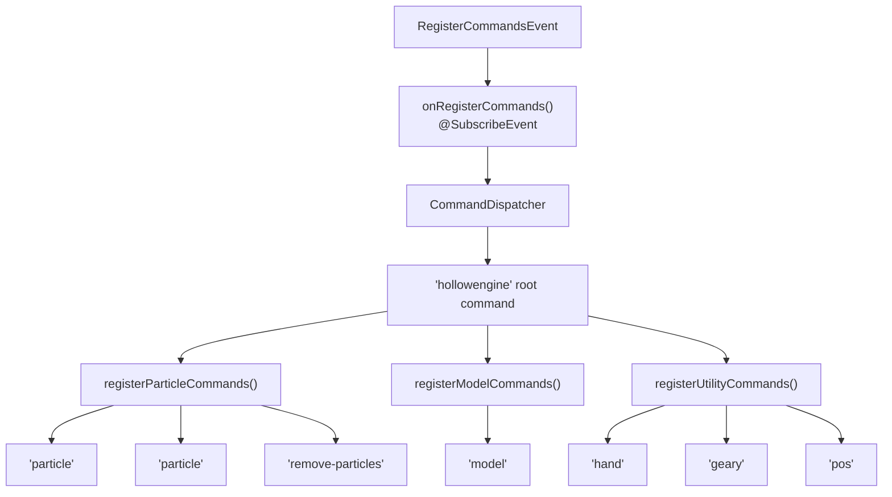
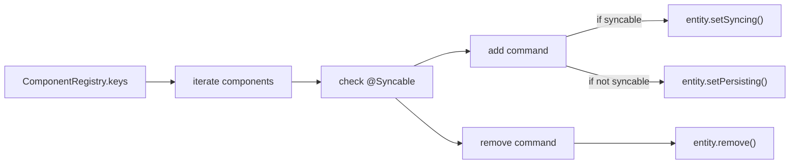
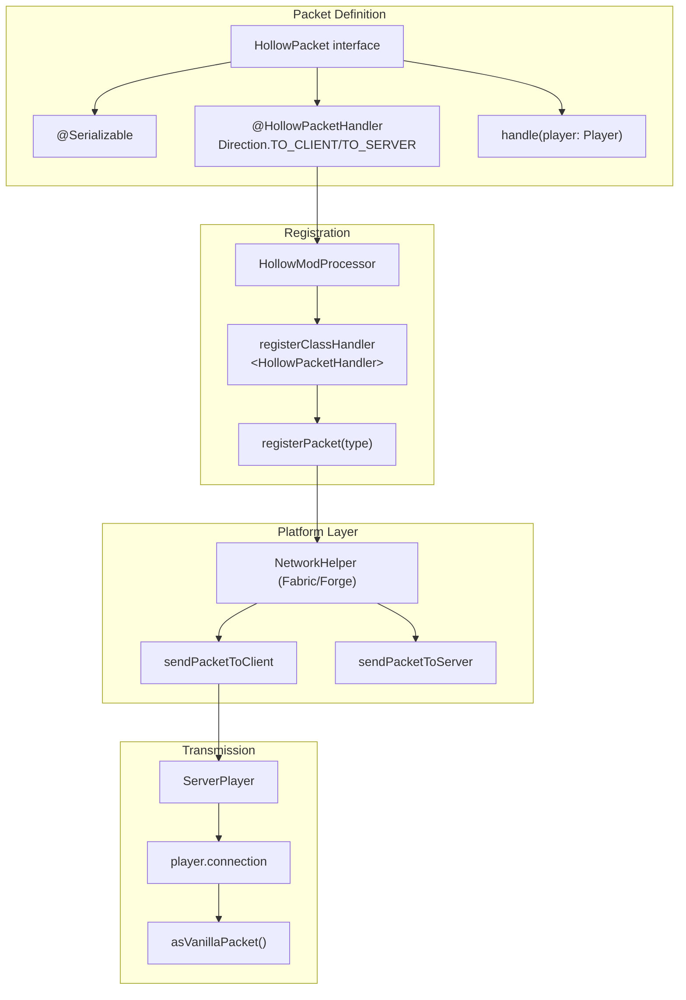
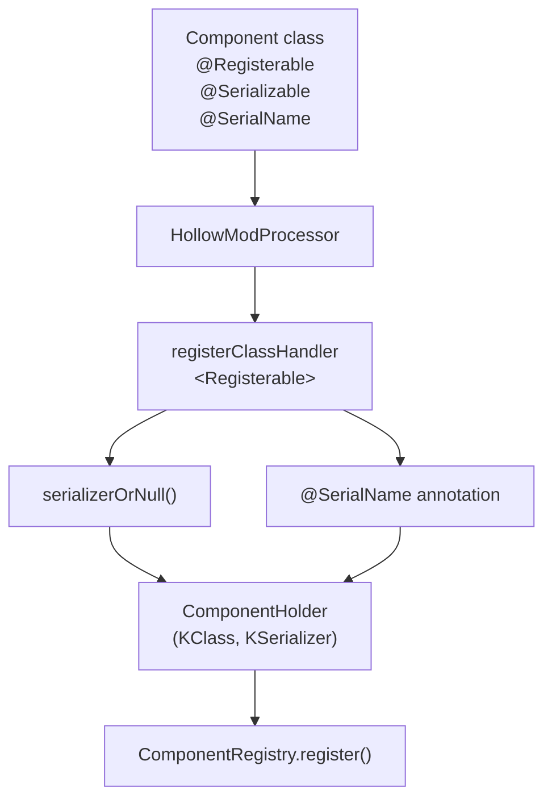
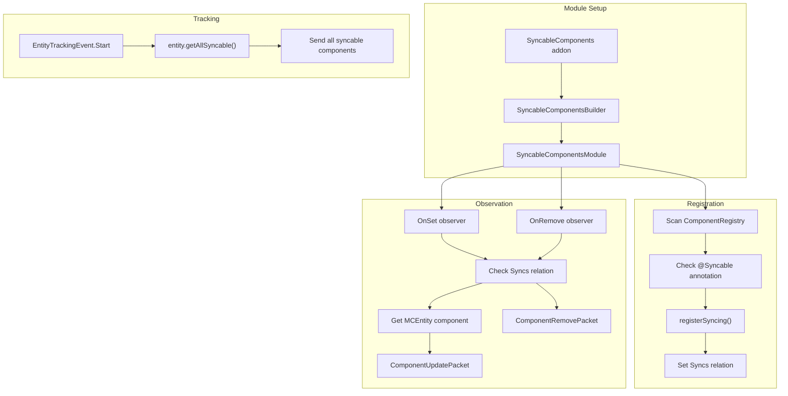
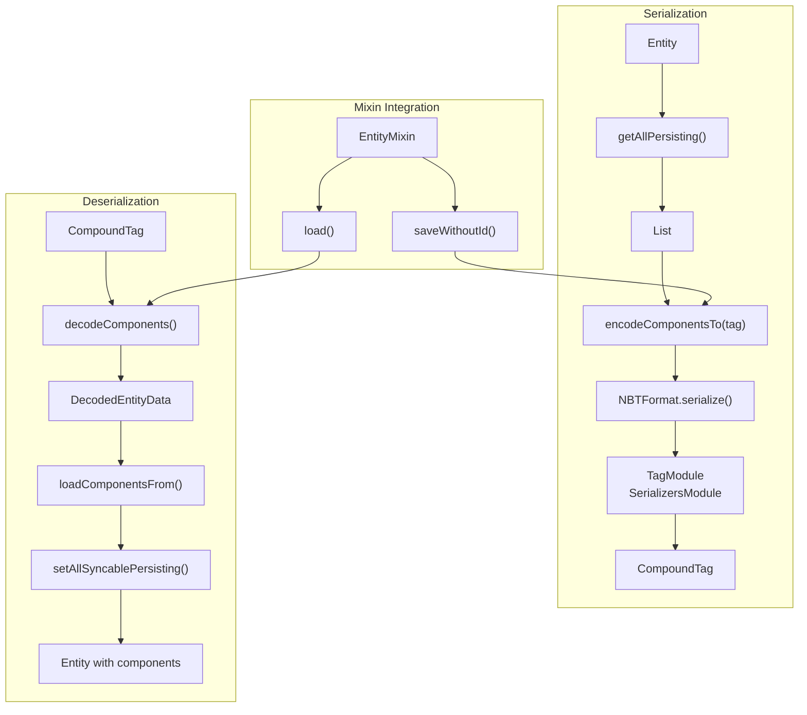
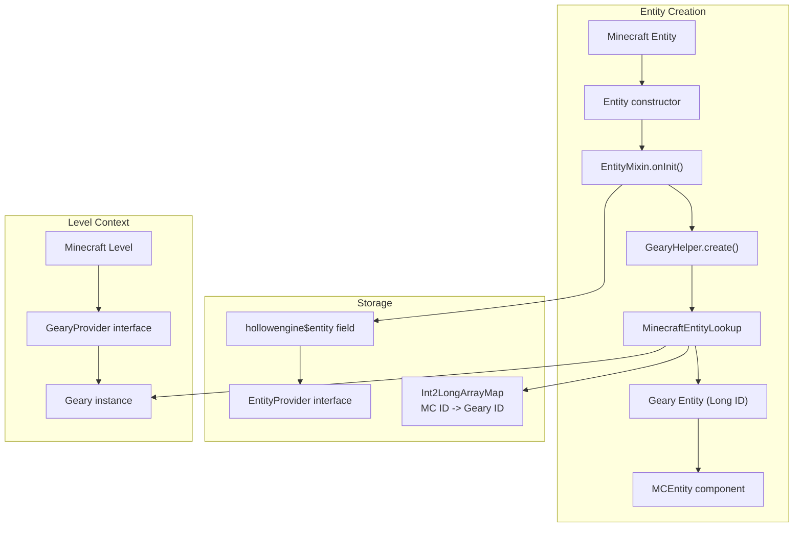

# Game Integration

<details>
<summary>Relevant source files</summary>

The following files were used as context for generating this wiki page:

- [src/main/java/ru/hollowhorizon/hollowengine/common/codeblocks/blocks/players/OnPlayerChatBlock.kt](src/main/java/ru/hollowhorizon/hollowengine/common/codeblocks/blocks/players/OnPlayerChatBlock.kt)
- [src/main/java/ru/hollowhorizon/hollowengine/common/codeblocks/execution/BlockFrameStackElement.kt](src/main/java/ru/hollowhorizon/hollowengine/common/codeblocks/execution/BlockFrameStackElement.kt)
- [src/main/java/ru/hollowhorizon/hollowengine/common/codeblocks/execution/CodeBlockInterpreter.kt](src/main/java/ru/hollowhorizon/hollowengine/common/codeblocks/execution/CodeBlockInterpreter.kt)
- [src/main/java/ru/hollowhorizon/hollowengine/common/codeblocks/runtime/BlocksSystem.kt](src/main/java/ru/hollowhorizon/hollowengine/common/codeblocks/runtime/BlocksSystem.kt)
- [src/main/java/ru/hollowhorizon/hollowengine/common/codeblocks/runtime/BlocksSystemSavedData.kt](src/main/java/ru/hollowhorizon/hollowengine/common/codeblocks/runtime/BlocksSystemSavedData.kt)
- [src/main/java/ru/hollowhorizon/hollowengine/common/codeblocks/runtime/OwnerScopeRestoredEvent.kt](src/main/java/ru/hollowhorizon/hollowengine/common/codeblocks/runtime/OwnerScopeRestoredEvent.kt)
- [src/main/java/ru/hollowhorizon/hollowengine/common/codeblocks/runtime/ScriptFile.kt](src/main/java/ru/hollowhorizon/hollowengine/common/codeblocks/runtime/ScriptFile.kt)
- [src/main/java/ru/hollowhorizon/hollowengine/common/codeblocks/runtime/ScriptInstance.kt](src/main/java/ru/hollowhorizon/hollowengine/common/codeblocks/runtime/ScriptInstance.kt)
- [src/main/java/ru/hollowhorizon/hollowengine/common/commands/HollowEngineCommands.kt](src/main/java/ru/hollowhorizon/hollowengine/common/commands/HollowEngineCommands.kt)
- [src/main/java/ru/hollowhorizon/hollowengine/common/coroutines/EntityScope.kt](src/main/java/ru/hollowhorizon/hollowengine/common/coroutines/EntityScope.kt)
- [src/main/java/ru/hollowhorizon/hollowengine/common/coroutines/SingleThreadDispatcher.kt](src/main/java/ru/hollowhorizon/hollowengine/common/coroutines/SingleThreadDispatcher.kt)
- [src/main/java/ru/hollowhorizon/hollowengine/common/dev/DevLogger.kt](src/main/java/ru/hollowhorizon/hollowengine/common/dev/DevLogger.kt)
- [src/main/java/ru/hollowhorizon/hollowengine/mixins/components/EntityMixin.java](src/main/java/ru/hollowhorizon/hollowengine/mixins/components/EntityMixin.java)
- [src/test/kotlin/CodeBlockExecutionCoreTests.kt](src/test/kotlin/CodeBlockExecutionCoreTests.kt)
- [src/test/kotlin/ScriptExecutionLifecycleTests.kt](src/test/kotlin/ScriptExecutionLifecycleTests.kt)

</details>


This page documents how HollowEngine integrates with Minecraft's gameplay systems, providing commands, network synchronization, and entity management capabilities. This covers the runtime interaction layer that allows scripts, mods, and players to interact with HollowEngine's features through standard Minecraft interfaces.

For information about the underlying ECS architecture, see [ECS Architecture](#8.1). For details on the scripting execution environment, see [Script Execution](#7). For entity component definitions, see [Component System](#8.2).

## Overview

HollowEngine integrates with Minecraft through four primary mechanisms:

| Integration Layer | Purpose | Key Components |
|------------------|---------|----------------|
| **Commands** | Administrative and development tools | `HollowEngineCommands`, brigadier integration |
| **Network Packets** | Client-server data synchronization | `HollowPacket`, `ComponentUpdatePacket`, `ComponentRemovePacket` |
| **Component Synchronization** | Automatic ECS state replication | `SyncableComponents` module, `@Syncable` annotation |
| **Entity Lifecycle** | Geary ECS integration with Minecraft entities | `EntityMixin`, `MinecraftEntityLookup`, NBT persistence |

Sources: [HollowEngineCommands.kt:1-274](), [SyncableComponents.kt:1-114](), [Syncs.kt:1-99]()

## Commands System

### Command Registration and Structure

Commands are registered using a DSL-based builder pattern that wraps Minecraft's Brigadier command framework. The main registration point is the `onRegisterCommands` event handler.



**Command Structure Diagram**

Sources: [HollowEngineCommands.kt:45-54](), [HollowEngineCommands.kt:58-147]()

### Particle Commands

Three particle-related commands allow spawning and removing Bedrock-format particles:

| Command | Arguments | Function | Line Reference |
|---------|-----------|----------|----------------|
| `/hollowengine particle <pos> <name>` | Position, particle name | Spawns particle at world position | [HollowEngineCommands.kt:59-70]() |
| `/hollowengine particle <entity> <name>` | Entity selector, particle name | Spawns particle attached to entity | [HollowEngineCommands.kt:72-83]() |
| `/hollowengine remove-particles <name>` | Particle name | Removes all particles of given type | [HollowEngineCommands.kt:85-92]() |

The particle system integrates with the `BedrockParticles.PARTICLES` registry and uses the `ParticlesProvider` interface to access the level's particle system. For position-based spawning, `Transform.create()` converts world coordinates to particle transforms [HollowEngineCommands.kt:150-156](). For entity-based spawning, `LivingEntityQuery` tracks the entity's position automatically [HollowEngineCommands.kt:158-164]().

Sources: [HollowEngineCommands.kt:58-93](), [HollowEngineCommands.kt:149-171]()

### Model Commands

The model command displays information about loaded 3D models:

```kotlin
/hollowengine model <model>
```

This command sends a `ShowModelInfoPacket` to the requesting player [HollowEngineCommands.kt:95-103](). The packet handler asynchronously loads the model using `HollowModelManager.getOrCreate()`, then displays:
- All animation names in the model
- All texture paths used by materials

Each item is displayed with clickable text that copies the value to clipboard when clicked [HollowEngineCommands.kt:238-273]().

Sources: [HollowEngineCommands.kt:95-103](), [HollowEngineCommands.kt:238-273]()

### Geary Component Commands

Dynamic commands are generated for each registered component in the `ComponentRegistry`, allowing runtime component manipulation:

```kotlin
/hollowengine geary <component_name> add <entity>
/hollowengine geary <component_name> remove <entity>
```

The command registration iterates through all components in the registry [HollowEngineCommands.kt:113-139](). For each component:
1. Checks if it has the `@Syncable` annotation
2. Creates `add` and `remove` subcommands
3. The `add` command either calls `setSyncing()` for syncable components or `setPersisting()` for non-syncable ones
4. The `remove` command removes the component from the entity



**Geary Component Command Flow**

Sources: [HollowEngineCommands.kt:113-139]()

### Utility Commands

| Command | Purpose | Output |
|---------|---------|--------|
| `/hollowengine hand` | Copies held item to clipboard as code | Generates `item()` function call with NBT [HollowEngineCommands.kt:106-111]() |
| `/hollowengine pos` | Copies targeted position to clipboard | Generates `pos()` function call with coordinates [HollowEngineCommands.kt:141-146]() |

Both commands send a `CopyTextPacket` to the player, which displays a clickable message and copies the value to the system clipboard [HollowEngineCommands.kt:224-236]().

Sources: [HollowEngineCommands.kt:105-147](), [HollowEngineCommands.kt:174-222]()

## Network Communication

### Packet System Architecture

HollowEngine implements a custom packet system that abstracts platform-specific networking:



**Network Packet Architecture**

Sources: [HollowModProcessor.kt:56-63](), [NetworkHelper.kt:14-36]()

### Packet Registration Process

Packet registration happens during initialization through annotation processing:

1. `HollowModProcessor` scans for classes annotated with `@HollowPacketHandler` [HollowModProcessor.kt:56-59]()
2. Validates that the class implements `HollowPacket` interface [HollowModProcessor.kt:58]()
3. Adds the packet type to a deferred registration list [HollowModProcessor.kt:57]()
4. Platform-specific `NetworkHelper` performs actual registration after initialization [HollowModProcessor.kt:62]()

The `NetworkHelper` implementation varies by platform (Fabric/Forge/NeoForge) but provides consistent abstract functions:
- `registerPacket`: Platform-specific registration
- `sendPacketToClient`: Send to specific player, with coroutine-based waiting for connection [NetworkHelper.kt:18-29]()
- `sendPacketToServer`: Send from client to server [NetworkHelper.kt:30-34]()

Sources: [HollowModProcessor.kt:56-63](), [NetworkHelper.kt:13-37]()

### Component Synchronization Packets

Two primary packets handle component synchronization:

**ComponentUpdatePacket**

```kotlin
@Serializable
data class ComponentUpdatePacket(
    override val entityId: Int,
    val component: @Polymorphic Component,
) : ComponentSyncPacket
```

Sent when a component is added or modified on an entity [Syncs.kt:68-81]():
1. Looks up the Geary entity using `MinecraftEntityLookup.getOrCreateById()` [Syncs.kt:76]()
2. Sets the component on the entity using polymorphic serialization [Syncs.kt:78]()

**ComponentRemovePacket**

```kotlin
@Serializable
data class ComponentRemovePacket(
    override val entityId: Int,
    val componentTypeId: ResourceLocation,
) : ComponentSyncPacket
```

Sent when a component is removed from an entity [Syncs.kt:83-97]():
1. Looks up the entity
2. Deserializes component type from `ResourceLocation` [Syncs.kt:93]()
3. Removes the component [Syncs.kt:94]()

Sources: [Syncs.kt:61-97]()

## Component System Integration

### Component Registration

Components are registered through the `@Registerable` annotation, which is processed during initialization:



**Component Registration Flow**

The registration process [HollowModProcessor.kt:98-103]():
1. Extracts the Kotlin class reflection
2. Obtains the serializer using Kotlinx Serialization
3. Extracts the `@SerialName` annotation value as the component key
4. Wraps in a `ComponentHolder` with type-erased serializer
5. Registers to `ComponentRegistry` with `ResourceLocation` key

Sources: [HollowModProcessor.kt:98-103](), [ComponentRegistry.kt:1-14]()

### Syncable Components Module

The `SyncableComponents` module is a Geary addon that automatically synchronizes component changes to tracking clients:



**Syncable Components Synchronization System**

The module performs three key functions:

1. **Registration** [SyncableComponents.kt:62-66](): Scans `ComponentRegistry` for components with `@Syncable` annotation and registers them as syncable
2. **Change Observation** [SyncableComponents.kt:68-82](): Observes `OnSet` and `OnRemove` events, sending packets when syncable components change
3. **Initial Sync** [SyncableComponents.kt:91-98](): When a player starts tracking an entity, sends all syncable components

Sources: [SyncableComponents.kt:56-86](), [SyncableComponents.kt:91-98]()

### NBT Persistence

Component data is serialized to NBT for world saves and dimension changes using the `NBTFormat`:



**NBT Persistence Flow**

The serialization process:

1. **Save** [EntityMixin.java:46-51](): During entity save, `EntityMixin` calls `encodeComponentsTo()` to write all persisting components to a `geary` NBT tag
2. **Load** [EntityMixin.java:53-56](): During entity load, `loadComponentsFrom()` reads the `geary` tag and restores components
3. **Format** [NBTFormat.kt:80-108](): The `NBTFormat` uses a `TagModule` that includes polymorphic serialization for `Component::class` [NBTFormat.kt:33-37]()

Components are polymorphically serialized using their `@SerialName` values as discriminators. The `ComponentRegistry` provides the complete set of component serializers to the `TagModule` [NBTFormat.kt:34-36]().

Sources: [EntityMixin.java:46-56](), [NBTFormat.kt:29-78](), [NBTFormat.kt:80-108](), [GearyEntityExtensions.kt:19-65]()

## Entity Lifecycle Integration

### Entity-ECS Binding

Every Minecraft entity is automatically bound to a Geary ECS entity through bytecode injection:



**Entity-ECS Binding Architecture**

The binding process [EntityMixin.java:41-44]():

1. `EntityMixin` injects an `onInit` method into the entity constructor
2. Calls `GearyHelper.create()` which obtains the level's `Geary` instance [GearyProvider.kt:34-35]()
3. `MinecraftEntityLookup.linkWithMinecraft()` creates or retrieves a Geary entity ID [MinecraftEntityLookup.kt:26-32]()
4. Stores the ID in the injected `hollowengine$entity` field [EntityMixin.java:32]()
5. Sets an `MCEntity` component containing the Minecraft entity reference

The `MinecraftEntityLookup` maintains a bidirectional mapping between Minecraft entity IDs and Geary entity IDs using an `Int2LongArrayMap` [MinecraftEntityLookup.kt:17]().

Sources: [EntityMixin.java:29-44](), [GearyProvider.kt:25-35](), [MinecraftEntityLookup.kt:12-32]()

### Dimension Changes and Cloning

When entities change dimensions or players respawn, component data must be transferred:

**Dimension Change** [EntityMixin.java:83-87]():
1. `EntityMixin` intercepts the `setLevel()` method call
2. Calls `GearyHelper.move()` which:
   - Encodes all components from the old entity to NBT [GearyProvider.kt:39]()
   - Creates a new Geary entity in the destination level [GearyProvider.kt:42]()
   - Decodes and restores components [GearyProvider.kt:43]()

**Player Clone** [SyncableComponents.kt:101-113]():
1. `PlayerEvent.Clone` captures old and new player entities
2. Encodes components from old player to NBT [SyncableComponents.kt:107]()
3. Yields one tick to allow player connection initialization [SyncableComponents.kt:109]()
4. Loads components into new player entity [SyncableComponents.kt:110-112]()

Sources: [EntityMixin.java:83-87](), [GearyProvider.kt:38-46](), [SyncableComponents.kt:100-114]()

### Entity Removal and ID Changes

**Entity Removal** [EntityMixin.java:95-100]():
- When an entity is removed (except players), calls `GearyHelper.removeEntity()`
- `MinecraftEntityLookup.remove()` deletes the mapping and removes the Geary entity [MinecraftEntityLookup.kt:34-39]()

**ID Changes** [EntityMixin.java:102-105]():
- When an entity's ID changes, calls `GearyHelper.changeId()`
- Updates the ID mapping, extending the new entity with the old entity's data if a collision occurs [MinecraftEntityLookup.kt:41-50]()

Sources: [EntityMixin.java:95-105](), [MinecraftEntityLookup.kt:34-50]()

## Integration Points Summary

The game integration layer bridges HollowEngine's systems with Minecraft's runtime:

| System | Entry Point | Integration Method |
|--------|-------------|-------------------|
| Commands | `RegisterCommandsEvent` | Event subscription [HollowEngineCommands.kt:45-54]() |
| Packets | `@HollowPacketHandler` annotation | Annotation processing [HollowModProcessor.kt:56-63]() |
| Components | `@Registerable` annotation | Annotation processing [HollowModProcessor.kt:98-103]() |
| Entity Binding | `Entity` constructor | Mixin injection [EntityMixin.java:41-44]() |
| Persistence | `Entity.saveWithoutId/load` | Mixin injection [EntityMixin.java:46-56]() |
| Synchronization | Geary `OnSet/OnRemove` observers | Geary addon module [SyncableComponents.kt:68-82]() |

This architecture allows HollowEngine to seamlessly extend Minecraft's entity system with a full ECS implementation while maintaining compatibility with vanilla save/load and multiplayer synchronization.