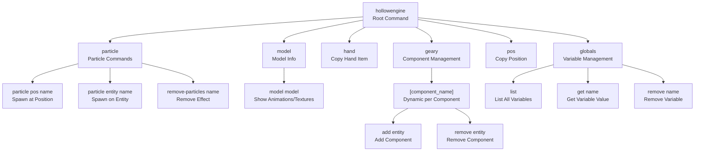
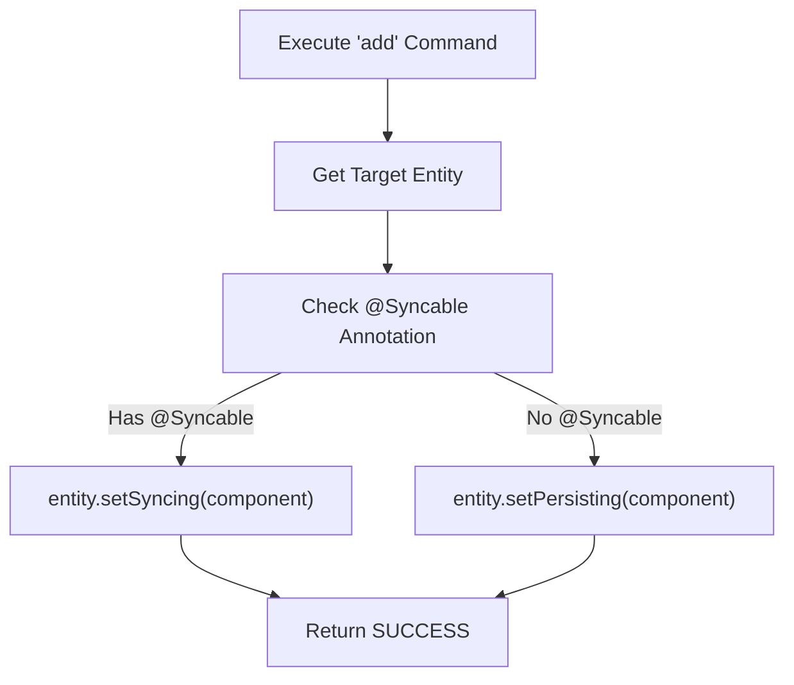
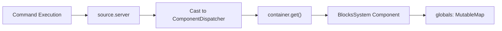
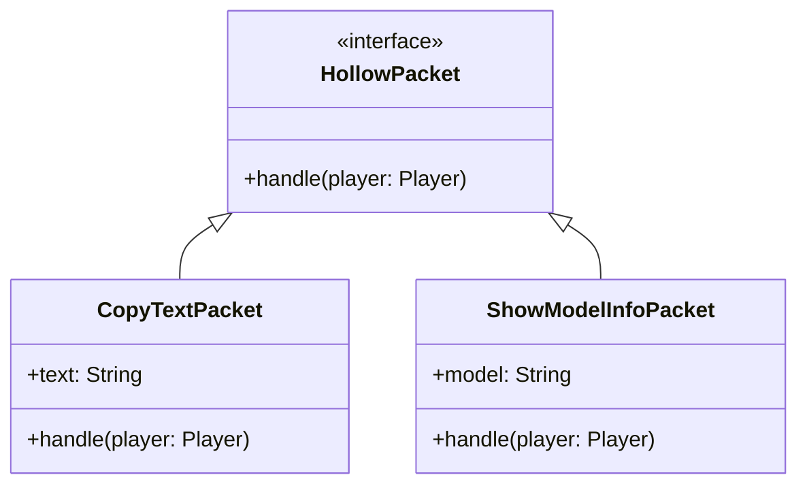
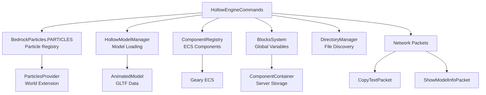

# Commands System

<details>
<summary>Relevant source files</summary>

The following files were used as context for generating this wiki page:

- [src/main/java/ru/hollowhorizon/hollowengine/common/codeblocks/blocks/players/OnPlayerChatBlock.kt](src/main/java/ru/hollowhorizon/hollowengine/common/codeblocks/blocks/players/OnPlayerChatBlock.kt)
- [src/main/java/ru/hollowhorizon/hollowengine/common/codeblocks/execution/BlockFrameStackElement.kt](src/main/java/ru/hollowhorizon/hollowengine/common/codeblocks/execution/BlockFrameStackElement.kt)
- [src/main/java/ru/hollowhorizon/hollowengine/common/codeblocks/execution/CodeBlockInterpreter.kt](src/main/java/ru/hollowhorizon/hollowengine/common/codeblocks/execution/CodeBlockInterpreter.kt)
- [src/main/java/ru/hollowhorizon/hollowengine/common/codeblocks/runtime/BlocksSystem.kt](src/main/java/ru/hollowhorizon/hollowengine/common/codeblocks/runtime/BlocksSystem.kt)
- [src/main/java/ru/hollowhorizon/hollowengine/common/codeblocks/runtime/BlocksSystemSavedData.kt](src/main/java/ru/hollowhorizon/hollowengine/common/codeblocks/runtime/BlocksSystemSavedData.kt)
- [src/main/java/ru/hollowhorizon/hollowengine/common/codeblocks/runtime/OwnerScopeRestoredEvent.kt](src/main/java/ru/hollowhorizon/hollowengine/common/codeblocks/runtime/OwnerScopeRestoredEvent.kt)
- [src/main/java/ru/hollowhorizon/hollowengine/common/codeblocks/runtime/ScriptFile.kt](src/main/java/ru/hollowhorizon/hollowengine/common/codeblocks/runtime/ScriptFile.kt)
- [src/main/java/ru/hollowhorizon/hollowengine/common/codeblocks/runtime/ScriptInstance.kt](src/main/java/ru/hollowhorizon/hollowengine/common/codeblocks/runtime/ScriptInstance.kt)
- [src/main/java/ru/hollowhorizon/hollowengine/common/commands/HollowEngineCommands.kt](src/main/java/ru/hollowhorizon/hollowengine/common/commands/HollowEngineCommands.kt)
- [src/main/java/ru/hollowhorizon/hollowengine/common/coroutines/EntityScope.kt](src/main/java/ru/hollowhorizon/hollowengine/common/coroutines/EntityScope.kt)
- [src/main/java/ru/hollowhorizon/hollowengine/common/coroutines/SingleThreadDispatcher.kt](src/main/java/ru/hollowhorizon/hollowengine/common/coroutines/SingleThreadDispatcher.kt)
- [src/main/java/ru/hollowhorizon/hollowengine/common/dev/DevLogger.kt](src/main/java/ru/hollowhorizon/hollowengine/common/dev/DevLogger.kt)
- [src/main/java/ru/hollowhorizon/hollowengine/mixins/components/EntityMixin.java](src/main/java/ru/hollowhorizon/hollowengine/mixins/components/EntityMixin.java)
- [src/test/kotlin/CodeBlockExecutionCoreTests.kt](src/test/kotlin/CodeBlockExecutionCoreTests.kt)
- [src/test/kotlin/ScriptExecutionLifecycleTests.kt](src/test/kotlin/ScriptExecutionLifecycleTests.kt)

</details>


## Purpose and Scope

The Commands System provides the `/hollowengine` command interface for in-game debugging, testing, and management of HollowEngine features. This system allows players and developers to spawn particles, inspect models, manipulate Geary ECS components, manage global variables, and access various debugging utilities directly from the game console.

For information about the Geary ECS component system that commands can manipulate, see [ECS Architecture](#8.1). For details on the particle system, see the high-level architecture diagrams. For block scripting and global variables, see [Visual Block Editor](#5).

**Sources:** [src/main/java/ru/hollowhorizon/hollowengine/common/commands/HollowEngineCommands.kt:1-311]()

---

## Command Registration Architecture

The command system is registered during the `RegisterCommandsEvent` through an event handler annotated with `@SubscribeEvent`. All commands are organized under a single root command `/hollowengine` with multiple subcommands organized by functionality.

### Registration Entry Point

The main registration function creates the command tree:

```kotlin
@SubscribeEvent
fun onRegisterCommands(event: RegisterCommandsEvent)
```

This handler uses a builder DSL pattern with the `CommandEditor` extension functions to construct the command hierarchy. The system divides commands into four major categories:
- Particle manipulation commands
- Model information commands  
- Utility commands (hand, geary, pos)
- Global variable management commands

**Sources:** [src/main/java/ru/hollowhorizon/hollowengine/common/commands/HollowEngineCommands.kt:42-52]()

### Command Tree Structure



**Sources:** [src/main/java/ru/hollowhorizon/hollowengine/common/commands/HollowEngineCommands.kt:44-51](), [src/main/java/ru/hollowhorizon/hollowengine/common/commands/HollowEngineCommands.kt:56-145]()

---

## Particle Commands

The particle command subsystem enables spawning and removing Bedrock-format particle effects in the world. It provides three subcommands with different targeting options.

### Command Signatures

| Command | Arguments | Description |
|---------|-----------|-------------|
| `/hollowengine particle <pos> <name>` | `pos`: Vec3, `name`: String | Spawns particle effect at coordinates |
| `/hollowengine particle <entity> <name>` | `entity`: Entity, `name`: String | Attaches particle effect to entity |
| `/hollowengine remove-particles <name>` | `name`: String | Removes all instances of particle effect |

### Implementation Details

The particle commands interact with the `BedrockParticles.PARTICLES` registry and the `ParticlesProvider` system:

- **Particle spawning at position**: Creates a `Transform` at the specified coordinates and spawns the effect through the particle system
- **Particle spawning on entity**: Uses `LivingEntityQuery` to attach the particle effect to follow the entity
- **Particle removal**: Removes all instances matching the particle identifier

The command provides auto-completion suggestions from `BedrockParticles.PARTICLES.keys` for particle names.

**Sources:** [src/main/java/ru/hollowhorizon/hollowengine/common/commands/HollowEngineCommands.kt:56-91](), [src/main/java/ru/hollowhorizon/hollowengine/common/commands/HollowEngineCommands.kt:195-216]()

---

## Model Commands

The model command provides inspection capabilities for GLTF/GLB models, displaying available animations and textures for a specified model.

### Command Signature

```
/hollowengine model <model>
```

- **Argument**: `model` - String path to model resource (supports auto-completion)
- **Output**: Sends clickable chat messages listing animations and textures

### Model Resolution

The command supports both built-in and custom models through `getAvailableModels()`:

1. **Default Models**:
   - `hollowengine:models/entity/player_model.gltf`
   - `hollowengine:models/entity/player_model_slim.gltf`
   - `hc:models/entity/hilda_regular.glb`

2. **Custom Models**: Scans the `HOLLOW_ENGINE/assets` directory for `.gltf` and `.glb` files, converting paths to resource location format

### Network Communication

The command sends a `ShowModelInfoPacket` to the client, which:
1. Loads the model through `HollowModelManager.getOrCreate(location)`
2. Iterates through `hollowModel.animations.keys` for animation names
3. Iterates through `hollowModel.model.materials` for texture paths
4. Sends clickable messages with copy-to-clipboard functionality

**Sources:** [src/main/java/ru/hollowhorizon/hollowengine/common/commands/HollowEngineCommands.kt:93-101](), [src/main/java/ru/hollowhorizon/hollowengine/common/commands/HollowEngineCommands.kt:243-257](), [src/main/java/ru/hollowhorizon/hollowengine/common/commands/HollowEngineCommands.kt:279-310]()

---

## Utility Commands

The utility commands provide developer tools for clipboard operations and dynamic Geary ECS component manipulation.

### Hand Command

```
/hollowengine hand
```

Copies the player's main hand item to clipboard in a script-friendly format. The output format varies based on item properties:

- Simple item: `item("minecraft:diamond")`
- With count: `item("minecraft:diamond", 64)`
- With NBT: `item("minecraft:diamond", 1, "{...}")`

This command sends a `CopyTextPacket` to the player, which both displays a clickable message and directly copies the text to the system clipboard.

**Sources:** [src/main/java/ru/hollowhorizon/hollowengine/common/commands/HollowEngineCommands.kt:104-109](), [src/main/java/ru/hollowhorizon/hollowengine/common/commands/HollowEngineCommands.kt:220-233]()

### Geary Component Commands

```
/hollowengine geary <component_name> add <entity>
/hollowengine geary <component_name> remove <entity>
```

These commands provide dynamic component manipulation for all registered Geary ECS components. The command tree is generated at registration time by iterating through `ComponentRegistry.keys`.

#### Component Addition Logic



When adding a component:
- If the component type has the `@Syncable` annotation, it calls `entity.setSyncing()` which marks it for network synchronization
- Otherwise, it calls `entity.setPersisting()` which only saves it to NBT without client sync

Component removal uses `entity.remove(componentType)` to delete the component from the entity.

**Sources:** [src/main/java/ru/hollowhorizon/hollowengine/common/commands/HollowEngineCommands.kt:111-137](), [src/main/java/ru/hollowhorizon/hollowengine/common/geary/components/ComponentRegistry.kt:1-15]()

### Position Command

```
/hollowengine pos
```

Performs a raycast from the player (100 blocks, fluid-sensitive) and copies the hit position to clipboard in the format:

```
pos(x, y, z)
```

Coordinates are rounded to 2 decimal places using `Double.roundTo()` for cleaner output.

**Sources:** [src/main/java/ru/hollowhorizon/hollowengine/common/commands/HollowEngineCommands.kt:139-144](), [src/main/java/ru/hollowhorizon/hollowengine/common/commands/HollowEngineCommands.kt:235-241]()

---

## Globals Commands

The globals command subsystem manages variables in the visual block scripting system's global scope. These variables are stored in the `BlocksSystem` component on the server instance.

### Command Signatures

| Command | Arguments | Description |
|---------|-----------|-------------|
| `/hollowengine globals list` | None | Lists all global variable names |
| `/hollowengine globals get <name>` | `name`: String (quoted) | Displays value of variable |
| `/hollowengine globals remove <name>` | `name`: String (quoted) | Deletes variable from global scope |

### Variable Storage Architecture

Global variables are accessed through the component system:



The system retrieves the `BlocksSystem` component using:
```kotlin
(source.server as ComponentDispatcher)
    .container
    .get<BlocksSystem>("hollowengine:blocks_system".rl)
    ?.globals
```

Each command provides auto-completion for variable names by querying the current globals map keys.

**Sources:** [src/main/java/ru/hollowhorizon/hollowengine/common/commands/HollowEngineCommands.kt:147-192]()

---

## Network Communication

The command system uses two packet types for client-server communication, both implementing the `HollowPacket` interface and marked with `@HollowPacketHandler(Direction.TO_CLIENT)`.

### Packet Types



### CopyTextPacket

This packet transmits formatted text to the client for clipboard operations. On the client side, it:
1. Sends a system message with hover text and click-to-copy functionality
2. Directly sets the system clipboard via `mc.keyboardHandler.clipboard`

The message uses translation keys:
- `"hollowengine.commands.copy"` for the message text
- `"hollowengine.tooltips.copy"` for hover tooltip

**Sources:** [src/main/java/ru/hollowhorizon/hollowengine/common/commands/HollowEngineCommands.kt:266-277]()

### ShowModelInfoPacket

This packet sends model path information to the client, which then:
1. Loads the model via `HollowModelManager.getOrCreate(location)`
2. Extracts animation names from `hollowModel.animations.keys`
3. Extracts texture paths from `hollowModel.model.materials`
4. Sends multiple clickable chat messages for each item

Each message line is clickable to copy the animation name or texture path to clipboard.

**Sources:** [src/main/java/ru/hollowhorizon/hollowengine/common/commands/HollowEngineCommands.kt:279-310]()

---

## Integration with Core Systems

The command system interfaces with multiple HollowEngine subsystems, serving as a bridge between the console interface and internal APIs.

### System Integration Map



### Component System Integration

The Geary commands dynamically access the `ComponentRegistry` to generate subcommands for every registered component. This registration happens through the `@Registerable` annotation processor:

1. At startup, `HollowModProcessor` scans for `@Registerable` classes
2. Each component is registered in `ComponentRegistry` with its serializer
3. Command registration iterates over `ComponentRegistry.keys` to build the command tree
4. Each component subcommand checks for `@Syncable` annotation at runtime

This creates a fully dynamic command interface that automatically adapts to new component types.

**Sources:** [src/main/java/ru/hollowhorizon/hollowengine/common/commands/HollowEngineCommands.kt:111-136](), [src/main/java/ru/hollowhorizon/hollowengine/common/geary/components/ComponentRegistry.kt:1-15](), [src/main/java/ru/hollowhorizon/hollowengine/common/registry/HollowModProcessor.kt:98-103]()

### Particle System Integration

Particle commands use the `ParticlesProvider` interface, which is implemented via mixin on the `Level` class. The system:
1. Resolves particle names through `BedrockParticles.PARTICLES` registry
2. Creates `ParticleEffect` instances from JSON files
3. Spawns effects with either position-based `Transform` or entity-based `LivingEntityQuery`

**Sources:** [src/main/java/ru/hollowhorizon/hollowengine/common/commands/HollowEngineCommands.kt:195-216]()

### Global Variables Storage

Global variables are stored as a component on the server instance through the `ComponentDispatcher` interface:
- The server implements `ComponentDispatcher` via mixin
- `ComponentContainer` holds various system components including `BlocksSystem`
- `BlocksSystem` contains the `globals: MutableMap<String, Any>` field used by visual block scripts

**Sources:** [src/main/java/ru/hollowhorizon/hollowengine/common/commands/HollowEngineCommands.kt:147-192]()

---

## Command Execution Flow

The following diagram illustrates the complete lifecycle of a command execution, from player input to system response:

```mermaid
sequenceDiagram
    participant Player
    participant CommandDispatcher
    participant Handler["Command Handler"]
    participant System["Target System<br/>(Geary/Particles/etc)"]
    participant Packet["Network Packet"]
    participant Client
    
    Player->>CommandDispatcher: /hollowengine [subcommand]
    CommandDispatcher->>Handler: Route to handler function
    Handler->>Handler: Parse arguments
    Handler->>System: Call system API
    System-->>Handler: Return result
    
    alt Client feedback needed
        Handler->>Packet: Create response packet
        Packet->>Client: Send TO_CLIENT
        Client->>Client: handle(player)
        Client->>Player: Display message/update
    else Server-only
        Handler->>Player: sendSuccess() message
    end
    
    Handler-->>CommandDispatcher: Return SUCCESS/FAILURE
    CommandDispatcher-->>Player: Show command result
```

**Sources:** [src/main/java/ru/hollowhorizon/hollowengine/common/commands/HollowEngineCommands.kt:42-311]()