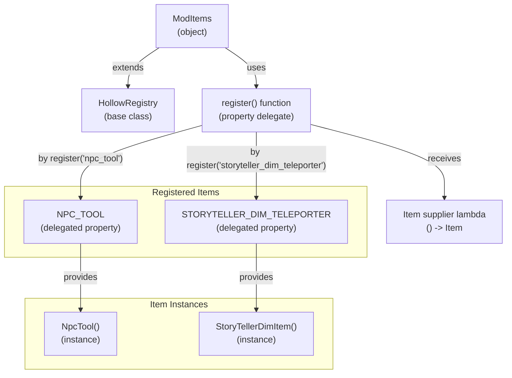
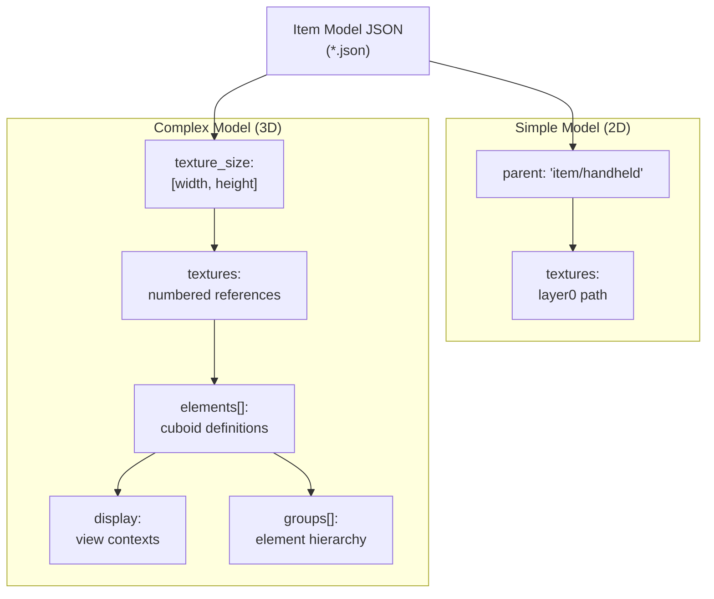
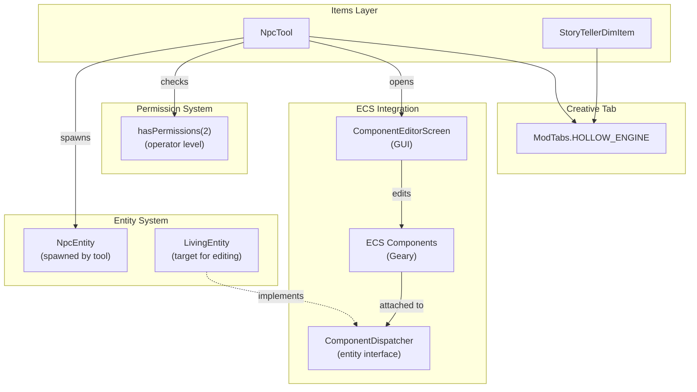

# Items and Registry

<details>
<summary>Relevant source files</summary>

The following files were used as context for generating this wiki page:

- [src/main/java/ru/hollowhorizon/hollowengine/common/registry/ModItems.kt](src/main/java/ru/hollowhorizon/hollowengine/common/registry/ModItems.kt)
- [src/main/resources/assets/hollowengine/models/item/camera.json](src/main/resources/assets/hollowengine/models/item/camera.json)
- [src/main/resources/assets/hollowengine/models/item/storyteller_dim_teleporter.json](src/main/resources/assets/hollowengine/models/item/storyteller_dim_teleporter.json)

</details>


This document covers the item registration system in HollowEngine, including the `HollowRegistry` base class and `ModItems` registry object. It also documents item model definitions and the custom items provided by the mod.

For detailed information about NPC Tool usage and entity interaction, see page 10.3. For component editing functionality, see page 12.1. For 3D model rendering, see page 9.

## HollowRegistry System

HollowEngine provides a declarative item registration system through the `HollowRegistry` base class. This class abstracts the underlying platform-specific registration mechanisms (Forge/Fabric via Architectury) and provides a simplified Kotlin DSL for registering items.

**Registry Architecture**



**Sources:** [src/main/java/ru/hollowhorizon/hollowengine/common/registry/ModItems.kt:1-10]()

### Registration Pattern

The `HollowRegistry` class takes a namespace (mod ID) as a constructor parameter and provides a `register()` function that returns a property delegate. This enables a clean registration syntax using Kotlin's delegated properties:

```kotlin
object ModItems : HollowRegistry(HollowEngine.MODID) {
    val ITEM_NAME by register("registry_id") { ItemClass() }
}
```

**Key characteristics:**
- **Namespace scoping:** All items registered under a `HollowRegistry` instance use the same namespace (e.g., `hollowengine:npc_tool`)
- **Delegated properties:** The `by register()` syntax creates a delegated property that lazily provides the registered item
- **Type-safe access:** Properties provide direct access to item instances without casting

**Sources:** [src/main/java/ru/hollowhorizon/hollowengine/common/registry/ModItems.kt:7]()

## ModItems Registry

The `ModItems` object serves as the central registry for all HollowEngine items. It extends `HollowRegistry` with the `hollowengine` namespace.

**ModItems Registry Contents**

| Property | Registry ID | Item Class | Purpose |
|----------|-------------|-----------|---------|
| `NPC_TOOL` | `npc_tool` | `NpcTool` | Tool for spawning and editing NPC entities |
| `STORYTELLER_DIM_TELEPORTER` | `storyteller_dim_teleporter` | `StoryTellerDimItem` | Dimension teleportation item |

**Registration implementation:**
- `val STORYTELLER_DIM_TELEPORTER by register("storyteller_dim_teleporter") { StoryTellerDimItem() }`
- `val NPC_TOOL by register("npc_tool") { NpcTool() }`

**Sources:** [src/main/java/ru/hollowhorizon/hollowengine/common/registry/ModItems.kt:7-10]()

## Registered Items

### NPC Tool

The `NpcTool` is an interactive tool for spawning and editing NPC entities. It provides access to the entity component editor and allows spawning new `NpcEntity` instances in the world.

**Primary capabilities:**
- **NPC spawning:** Right-click in air/on blocks to spawn new `NpcEntity` at targeted location (up to 25 blocks)
- **Self-editing:** Shift + right-click to open component editor for player's own entity
- **Entity editing:** Right-click entities to open component editor (requires operator permissions)

**Item Properties**

| Property | Value | Description |
|----------|-------|-------------|
| Registry ID | `npc_tool` | Namespaced identifier |
| Stack size | 1 | Non-stackable |
| Creative tab | `ModTabs.HOLLOW_ENGINE` | Creative menu placement |
| Item class | `NpcTool` | Implementation class |

For detailed information on NPC Tool interactions and usage patterns, see page 10.3. For component editor functionality, see page 12.1.

**Sources:** [src/main/java/ru/hollowhorizon/hollowengine/common/registry/ModItems.kt:9]()

### Story Teller Dimension Teleporter

The `StoryTellerDimItem` provides dimension teleportation functionality for story scripting scenarios.

**Item Properties**

| Property | Value | Description |
|----------|-------|-------------|
| Registry ID | `storyteller_dim_teleporter` | Namespaced identifier |
| Item class | `StoryTellerDimItem` | Implementation class |
| Model parent | `item/handheld` | Standard handheld rendering |
| Texture | `hollowengine:item/storyteller_dim_teleporter` | Texture path |

**Sources:** [src/main/java/ru/hollowhorizon/hollowengine/common/registry/ModItems.kt:8](), [src/main/resources/assets/hollowengine/models/item/storyteller_dim_teleporter.json:1-6]()

## Item Models

HollowEngine uses Minecraft's JSON model format to define item appearance. Item models are stored in `assets/hollowengine/models/item/` and support both simple texture-based models and complex 3D geometry.

### Model Format Overview

**Item Model Structure**



**Sources:** [src/main/resources/assets/hollowengine/models/item/storyteller_dim_teleporter.json:1-6](), [src/main/resources/assets/hollowengine/models/item/camera.json:1-10]()

### Story Teller Teleporter Model

The story teller dimension teleporter uses a simple 2D item model:

```json
{
  "parent": "item/handheld",
  "textures": {
    "layer0": "hollowengine:item/storyteller_dim_teleporter"
  }
}
```

This model inherits from the standard `item/handheld` parent, which provides default handheld item rendering transforms.

**Sources:** [src/main/resources/assets/hollowengine/models/item/storyteller_dim_teleporter.json:1-6]()

### Camera Model (Complex 3D)

The camera item demonstrates advanced 3D modeling capabilities with detailed blockbench-style geometry.

**Model Specifications**

| Property | Value |
|----------|-------|
| Texture size | 128×128 pixels |
| Texture path | `hollowengine:items/camera` |
| Elements | 16 cuboid elements |
| Display contexts | 6 (GUI, ground, fixed, third-person L/R, first-person L/R) |
| GUI lighting | Side lighting (`"gui_light": "side"`) |
| Author | _BENDY659_ \| RU |

**Display Transform Configurations**

| Context | Rotation | Translation | Scale |
|---------|----------|-------------|-------|
| `gui` | [30, 225, 0] | [0, 0, 0] | 0.625 |
| `ground` | [0, 0, 0] | [0, 3, 0] | 0.25 |
| `fixed` | [0, 0, 0] | [0, 0, 0] | 0.5 |
| `thirdperson_righthand` | [75, 45, 0] | [0, 2.5, 0] | 0.375 |
| `firstperson_righthand` | [0, 45, 0] | [0, 0, 0] | 0.40 |
| `firstperson_lefthand` | [0, 225, 0] | [0, 0, 0] | 0.40 |

**Element Structure**

Each of the 16 cuboid elements defines:
- **Position:** `from` and `to` coordinates [src/main/resources/assets/hollowengine/models/item/camera.json:10-11]()
- **Rotation:** Angle, axis, and origin point [src/main/resources/assets/hollowengine/models/item/camera.json:12]()
- **Face UVs:** Per-face texture mapping with optional rotation [src/main/resources/assets/hollowengine/models/item/camera.json:13-20]()

Elements are organized into hierarchical groups for easier management:

```
group (root)
  ├─ group (camera body)
  │   └─ elements [0-4]
  ├─ group (lens assembly)
  │   ├─ group (lens mount)
  │   │   └─ elements [5-8]
  │   └─ elements [9-11]
  └─ elements [12-15] (viewfinder)
```

**Sources:** [src/main/resources/assets/hollowengine/models/item/camera.json:1-303]()

## Integration with Game Systems

HollowEngine items integrate with multiple system layers to provide their functionality:



### Component System Access

The NPC Tool provides direct access to the Geary ECS component system through the `ComponentEditorScreen`. This screen allows runtime manipulation of entity components without requiring script execution or command usage.

**Access requirements:**
- Player must have operator permissions (level 2)
- Target entity must implement `ComponentDispatcher` interface
- Tool must be used on client-side with main hand

For detailed information on the component system architecture, see [Component System](#8.2) and [Component Synchronization](#8.4).

**Sources:** [src/main/java/ru/hollowhorizon/hollowengine/common/items/NpcTool.kt:16,18,31-32]()

### NPC Entity Creation

The NPC Tool directly instantiates `NpcEntity` objects and adds them to the world. These entities integrate with:
- **Story API:** For suspendable NPC actions (see [NPC System and Scripting API](#9.2))
- **Geary ECS:** For component attachment and synchronization (see [ECS Architecture](#8.1))
- **Rendering system:** For 3D model display (see [Models and Rendering](#9.4))

**Sources:** [src/main/java/ru/hollowhorizon/hollowengine/common/items/NpcTool.kt:19,53-55]()

### Creative Tab Organization

All HollowEngine items appear in a dedicated creative tab (`ModTabs.HOLLOW_ENGINE`) for easy access. Items implement the `CreativeTab` interface to specify their tab membership.

**Sources:** [src/main/java/ru/hollowhorizon/hollowengine/common/items/NpcTool.kt:20,61]()