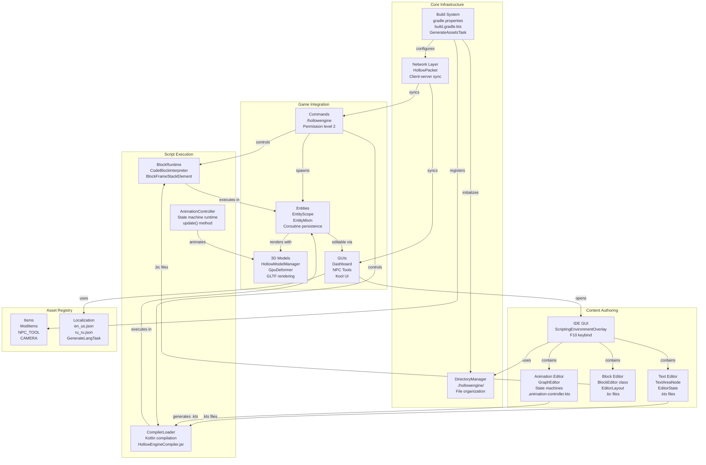
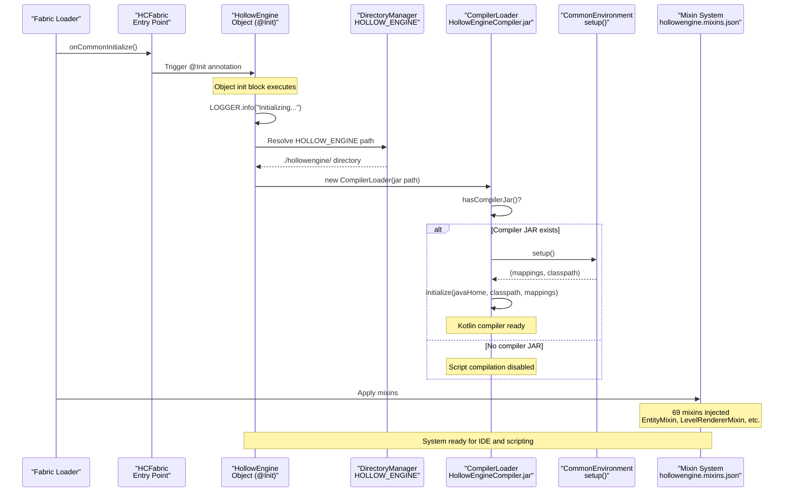
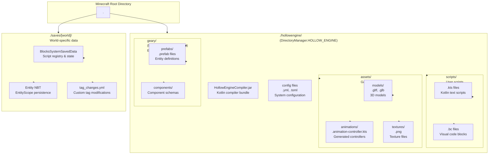

# Getting Started

<details>
<summary>Relevant source files</summary>

The following files were used as context for generating this wiki page:

- [build.gradle.kts](build.gradle.kts)
- [gradle.properties](gradle.properties)
- [src/main/java/ru/hollowhorizon/hollowengine/HollowEngine.kt](src/main/java/ru/hollowhorizon/hollowengine/HollowEngine.kt)
- [src/main/resources/hollowengine.mixins.json](src/main/resources/hollowengine.mixins.json)

</details>


HollowEngine is a Minecraft modding framework that provides an in-game IDE for creating scripts, animations, and game content without restarting the game. This page provides a high-level overview of the system architecture and guides you through the initial setup process.

## What is HollowEngine?

HollowEngine extends Minecraft with:

| Feature | Description | Implementation |
|---------|-------------|----------------|
| **In-Game IDE** | Full IDE environment accessible via F10 keybind | `ScriptingEnvironmentOverlay`, Kool UI framework |
| **Visual Scripting** | Scratch-like block programming system | `BlockEditor`, `CodeBlockInterpreter` |
| **Text Scripting** | Kotlin script editor with IDE features | `TextAreaNode`, `CompilerLoader` |
| **Animation System** | Visual state machine editor for 3D animations | `GraphEditor`, `AnimationController` |
| **3D Model Support** | GLTF/GLB model loading and rendering | `HollowModelManager`, `GpuDeformer` |
| **ECS Integration** | Geary entity-component system | `ComponentRegistry`, prefab system |

The system allows content creators to develop gameplay logic, animations, and entities entirely within Minecraft, with changes taking effect immediately without server restarts.

Sources: [HollowEngine.kt:1-34]()

---

## Prerequisites

| Component | Version/Requirement | Configured In |
|-----------|-------------------|---------------|
| Java | JDK 17 or higher | System environment |
| Kotlin | 2.3.0 | [gradle.properties:10]() |
| Gradle | Managed by wrapper | `gradlew` scripts |
| Minecraft | 1.20.1 or 1.21.1 | Stonecutter configuration |
| Memory | 6GB JVM heap minimum | [gradle.properties:19]() |
| Platform | Fabric (Forge via conditional compilation) | Architectury plugin |

Sources: [gradle.properties:1-22](), [build.gradle.kts:1-16]()

---

## High-Level System Architecture

HollowEngine consists of five major subsystems that work together to provide the complete content creation experience:

**System Architecture Diagram**



**System Relationships**

| Subsystem | Primary Components | Purpose |
|-----------|-------------------|---------|
| **Core Infrastructure** | `DirectoryManager`, build system, network | Foundation layer: file organization, build process, client-server communication |
| **Content Authoring** | `ScriptingEnvironmentOverlay`, editors | User-facing IDE for creating scripts, blocks, and animations |
| **Script Execution** | `CompilerLoader`, `CodeBlockInterpreter`, `AnimationController` | Runtime systems that execute user-created content |
| **Game Integration** | Commands, `EntityScope`, `HollowModelManager` | Bridges content to Minecraft gameplay systems |
| **Asset Registry** | `ModItems`, localization system | Static game content and translations |

The workflow follows this pattern:
1. Users create content in the **IDE** (text scripts, visual blocks, or animations)
2. Content is compiled/interpreted by **execution systems**
3. Scripts run within **EntityScope** attached to game entities
4. Results are rendered via **3D models** and synced via **network packets**

Sources: [HollowEngine.kt:1-34](), [build.gradle.kts:1-148]()

---

## Quick Start

### Building and Running

1. **Clone the repository**
   ```bash
   git clone https://github.com/HollowHorizon/HollowEngine
   cd HollowEngine
   ```

2. **Build the project**
   ```bash
   ./gradlew build
   ```
   
   This executes:
   - `GenerateAssetsTask`: Generates asset path constants in [build.gradle.kts:122-126]()
   - `GenerateLangTask`: Generates localization constants in [build.gradle.kts:128-132]()
   - Kotlin compilation with dependencies
   - JAR packaging

3. **Run the development client**
   ```bash
   ./gradlew runClient
   ```

4. **Access the IDE**
   - In-game, press **F10** to open the IDE overlay
   - Or use `/hollowengine` commands with operator permissions

For detailed installation instructions, including IDE configuration and dependency setup, see [Installation and Setup](#2.1).

Sources: [build.gradle.kts:122-145](), [gradle.properties:1-22]()

---

## Understanding the Initialization Process

HollowEngine initializes through a multi-stage process that sets up the core infrastructure before loading user content:

**Initialization Sequence Diagram**



**Initialization Components**

| Component | File | Responsibility |
|-----------|------|----------------|
| `HollowEngine` object | [HollowEngine.kt:17-34]() | Main initialization entry point with `@Init` annotation |
| `DirectoryManager` | [DirectoryManager.kt]() | Creates and manages `./hollowengine/` directory structure |
| `CompilerLoader` | [CompilerLoader.kt]() | Loads Kotlin compiler from `HollowEngineCompiler.jar` |
| `CommonEnvironment` | [CommonEnvironment.kt]() | Sets up deobfuscation mappings and classpath |
| Mixin system | [hollowengine.mixins.json:1-80]() | Injects 69 mixins for Minecraft integration |

The `HollowEngine.kt` initialization code:
```kotlin
val compilerLoader = CompilerLoader(
    DirectoryManager.HOLLOW_ENGINE.resolve("HollowEngineCompiler.jar").toFile()
)

init {
    LOGGER.info("Initializing Hollow Engine 2.0!")
    
    if (compilerLoader.hasCompilerJar()) {
        val (mappings, classpath) = CommonEnvironment.setup()
        compilerLoader.initialize(File(System.getProperty("java.home")), classpath, mappings)
    }
}
```

For detailed information on annotation processing, compiler setup, and mixin configuration, see [Mod Initialization](#2.4).

Sources: [HollowEngine.kt:17-34](), [hollowengine.mixins.json:1-80]()

---

## Core Dependencies and Build System

HollowEngine uses Gradle with Architectury for multi-platform support and extensive Kotlin ecosystem integration:

**Dependency Overview**

```mermaid
graph TB
    subgraph BuildConfig["Build Configuration"]
        GradleProps["gradle.properties<br/>modVersion=2.0.0-snapshot-1<br/>kotlinVersion=2.3.0<br/>koolVersion=0.20.0-SNAPSHOT"]
        BuildKts["build.gradle.kts<br/>plugins + dependencies"]
    end
    
    subgraph CorePlugins["Gradle Plugins"]
        Arch["architectury-plugin<br/>Platform abstraction"]
        Loom["architectury.loom<br/>Minecraft development"]
        KotlinJvm["kotlin(\"jvm\")<br/>Kotlin compilation"]
        KotlinSerial["kotlin(\"plugin.serialization\")<br/>Kotlinx.serialization"]
        Yamlang["yamlang<br/>Localization"]
    end
    
    subgraph KeyDeps["Key Dependencies"]
        KotlinStd["Kotlin stdlib 2.3.0<br/>kotlin-reflect<br/>kotlinx-coroutines<br/>kotlinx-serialization"]
        KoolUI["Kool UI 0.20.0-SNAPSHOT<br/>kool-core-desktop<br/>Desktop UI framework"]
        GearyECS["Geary ECS 0.28<br/>geary-core<br/>geary-prefabs<br/>geary-serialization"]
        Util["Utilities<br/>tomlkt, kaml<br/>jsvg, markdown<br/>ktfmt"]
    end
    
    subgraph CodeGen["Code Generation"]
        GenAssets["GenerateAssetsTask<br/>generates asset constants<br/>output: build/generated/sources/assets/"]
        GenLang["GenerateLangTask<br/>generates lang constants<br/>output: build/generated/sources/hollowengine/lang"]
    end
    
    GradleProps --> BuildKts
    BuildKts --> Arch
    BuildKts --> Loom
    BuildKts --> KotlinJvm
    BuildKts --> KotlinSerial
    BuildKts --> Yamlang
    
    BuildKts --> KotlinStd
    BuildKts --> KoolUI
    BuildKts --> GearyECS
    BuildKts --> Util
    
    BuildKts --> GenAssets
    BuildKts --> GenLang
```

**Major Dependency Categories**

| Category | Libraries | Purpose |
|----------|-----------|---------|
| **Kotlin** | stdlib 2.3.0, reflect, coroutines 1.9.0, serialization 1.8.0 | Core language support and async execution |
| **UI Framework** | Kool 0.20.0-SNAPSHOT | Desktop UI rendering (Vulkan/OpenGL backend) |
| **ECS** | Geary 0.28 (core, prefabs, actions, serialization) | Entity-component system integration |
| **Configuration** | tomlkt 0.5.0, kaml 0.104.0, snakeyaml-engine-kmp 4.0.1 | File format parsing |
| **Utilities** | jsvg 2.0.0, markdown 0.7.3, ktfmt 0.54, okio 3.9.0 | SVG rendering, markdown, code formatting |

**Build Task Dependencies**

The build system defines custom Gradle tasks that run before compilation:

| Task | Implementation | Purpose |
|------|---------------|---------|
| `generateAssets` | `GenerateAssetsTask` in [build.gradle.kts:122-126]() | Generates Kotlin constants for all asset paths in `src/main/resources/assets/` |
| `generateLang` | `GenerateLangTask` in [build.gradle.kts:128-132]() | Generates Kotlin constants for translation keys from `assets/hollowengine/lang/` |

Both tasks add their output directories to the main source set in [build.gradle.kts:134-139](), making generated constants available at compile time.

For detailed dependency management, version constraints, and custom build tasks, see [Build System and Dependencies](#2.2).

Sources: [build.gradle.kts:1-148](), [gradle.properties:1-22]()

---

## Directory Structure and File Organization

HollowEngine creates a dedicated directory structure for user content, organized by content type:

**Directory Layout**



**Directory Purpose and Persistence**

| Directory | Managed By | Contents | Persistence Scope |
|-----------|-----------|----------|------------------|
| `./hollowengine/` | `DirectoryManager.HOLLOW_ENGINE` | User-created content files | Client-side, not synced |
| `./hollowengine/scripts/` | IDE file tree | `.kts` (text) and `.bc` (blocks) scripts | Local development files |
| `./hollowengine/assets/` | IDE + model loader | 3D models, animations, textures | Asset files referenced by scripts |
| `./hollowengine/geary/` | `DirectoryManager.GEARY` | ECS prefabs and component definitions | ECS configuration |
| `./saves/[world]/` | Minecraft save system | Script state, entity data, tags | Server-side, saved per world |

**Path Utilities**

`DirectoryManager` provides utility methods for path manipulation:

```kotlin
// Convert absolute path to readable relative path
Path.toReadablePath(): String  // "/full/path/hollowengine/scripts/test.kts" → "scripts/test.kts"

// Resolve readable path to absolute File
String.fromReadablePath(): File  // "scripts/test.kts" → File("/full/path/hollowengine/scripts/test.kts")
```

These utilities are used throughout the IDE for displaying file paths and resolving file references.

For detailed information on directory structure, file organization, and path resolution, see [Project Structure and Directories](#2.3).

Sources: [HollowEngine.kt:20](), [DirectoryManager.kt]()

---

## Key Configuration Files

### gradle.properties

Defines project metadata and dependency versions:

```properties
modId=hollowengine
modName=HollowEngine
modVersion=2.0.0-Beta15.1
kotlinVersion=2.3.0
koolVersion=0.20.0-SNAPSHOT
compiler_plugin=1.5.1
```

Sources: [gradle.properties:1-13]()

### build.gradle.kts

Configures build system with:
- **Plugins**: Architectury, Loom, Kotlin JVM, Kotlin Serialization, Yamlang
- **Dependencies**: 40+ libraries including Kotlin stdlib, Kool graphics, Geary ECS
- **Entry Points**: `HCFabric::onCommonInitialize` (main), `HCFabric::onClientInitialize` (client)
- **Source Generation**: `GenerateAssetsTask`, `GenerateLangTask`

Sources: [build.gradle.kts:8-143]()

### hollowengine.mixins.json

Defines 69 mixins across three categories:
- **Common**: 32 mixins (server/client shared)
- **Client**: 37 mixins (rendering, UI integration)
- **Server**: 0 mixins (server-only, currently none)

Mixin categories include:
- Kool UI integration (`DockNodeMixin`, `PlatformInputMixin`)
- Entity system integration (`EntityMixin`, `LivingEntityMixin`)
- Rendering (`LevelRendererMixin`, `EntityRenderDispatcherMixin`)
- Tag system (`TagLoaderMixin`, `TagEntryAccessor`)

Sources: [hollowengine.mixins.json:1-79]()

---

## Localization System

HollowEngine includes comprehensive localization with translation keys for:

| Category | Translation Keys | Purpose |
|----------|-----------------|---------|
| IDE UI | `hollowengine.gui.ide.*` | IDE panels, menus, actions |
| Tag Editor | `hollowengine.tags.*` | Tag management UI |
| Documentation | `hollowengine.gui.docs.*` | Documentation panel structure |
| Commands | `hollowengine.commands.*` | Command feedback messages |
| Components | `hollowengine.component.*` | NPC component categories |

Languages supported:
- English (`en_us.json`)
- Russian (`ru_ru.json`)

The `GenerateLangTask` Gradle task generates Kotlin constants for type-safe translation key access.

Sources: [en_us.json:1-121](), [ru_ru.json:1-121](), [build.gradle.kts:126-130]()

---

## Next Steps

After understanding the initialization and structure:

1. **For development setup**: See [Installation and Setup](#2.1) for detailed environment configuration
2. **For build customization**: See [Build System and Dependencies](#2.2) for dependency management
3. **For file organization**: See [Project Structure and Directories](#2.3) for detailed directory layout
4. **For initialization details**: See [Mod Initialization and Compiler Loading](#2.4) for annotation processing and compiler setup
5. **For extending functionality**: See [Development Guide](#13) for creating custom components and systems