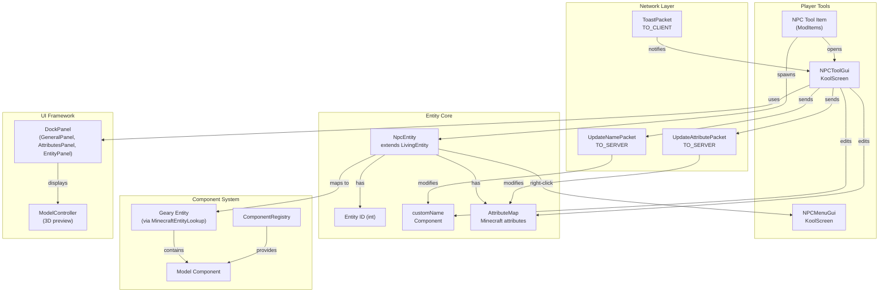
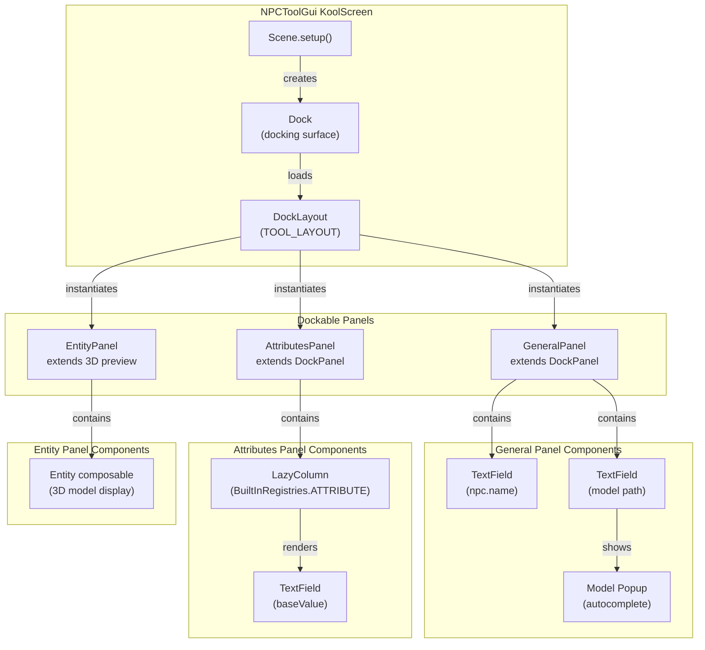
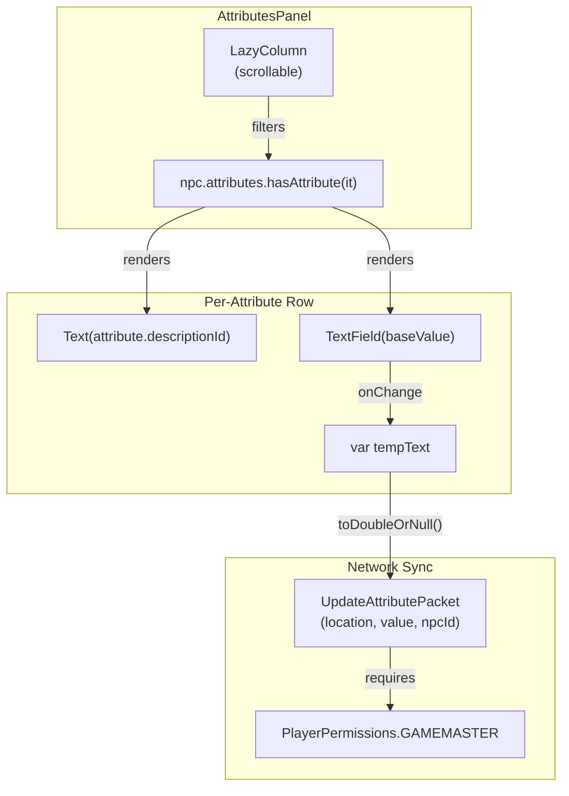
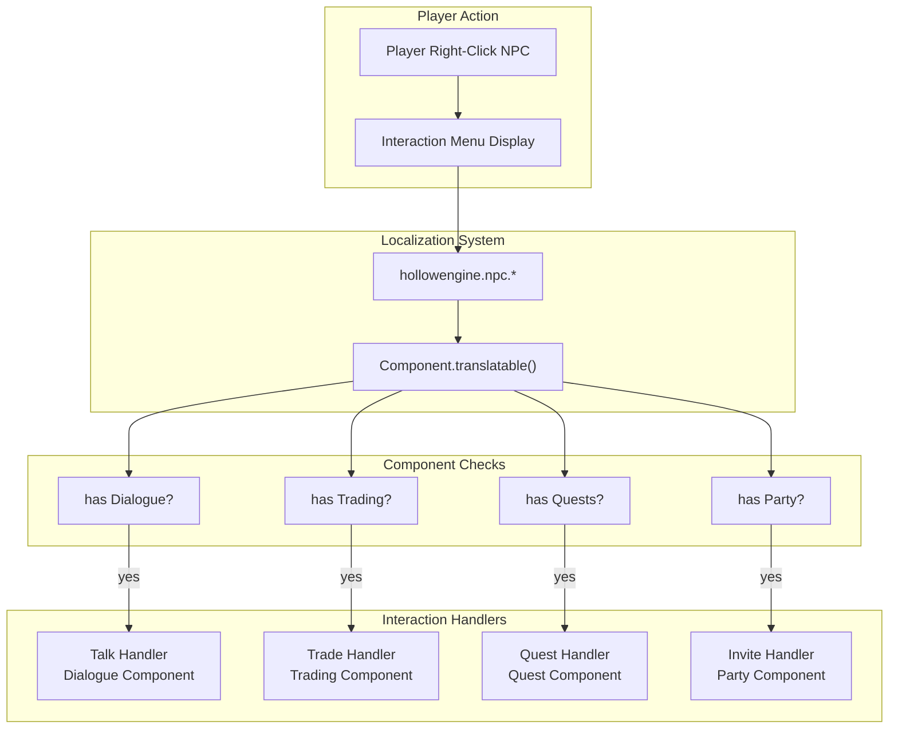
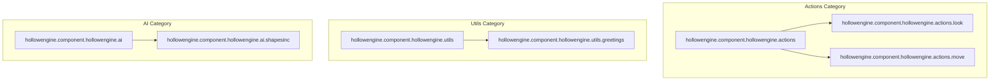
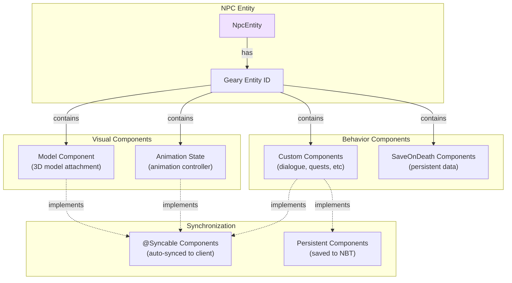

# NPC System

<details>
<summary>Relevant source files</summary>

The following files were used as context for generating this wiki page:

- [src/main/java/ru/hollowhorizon/hollowengine/client/gui/DashboardScreen.kt](src/main/java/ru/hollowhorizon/hollowengine/client/gui/DashboardScreen.kt)
- [src/main/java/ru/hollowhorizon/hollowengine/client/gui/NPCToolGui.kt](src/main/java/ru/hollowhorizon/hollowengine/client/gui/NPCToolGui.kt)
- [src/main/java/ru/hollowhorizon/hollowengine/client/gui/codeblocks/BlockContextMenu.kt](src/main/java/ru/hollowhorizon/hollowengine/client/gui/codeblocks/BlockContextMenu.kt)
- [src/main/java/ru/hollowhorizon/hollowengine/client/gui/modificators/BiomeModificator.kt](src/main/java/ru/hollowhorizon/hollowengine/client/gui/modificators/BiomeModificator.kt)
- [src/main/java/ru/hollowhorizon/hollowengine/client/gui/npcs/NPCMenuGui.kt](src/main/java/ru/hollowhorizon/hollowengine/client/gui/npcs/NPCMenuGui.kt)
- [src/main/java/ru/hollowhorizon/hollowengine/client/gui/scripting/GuiPackets.kt](src/main/java/ru/hollowhorizon/hollowengine/client/gui/scripting/GuiPackets.kt)
- [src/main/java/ru/hollowhorizon/hollowengine/client/gui/scripting/ServerIdeWarning.kt](src/main/java/ru/hollowhorizon/hollowengine/client/gui/scripting/ServerIdeWarning.kt)
- [src/main/java/ru/hollowhorizon/hollowengine/client/gui/scripting/files/ImageFile.kt](src/main/java/ru/hollowhorizon/hollowengine/client/gui/scripting/files/ImageFile.kt)
- [src/main/java/ru/hollowhorizon/hollowengine/client/gui/scripting/files/prefabs/EntityEditorScreen.kt](src/main/java/ru/hollowhorizon/hollowengine/client/gui/scripting/files/prefabs/EntityEditorScreen.kt)
- [src/main/java/ru/hollowhorizon/hollowengine/client/gui/scripting/files/prefabs/ItemPrefabEditorFile.kt](src/main/java/ru/hollowhorizon/hollowengine/client/gui/scripting/files/prefabs/ItemPrefabEditorFile.kt)
- [src/main/java/ru/hollowhorizon/hollowengine/client/gui/scripting/files/prefabs/PrefabEditorFile.kt](src/main/java/ru/hollowhorizon/hollowengine/client/gui/scripting/files/prefabs/PrefabEditorFile.kt)
- [src/main/java/ru/hollowhorizon/hollowengine/client/gui/scripting/panels/ConsolePanel.kt](src/main/java/ru/hollowhorizon/hollowengine/client/gui/scripting/panels/ConsolePanel.kt)
- [src/main/java/ru/hollowhorizon/hollowengine/client/gui/scripting/panels/LanguageEditorPanel.kt](src/main/java/ru/hollowhorizon/hollowengine/client/gui/scripting/panels/LanguageEditorPanel.kt)
- [src/main/java/ru/hollowhorizon/hollowengine/client/gui/scripting/theme/ThemeEditor.kt](src/main/java/ru/hollowhorizon/hollowengine/client/gui/scripting/theme/ThemeEditor.kt)
- [src/main/resources/assets/hollowengine/lang/en_us.json](src/main/resources/assets/hollowengine/lang/en_us.json)
- [src/main/resources/assets/hollowengine/lang/ru_ru.json](src/main/resources/assets/hollowengine/lang/ru_ru.json)

</details>


## Overview

The NPC System provides custom non-player character entities (`NpcEntity`) that can be created, configured, and interacted with in-game. NPCs are standard Minecraft `LivingEntity` instances with support for custom models, attributes, and Geary ECS components. The system includes dedicated GUI tools for editing NPC properties and player interaction menus.

**Core Components:**
- `NpcEntity`: Custom entity type registered as `hollowengine.entity.hollowengine.npc_entity`
- `NPCToolGui`: In-game editor for NPC name, model, and attributes
- `NPCMenuGui`: Player interaction menu (talk, trade, quests, invite)
- `EntityEditorScreen`: Generic entity/component editor usable on NPCs
- Network packets for client-server synchronization

For related systems, see page 10.4 (Entity System) for entity tracking and page 12.1 (Geary ECS Integration) for component architecture.

---

## System Architecture



**Creation Flow:**
1. Player obtains NPC Tool item from creative inventory or commands
2. Using the tool spawns a new `NpcEntity` in the world
3. Right-clicking the NPC with the tool opens `NPCToolGui` for editing

**Editing Flow:**
1. `NPCToolGui` displays dockable panels for name, model, attributes, and preview
2. Changes are sent via `UpdateNamePacket` and `UpdateAttributePacket` to the server
3. Server validates permissions (requires `PlayerPermissions.GAMEMASTER`)
4. Server updates entity properties and syncs to tracking clients

**Interaction Flow:**
1. Player right-clicks NPC without tool to open `NPCMenuGui`
2. Menu displays localized interaction options (talk, trade, quests, invite)
3. Selecting an option triggers interaction handlers

**Sources:** [src/main/java/ru/hollowhorizon/hollowengine/client/gui/NPCToolGui.kt:1-395](), [src/main/java/ru/hollowhorizon/hollowengine/client/gui/npcs/NPCMenuGui.kt:1-104](), [src/main/resources/assets/hollowengine/lang/en_us.json:109-115]()

---

## NpcEntity Properties

The `NpcEntity` class is defined in `ru.hollowhorizon.hollowengine.common.entities` and extends Minecraft's `LivingEntity`. It is registered with the entity type localization key `hollowengine.entity.hollowengine.npc_entity`.

### Editable Properties

| Property | Type | Access | Description |
|----------|------|--------|-------------|
| `customName` | `Component` | Client/Server | Display name shown above NPC |
| `isCustomNameVisible` | `boolean` | Client/Server | Whether name is always visible |
| `attributes` | `AttributeMap` | Server | Minecraft attribute instances |
| Model path | `String` | Via components | 3D model resource location |

### Attribute System

NPCs support all standard Minecraft attributes from `BuiltInRegistries.ATTRIBUTE`. Attributes are managed through the `AttributeMap` and can be edited via `NPCToolGui` or commands.

**Common Attributes:**
- Max health
- Movement speed
- Attack damage
- Follow range
- Knockback resistance
- Armor/toughness values

Attributes are identified by their registry `ResourceLocation` (e.g., `minecraft:generic.max_health`) and synced to clients automatically by Minecraft's entity tracking system.

**Sources:** [src/main/java/ru/hollowhorizon/hollowengine/client/gui/NPCToolGui.kt:275-331](), [src/main/resources/assets/hollowengine/lang/en_us.json:115]()

---

## NPCToolGui - NPC Editor Interface

`NPCToolGui` is a `KoolScreen` that provides a docking-based interface for editing NPC properties. The GUI is opened when using the NPC Tool item on an existing NPC entity (requires operator permissions).

### GUI Architecture



**Panel Descriptions:**

| Panel | Purpose | Key Components |
|-------|---------|----------------|
| `GeneralPanel` | Name and model editing | Name `TextField`, model `TextField` with autocomplete |
| `AttributesPanel` | Attribute value editing | Scrollable list of attribute editors |
| `EntityPanel` | 3D model preview | Live `Entity` composable with camera controls |

**Docking System:**
- Layout is saved/loaded via `DockLayout.saveLayout()` / `DockLayout.loadLayout()`
- Layout key: `TOOL_LAYOUT` from `LayoutLoader`
- Default layout: horizontal split with attributes/general tabs on left, preview on right
- Users can rearrange panels by dragging tab headers

**Sources:** [src/main/java/ru/hollowhorizon/hollowengine/client/gui/NPCToolGui.kt:36-100](), [src/main/java/ru/hollowhorizon/hollowengine/client/gui/NPCToolGui.kt:104-184]()

### Name and Model Editing

The `GeneralPanel` provides text fields for editing NPC name and model path.

**Name Field Implementation:**

```
TextField {
    modifier.text(npc.name)
        .onChange { 
            npc.name = it
            UpdateNamePacket(it, npc.id).send() 
        }
}
```

- Changes update local `npc.name` immediately for client preview
- `UpdateNamePacket` sent to server on every keystroke
- Server validates and applies name change to actual entity

**Model Field Implementation:**

```
TextField {
    modifier.text(model)
        .textColor = if (model.isValidRL() && model.rl in HollowModelManager.allModels) 
            colors.onBackground 
        else 
            Color.DARK_RED
        .onChange { model = it }
}
```

- Text color indicates validation status:
  - Normal color: Valid model resource location found in `HollowModelManager`
  - Dark red: Invalid or non-existent model path
- Autocomplete popup appears when typing, filtered by `model.startsWith(input, ignoreCase = true)`
- Popup shows up to 10 matching models with click-to-select functionality

**Model Autocomplete Popup:**

Rendered as a `Popup` below the text field showing filtered model paths from `HollowModelManager.allModels`. The popup dynamically updates as the user types and dismisses when a selection is made.

**Sources:** [src/main/java/ru/hollowhorizon/hollowengine/client/gui/NPCToolGui.kt:104-184]()

### Attribute Editing

The `AttributesPanel` displays all attributes present on the NPC entity from `BuiltInRegistries.ATTRIBUTE`.

**Attribute List Structure:**



**Attribute Modification Flow:**

1. User types in attribute `TextField`
2. Input is stored in temporary state (`var tempText`)
3. Value is parsed with `toDoubleOrNull()`
4. If valid: `UpdateAttributePacket(location, value, npcId).send()`
5. If invalid: `UpdateAttributePacket(location, 0.0, npcId).send()` (sets to 0)
6. Server receives packet and validates permissions
7. Server updates `entity.attributes.getInstance(attr).baseValue`

**Attribute Display:**
- Attribute name uses localized `descriptionId` from Minecraft's registry
- Registry location shown in packet for server-side lookup
- Only attributes already present on entity are shown (filtered by `hasAttribute()`)

**Sources:** [src/main/java/ru/hollowhorizon/hollowengine/client/gui/NPCToolGui.kt:275-331](), [src/main/java/ru/hollowhorizon/hollowengine/client/gui/NPCToolGui.kt:376-395]()

### Entity Preview

The `EntityPanel` displays a live 3D preview of the NPC using the `Entity()` composable function.

**Preview Implementation:**

```kotlin
Entity({npc}) {
    modifier.size(Grow.Std, Grow.Std)
}
```

- Renders the actual `NpcEntity` instance in a 3D viewport
- Updates automatically when model or animations change
- Supports camera rotation via mouse drag
- Uses the same rendering system as in-world entities

The preview allows creators to see changes to the NPC's appearance immediately without closing the editor.

**Sources:** [src/main/java/ru/hollowhorizon/hollowengine/client/gui/NPCToolGui.kt:333-346]()

---

## Network Synchronization

NPC property changes are synchronized between client and server using `HollowPacket` implementations.

### UpdateNamePacket

Sent from client to server when the NPC name is changed in `NPCToolGui`.

**Packet Structure:**

```kotlin
@HollowPacketHandler(HollowPacketHandler.Direction.TO_SERVER)
@Serializable
class UpdateNamePacket(
    private val name: String, 
    private val npcId: Int
) : HollowPacket
```

**Handler Logic:**

```
override fun handle(player: Player) {
    if (player.hasPermissions(PlayerPermissions.GAMEMASTER)) {
        player.level().getEntity(npcId)?.let {
            it.customName = name.literal
            it.isCustomNameVisible = name.isNotEmpty()
        }
    }
}
```

- Validates player has `GAMEMASTER` permission (operator level 2)
- Looks up entity by integer ID in player's current level
- Sets `customName` to localized `Component` via `literal` extension
- Controls name visibility: hidden if empty, visible if non-empty
- Changes are automatically synced to tracking clients by Minecraft

**Sources:** [src/main/java/ru/hollowhorizon/hollowengine/client/gui/NPCToolGui.kt:363-374]()

### UpdateAttributePacket

Sent from client to server when attribute values are changed in `NPCToolGui`.

**Packet Structure:**

```kotlin
@HollowPacketHandler(HollowPacketHandler.Direction.TO_SERVER)
@Serializable
class UpdateAttributePacket(
    private val attribute: String,  // ResourceLocation as string
    private val value: Double,
    private val npcId: Int
) : HollowPacket
```

**Handler Logic:**

```
override fun handle(player: Player) {
    if (player.hasPermissions(PlayerPermissions.GAMEMASTER)) {
        (player.level().getEntity(npcId) as? LivingEntity)?.let {
            val attr = BuiltInRegistries.ATTRIBUTE.get(attribute.rl)!!
            it.attributes.getInstance(attr)?.baseValue = value
        }
    }
}
```

- Validates player has `GAMEMASTER` permission
- Casts entity to `LivingEntity` (only living entities have attributes)
- Looks up attribute in `BuiltInRegistries.ATTRIBUTE` using resource location
- Updates `baseValue` of the attribute instance
- Changes are automatically synced by Minecraft's attribute tracking

**Version Compatibility:**

The code includes version-specific handling for Minecraft 1.20.1 vs newer versions:
- 1.20.1: `BuiltInRegistries.ATTRIBUTE.get(attribute.rl)!!`
- 1.20.2+: `BuiltInRegistries.ATTRIBUTE.getHolder(attribute.rl).orElseThrow()`

**Sources:** [src/main/java/ru/hollowhorizon/hollowengine/client/gui/NPCToolGui.kt:376-395]()

### ToastPacket

Server can send toast notifications to clients for operation feedback.

**Packet Structure:**

```kotlin
@HollowPacketHandler(HollowPacketHandler.Direction.TO_CLIENT)
@Serializable
class ToastPacket(
    val message: @Serializable(ForTextComponent::class) Component
) : HollowPacket
```

**Client Handler:**

```kotlin
override fun handle(player: Player) = player.sendToast(message)

fun Player.sendToast(message: Component) {
    if (this !is ServerPlayer) {
        Minecraft.getInstance().toasts.addToast(
            SystemToast(
                SystemToast.SystemToastIds.PERIODIC_NOTIFICATION,
                "hollowengine.gui.notification.title".lang.literal,
                message
            )
        )
    } else {
        ToastPacket(message).send(this)
    }
}
```

- Displays system toast notification in top-right corner of screen
- Title uses localized key `hollowengine.gui.notification.title`
- Message is the provided `Component` (supports formatting and translations)
- Server convenience method automatically converts to packet

**Sources:** [src/main/java/ru/hollowhorizon/hollowengine/client/gui/scripting/GuiPackets.kt:15-34]()

---

## NPC Interaction System

NPCs support player interactions through a localized interaction menu system. The interaction types are defined in the localization files and can be extended through custom components.

### Interaction Localization Keys

**Default Interaction Options** ([src/main/resources/assets/hollowengine/lang/en_us.json:107-110]()):

| Localization Key | English Text | Purpose |
|-----------------|--------------|---------|
| `hollowengine.npc.talk` | "Talk" | Opens dialogue interface |
| `hollowengine.npc.trade` | "Trade" | Opens trading GUI |
| `hollowengine.npc.quests` | "Quests" | Opens quest management |
| `hollowengine.npc.invite` | "Invite to team" | Party/team invitation |

These keys are used to generate the interaction menu when a player right-clicks an NPC entity.

### Interaction Flow



The interaction menu dynamically shows only the options for which the NPC has the corresponding component attached. For example, an NPC with only a `Dialogue` component will show only the "Talk" option.

**Component-Based Interactions:** Each interaction type is typically backed by a Geary component:
- **Talk**: Requires a dialogue component containing conversation trees
- **Trade**: Requires a trading component with item exchange definitions
- **Quests**: Requires a quest component with quest data and progress tracking
- **Invite**: Requires a party/team component for group management

**Sources:** [src/main/resources/assets/hollowengine/lang/en_us.json:107-110](), [src/main/resources/assets/hollowengine/lang/ru_ru.json:107-110]()

---

## Component Localization and Categories

NPC components are organized into localized categories for the EntityEditorScreen. This organization is defined in the localization files.

### Component Categories

**Component Localization Keys** ([src/main/resources/assets/hollowengine/lang/en_us.json:114-120]()):



**Category Structure:**

| Category | Localization Key | Purpose |
|----------|-----------------|---------|
| Actions | `hollowengine.component.hollowengine.actions` | Movement and behavior actions |
| Utils | `hollowengine.component.hollowengine.utils` | Utility components |
| AI | `hollowengine.component.hollowengine.ai` | AI and pathfinding systems |

**Individual Components:**

| Component | Localization Key | Description |
|-----------|-----------------|-------------|
| Look | `hollowengine.component.hollowengine.actions.look` | Controls entity look direction |
| Move | `hollowengine.component.hollowengine.actions.move` | Controls entity movement |
| Greetings | `hollowengine.component.hollowengine.utils.greetings` | Greeting message configuration |
| Shapes Inc | `hollowengine.component.hollowengine.ai.shapesinc` | AI integration component |

These localization keys are used by the EntityEditorScreen to organize components into collapsible categories, making it easier to navigate large numbers of components on an entity.

**Sources:** [src/main/resources/assets/hollowengine/lang/en_us.json:114-120](), [src/main/resources/assets/hollowengine/lang/ru_ru.json:114-120]()

---

## Integration with Geary ECS

NPCs are fully integrated with the Geary ECS, meaning they can have arbitrary components attached for custom behavior and data storage.

### Common Component Patterns

Based on the architecture, typical NPC component usage includes:



### Example Usage Pattern

While not shown in the provided files, the typical workflow for extending NPC functionality would be:

1. **Define a Component Class**: Create a data class with `@Registerable` annotation
2. **Mark for Synchronization**: Add `@Syncable` if clients need the data
3. **Attach to NPC**: Use Geary commands or `EntityEditorScreen` to add component
4. **System Processing**: Create Geary systems that query for NPCs with specific components

The `EntityEditorScreen` provides a no-code interface for this workflow, automatically discovering and providing editors for all registered component types.

**Sources:** Diagram 1 and Diagram 4 from architecture overview, [src/main/java/ru/hollowhorizon/hollowengine/common/items/NpcTool.kt:1-66]()