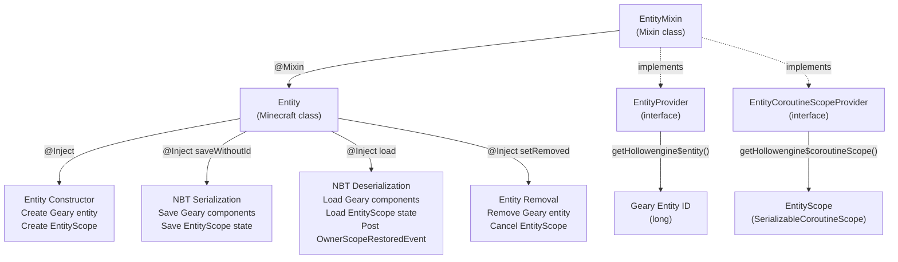
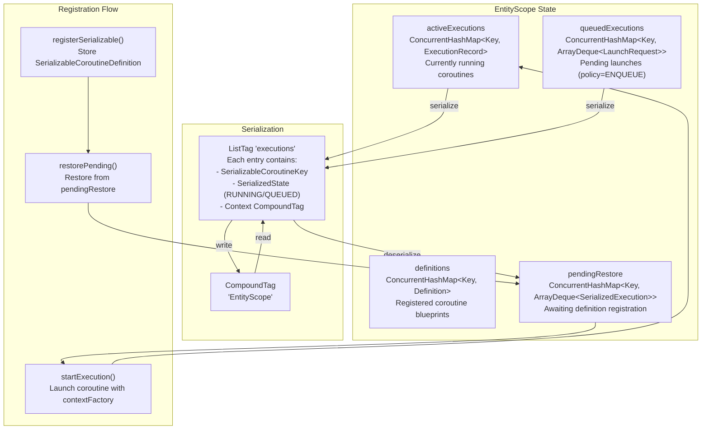
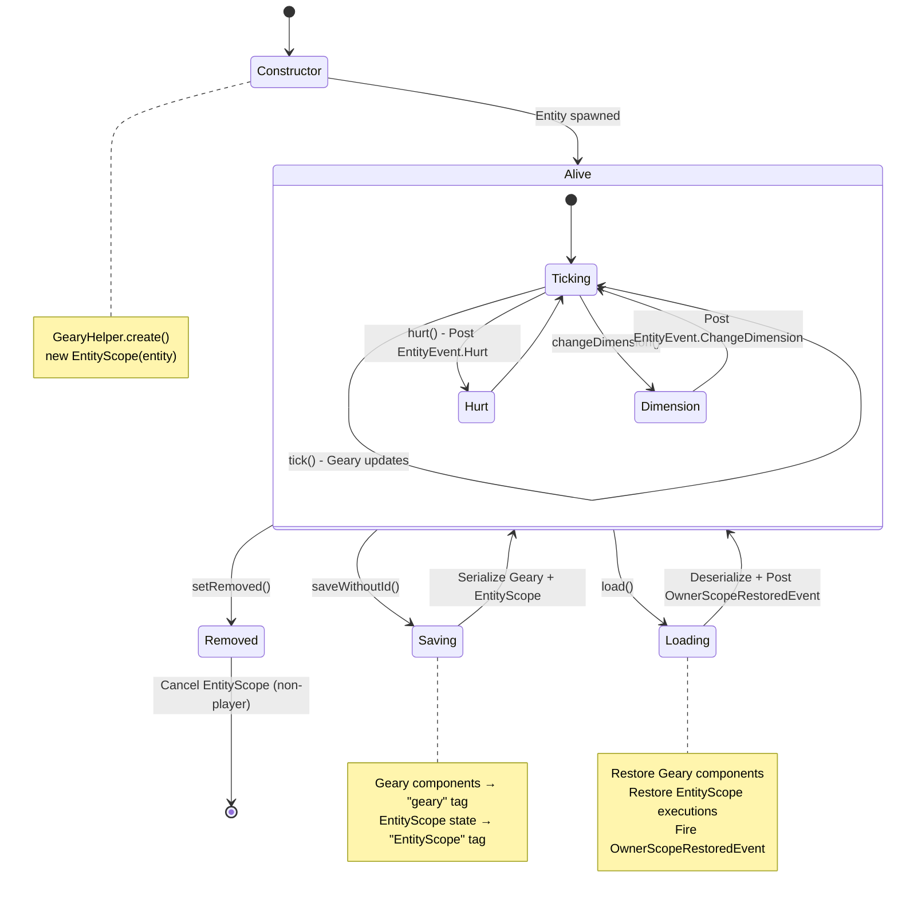
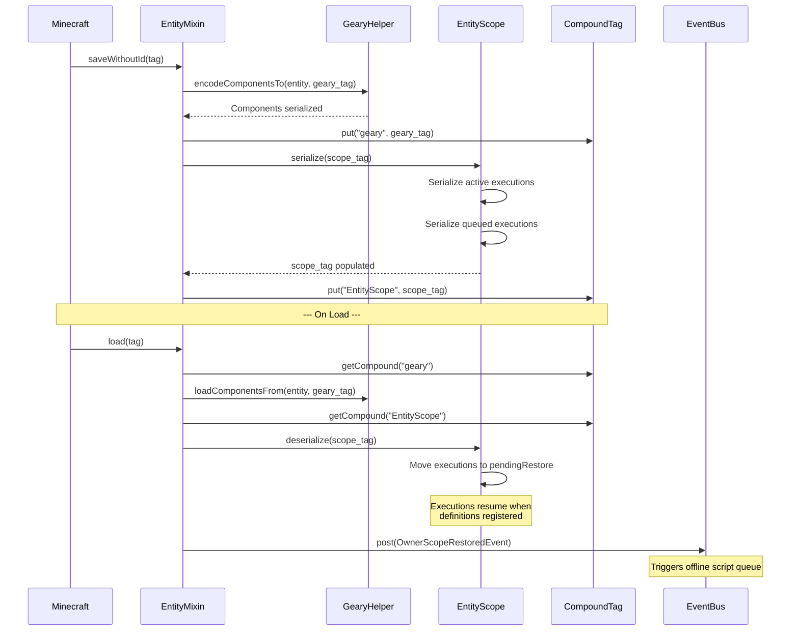
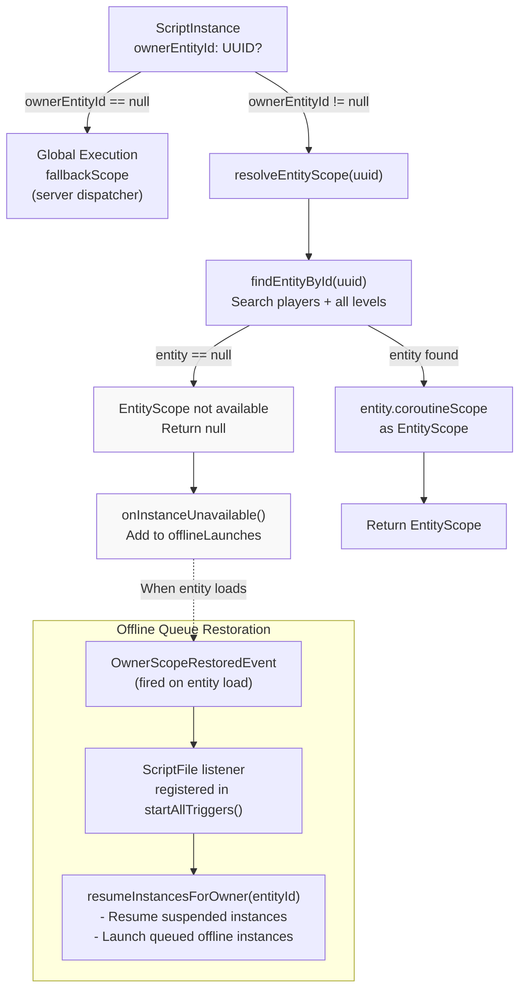
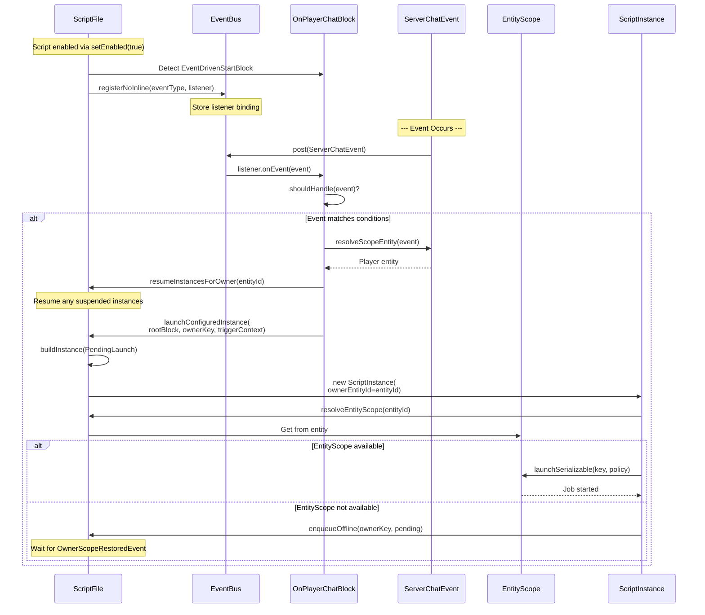
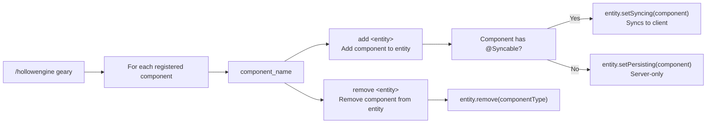
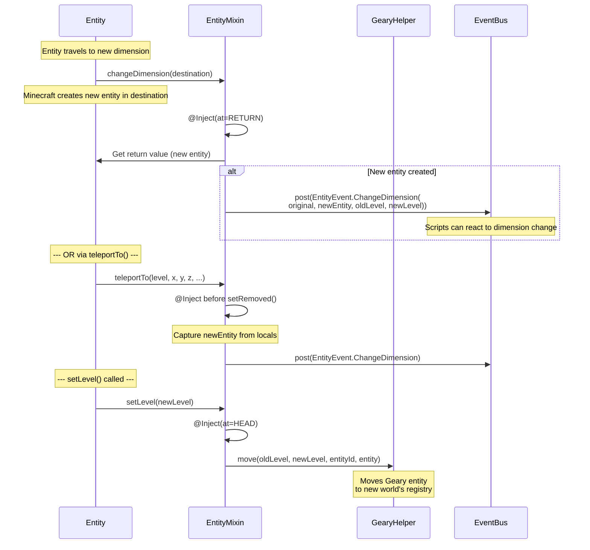
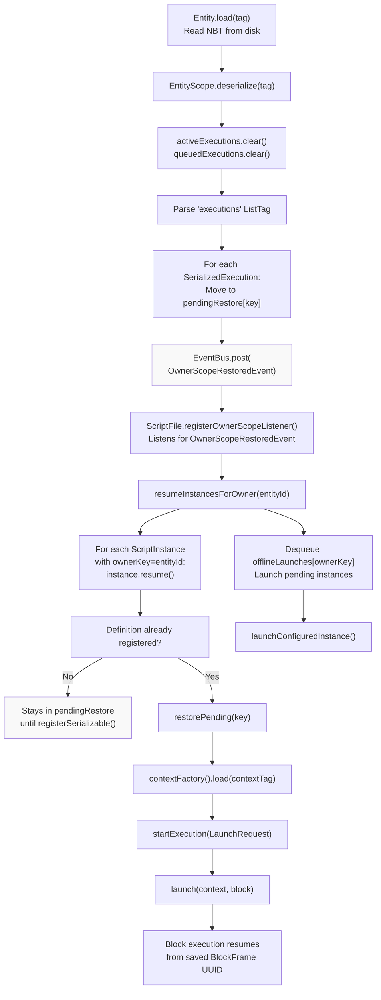
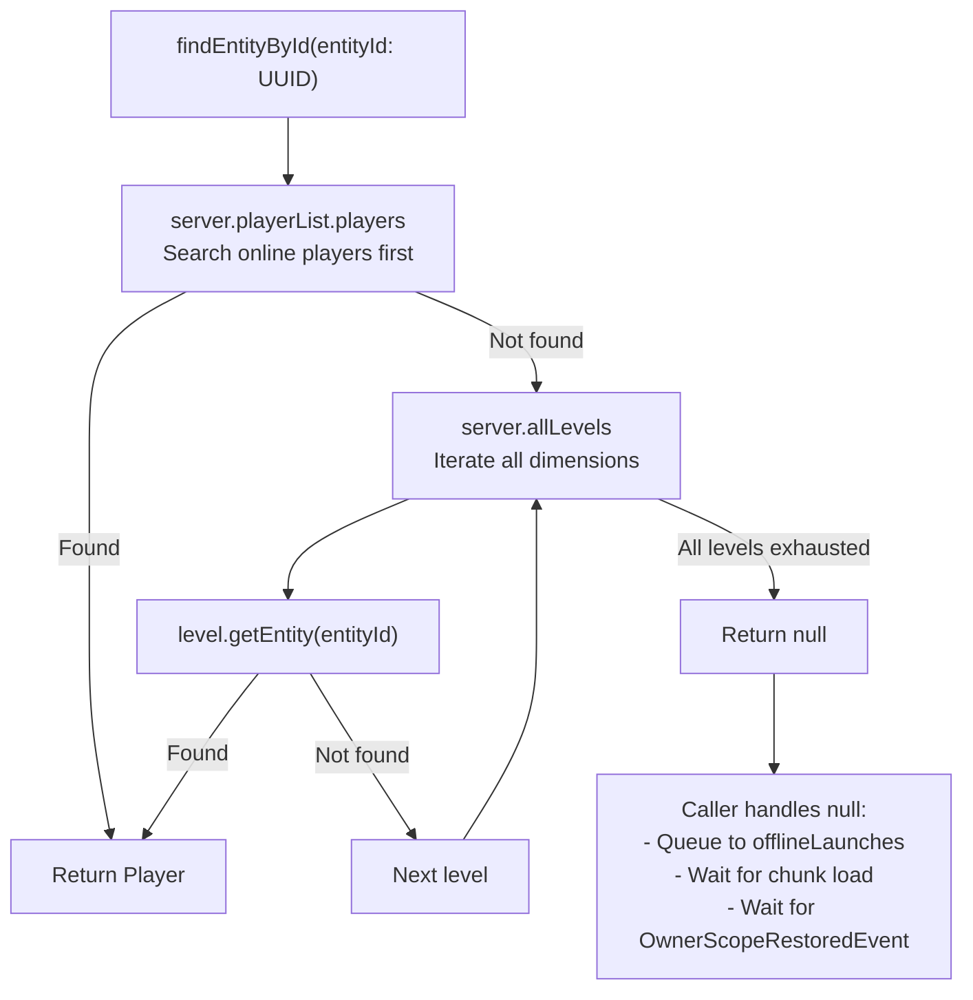

# Entity System

<details>
<summary>Relevant source files</summary>

The following files were used as context for generating this wiki page:

- [src/main/java/ru/hollowhorizon/hollowengine/common/codeblocks/blocks/players/OnPlayerChatBlock.kt](src/main/java/ru/hollowhorizon/hollowengine/common/codeblocks/blocks/players/OnPlayerChatBlock.kt)
- [src/main/java/ru/hollowhorizon/hollowengine/common/codeblocks/execution/BlockFrameStackElement.kt](src/main/java/ru/hollowhorizon/hollowengine/common/codeblocks/execution/BlockFrameStackElement.kt)
- [src/main/java/ru/hollowhorizon/hollowengine/common/codeblocks/execution/CodeBlockInterpreter.kt](src/main/java/ru/hollowhorizon/hollowengine/common/codeblocks/execution/CodeBlockInterpreter.kt)
- [src/main/java/ru/hollowhorizon/hollowengine/common/codeblocks/runtime/BlocksSystem.kt](src/main/java/ru/hollowhorizon/hollowengine/common/codeblocks/runtime/BlocksSystem.kt)
- [src/main/java/ru/hollowhorizon/hollowengine/common/codeblocks/runtime/BlocksSystemSavedData.kt](src/main/java/ru/hollowhorizon/hollowengine/common/codeblocks/runtime/BlocksSystemSavedData.kt)
- [src/main/java/ru/hollowhorizon/hollowengine/common/codeblocks/runtime/OwnerScopeRestoredEvent.kt](src/main/java/ru/hollowhorizon/hollowengine/common/codeblocks/runtime/OwnerScopeRestoredEvent.kt)
- [src/main/java/ru/hollowhorizon/hollowengine/common/codeblocks/runtime/ScriptFile.kt](src/main/java/ru/hollowhorizon/hollowengine/common/codeblocks/runtime/ScriptFile.kt)
- [src/main/java/ru/hollowhorizon/hollowengine/common/codeblocks/runtime/ScriptInstance.kt](src/main/java/ru/hollowhorizon/hollowengine/common/codeblocks/runtime/ScriptInstance.kt)
- [src/main/java/ru/hollowhorizon/hollowengine/common/commands/HollowEngineCommands.kt](src/main/java/ru/hollowhorizon/hollowengine/common/commands/HollowEngineCommands.kt)
- [src/main/java/ru/hollowhorizon/hollowengine/common/coroutines/EntityScope.kt](src/main/java/ru/hollowhorizon/hollowengine/common/coroutines/EntityScope.kt)
- [src/main/java/ru/hollowhorizon/hollowengine/common/coroutines/SingleThreadDispatcher.kt](src/main/java/ru/hollowhorizon/hollowengine/common/coroutines/SingleThreadDispatcher.kt)
- [src/main/java/ru/hollowhorizon/hollowengine/common/dev/DevLogger.kt](src/main/java/ru/hollowhorizon/hollowengine/common/dev/DevLogger.kt)
- [src/main/java/ru/hollowhorizon/hollowengine/mixins/components/EntityMixin.java](src/main/java/ru/hollowhorizon/hollowengine/mixins/components/EntityMixin.java)
- [src/test/kotlin/CodeBlockExecutionCoreTests.kt](src/test/kotlin/CodeBlockExecutionCoreTests.kt)
- [src/test/kotlin/ScriptExecutionLifecycleTests.kt](src/test/kotlin/ScriptExecutionLifecycleTests.kt)

</details>


## Purpose and Scope

The Entity System provides the foundational infrastructure for attaching persistent script execution contexts and ECS components to Minecraft entities. This system enables scripts to be owned by specific entities, survive world saves and chunk unloading, and respond to entity-specific events.

For information about script execution mechanics, see [Script Execution and Runtime](#7). For Geary ECS component management, see [Geary ECS Integration](#12.1). For entity-driven event blocks, see [Event-Driven Execution](#7.4).

---

## Entity Injection via Mixin

HollowEngine uses a mixin to inject two critical fields into every Minecraft `Entity`:

**Injected Fields**

| Field | Type | Purpose |
|-------|------|---------|
| `hollowengine$entity` | `long` | Geary ECS entity ID for component storage |
| `hollowengine$coroutineScope` | `SerializableCoroutineScope` | EntityScope for script execution |

The mixin implements two interfaces to expose these fields:
- `EntityProvider` - Provides access to the Geary entity ID
- `EntityCoroutineScopeProvider` - Provides access to the EntityScope

**Mixin Injection Points**



Sources: [src/main/java/ru/hollowhorizon/hollowengine/mixins/components/EntityMixin.java:1-133]()

---

## EntityScope: Serializable Coroutine Execution

`EntityScope` is a specialized `CoroutineScope` that manages serializable coroutines bound to an entity. It enables script execution to persist across server restarts and chunk unloading.

**EntityScope Architecture**



**LaunchPolicy Behavior**

When `launchSerializable()` is called with an active execution for the same key:

| Policy | Behavior |
|--------|----------|
| `CANCEL_OLD` | Cancels active execution, starts new one |
| `DROP_NEW` | Ignores new request, returns active job |
| `ENQUEUE` | Adds request to queue, starts after active completes |

Sources: [src/main/java/ru/hollowhorizon/hollowengine/common/coroutines/EntityScope.kt:1-276]()

---

## Entity Lifecycle and Event Hooks

The `EntityMixin` injects into key lifecycle methods to maintain entity state and fire events:

**Lifecycle Injection Points**



**Event Firing**

The mixin posts events to the `EventBus`:
- `EntityEvent.Hurt` - When entity takes damage (cancellable)
- `EntityEvent.ChangeDimension` - When entity changes dimensions
- `OwnerScopeRestoredEvent` - When entity NBT is loaded and scope is restored

Sources: [src/main/java/ru/hollowhorizon/hollowengine/mixins/components/EntityMixin.java:48-120]()

---

## NBT Persistence Structure

Entity data is persisted in the entity's NBT tag with two separate sections:

**NBT Tag Structure**

```
Entity NBT (CompoundTag)
├── geary (CompoundTag)
│   └── [Geary component data - see Geary ECS Integration]
│
└── EntityScope (CompoundTag)
    └── executions (ListTag)
        └── [0..n] Execution Entry (CompoundTag)
            ├── key (SerializableCoroutineKey components)
            │   ├── Context key name
            │   ├── Additional key-value pairs
            ├── state (String: "RUNNING" or "QUEUED")
            └── context (CompoundTag)
                └── frames (ListTag)
                    └── [0..n] BlockFrame (CompoundTag)
                        ├── uuid (UUID) - current block ID
                        ├── [custom frame data]
```

**Serialization Flow**



Sources: 
- [src/main/java/ru/hollowhorizon/hollowengine/mixins/components/EntityMixin.java:54-69]()
- [src/main/java/ru/hollowhorizon/hollowengine/common/coroutines/EntityScope.kt:40-77]()

---

## Script-Entity Binding

Scripts can be bound to specific entities through the `ownerEntityId` field in `ScriptInstance`. This enables entity-specific execution contexts and offline queuing.

**Entity Owner Resolution**



**Entity Key System**

Scripts use `OwnerKey` to identify execution ownership:

| OwnerKey Type | Value | Usage |
|---------------|-------|-------|
| `OwnerKey.Global` | Special sentinel | Scripts not bound to any entity |
| `OwnerKey.Entity(UUID)` | Entity UUID | Scripts bound to specific entity |

The `BranchKey` uniquely identifies a script execution branch:
```
BranchKey = (scriptPath, startBlockUUID, ownerKey)
```

This enables different instances of the same script to run on different entities simultaneously, while respecting `RepeatPolicy` per-entity.

Sources: 
- [src/main/java/ru/hollowhorizon/hollowengine/common/codeblocks/runtime/ScriptInstance.kt:52-104]()
- [src/main/java/ru/hollowhorizon/hollowengine/common/codeblocks/runtime/ScriptFile.kt:129-148]()

---

## Event-Driven Entity Execution

Event-driven start blocks can bind script execution to specific entities based on the event context.

**Event-Driven Start Block Interface**

```kotlin
interface EventDrivenStartBlock<E : Event> {
    val eventType: Class<E>
    
    // Resolve which entity should own this script instance
    fun resolveScopeEntity(event: E): Entity?
    
    // Check if this block should handle this specific event
    fun shouldHandle(event: E): Boolean = true
}
```

**Event Registration and Dispatch**



**Example: OnPlayerChatBlock**

The `OnPlayerChatBlock` demonstrates entity binding:
- `eventType` = `ServerChatEvent::class.java`
- `resolveScopeEntity(event)` returns `event.player`
- Each player's chat triggers script execution in that player's `EntityScope`

Sources:
- [src/main/java/ru/hollowhorizon/hollowengine/common/codeblocks/blocks/players/OnPlayerChatBlock.kt:1-86]()
- [src/main/java/ru/hollowhorizon/hollowengine/common/codeblocks/runtime/ScriptFile.kt:150-169]()

---

## Entity-Specific Commands

The `/hollowengine geary` command suite manages ECS components on entities:

**Geary Command Structure**



**Component Registration Detection**

The command iterates over `ComponentRegistry.keys` to dynamically generate subcommands for all registered Geary components. Components annotated with `@Syncable` use `setSyncing()` to replicate to clients, while others use `setPersisting()` for server-only storage.

Sources: [src/main/java/ru/hollowhorizon/hollowengine/common/commands/HollowEngineCommands.kt:123-149]()

---

## Entity Tracking Across Dimensions

The mixin intercepts dimension changes to maintain entity tracking consistency:

**Dimension Change Hooks**



**Player vs Non-Player Entities**

On entity removal (`setRemoved()`), the mixin behavior differs:
- **Non-player entities**: `GearyHelper.removeEntity()` cleans up Geary entity, `EntityScope.cancel()` stops all coroutines
- **Players**: No cleanup (players are handled separately by Minecraft's player list)

Sources: [src/main/java/ru/hollowhorizon/hollowengine/mixins/components/EntityMixin.java:83-120]()

---

## EntityScope Restoration Flow

When an entity is loaded from NBT, its `EntityScope` must restore suspended script executions:

**Complete Restoration Sequence**



**Registration Order Issue**

The mixin posts `OwnerScopeRestoredEvent` immediately after deserialization, but `SerializableCoroutineDefinition` instances may not be registered yet. The `EntityScope` handles this through `pendingRestore`:

1. Deserialized executions go to `pendingRestore[key]`
2. When `registerSerializable(definition)` is called, it triggers `restorePending(key)`
3. If definition matches pending executions, they're restored immediately

This allows script files to register their definitions after entity load, and executions will automatically resume.

Sources:
- [src/main/java/ru/hollowhorizon/hollowengine/common/coroutines/EntityScope.kt:57-84]()
- [src/main/java/ru/hollowhorizon/hollowengine/common/codeblocks/runtime/ScriptFile.kt:171-181]()
- [src/main/java/ru/hollowhorizon/hollowengine/common/codeblocks/runtime/ScriptFile.kt:338-345]()

---

## Entity ID Resolution and Server Searches

`ScriptFile.findEntityById()` performs a comprehensive search across all server entities:

**Entity Search Strategy**



**Why Comprehensive Search is Needed**

Entities can be:
- **Online players**: In `server.playerList.players`
- **Loaded entities**: In a level's entity storage (chunk loaded)
- **Unloaded entities**: Not in memory (chunk unloaded) → returns `null`

When `null` is returned, the script instance is queued in `offlineLaunches` and will resume when the entity's chunk is loaded and `OwnerScopeRestoredEvent` fires.

Sources: [src/main/java/ru/hollowhorizon/hollowengine/common/codeblocks/runtime/ScriptFile.kt:304-311]()

---

## Summary

The Entity System provides a complete infrastructure for entity-aware script execution:

**Key Components**

| Component | Purpose |
|-----------|---------|
| `EntityMixin` | Injects Geary ID and EntityScope into all entities |
| `EntityScope` | Manages serializable coroutines with persistence |
| `OwnerKey` | Identifies script ownership (global or entity-specific) |
| `EventDrivenStartBlock` | Binds script triggers to entity events |
| `OwnerScopeRestoredEvent` | Signals entity load for script resumption |
| `offlineLaunches` | Queues scripts for entities not currently loaded |

**Persistence Guarantees**

- Entity Geary components persist via `"geary"` NBT tag
- Entity script state persists via `"EntityScope"` NBT tag
- Script instances resume execution at the exact block where they were suspended
- Script state survives server restarts, chunk unloading, and dimension changes

**Thread Safety**

`EntityScope` uses `ConcurrentHashMap` for all state storage, enabling safe access from multiple threads. The `synchronized(lock)` blocks ensure atomic operations during serialization and queue manipulation.

Sources: All files analyzed in this document