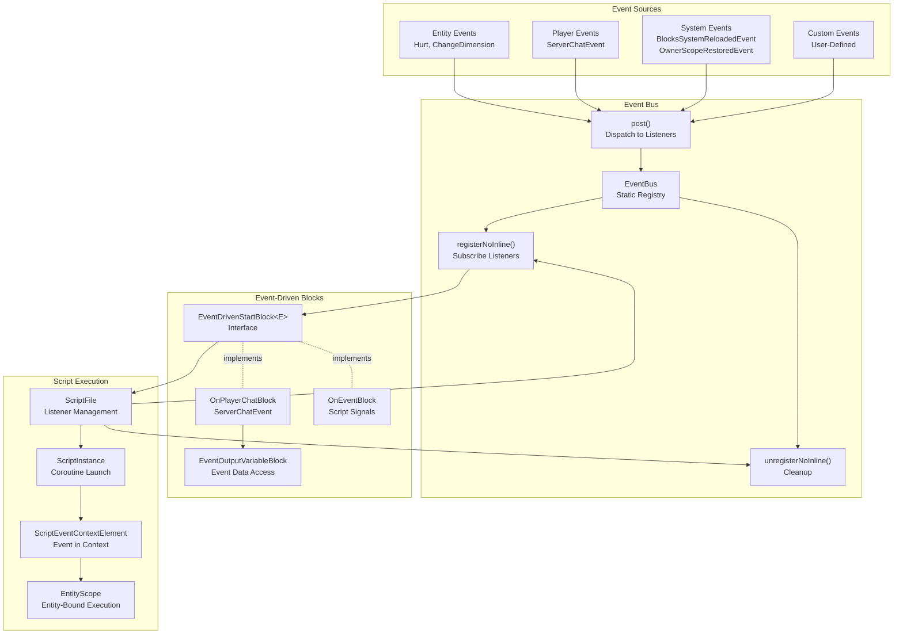
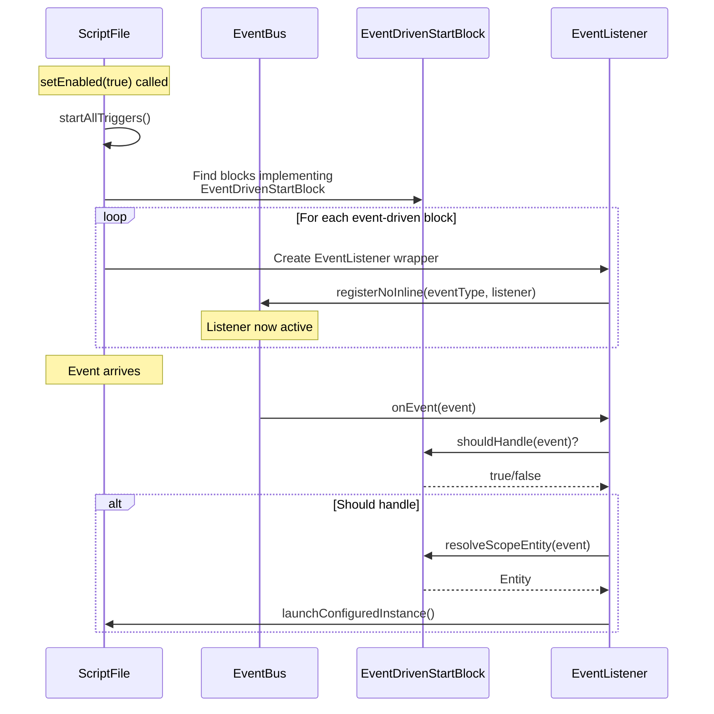
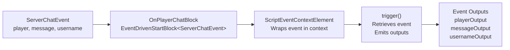
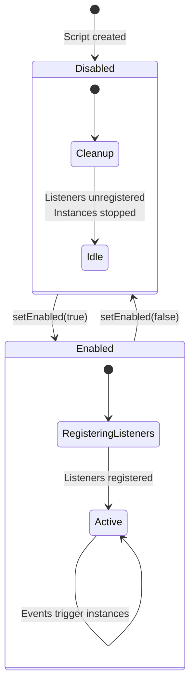
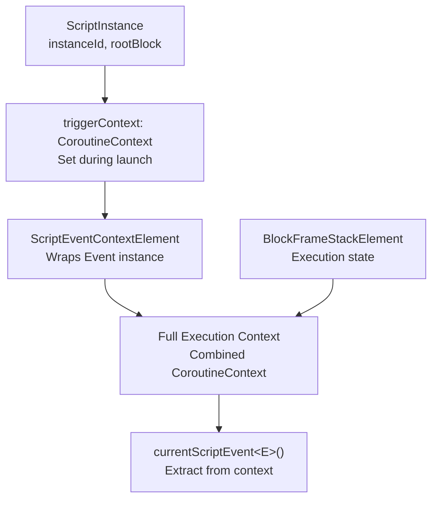
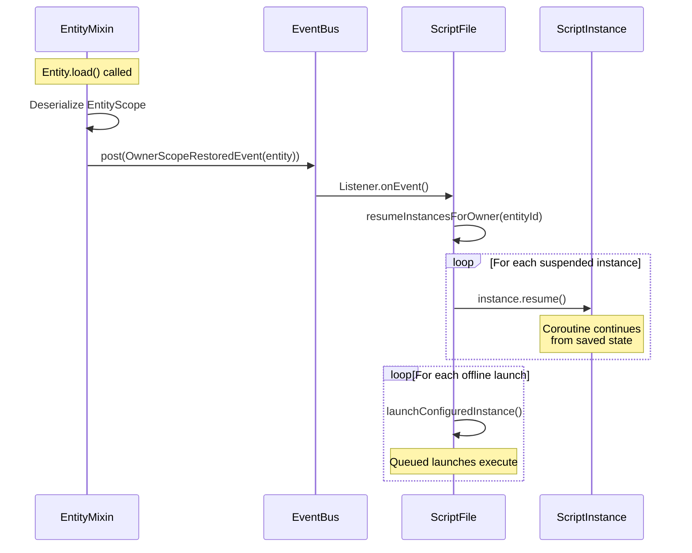
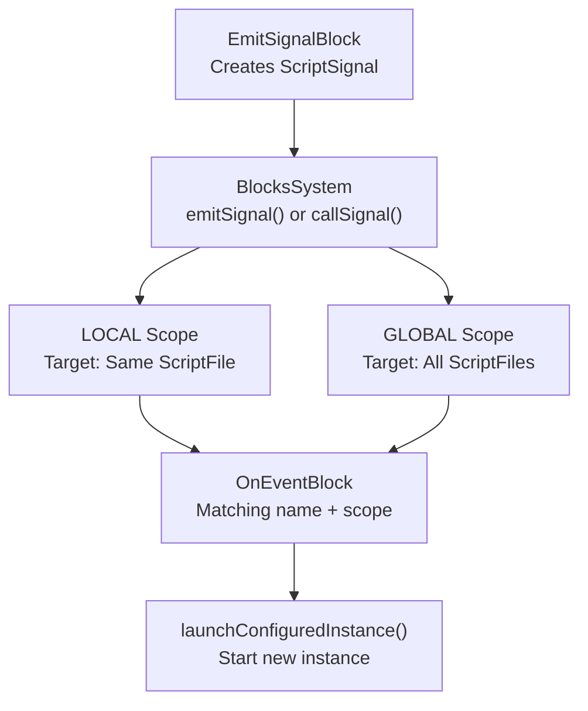
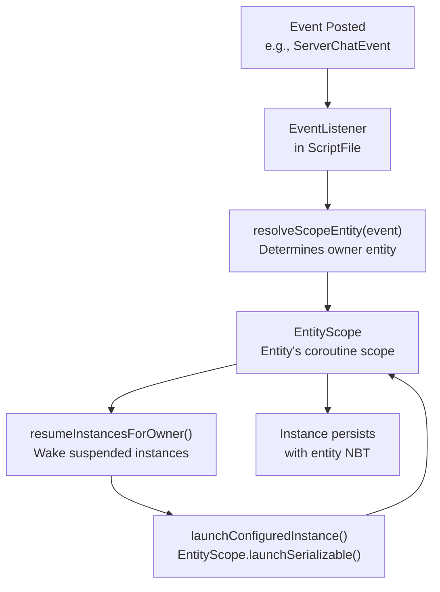

# Event System

<details>
<summary>Relevant source files</summary>

The following files were used as context for generating this wiki page:

- [src/main/java/ru/hollowhorizon/hollowengine/common/codeblocks/blocks/players/OnPlayerChatBlock.kt](src/main/java/ru/hollowhorizon/hollowengine/common/codeblocks/blocks/players/OnPlayerChatBlock.kt)
- [src/main/java/ru/hollowhorizon/hollowengine/common/codeblocks/execution/BlockFrameStackElement.kt](src/main/java/ru/hollowhorizon/hollowengine/common/codeblocks/execution/BlockFrameStackElement.kt)
- [src/main/java/ru/hollowhorizon/hollowengine/common/codeblocks/execution/CodeBlockInterpreter.kt](src/main/java/ru/hollowhorizon/hollowengine/common/codeblocks/execution/CodeBlockInterpreter.kt)
- [src/main/java/ru/hollowhorizon/hollowengine/common/codeblocks/runtime/BlocksSystem.kt](src/main/java/ru/hollowhorizon/hollowengine/common/codeblocks/runtime/BlocksSystem.kt)
- [src/main/java/ru/hollowhorizon/hollowengine/common/codeblocks/runtime/BlocksSystemSavedData.kt](src/main/java/ru/hollowhorizon/hollowengine/common/codeblocks/runtime/BlocksSystemSavedData.kt)
- [src/main/java/ru/hollowhorizon/hollowengine/common/codeblocks/runtime/OwnerScopeRestoredEvent.kt](src/main/java/ru/hollowhorizon/hollowengine/common/codeblocks/runtime/OwnerScopeRestoredEvent.kt)
- [src/main/java/ru/hollowhorizon/hollowengine/common/codeblocks/runtime/ScriptFile.kt](src/main/java/ru/hollowhorizon/hollowengine/common/codeblocks/runtime/ScriptFile.kt)
- [src/main/java/ru/hollowhorizon/hollowengine/common/codeblocks/runtime/ScriptInstance.kt](src/main/java/ru/hollowhorizon/hollowengine/common/codeblocks/runtime/ScriptInstance.kt)
- [src/main/java/ru/hollowhorizon/hollowengine/common/commands/HollowEngineCommands.kt](src/main/java/ru/hollowhorizon/hollowengine/common/commands/HollowEngineCommands.kt)
- [src/main/java/ru/hollowhorizon/hollowengine/common/coroutines/EntityScope.kt](src/main/java/ru/hollowhorizon/hollowengine/common/coroutines/EntityScope.kt)
- [src/main/java/ru/hollowhorizon/hollowengine/common/coroutines/SingleThreadDispatcher.kt](src/main/java/ru/hollowhorizon/hollowengine/common/coroutines/SingleThreadDispatcher.kt)
- [src/main/java/ru/hollowhorizon/hollowengine/common/dev/DevLogger.kt](src/main/java/ru/hollowhorizon/hollowengine/common/dev/DevLogger.kt)
- [src/main/java/ru/hollowhorizon/hollowengine/mixins/components/EntityMixin.java](src/main/java/ru/hollowhorizon/hollowengine/mixins/components/EntityMixin.java)
- [src/test/kotlin/CodeBlockExecutionCoreTests.kt](src/test/kotlin/CodeBlockExecutionCoreTests.kt)
- [src/test/kotlin/ScriptExecutionLifecycleTests.kt](src/test/kotlin/ScriptExecutionLifecycleTests.kt)

</details>


The Event System provides the primary mechanism for triggering and communicating between scripts, game systems, and entities. It enables event-driven execution of code block scripts, entity lifecycle management, and inter-script communication through a centralized event bus. 

For information about the runtime execution of event-driven scripts, see [Script Execution and Runtime](#7). For details on creating event-driven block types, see [Custom Block Development](#12.3).

---

## System Overview

The Event System consists of three main subsystems: the **Event Bus** for publishing and subscribing to events, **Event-Driven Start Blocks** that trigger script execution when events occur, and an **Event Context System** that passes event data through coroutine execution chains.



**Diagram: Event System Architecture**

Sources: [src/main/java/ru/hollowhorizon/hollowengine/common/codeblocks/runtime/ScriptFile.kt:150-169](), [src/main/java/ru/hollowhorizon/hollowengine/mixins/components/EntityMixin.java:71-93]()

---

## Event Bus

The `EventBus` provides a centralized publish-subscribe mechanism for all events in the system. Events are typed, allowing listeners to subscribe only to specific event classes.

### Core Operations

| Operation | Description | Usage Context |
|-----------|-------------|---------------|
| `post(event: Event)` | Broadcasts event to all registered listeners | Event sources (mixins, commands, scripts) |
| `registerNoInline(type: Class<Event>, listener: EventListener<Event>)` | Subscribes listener to event type | Script file initialization, custom listeners |
| `unregisterNoInline(type: Class<Event>, listener: EventListener<Event>)` | Removes listener subscription | Script file cleanup, disable |

### Event Listener Interface

Event listeners implement a functional interface with a single method:

```kotlin
interface EventListener<E : Event> {
    fun onEvent(event: E)
}
```

Sources: [src/main/java/ru/hollowhorizon/hollowengine/common/codeblocks/runtime/ScriptFile.kt:151-169]()

### Registration Flow



**Diagram: Event Listener Registration and Invocation**

Sources: [src/main/java/ru/hollowhorizon/hollowengine/common/codeblocks/runtime/ScriptFile.kt:61-70](), [src/main/java/ru/hollowhorizon/hollowengine/common/codeblocks/runtime/ScriptFile.kt:150-169]()

---

## Event-Driven Start Blocks

Event-driven start blocks implement the `EventDrivenStartBlock<E>` interface, which extends `StartBlock`. These blocks automatically register event listeners when the script is enabled and trigger script execution when matching events occur.

### EventDrivenStartBlock Interface

```kotlin
interface EventDrivenStartBlock<E : Event> {
    val eventType: Class<E>
    fun shouldHandle(event: E): Boolean = true
    fun resolveScopeEntity(event: E): Entity?
}
```

| Method | Purpose | Default Behavior |
|--------|---------|------------------|
| `eventType` | Specifies which event class triggers this block | Must be implemented |
| `shouldHandle(event)` | Filters events before execution | Returns `true` (all events accepted) |
| `resolveScopeEntity(event)` | Determines which entity owns the script execution | Must be implemented |

Sources: [src/main/java/ru/hollowhorizon/hollowengine/common/codeblocks/runtime/ScriptFile.kt:150-169]()

### Example: OnPlayerChatBlock

The `OnPlayerChatBlock` demonstrates the complete pattern for event-driven blocks:



**Diagram: OnPlayerChatBlock Event Flow**

Implementation highlights from [src/main/java/ru/hollowhorizon/hollowengine/common/codeblocks/blocks/players/OnPlayerChatBlock.kt:1-86]():

- **Event Type**: `ServerChatEvent::class.java` (line 43)
- **Scope Resolution**: Returns `event.player` (line 45)
- **Event Data Access**: Uses `currentScriptEvent<ServerChatEvent>()` to retrieve event from context (line 37)
- **Output Variables**: Three `EventOutputVariableBlock` instances expose event properties (lines 23-34)

Sources: [src/main/java/ru/hollowhorizon/hollowengine/common/codeblocks/blocks/players/OnPlayerChatBlock.kt:19-45]()

### Lifecycle Management

Event listeners are managed automatically by `ScriptFile`:



**Diagram: Event Listener Lifecycle**

When a script is disabled, all event listeners are unregistered and running instances are stopped [src/main/java/ru/hollowhorizon/hollowengine/common/codeblocks/runtime/ScriptFile.kt:49-58]().

Sources: [src/main/java/ru/hollowhorizon/hollowengine/common/codeblocks/runtime/ScriptFile.kt:49-81](), [src/main/java/ru/hollowhorizon/hollowengine/common/codeblocks/runtime/ScriptFile.kt:297-302]()

---

## Event Context System

Events are passed through coroutine execution chains using `ScriptEventContextElement`, allowing event data to be accessed anywhere in the script execution.

### Context Element Structure



**Diagram: Event Context Flow**

Sources: [src/main/java/ru/hollowhorizon/hollowengine/common/codeblocks/runtime/ScriptInstance.kt:93](), [src/main/java/ru/hollowhorizon/hollowengine/common/codeblocks/runtime/ScriptFile.kt:158-164]()

### Retrieving Event Data in Blocks

Event-driven blocks access event data using `currentScriptEvent<E>()`:

```kotlin
override suspend fun trigger() {
    val event = currentScriptEvent<ServerChatEvent>() ?: await<ServerChatEvent>()
    playerOutput.emit(event.player)
    messageOutput.emit(event.message.string)
    usernameOutput.emit(event.username)
}
```

This pattern retrieves the event from the coroutine context, falling back to `await<E>()` if not present [src/main/java/ru/hollowhorizon/hollowengine/common/codeblocks/blocks/players/OnPlayerChatBlock.kt:36-41]().

### Event Output Variables

`EventOutputVariableBlock` provides a mechanism for declaring event properties that should be available to downstream blocks. These are declared using the `outputDefault` delegate:

```kotlin
private val playerOutput by outputDefault<Player>(
    name = PLAYER_OUTPUT,
    default = { EventOutputVariableBlock("player") },
)
```

The variable name (e.g., `"player"`) must match the event context provider's `availableEventOutputs()` set [src/main/java/ru/hollowhorizon/hollowengine/common/codeblocks/blocks/players/OnPlayerChatBlock.kt:78]().

Sources: [src/main/java/ru/hollowhorizon/hollowengine/common/codeblocks/blocks/players/OnPlayerChatBlock.kt:23-41]()

---

## Built-in Events

The system includes several categories of built-in events that drive core functionality.

### Entity Events

Posted by `EntityMixin` during entity lifecycle:

| Event Class | Trigger Condition | Available Data |
|-------------|------------------|----------------|
| `EntityEvent.Hurt` | Entity takes damage | `entity`, `damageSource`, `amount` |
| `EntityEvent.ChangeDimension` | Entity changes dimension | `oldEntity`, `newEntity`, `oldLevel`, `newLevel` |

Sources: [src/main/java/ru/hollowhorizon/hollowengine/mixins/components/EntityMixin.java:71-106]()

### Player Events

| Event Class | Trigger Condition | Available Data |
|-------------|------------------|----------------|
| `ServerChatEvent` | Player sends chat message | `player`, `message`, `username` |

Sources: [src/main/java/ru/hollowhorizon/hollowengine/common/codeblocks/blocks/players/OnPlayerChatBlock.kt:21]()

### System Events

| Event Class | Trigger Condition | Purpose |
|-------------|------------------|---------|
| `BlocksSystemReloadedEvent` | Scripts reloaded from disk | Notify systems of script changes |
| `OwnerScopeRestoredEvent` | Entity deserialized with EntityScope | Resume suspended script instances |
| `RegisterCommandsEvent` | Command registration phase | Register mod commands |

The `OwnerScopeRestoredEvent` is particularly important for script persistence. When an entity is deserialized, this event triggers resumption of any suspended script instances bound to that entity:



**Diagram: OwnerScopeRestoredEvent Handling**

Sources: [src/main/java/ru/hollowhorizon/hollowengine/mixins/components/EntityMixin.java:64-69](), [src/main/java/ru/hollowhorizon/hollowengine/common/codeblocks/runtime/ScriptFile.kt:171-181](), [src/main/java/ru/hollowhorizon/hollowengine/common/codeblocks/runtime/ScriptFile.kt:338-345]()

---

## Script Signals

In addition to game events, scripts can communicate with each other using **signals**. Signals are custom events with a name and scope that can trigger `OnEventBlock` instances.

### Signal Structure

```kotlin
data class ScriptSignal(
    val name: String,
    val scope: SignalScope,
    val sourceScriptPath: String,
    val owner: OwnerKey,
    val data: Map<String, Any?> = emptyMap()
)

enum class SignalScope {
    LOCAL,   // Only triggers blocks in same script file
    GLOBAL   // Triggers blocks in all script files
}
```

### Signal Emission Flow



**Diagram: Signal Emission and Handling**

### Signal vs Event

| Aspect | Events | Signals |
|--------|--------|---------|
| Origin | Game systems, entity lifecycle | Script blocks |
| Typing | Strongly-typed Event classes | String-based names |
| Scope | Global (all listeners) | LOCAL or GLOBAL |
| Context | Pass through coroutine context | Wrapped in `ScriptSignalContextElement` |
| Execution | Launch new instances | Launch or call (synchronous) |

The `callSignal()` method executes signal handlers synchronously without launching new instances, useful for function-like behavior:

```kotlin
suspend fun callSignal(signal: ScriptSignal) {
    val targetScripts = when (signal.scope) {
        SignalScope.LOCAL -> listOfNotNull(scripts[signal.sourceScriptPath])
        SignalScope.GLOBAL -> scripts.values.toList()
    }
    
    targetScripts.forEach { it.callSignal(signal) }
}
```

Sources: [src/main/java/ru/hollowhorizon/hollowengine/common/codeblocks/runtime/BlocksSystem.kt:89-105](), [src/main/java/ru/hollowhorizon/hollowengine/common/codeblocks/runtime/ScriptFile.kt:185-213]()

---

## Event Posting from Code

Game systems and mixins post events using the static `EventBus.post()` method:

```java
// From EntityMixin
@Inject(method = "hurt", at = @At("HEAD"), cancellable = true)
public void onHurt(DamageSource damageSource, float amount, CallbackInfoReturnable<Boolean> cir) {
    var event = new EntityEvent.Hurt((Entity) (Object) this, damageSource, amount);
    EventBus.post(event);
    if (event.isCanceled()) cir.setReturnValue(false);
}
```

Events can be cancellable, allowing listeners to prevent default behavior [src/main/java/ru/hollowhorizon/hollowengine/mixins/components/EntityMixin.java:71-76]().

### Command Registration Example

The `@SubscribeEvent` annotation marks methods that should be registered as event listeners during initialization:

```kotlin
@SubscribeEvent
fun onRegisterCommands(event: RegisterCommandsEvent) {
    event.dispatcher.onRegisterCommands {
        "hollowengine" {
            registerParticleCommands()
            registerModelCommands()
            // ...
        }
    }
}
```

Sources: [src/main/java/ru/hollowhorizon/hollowengine/common/commands/HollowEngineCommands.kt:53-64]()

---

## Integration with EntityScope

The event system deeply integrates with `EntityScope` to enable entity-bound script execution with persistence:



**Diagram: Event-Driven Execution with EntityScope**

When an event-driven block resolves an entity, the resulting script instance is bound to that entity's `EntityScope`. This enables:

1. **Automatic suspension** when the entity unloads from the world
2. **Serialization** of script state to entity NBT
3. **Resumption** when the entity is loaded via `OwnerScopeRestoredEvent`

Sources: [src/main/java/ru/hollowhorizon/hollowengine/common/codeblocks/runtime/ScriptFile.kt:129-132](), [src/main/java/ru/hollowhorizon/hollowengine/common/codeblocks/runtime/ScriptFile.kt:158-164](), [src/main/java/ru/hollowhorizon/hollowengine/common/codeblocks/runtime/ScriptFile.kt:338-345]()

---

## Custom Event Development

To create custom events that integrate with the block system:

### 1. Define the Event Class

```kotlin
class MyCustomEvent(
    val someData: String,
    val affectedEntity: Entity
) : Event
```

All events must extend the base `Event` class.

### 2. Create an Event-Driven Start Block

```kotlin
@Serializable
@SerialName("mymod:events/my_event")
class OnMyCustomEventBlock : StartBlock(), EventDrivenStartBlock<MyCustomEvent>, EventContextProvider {
    override val color: Color get() = CodeBlocksColors.EVENTS
    
    private val dataOutput by outputDefault<String>(
        name = DATA_OUTPUT,
        default = { EventOutputVariableBlock("data") },
    )
    
    override suspend fun trigger() {
        val event = currentScriptEvent<MyCustomEvent>() ?: await<MyCustomEvent>()
        dataOutput.emit(event.someData)
    }
    
    override val eventType: Class<MyCustomEvent> get() = MyCustomEvent::class.java
    
    override fun resolveScopeEntity(event: MyCustomEvent) = event.affectedEntity
    
    override fun availableEventOutputs(): Set<String> = setOf("data")
    
    override fun InputSlotScope.composeContent() {
        Text("On My Custom Event") { /* styling */ }
        Row { OutputSlot(dataOutput) }
    }
}
```

### 3. Post the Event

```kotlin
// From game code or mixin
EventBus.post(MyCustomEvent("example", entity))
```

### 4. Register the Block

Add the block to a `BlockModule` so it appears in the block repository:

```kotlin
object MyEventsModule : BlockModule {
    override val blocks = listOf(
        BlockEntry(
            name = "On My Custom Event",
            icon = /* ... */,
            create = { OnMyCustomEventBlock() }
        )
    )
}
```

Sources: [src/main/java/ru/hollowhorizon/hollowengine/common/codeblocks/blocks/players/OnPlayerChatBlock.kt:19-85]()

---

## Testing Event-Driven Execution

The test suite demonstrates event-driven execution patterns:

```kotlin
// From test: Event triggers script instance
val listener = object : EventListener<ServerChatEvent> {
    override fun onEvent(event: ServerChatEvent) {
        if (!trigger.shouldHandle(event)) return
        val entity = trigger.resolveScopeEntity(event) ?: return
        launchConfiguredInstance(
            rootBlock = trigger as StartBlock,
            ownerKey = entity.uuid.toOwnerKey(),
            triggerContext = ScriptEventContextElement(event),
        )
    }
}

EventBus.registerNoInline(ServerChatEvent::class.java, listener)
```

Sources: [src/main/java/ru/hollowhorizon/hollowengine/common/codeblocks/runtime/ScriptFile.kt:151-169]()

---

## Key Implementation Files

| File | Purpose |
|------|---------|
| `ScriptFile.kt` | Event listener registration and lifecycle management |
| `BlocksSystem.kt` | Signal emission and global event coordination |
| `EntityMixin.java` | Entity lifecycle event posting |
| `OnPlayerChatBlock.kt` | Reference implementation of event-driven block |
| `OwnerScopeRestoredEvent.kt` | Event for script resumption |

Sources: All files listed in table