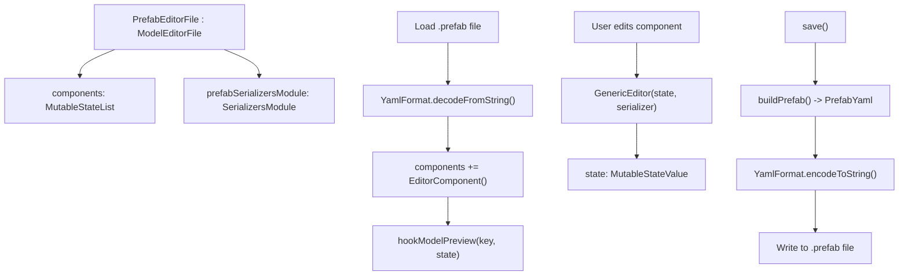
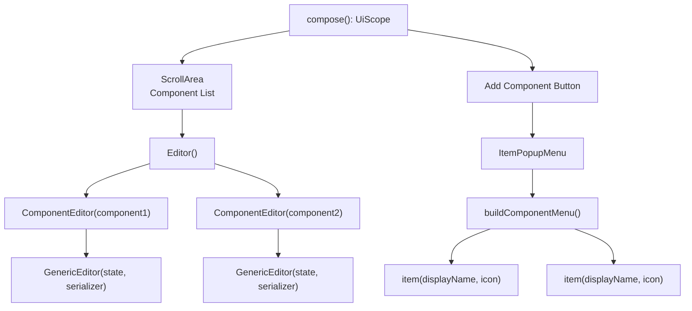
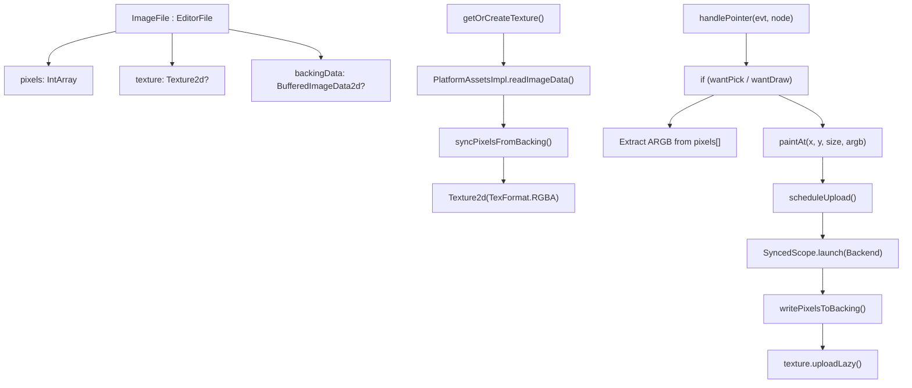
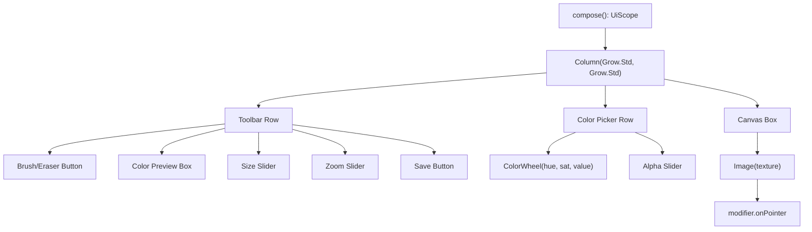
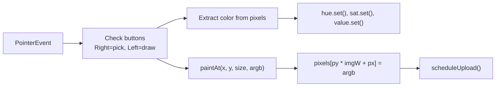
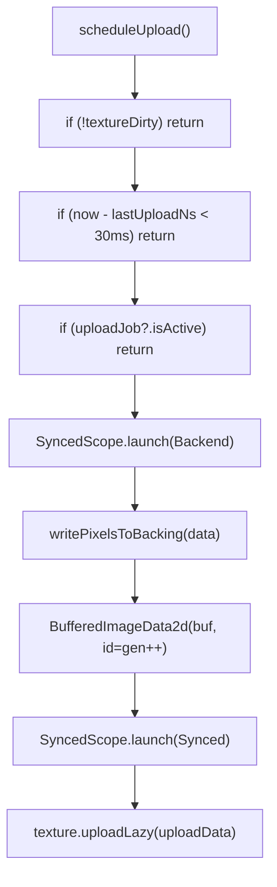

# Additional Tools and Editors

<details>
<summary>Relevant source files</summary>

The following files were used as context for generating this wiki page:

- [src/main/java/ru/hollowhorizon/hollowengine/client/gui/DashboardScreen.kt](src/main/java/ru/hollowhorizon/hollowengine/client/gui/DashboardScreen.kt)
- [src/main/java/ru/hollowhorizon/hollowengine/client/gui/NPCToolGui.kt](src/main/java/ru/hollowhorizon/hollowengine/client/gui/NPCToolGui.kt)
- [src/main/java/ru/hollowhorizon/hollowengine/client/gui/codeblocks/BlockContextMenu.kt](src/main/java/ru/hollowhorizon/hollowengine/client/gui/codeblocks/BlockContextMenu.kt)
- [src/main/java/ru/hollowhorizon/hollowengine/client/gui/modificators/BiomeModificator.kt](src/main/java/ru/hollowhorizon/hollowengine/client/gui/modificators/BiomeModificator.kt)
- [src/main/java/ru/hollowhorizon/hollowengine/client/gui/npcs/NPCMenuGui.kt](src/main/java/ru/hollowhorizon/hollowengine/client/gui/npcs/NPCMenuGui.kt)
- [src/main/java/ru/hollowhorizon/hollowengine/client/gui/scripting/GuiPackets.kt](src/main/java/ru/hollowhorizon/hollowengine/client/gui/scripting/GuiPackets.kt)
- [src/main/java/ru/hollowhorizon/hollowengine/client/gui/scripting/ServerIdeWarning.kt](src/main/java/ru/hollowhorizon/hollowengine/client/gui/scripting/ServerIdeWarning.kt)
- [src/main/java/ru/hollowhorizon/hollowengine/client/gui/scripting/files/ImageFile.kt](src/main/java/ru/hollowhorizon/hollowengine/client/gui/scripting/files/ImageFile.kt)
- [src/main/java/ru/hollowhorizon/hollowengine/client/gui/scripting/files/prefabs/EntityEditorScreen.kt](src/main/java/ru/hollowhorizon/hollowengine/client/gui/scripting/files/prefabs/EntityEditorScreen.kt)
- [src/main/java/ru/hollowhorizon/hollowengine/client/gui/scripting/files/prefabs/ItemPrefabEditorFile.kt](src/main/java/ru/hollowhorizon/hollowengine/client/gui/scripting/files/prefabs/ItemPrefabEditorFile.kt)
- [src/main/java/ru/hollowhorizon/hollowengine/client/gui/scripting/files/prefabs/PrefabEditorFile.kt](src/main/java/ru/hollowhorizon/hollowengine/client/gui/scripting/files/prefabs/PrefabEditorFile.kt)
- [src/main/java/ru/hollowhorizon/hollowengine/client/gui/scripting/panels/ConsolePanel.kt](src/main/java/ru/hollowhorizon/hollowengine/client/gui/scripting/panels/ConsolePanel.kt)
- [src/main/java/ru/hollowhorizon/hollowengine/client/gui/scripting/panels/LanguageEditorPanel.kt](src/main/java/ru/hollowhorizon/hollowengine/client/gui/scripting/panels/LanguageEditorPanel.kt)
- [src/main/java/ru/hollowhorizon/hollowengine/client/gui/scripting/theme/ThemeEditor.kt](src/main/java/ru/hollowhorizon/hollowengine/client/gui/scripting/theme/ThemeEditor.kt)
- [src/main/resources/assets/hollowengine/lang/en_us.json](src/main/resources/assets/hollowengine/lang/en_us.json)
- [src/main/resources/assets/hollowengine/lang/ru_ru.json](src/main/resources/assets/hollowengine/lang/ru_ru.json)

</details>


HollowEngine provides specialized content editors beyond text scripts and visual code blocks. This page documents the Prefab Editor, Image Editor, Console Panel, Language Editor, and Theme Editor.

Related pages: [Text Script Editor](#4), [Visual Block Editor](#5), [Animation System](#8).

---

## Prefab Editor

`PrefabEditorFile` enables visual editing of entity and item prefabs using a component-based architecture. Components are registered via `ComponentRegistry` and serialized to YAML using polymorphic serialization.

### Architecture Overview

**Prefab Editor Data Flow**


### Component System

**Component Registry Integration**

The editor loads components from `ComponentRegistry`, which maps `ResourceLocation` keys to `ComponentHolder` instances:

[src/main/java/ru/hollowhorizon/hollowengine/client/gui/scripting/files/prefabs/PrefabEditorFile.kt:34-39]()

**Component Data Model**

| Class | Properties | Purpose |
|-------|-----------|---------|
| `EditorComponent` | `key: ResourceLocation`<br/>`holder: ComponentHolder<*>`<br/>`state: MutableStateValue<Component>` | Tracks component instance with metadata |
| `ComponentHolder` | `value: KClass<out Component>`<br/>`serializer: KSerializer<*>` | Provides component type info and serializer |
| `PrefabYaml` | `components: Map<String, String>`<br/>`prefabs: Set<PrefabKey>` | Serialization container |

The polymorphic serializers module is built dynamically:

[src/main/java/ru/hollowhorizon/hollowengine/client/gui/scripting/files/prefabs/PrefabEditorFile.kt:32-39]()

### UI Layout

**Prefab Editor Component Hierarchy**


The sidebar composition creates a scrollable list of component editors:

[src/main/java/ru/hollowhorizon/hollowengine/client/gui/scripting/files/prefabs/PrefabEditorFile.kt:96-147]()

### Component Operations

**Add Component Flow**

```mermaid
graph LR
    AddButton["Add Component Button<br/>onClick"]
    showPopup["componentPopup.show()"]
    buildMenu["buildComponentMenu()"]
    
    AddButton --> showPopup
    showPopup --> buildMenu
    
    buildMenu --> getAvailable["ComponentRegistry.keys<br/>.filter { it !in existing }"]
    getAvailable --> renderItems["item(displayName, icon)"]
    
    renderItems --> itemClick["onClick"]
    itemClick --> addComponent["addComponent(key)"]
    
    addComponent --> getHolder["ComponentRegistry[key]"]
    getHolder --> createComponent["holder.create()"]
    createComponent --> createState["mutableStateOf(component)"]
    createState --> addToList["components += EditorComponent()"]
```



The `addComponent` function creates new component instances:

[src/main/java/ru/hollowhorizon/hollowengine/client/gui/scripting/files/prefabs/PrefabEditorFile.kt:166-174]()

**Model Preview Hook**

The editor hooks into model component changes to update the 3D preview:

[src/main/java/ru/hollowhorizon/hollowengine/client/gui/scripting/files/prefabs/PrefabEditorFile.kt:176-185]()

When a component with key `hollowengine:model` changes, the `modelController.model.set()` is called to update the preview viewport.

### Generic Editor

`GenericEditor` is a composable function that renders form fields for any serializable component using reflection on the `KSerializer` descriptor. Implementation details are referenced but not fully shown in the provided files.

**Generic Editor Features**

| Feature | Implementation |
|---------|----------------|
| Field rendering | Inspects `SerialDescriptor` for field names and types |
| Type dispatch | Renders appropriate UI widgets per field type |
| Delete callback | Shows delete button with confirmation |
| State binding | Writes changes back to `MutableStateValue<T>` |

[src/main/java/ru/hollowhorizon/hollowengine/client/gui/scripting/files/prefabs/PrefabEditorFile.kt:209-218]()

### Serialization Format

**YAML Prefab Structure**

```yaml
components:
  hollowengine:model: |
    model: "hollowengine:entities/npc"
  hollowengine:health: |
    maxHealth: 20.0
    health: 20.0
prefabs: []
```

Components are serialized as a map from `ResourceLocation` strings to YAML sub-documents. The `YamlFormat.encodeToString()` call serializes each component independently:

[src/main/java/ru/hollowhorizon/hollowengine/client/gui/scripting/files/prefabs/PrefabEditorFile.kt:78-93]()

Sources:
- [src/main/java/ru/hollowhorizon/hollowengine/client/gui/scripting/files/prefabs/PrefabEditorFile.kt:1-226]()

---

## Image Editor

`ImageFile` provides pixel-level image editing with brush/eraser tools, color picking, and zoom controls. Images are loaded from PNG bytes and rendered via `Texture2d` with lazy GPU uploads.

### Architecture

**Image Editor Component Structure**


### State Management

**Image Editor State**

| Property | Type | Purpose |
|----------|------|---------|
| `pixels` | `IntArray` | ARGB pixel data in memory |
| `texture` | `Texture2d?` | GPU texture for rendering |
| `backingData` | `BufferedImageData2d?` | Intermediate buffer for uploads |
| `zoom` | `MutableStateValue<Float>` | Zoom level (4x to 64x) |
| `brushSize` | `MutableStateValue<Int>` | Brush radius in pixels |
| `isEraser` | `MutableStateValue<Boolean>` | Eraser mode toggle |
| `hue`, `sat`, `value`, `alpha` | `MutableStateValue<Float>` | HSV color picker state |

[src/main/java/ru/hollowhorizon/hollowengine/client/gui/scripting/files/ImageFile.kt:22-54]()

### UI Layout

**Image Editor Component Hierarchy**


[src/main/java/ru/hollowhorizon/hollowengine/client/gui/scripting/files/ImageFile.kt:60-156]()

### Drawing Operations

**Pointer Event Handling**

Drawing is implemented via `modifier.onPointer` callback on the image canvas:



[src/main/java/ru/hollowhorizon/hollowengine/client/gui/scripting/files/ImageFile.kt:206-247]()

**Paint Implementation**

The `paintAt` function applies a brush stamp to the pixel array:

[src/main/java/ru/hollowhorizon/hollowengine/client/gui/scripting/files/ImageFile.kt:249-260]()

Brush shape is square with radius `size`. Eraser mode writes transparent pixels (`0x00000000`).

### GPU Upload Strategy

**Throttled Upload System**

To avoid excessive GPU traffic, uploads are throttled to ~30ms intervals:



[src/main/java/ru/hollowhorizon/hollowengine/client/gui/scripting/files/ImageFile.kt:262-291]()

The upload job runs on a backend thread to avoid blocking the UI. The generation counter (`uploadGen`) ensures each upload has a unique `BufferedImageData2d.id`, forcing Kool to re-upload the texture.

### Color Picker

The color picker uses `ColorWheel` composable with HSV color space:

[src/main/java/ru/hollowhorizon/hollowengine/client/gui/scripting/files/ImageFile.kt:116-125]()

**Color Conversion**

Brush color is converted from HSV to ARGB:

```kotlin
val c = Color.Hsv(hue.value, sat.value, value.value).toSrgb(a = alpha.value)
val a = (c.a * 255f).toInt()
val r = (c.r * 255f).toInt()
val g = (c.g * 255f).toInt()
val b = (c.b * 255f).toInt()
return (a shl 24) or (r shl 16) or (g shl 8) or b
```

[src/main/java/ru/hollowhorizon/hollowengine/client/gui/scripting/files/ImageFile.kt:46-54]()

Sources:
- [src/main/java/ru/hollowhorizon/hollowengine/client/gui/scripting/files/ImageFile.kt:1-340]()

---

## Recipe Editor

Recipe editing functionality is referenced in the localization files but implementation details are not provided in the available source files.

**Localization Keys**

| Key | English | Russian |
|-----|---------|---------|
| `hollowengine.gui.ide.recipes` | "Recipe Editor" | "Редактор рецептов" |

[src/main/resources/assets/hollowengine/lang/en_us.json:33]()
[src/main/resources/assets/hollowengine/lang/ru_ru.json:33]()

Sources:
- [src/main/resources/assets/hollowengine/lang/en_us.json:33]()
- [src/main/resources/assets/hollowengine/lang/ru_ru.json:33]()

---

## Console Panel and Other Panels

Additional panels provide specialized functionality within the IDE.

### Console Panel

`ConsolePanel` displays script output and system logs. Implementation details are limited in the provided files.

Registration:
[src/main/java/ru/hollowhorizon/hollowengine/client/gui/scripting/docking/IdeLayouts.kt:9]()

### Docs Panel

`DocsPanel` provides API documentation browsing. Implementation details are limited in the provided files.

Registration:
[src/main/java/ru/hollowhorizon/hollowengine/client/gui/scripting/docking/IdeLayouts.kt:10]()

Sources:
- [src/main/java/ru/hollowhorizon/hollowengine/client/gui/scripting/docking/IdeLayouts.kt:1-14]()

---

## Localization System

IDE components use YAML language files for internationalization via the `.lang` extension function.

### Language Files

YAML language definitions:
- English: [src/main/resources/assets/hollowengine/lang/en_us.yml:1-153]()
- Russian: [src/main/resources/assets/hollowengine/lang/ru_ru.yml:1-159]()

**Localization Key Hierarchy**

| Key Pattern | Example | Purpose |
|-------------|---------|---------|
| `hollowengine.gui.ide.*` | `hollowengine.gui.ide.tags` | Panel names |
| `hollowengine.tags.*` | `hollowengine.tags.search_hint` | Tag editor strings |
| `hollowengine.gui.ide.actions.*` | `hollowengine.gui.ide.actions.create.script` | Action labels |
| `hollowengine.gui.ide.popups.*` | `hollowengine.gui.ide.popups.create_folder` | Dialog prompts |

### Usage

The `.lang` extension property retrieves localized strings:

```kotlin
Text("hollowengine.gui.ide.tags".lang) {
    modifier.textColor(ColorTheme.UI.WhiteReplacement)
}
```

Example from Tag Editor:
[src/main/java/ru/hollowhorizon/hollowengine/client/gui/scripting/panels/TagEditorPanel.kt:35-38]()

Sources:
- [src/main/resources/assets/hollowengine/lang/en_us.yml:1-153]()
- [src/main/resources/assets/hollowengine/lang/ru_ru.yml:1-159]()

---

## Theme and Styling

All IDE tools share a unified theme system defined in `ColorTheme` and `Dimensions`.

### Color Theme Structure

The color theme defines semantic color palettes:

[src/main/java/ru/hollowhorizon/hollowengine/client/gui/colors/ColorTheme.kt:15-86]()

Theme categories:
- **UI**: Background levels (General, Secondary, Elements, Accent), foreground colors
- **Accents**: Main accent (orange) and success (green)
- **Console**: Log level colors (Debug, Info, Warning, Error)
- **Icons**: File type colors (NPC, Data, Image, Camera, Script, etc.)
- **CodeWindow**: Syntax highlighting colors
- **Blocks**: Visual block programming colors (by category)
- **GraphColors**: Graph editor specific colors

### Dimension System

Padding and font sizes are centralized:

[src/main/java/ru/hollowhorizon/hollowengine/client/gui/colors/ColorTheme.kt:89-102]()

Standard dimensions:
- **PaddingSmall**: 2dp
- **PaddingNormal**: 4dp
- **PaddingMedium**: 8dp
- **PaddingHuge**: 16dp
- **PaddingLarge**: 24dp
- **PaddingExtraLarge**: 32dp

Font sizes:
- **FontSmall**: 12pt
- **FontNormal**: 16pt
- **FontLarge**: 20pt

### Font System

Custom fonts are loaded from MSDF (Multi-channel Signed Distance Field) format:

[src/main/java/ru/hollowhorizon/hollowengine/client/gui/scripting/theme/IdeTheme.kt:30-42]()

Available fonts:
- **PT_SANS**: General UI text ([src/main/java/ru/hollowhorizon/hollowengine/client/gui/colors/ColorTheme.kt:10]())
- **MONOCRAFT**: Monospace for code ([src/main/java/ru/hollowhorizon/hollowengine/client/gui/colors/ColorTheme.kt:11]())
- **HACK**: Alternative monospace ([src/main/java/ru/hollowhorizon/hollowengine/client/gui/colors/ColorTheme.kt:12]())

The `loadFont()` function loads both the font metadata JSON and the MSDF texture atlas PNG.

Sources:
- [src/main/java/ru/hollowhorizon/hollowengine/client/gui/colors/ColorTheme.kt:1-102]()
- [src/main/java/ru/hollowhorizon/hollowengine/client/gui/scripting/theme/IdeTheme.kt:19-42]()