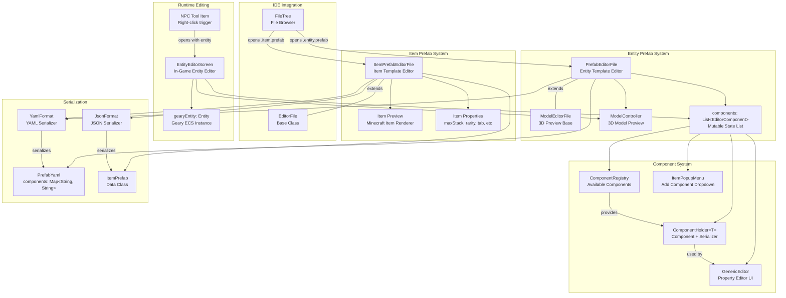
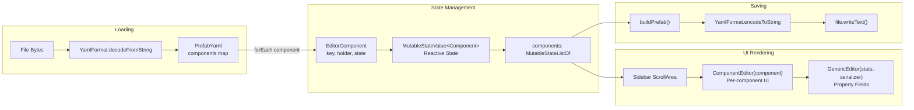
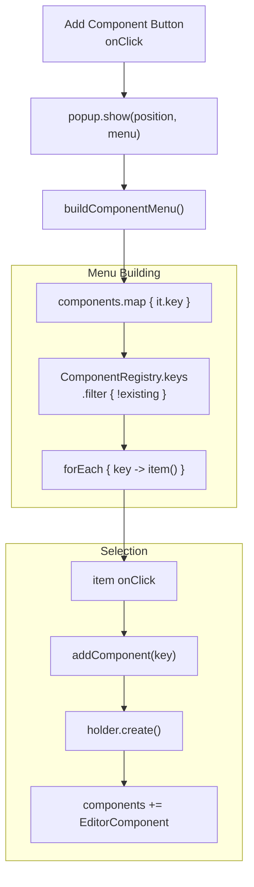
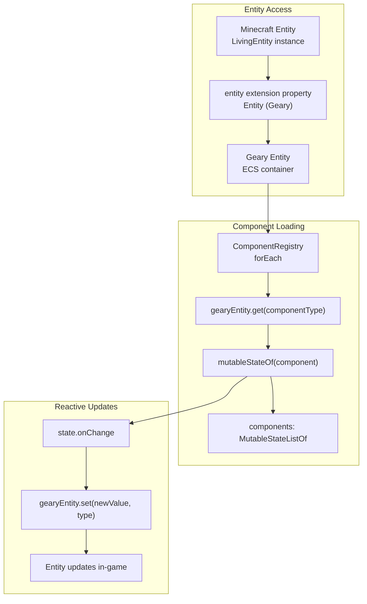
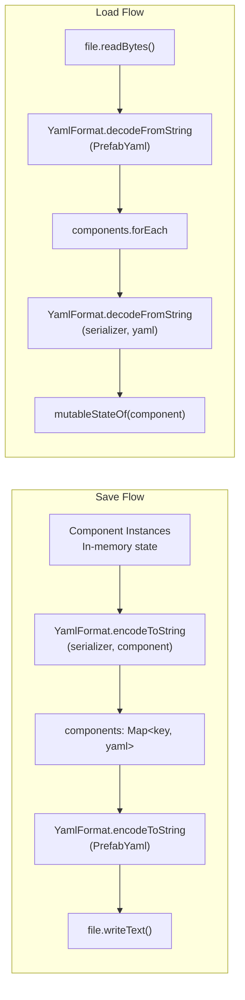

# Prefab Editor

<details>
<summary>Relevant source files</summary>

The following files were used as context for generating this wiki page:

- [src/main/java/ru/hollowhorizon/hollowengine/client/gui/DashboardScreen.kt](src/main/java/ru/hollowhorizon/hollowengine/client/gui/DashboardScreen.kt)
- [src/main/java/ru/hollowhorizon/hollowengine/client/gui/NPCToolGui.kt](src/main/java/ru/hollowhorizon/hollowengine/client/gui/NPCToolGui.kt)
- [src/main/java/ru/hollowhorizon/hollowengine/client/gui/codeblocks/BlockContextMenu.kt](src/main/java/ru/hollowhorizon/hollowengine/client/gui/codeblocks/BlockContextMenu.kt)
- [src/main/java/ru/hollowhorizon/hollowengine/client/gui/modificators/BiomeModificator.kt](src/main/java/ru/hollowhorizon/hollowengine/client/gui/modificators/BiomeModificator.kt)
- [src/main/java/ru/hollowhorizon/hollowengine/client/gui/npcs/NPCMenuGui.kt](src/main/java/ru/hollowhorizon/hollowengine/client/gui/npcs/NPCMenuGui.kt)
- [src/main/java/ru/hollowhorizon/hollowengine/client/gui/scripting/GuiPackets.kt](src/main/java/ru/hollowhorizon/hollowengine/client/gui/scripting/GuiPackets.kt)
- [src/main/java/ru/hollowhorizon/hollowengine/client/gui/scripting/ServerIdeWarning.kt](src/main/java/ru/hollowhorizon/hollowengine/client/gui/scripting/ServerIdeWarning.kt)
- [src/main/java/ru/hollowhorizon/hollowengine/client/gui/scripting/files/ImageFile.kt](src/main/java/ru/hollowhorizon/hollowengine/client/gui/scripting/files/ImageFile.kt)
- [src/main/java/ru/hollowhorizon/hollowengine/client/gui/scripting/files/prefabs/EntityEditorScreen.kt](src/main/java/ru/hollowhorizon/hollowengine/client/gui/scripting/files/prefabs/EntityEditorScreen.kt)
- [src/main/java/ru/hollowhorizon/hollowengine/client/gui/scripting/files/prefabs/ItemPrefabEditorFile.kt](src/main/java/ru/hollowhorizon/hollowengine/client/gui/scripting/files/prefabs/ItemPrefabEditorFile.kt)
- [src/main/java/ru/hollowhorizon/hollowengine/client/gui/scripting/files/prefabs/PrefabEditorFile.kt](src/main/java/ru/hollowhorizon/hollowengine/client/gui/scripting/files/prefabs/PrefabEditorFile.kt)
- [src/main/java/ru/hollowhorizon/hollowengine/client/gui/scripting/panels/ConsolePanel.kt](src/main/java/ru/hollowhorizon/hollowengine/client/gui/scripting/panels/ConsolePanel.kt)
- [src/main/java/ru/hollowhorizon/hollowengine/client/gui/scripting/panels/LanguageEditorPanel.kt](src/main/java/ru/hollowhorizon/hollowengine/client/gui/scripting/panels/LanguageEditorPanel.kt)
- [src/main/java/ru/hollowhorizon/hollowengine/client/gui/scripting/theme/ThemeEditor.kt](src/main/java/ru/hollowhorizon/hollowengine/client/gui/scripting/theme/ThemeEditor.kt)
- [src/main/resources/assets/hollowengine/lang/en_us.json](src/main/resources/assets/hollowengine/lang/en_us.json)
- [src/main/resources/assets/hollowengine/lang/ru_ru.json](src/main/resources/assets/hollowengine/lang/ru_ru.json)

</details>


The Prefab Editor system provides visual tools for creating and editing entity and item definitions (prefabs) within the HollowEngine IDE. Prefabs define reusable templates for game objects by combining components from the Geary ECS system with serialization support. The editor offers both file-based editing for entity/item prefabs and runtime entity modification capabilities.

For information about the Geary ECS integration that powers the component system, see [Geary ECS Integration](#12.1). For the broader IDE file management system, see [File Management and Navigation](#3.2).

---

## System Architecture

The prefab editor system consists of three primary editor types:

1. **Entity Prefab Editor** (`PrefabEditorFile`) - Edits `.entity.prefab` files defining NPC and entity templates
2. **Item Prefab Editor** (`ItemPrefabEditorFile`) - Edits `.item.prefab` or `.item.json` files for custom items
3. **Runtime Entity Editor** (`EntityEditorScreen`) - Allows in-game editing of spawned entities using the NPC Tool

### Prefab Editor Architecture



**Sources:**
- [src/main/java/ru/hollowhorizon/hollowengine/client/gui/scripting/files/prefabs/PrefabEditorFile.kt:29-94]()
- [src/main/java/ru/hollowhorizon/hollowengine/client/gui/scripting/files/prefabs/ItemPrefabEditorFile.kt:19-68]()
- [src/main/java/ru/hollowhorizon/hollowengine/client/gui/scripting/files/prefabs/EntityEditorScreen.kt:29-57]()

---

## Entity Prefab Editor

The `PrefabEditorFile` class provides a visual editor for entity prefab files, which define reusable entity templates by combining Geary ECS components.

### File Format

Entity prefabs are stored as YAML files (`.entity.prefab`) with the following structure:

```yaml
components:
  namespace:component_name: |
    property1: value1
    property2: value2
prefabs:
  - namespace:parent_prefab
```

The `components` map stores each component as a serialized YAML string indexed by its resource location. The `prefabs` set allows inheriting from other prefabs.

**Sources:**
- [src/main/java/ru/hollowhorizon/hollowengine/client/gui/scripting/files/prefabs/PrefabEditorFile.kt:41-68]()

### Component Editing Workflow



**Sources:**
- [src/main/java/ru/hollowhorizon/hollowengine/client/gui/scripting/files/prefabs/PrefabEditorFile.kt:47-68]()
- [src/main/java/ru/hollowhorizon/hollowengine/client/gui/scripting/files/prefabs/PrefabEditorFile.kt:209-218]()

### Key Classes and Data Structures

| Class | Purpose | Key Members |
|-------|---------|-------------|
| `PrefabEditorFile` | Main editor class | `components: MutableStateListOf<EditorComponent>`, `modelController: ModelController` |
| `EditorComponent` | Wrapper for component state | `key: ResourceLocation`, `holder: ComponentHolder<*>`, `state: MutableStateValue<Component>` |
| `PrefabYaml` | Serialization format | `components: Map<String, String>`, `prefabs: Set<PrefabKey>` |
| `ComponentRegistry` | Component lookup | `map`, `keys`, `getOrNull(ResourceLocation)` |

**Sources:**
- [src/main/java/ru/hollowhorizon/hollowengine/client/gui/scripting/files/prefabs/PrefabEditorFile.kt:29-30]()
- [src/main/java/ru/hollowhorizon/hollowengine/client/gui/scripting/files/prefabs/PrefabEditorFile.kt:220-224]()
- [src/main/java/ru/hollowhorizon/hollowengine/client/gui/scripting/files/prefabs/PrefabEditorFile.kt:42-45]()

### UI Layout

The editor uses a two-column layout:

**Left Column - 3D Model Preview:**
- Displays the entity's 3D model using `ModelController`
- Automatically updates when a `hollowengine:model` component is added or modified
- Controlled by `ModelEditorFile` base class

**Right Column - Component Sidebar:**
- Lists all added components
- Each component rendered via `GenericEditor` for property editing
- "Add Component" button at bottom opens component selection popup

**Sources:**
- [src/main/java/ru/hollowhorizon/hollowengine/client/gui/scripting/files/prefabs/PrefabEditorFile.kt:96-147]()
- [src/main/java/ru/hollowhorizon/hollowengine/client/gui/scripting/files/prefabs/PrefabEditorFile.kt:149-164]()

### Model Preview Integration

When a `hollowengine:model` component is added or edited, the preview automatically updates:

```kotlin
// Hook model preview updates
if (key == "hollowengine:model".rl) {
    state.onChange { _, newValue ->
        val modelPath = (newValue as? Model)?.model
        if (modelPath != null) modelController.model.set(modelPath)
    }
}
```

**Sources:**
- [src/main/java/ru/hollowhorizon/hollowengine/client/gui/scripting/files/prefabs/PrefabEditorFile.kt:176-185]()

### Adding Components

Components are added through a popup menu built from `ComponentRegistry`:



**Sources:**
- [src/main/java/ru/hollowhorizon/hollowengine/client/gui/scripting/files/prefabs/PrefabEditorFile.kt:187-207]()
- [src/main/java/ru/hollowhorizon/hollowengine/client/gui/scripting/files/prefabs/PrefabEditorFile.kt:166-174]()

---

## Item Prefab Editor

The `ItemPrefabEditorFile` provides specialized editing for item definitions, supporting both YAML and JSON formats.

### Item Properties

| Property | Type | Description |
|----------|------|-------------|
| `id` | String? | Item registry ID (namespace:path) |
| `maxStack` | Int? | Maximum stack size (1-64) |
| `maxDamage` | Int? | Durability if damageable |
| `rarity` | String? | Display rarity (common/uncommon/rare/epic) |
| `fireResistant` | Boolean | Immune to fire/lava |
| `tab` | String? | Creative tab location |
| `model` | String? | Model template (generated/handheld) or custom ID |
| `modelParent` | String? | Parent model reference |
| `modelTexture` | String? | Texture resource location |
| `modelJson` | String? | Raw JSON model override |

**Sources:**
- [src/main/java/ru/hollowhorizon/hollowengine/client/gui/scripting/files/prefabs/ItemPrefabEditorFile.kt:20-33]()
- [src/main/java/ru/hollowhorizon/hollowengine/client/gui/scripting/files/prefabs/ItemPrefabEditorFile.kt:261-273]()

### UI Layout

The item editor uses a 65/35 split layout:

**Left Side (65%) - Property Form:**
- Item properties (ID, stack size, durability, rarity)
- Fire resistance checkbox
- Creative tab selector with custom input
- Model template selector (generated/handheld)
- Advanced model properties (parent, texture, raw JSON)

**Right Side (35%) - Preview:**
- Renders the actual Minecraft item using `Item` composable
- Shows "No item registered" if ID is invalid
- Displays resolved item ID below preview

**Sources:**
- [src/main/java/ru/hollowhorizon/hollowengine/client/gui/scripting/files/prefabs/ItemPrefabEditorFile.kt:70-94]()
- [src/main/java/ru/hollowhorizon/hollowengine/client/gui/scripting/files/prefabs/ItemPrefabEditorFile.kt:115-143]()

### Item ID Resolution

The editor uses intelligent ID resolution:

1. **Explicit ID:** Uses `id` field if provided
2. **Path-based ID:** Derives from file path if `id` is blank
3. **Namespace fallback:** Adds `hollowengine:` prefix if no namespace specified

```kotlin
private fun resolvePreviewId(): ResourceLocation? {
    val explicit = id.value.trim().ifBlank { null }
    val raw = explicit ?: defaultIdFromPath() ?: return null
    val full = if (raw.contains(':')) raw else "${HollowEngine.MODID}:$raw"
    return ResourceLocation.tryParse(full)
}
```

**Sources:**
- [src/main/java/ru/hollowhorizon/hollowengine/client/gui/scripting/files/prefabs/ItemPrefabEditorFile.kt:282-287]()
- [src/main/java/ru/hollowhorizon/hollowengine/client/gui/scripting/files/prefabs/ItemPrefabEditorFile.kt:289-303]()

### Creative Tab Selection

The tab selector dynamically loads all registered creative tabs from `BuiltInRegistries.CREATIVE_MODE_TAB` and provides a "Custom" option for modded tabs:

**Sources:**
- [src/main/java/ru/hollowhorizon/hollowengine/client/gui/scripting/files/prefabs/ItemPrefabEditorFile.kt:187-227]()

---

## Runtime Entity Editor

The `EntityEditorScreen` allows editing spawned entities in-game, triggered by right-clicking with the NPC Tool item.

### Integration with Geary ECS

The runtime editor directly modifies the entity's Geary ECS components:



**Sources:**
- [src/main/java/ru/hollowhorizon/hollowengine/client/gui/scripting/files/prefabs/EntityEditorScreen.kt:29-57]()
- [src/main/java/ru/hollowhorizon/hollowengine/client/gui/scripting/files/prefabs/EntityEditorScreen.kt:50-52]()

### Live Editing

Unlike file-based prefab editors, the runtime editor applies changes immediately to the spawned entity:

```kotlin
state.onChange { _, newValue ->
    gearyEntity.set(newValue, newValue::class)
}
```

This allows real-time testing of component values without reloading or respawning the entity.

**Sources:**
- [src/main/java/ru/hollowhorizon/hollowengine/client/gui/scripting/files/prefabs/EntityEditorScreen.kt:50-52]()

### UI Structure

The runtime editor uses a full-screen layout:

**Left (66%) - 3D Preview:**
- Renders the live entity using `ModelController`
- Title displays entity name at top

**Right (34%) - Component Sidebar:**
- Same component editing interface as `PrefabEditorFile`
- Add/remove components dynamically
- Changes apply immediately

**Sources:**
- [src/main/java/ru/hollowhorizon/hollowengine/client/gui/scripting/files/prefabs/EntityEditorScreen.kt:59-82]()
- [src/main/java/ru/hollowhorizon/hollowengine/client/gui/scripting/files/prefabs/EntityEditorScreen.kt:84-136]()

---

## Component Management

### ComponentRegistry

The `ComponentRegistry` provides centralized management of all available components:

**Key Operations:**
- `ComponentRegistry.keys` - All registered component resource locations
- `ComponentRegistry[key]` - Retrieve `ComponentHolder` by ID
- `ComponentRegistry.getOrNull(key)` - Safe retrieval
- `ComponentRegistry.forEach { holder -> }` - Iterate all components

**Sources:**
- [src/main/java/ru/hollowhorizon/hollowengine/client/gui/scripting/files/prefabs/PrefabEditorFile.kt:34-36]()
- [src/main/java/ru/hollowhorizon/hollowengine/client/gui/scripting/files/prefabs/EntityEditorScreen.kt:36-39]()

### ComponentHolder

Each component is wrapped in a `ComponentHolder<T>` which bundles:

| Member | Type | Purpose |
|--------|------|---------|
| `value` | `KClass<out Component>` | Component class type |
| `serializer` | `KSerializer<*>` | Kotlin serialization descriptor |
| `create()` | Function | Factory for default instances |

**Sources:**
- [src/main/java/ru/hollowhorizon/hollowengine/client/gui/scripting/files/prefabs/PrefabEditorFile.kt:220-224]()

### GenericEditor

The `GenericEditor` composable provides universal property editing for any component:

```kotlin
GenericEditor(state, serializer) {
    // onDelete callback
    components.remove(component)
}
```

It introspects the component's serializer to automatically generate appropriate UI fields (text inputs, checkboxes, dropdowns) for each property.

**Sources:**
- [src/main/java/ru/hollowhorizon/hollowengine/client/gui/scripting/files/prefabs/PrefabEditorFile.kt:209-218]()
- [src/main/java/ru/hollowhorizon/hollowengine/client/gui/scripting/files/prefabs/EntityEditorScreen.kt:174-183]()

### EditorIcon Annotation

Components can specify custom icons for the add component menu:

```kotlin
@EditorIcon("namespace:path/to/icon")
data class MyComponent(...) : Component
```

**Sources:**
- [src/main/java/ru/hollowhorizon/hollowengine/client/gui/scripting/files/prefabs/PrefabEditorFile.kt:200-201]()
- [src/main/java/ru/hollowhorizon/hollowengine/client/gui/scripting/files/prefabs/EntityEditorScreen.kt:166-167]()

---

## Serialization and Persistence

### Entity Prefab Serialization

Entity prefabs use nested YAML serialization with polymorphic component support:



**Sources:**
- [src/main/java/ru/hollowhorizon/hollowengine/client/gui/scripting/files/prefabs/PrefabEditorFile.kt:71-94]()
- [src/main/java/ru/hollowhorizon/hollowengine/client/gui/scripting/files/prefabs/PrefabEditorFile.kt:47-68]()

### Polymorphic SerializersModule

The prefab editor configures a custom `SerializersModule` to handle component polymorphism:

```kotlin
private val prefabSerializersModule: SerializersModule = SerializersModule {
    polymorphic(Any::class) {
        ComponentRegistry.map { it.value }.forEach { holder ->
            subclass(holder.value, holder.serializer)
        }
    }
}
```

This allows deserializing components by their resource location keys.

**Sources:**
- [src/main/java/ru/hollowhorizon/hollowengine/client/gui/scripting/files/prefabs/PrefabEditorFile.kt:32-39]()

### Item Prefab Serialization

Item prefabs support dual formats (JSON/YAML) detected by file extension:

| Format | Extension | Use Case |
|--------|-----------|----------|
| YAML | `.item.prefab`, `.item.yml`, `.item.yaml` | Human-readable, preferred |
| JSON | `.item.json` | Compatibility with vanilla resource packs |

**Sources:**
- [src/main/java/ru/hollowhorizon/hollowengine/client/gui/scripting/files/prefabs/ItemPrefabEditorFile.kt:38-51]()
- [src/main/java/ru/hollowhorizon/hollowengine/client/gui/scripting/files/prefabs/ItemPrefabEditorFile.kt:54-67]()

---

## Localization

The prefab editor UI is fully localized with translation keys:

| Key | English | Purpose |
|-----|---------|---------|
| `hollowengine.gui.prefab_editor.add_component` | "Add Component" | Add component button |
| `hollowengine.gui.prefab_editor.prefab_components` | "Prefab Components" | Sidebar title |
| `hollowengine.gui.prefab_editor.all_components_added` | "All components added" | Empty state message |
| `hollowengine.gui.entity_editor.title` | "Editing entity: %s" | Runtime editor title |
| `hollowengine.gui.entity_editor.components` | "Components" | Components section |
| `hollowengine.gui.entity_editor.add_component` | "Add Component" | Add button |
| `hollowengine.gui.item_editor.preview` | "Preview" | Preview section |
| `hollowengine.gui.item_editor.no_item` | "No item registered for id" | Error message |
| `hollowengine.gui.item_editor.creative_tab` | "Creative Tab" | Tab selector label |

**Sources:**
- [src/main/resources/assets/hollowengine/lang/en_us.json:254-262]()
- [src/main/resources/assets/hollowengine/lang/en_us.json:165-167]()