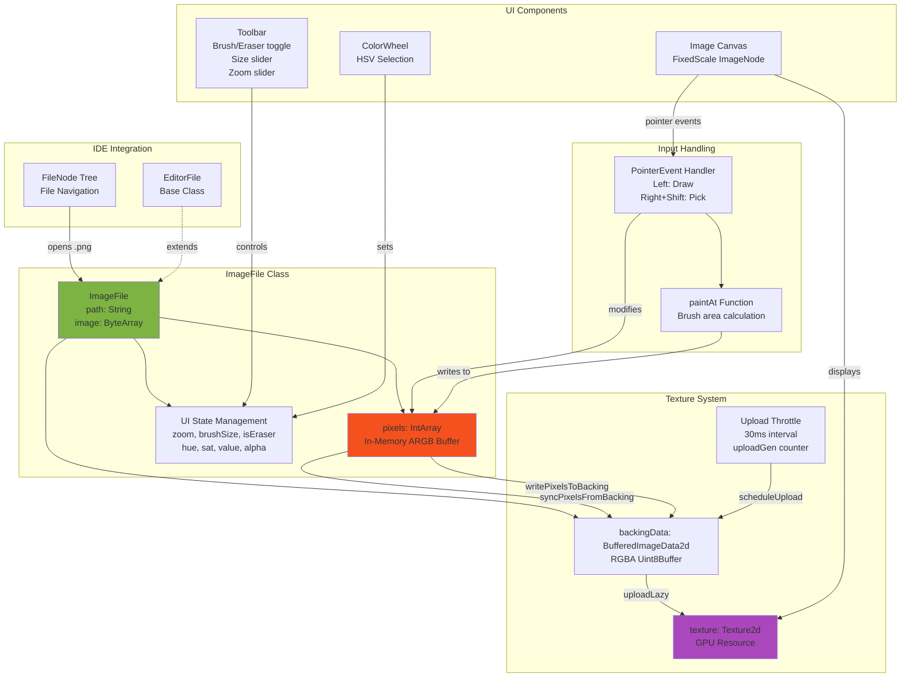
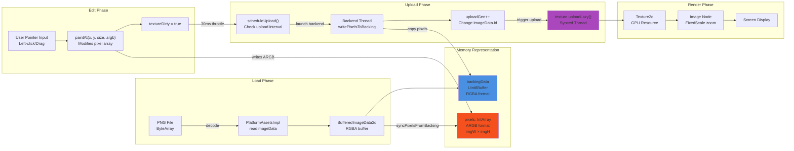

# Image Editor

<details>
<summary>Relevant source files</summary>

The following files were used as context for generating this wiki page:

- [src/main/java/ru/hollowhorizon/hollowengine/client/gui/DashboardScreen.kt](src/main/java/ru/hollowhorizon/hollowengine/client/gui/DashboardScreen.kt)
- [src/main/java/ru/hollowhorizon/hollowengine/client/gui/NPCToolGui.kt](src/main/java/ru/hollowhorizon/hollowengine/client/gui/NPCToolGui.kt)
- [src/main/java/ru/hollowhorizon/hollowengine/client/gui/codeblocks/BlockContextMenu.kt](src/main/java/ru/hollowhorizon/hollowengine/client/gui/codeblocks/BlockContextMenu.kt)
- [src/main/java/ru/hollowhorizon/hollowengine/client/gui/modificators/BiomeModificator.kt](src/main/java/ru/hollowhorizon/hollowengine/client/gui/modificators/BiomeModificator.kt)
- [src/main/java/ru/hollowhorizon/hollowengine/client/gui/npcs/NPCMenuGui.kt](src/main/java/ru/hollowhorizon/hollowengine/client/gui/npcs/NPCMenuGui.kt)
- [src/main/java/ru/hollowhorizon/hollowengine/client/gui/scripting/GuiPackets.kt](src/main/java/ru/hollowhorizon/hollowengine/client/gui/scripting/GuiPackets.kt)
- [src/main/java/ru/hollowhorizon/hollowengine/client/gui/scripting/ServerIdeWarning.kt](src/main/java/ru/hollowhorizon/hollowengine/client/gui/scripting/ServerIdeWarning.kt)
- [src/main/java/ru/hollowhorizon/hollowengine/client/gui/scripting/files/ImageFile.kt](src/main/java/ru/hollowhorizon/hollowengine/client/gui/scripting/files/ImageFile.kt)
- [src/main/java/ru/hollowhorizon/hollowengine/client/gui/scripting/files/prefabs/EntityEditorScreen.kt](src/main/java/ru/hollowhorizon/hollowengine/client/gui/scripting/files/prefabs/EntityEditorScreen.kt)
- [src/main/java/ru/hollowhorizon/hollowengine/client/gui/scripting/files/prefabs/ItemPrefabEditorFile.kt](src/main/java/ru/hollowhorizon/hollowengine/client/gui/scripting/files/prefabs/ItemPrefabEditorFile.kt)
- [src/main/java/ru/hollowhorizon/hollowengine/client/gui/scripting/files/prefabs/PrefabEditorFile.kt](src/main/java/ru/hollowhorizon/hollowengine/client/gui/scripting/files/prefabs/PrefabEditorFile.kt)
- [src/main/java/ru/hollowhorizon/hollowengine/client/gui/scripting/panels/ConsolePanel.kt](src/main/java/ru/hollowhorizon/hollowengine/client/gui/scripting/panels/ConsolePanel.kt)
- [src/main/java/ru/hollowhorizon/hollowengine/client/gui/scripting/panels/LanguageEditorPanel.kt](src/main/java/ru/hollowhorizon/hollowengine/client/gui/scripting/panels/LanguageEditorPanel.kt)
- [src/main/java/ru/hollowhorizon/hollowengine/client/gui/scripting/theme/ThemeEditor.kt](src/main/java/ru/hollowhorizon/hollowengine/client/gui/scripting/theme/ThemeEditor.kt)
- [src/main/resources/assets/hollowengine/lang/en_us.json](src/main/resources/assets/hollowengine/lang/en_us.json)
- [src/main/resources/assets/hollowengine/lang/ru_ru.json](src/main/resources/assets/hollowengine/lang/ru_ru.json)

</details>


The Image Editor is a pixel-art editing tool integrated into HollowEngine's in-game IDE. It provides real-time texture manipulation with brush and eraser tools, color selection, and adjustable zoom levels. This editor is primarily designed for quick texture modifications during development.

For information about other specialized editors in the IDE, see [Additional Tools and Editors](#11). For the prefab editor which can reference textures, see [Prefab Editor](#11.1).

---

## Purpose and Scope

The Image Editor enables in-game editing of PNG texture files within the HollowEngine IDE. It provides:

- **Pixel-level painting** with configurable brush size
- **HSV-based color selection** with alpha channel support
- **Real-time visual feedback** with adjustable zoom (4x-64x)
- **Eraser mode** for transparent pixel editing
- **Color picking** from existing pixels using Shift+Right-Click
- **Throttled GPU upload** to maintain performance during rapid edits

The editor operates in "devlog mode" by default, keeping edits in memory without persisting to disk. It is instantiated when `.png` files are opened from the IDE file tree.

**Sources:** [src/main/java/ru/hollowhorizon/hollowengine/client/gui/scripting/files/ImageFile.kt:1-340]()

---

## Architecture Overview



**Diagram: Image Editor Component Architecture**

The `ImageFile` class manages a dual-representation system: an `IntArray` for efficient CPU-side pixel manipulation and a `BufferedImageData2d` for GPU texture uploads. User interactions modify the pixel array, which triggers throttled texture updates to maintain real-time responsiveness without overwhelming the GPU.

**Sources:** [src/main/java/ru/hollowhorizon/hollowengine/client/gui/scripting/files/ImageFile.kt:19-59](), [src/main/java/ru/hollowhorizon/hollowengine/client/gui/scripting/files/ImageFile.kt:158-204]()

---

## Data Flow Pipeline



**Diagram: Image Editor Data Flow from Load to Display**

The editor uses a two-stage buffer system: the `IntArray` provides fast CPU-side access for painting operations, while `BufferedImageData2d` serves as an intermediate format for GPU uploads. The `uploadGen` counter ensures that texture updates are properly sequenced even when multiple edits occur rapidly.

**Sources:** [src/main/java/ru/hollowhorizon/hollowengine/client/gui/scripting/files/ImageFile.kt:158-204](), [src/main/java/ru/hollowhorizon/hollowengine/client/gui/scripting/files/ImageFile.kt:262-291](), [src/main/java/ru/hollowhorizon/hollowengine/client/gui/scripting/files/ImageFile.kt:306-337]()

---

## UI Layout and Controls

The editor's interface is organized into three primary sections: toolbar, color picker, and canvas.

### Toolbar Layout

| Control | Type | Range | Purpose |
|---------|------|-------|---------|
| Brush/Eraser Toggle | `Button` | Boolean | Switches between paint and erase modes |
| Color Preview Box | `Box` | 32×32 dp | Shows current HSV + alpha color |
| Brush Size | `Slider` | 0-16 | Controls paint radius (displayed as size+1) |
| Zoom Level | `Slider` | 4-64 | Adjusts canvas magnification |
| Save Button | `Button` | N/A | Persists changes to disk (no-op in devlog mode) |

**Sources:** [src/main/java/ru/hollowhorizon/hollowengine/client/gui/scripting/files/ImageFile.kt:66-109]()

### Color Selection Interface

The color picker consists of a 125×125 dp `ColorWheel` component and an alpha slider:

```kotlin
ColorWheel(hue.use(), sat.use(), value.use()) {
    modifier
        .size(Dp(125f), Dp(125f))
        .alignY(AlignmentY.Center)
        .onChange { h, s, v ->
            hue.set(h)
            sat.set(s)
            value.set(v)
        }
}
```

The alpha channel is controlled independently via a horizontal slider (0.0-1.0 range). The current color is converted to ARGB format for pixel writing:

```kotlin
private val brushColorArgb: Int
    get() {
        val c = Color.Hsv(hue.value, sat.value, value.value).toSrgb(a = alpha.value)
        val a = (c.a * 255f).toInt().coerceIn(0, 255)
        val r = (c.r * 255f).toInt().coerceIn(0, 255)
        val g = (c.g * 255f).toInt().coerceIn(0, 255)
        val b = (c.b * 255f).toInt().coerceIn(0, 255)
        return (a shl 24) or (r shl 16) or (g shl 8) or b
    }
```

**Sources:** [src/main/java/ru/hollowhorizon/hollowengine/client/gui/scripting/files/ImageFile.kt:46-54](), [src/main/java/ru/hollowhorizon/hollowengine/client/gui/scripting/files/ImageFile.kt:116-139]()

---

## Pixel Editing System

### Pointer Event Handling

The canvas processes pointer events to determine editing intent:

| Input Combination | Action |
|------------------|--------|
| Left Button Down | Paint with current brush color |
| Right Button Down + Shift | Pick color from pixel under cursor |
| Alt + Any Button | Ignored (no action) |

The event handler converts screen coordinates to pixel coordinates by accounting for zoom and centering:

```kotlin
val scale = zoom.value
val drawW = imgW * scale
val drawH = imgH * scale
val ox = (node.widthPx - drawW) * 0.5f  // X offset for centering
val oy = (node.heightPx - drawH) * 0.5f  // Y offset for centering

val localX = evt.position.x - ox
val localY = evt.position.y - oy

val px = floor(localX / scale).toInt()
val py = floor(localY / scale).toInt()
```

**Sources:** [src/main/java/ru/hollowhorizon/hollowengine/client/gui/scripting/files/ImageFile.kt:206-247]()

### Brush Painting Algorithm

The `paintAt` function implements a square brush pattern:

```kotlin
private fun paintAt(x: Int, y: Int, size: Int, argb: Int) {
    val r = size.coerceAtLeast(0)
    for (dy in -r..r) {
        for (dx in -r..r) {
            val px = x + dx
            val py = y + dy
            if (px !in 0 until imgW || py !in 0 until imgH) continue
            pixels[py * imgW + px] = argb
        }
    }
    textureDirty = true
}
```

The brush size parameter determines the radius, creating a (2r+1) × (2r+1) square. Pixels outside image bounds are automatically skipped. When `isEraser` is true, the ARGB value is set to `0x00000000` (fully transparent).

**Sources:** [src/main/java/ru/hollowhorizon/hollowengine/client/gui/scripting/files/ImageFile.kt:249-260]()

### Color Picking

Right-clicking with Shift held extracts color values from the pixel buffer:

```kotlin
if (wantPick) {
    val argb = pixels[py * imgW + px]
    val a = ((argb ushr 24) and 0xFF) / 255f
    val r = ((argb ushr 16) and 0xFF) / 255f
    val g = ((argb ushr 8) and 0xFF) / 255f
    val b = (argb and 0xFF) / 255f
    val c = Color(r, g, b, a).toHsv()
    hue.set(c.h)
    sat.set(c.s)
    value.set(c.v)
    alpha.set(a)
    return
}
```

This converts the ARGB integer back to normalized RGBA floats, then to HSV for UI state updates.

**Sources:** [src/main/java/ru/hollowhorizon/hollowengine/client/gui/scripting/files/ImageFile.kt:230-242]()

---

## Texture Upload Pipeline

### Upload Throttling Mechanism

To prevent excessive GPU updates during rapid painting, the editor implements a 30ms throttle:

```kotlin
private var uploadJob: Job? = null
private var lastUploadNs: Long = 0
private val uploadIntervalNs = 30_000_000L  // ~33ms (~30 FPS)

private fun scheduleUpload() {
    if (!textureDirty) return
    val now = System.nanoTime()
    if (now - lastUploadNs < uploadIntervalNs) return
    lastUploadNs = now
    
    if (uploadJob?.isActive == true) return
    // ... launch upload job
}
```

Only one upload job can be active at a time, and uploads are spaced at least 30ms apart. This balances visual responsiveness with performance.

**Sources:** [src/main/java/ru/hollowhorizon/hollowengine/client/gui/scripting/files/ImageFile.kt:28-33](), [src/main/java/ru/hollowhorizon/hollowengine/client/gui/scripting/files/ImageFile.kt:262-269]()

### Buffer Write Process

The upload job runs on the backend thread to avoid blocking the UI:

```kotlin
uploadJob = SyncedScope.launch(KoolDispatchers.Backend) {
    val data = backingData ?: return@launch
    val buf = data.data
    writePixelsToBacking(data)
    
    val gen = ++uploadGen
    val uploadData = BufferedImageData2d(
        data = buf,
        width = data.width,
        height = data.height,
        format = data.format,
        id = "ImageEditorData:$filePath:$gen"  // Unique ID triggers upload
    )
    
    SyncedScope.launch(KoolDispatchers.Synced) {
        val tex = texture ?: return@launch
        tex.uploadLazy(uploadData)
        textureDirty = false
    }
}
```

The `uploadGen` counter is incremented to create a unique ID for the `BufferedImageData2d`. This signals to the texture system that new data is available, even though the buffer reference remains the same.

**Sources:** [src/main/java/ru/hollowhorizon/hollowengine/client/gui/scripting/files/ImageFile.kt:271-291]()

### Pixel Format Conversion

The `writePixelsToBacking` function converts from the CPU-side ARGB `IntArray` to the GPU-side RGBA `Uint8Buffer`:

```kotlin
private fun writePixelsToBacking(data: BufferedImageData2d) {
    val buf = data.data as? Uint8BufferImpl ?: return
    buf.useRaw { bb ->
        bb.rewind()
        for (i in 0 until (imgW * imgH)) {
            val argb = pixels[i]
            val a = (argb ushr 24) and 0xFF
            val r = (argb ushr 16) and 0xFF
            val g = (argb ushr 8) and 0xFF
            val b = argb and 0xFF
            bb.put(r.toByte())  // RGBA order for GPU
            bb.put(g.toByte())
            bb.put(b.toByte())
            bb.put(a.toByte())
        }
        bb.flip()
    }
}
```

The reverse operation, `syncPixelsFromBacking`, is used during initial load to populate the `IntArray` from the PNG file data.

**Sources:** [src/main/java/ru/hollowhorizon/hollowengine/client/gui/scripting/files/ImageFile.kt:320-337](), [src/main/java/ru/hollowhorizon/hollowengine/client/gui/scripting/files/ImageFile.kt:306-318]()

---

## Integration with IDE

### File Type Registration

The `ImageFile` class extends `EditorFile` and is instantiated by the IDE's file opening system when a `.png` file is selected. The constructor accepts the file path and raw byte array:

```kotlin
class ImageFile(path: String, var image: ByteArray) : EditorFile(path) {
    // ...
}
```

**Sources:** [src/main/java/ru/hollowhorizon/hollowengine/client/gui/scripting/files/ImageFile.kt:19-20]()

### Save Operation

The base `EditorFile` class defines a `save()` method. The `ImageFile` implementation currently no-ops for devlog purposes:

```kotlin
override fun save() {
    // Intentionally no-op for now (devlog mode): keep edits in memory only.
}
```

To implement persistent saves, this method would need to call `encodePngFromBackingData()` and write the resulting byte array to disk via `DirectoryManager.fromReadablePath()`.

**Sources:** [src/main/java/ru/hollowhorizon/hollowengine/client/gui/scripting/files/ImageFile.kt:56-58]()

### Localization Keys

The editor uses the following translation keys from [src/main/resources/assets/hollowengine/lang/en_us.json]():

| Key | English Text | Usage |
|-----|-------------|-------|
| `hollowengine.gui.image_editor.size` | "Size: %d" | Brush size display (line 249) |
| `hollowengine.gui.image_editor.zoom` | "Zoom: %dx" | Zoom level display (line 250) |
| `hollowengine.gui.image_editor.save` | "Save" | Save button label (line 251) |
| `hollowengine.gui.image_editor.alpha` | "A: %d%%" | Alpha percentage display (line 252) |

**Sources:** [src/main/resources/assets/hollowengine/lang/en_us.json:249-252](), [src/main/java/ru/hollowhorizon/hollowengine/client/gui/scripting/files/ImageFile.kt:85-135]()

---

## State Management Summary

The following table summarizes all mutable state maintained by the `ImageFile` class:

| State Variable | Type | Initial Value | Purpose |
|---------------|------|---------------|---------|
| `pixels` | `IntArray` | Empty array | CPU-side ARGB pixel buffer |
| `imgW`, `imgH` | `Int` | 0 | Image dimensions |
| `texture` | `Texture2d?` | null | GPU texture reference |
| `textureDirty` | `Boolean` | true | Flags pending GPU upload |
| `uploadGen` | `Long` | 0 | Upload generation counter |
| `uploadJob` | `Job?` | null | Active backend upload coroutine |
| `lastUploadNs` | `Long` | 0 | Timestamp of last upload |
| `backingData` | `BufferedImageData2d?` | null | RGBA buffer for GPU upload |
| `zoom` | `MutableStateValue<Float>` | 16f | Canvas zoom multiplier |
| `brushSize` | `MutableStateValue<Int>` | 1 | Brush radius |
| `isEraser` | `MutableStateValue<Boolean>` | false | Eraser mode flag |
| `hue`, `sat`, `value`, `alpha` | `MutableStateValue<Float>` | Various | Current brush color (HSV+A) |

**Sources:** [src/main/java/ru/hollowhorizon/hollowengine/client/gui/scripting/files/ImageFile.kt:22-45]()