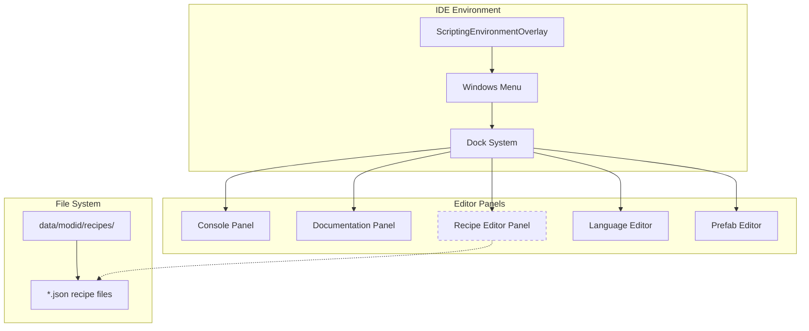
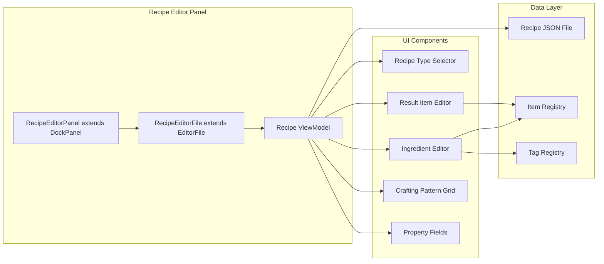
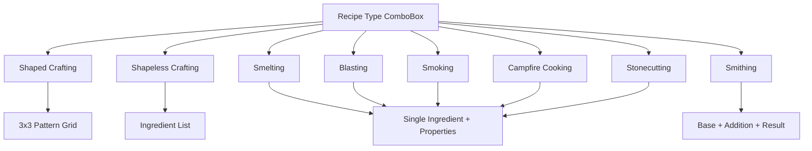
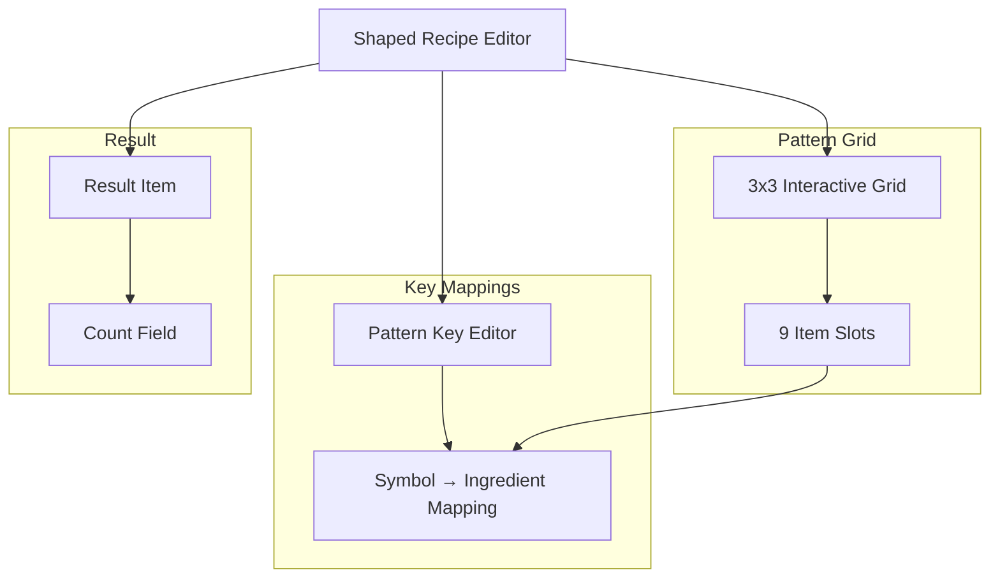
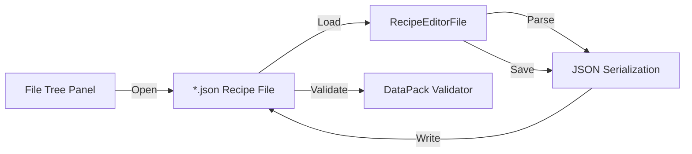
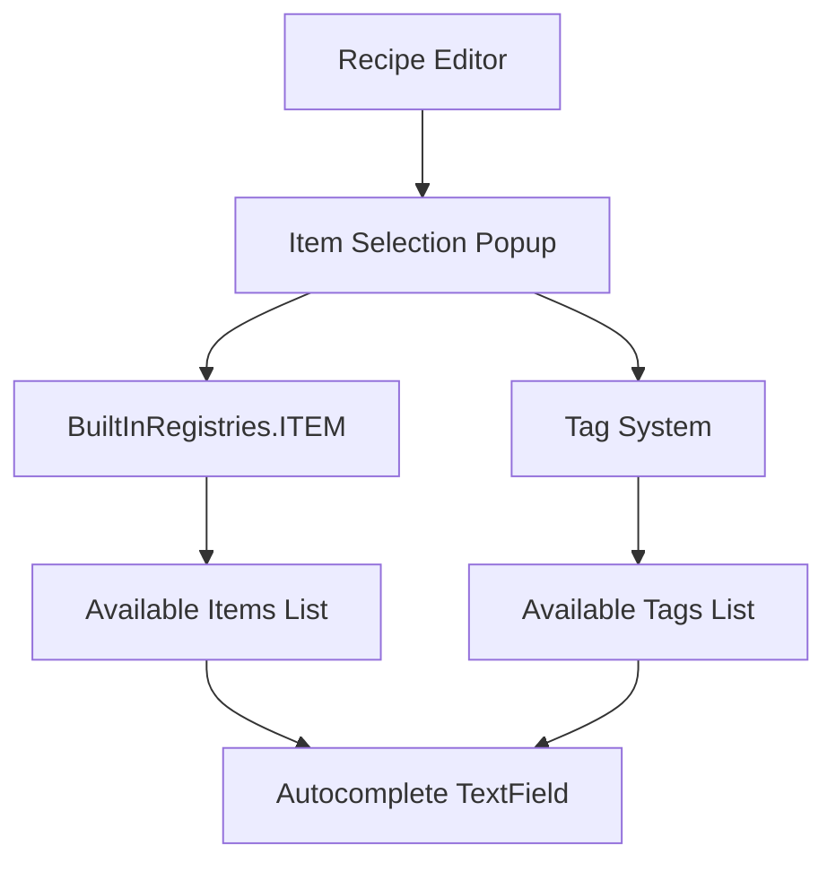

# Recipe Editor

<details>
<summary>Relevant source files</summary>

The following files were used as context for generating this wiki page:

- [src/main/java/ru/hollowhorizon/hollowengine/client/gui/DashboardScreen.kt](src/main/java/ru/hollowhorizon/hollowengine/client/gui/DashboardScreen.kt)
- [src/main/java/ru/hollowhorizon/hollowengine/client/gui/NPCToolGui.kt](src/main/java/ru/hollowhorizon/hollowengine/client/gui/NPCToolGui.kt)
- [src/main/java/ru/hollowhorizon/hollowengine/client/gui/codeblocks/BlockContextMenu.kt](src/main/java/ru/hollowhorizon/hollowengine/client/gui/codeblocks/BlockContextMenu.kt)
- [src/main/java/ru/hollowhorizon/hollowengine/client/gui/modificators/BiomeModificator.kt](src/main/java/ru/hollowhorizon/hollowengine/client/gui/modificators/BiomeModificator.kt)
- [src/main/java/ru/hollowhorizon/hollowengine/client/gui/npcs/NPCMenuGui.kt](src/main/java/ru/hollowhorizon/hollowengine/client/gui/npcs/NPCMenuGui.kt)
- [src/main/java/ru/hollowhorizon/hollowengine/client/gui/scripting/GuiPackets.kt](src/main/java/ru/hollowhorizon/hollowengine/client/gui/scripting/GuiPackets.kt)
- [src/main/java/ru/hollowhorizon/hollowengine/client/gui/scripting/ServerIdeWarning.kt](src/main/java/ru/hollowhorizon/hollowengine/client/gui/scripting/ServerIdeWarning.kt)
- [src/main/java/ru/hollowhorizon/hollowengine/client/gui/scripting/files/ImageFile.kt](src/main/java/ru/hollowhorizon/hollowengine/client/gui/scripting/files/ImageFile.kt)
- [src/main/java/ru/hollowhorizon/hollowengine/client/gui/scripting/files/prefabs/EntityEditorScreen.kt](src/main/java/ru/hollowhorizon/hollowengine/client/gui/scripting/files/prefabs/EntityEditorScreen.kt)
- [src/main/java/ru/hollowhorizon/hollowengine/client/gui/scripting/files/prefabs/ItemPrefabEditorFile.kt](src/main/java/ru/hollowhorizon/hollowengine/client/gui/scripting/files/prefabs/ItemPrefabEditorFile.kt)
- [src/main/java/ru/hollowhorizon/hollowengine/client/gui/scripting/files/prefabs/PrefabEditorFile.kt](src/main/java/ru/hollowhorizon/hollowengine/client/gui/scripting/files/prefabs/PrefabEditorFile.kt)
- [src/main/java/ru/hollowhorizon/hollowengine/client/gui/scripting/panels/ConsolePanel.kt](src/main/java/ru/hollowhorizon/hollowengine/client/gui/scripting/panels/ConsolePanel.kt)
- [src/main/java/ru/hollowhorizon/hollowengine/client/gui/scripting/panels/LanguageEditorPanel.kt](src/main/java/ru/hollowhorizon/hollowengine/client/gui/scripting/panels/LanguageEditorPanel.kt)
- [src/main/java/ru/hollowhorizon/hollowengine/client/gui/scripting/theme/ThemeEditor.kt](src/main/java/ru/hollowhorizon/hollowengine/client/gui/scripting/theme/ThemeEditor.kt)
- [src/main/resources/assets/hollowengine/lang/en_us.json](src/main/resources/assets/hollowengine/lang/en_us.json)
- [src/main/resources/assets/hollowengine/lang/ru_ru.json](src/main/resources/assets/hollowengine/lang/ru_ru.json)

</details>


The Recipe Editor is a planned IDE panel for creating and editing Minecraft crafting recipes within the HollowEngine integrated development environment. It provides a visual interface for defining how items can be crafted, smelted, or otherwise transformed within the game.

For information about editing item definitions, see [Prefab Editor](#11.1). For general IDE panel architecture, see [Panel System](#3.5).

---

## Purpose and Scope

The Recipe Editor is designed to allow content creators to define Minecraft recipes without manually editing JSON files. Recipes in Minecraft define how players craft items in crafting tables, furnaces, smithing tables, and other crafting interfaces.

**Current Status**: The Recipe Editor is referenced in localization files but does not have a complete implementation in the current codebase. The infrastructure for integrating it into the IDE exists, but the editor panel itself is not yet implemented.

Sources: [src/main/resources/assets/hollowengine/lang/en_us.json:33](), [src/main/resources/assets/hollowengine/lang/ru_ru.json:33]()

---

## Integration with IDE

The Recipe Editor is registered as a dockable panel within the IDE system, accessible from the Windows menu alongside other panels like the Console, Documentation, and Translations panels.



**Diagram**: IDE Integration Architecture - The Recipe Editor as a dockable panel within the IDE system

Sources: [src/main/java/ru/hollowhorizon/hollowengine/client/gui/DashboardScreen.kt:1-50](), [src/main/resources/assets/hollowengine/lang/en_us.json:26-33]()

---

## Recipe File Structure

Minecraft recipes are stored as JSON files in the `data/<modid>/recipes/` directory. The Recipe Editor would need to support multiple recipe types:

| Recipe Type | Purpose | Key Fields |
|-------------|---------|------------|
| `crafting_shaped` | Shaped crafting recipes with specific patterns | `pattern`, `key`, `result` |
| `crafting_shapeless` | Shapeless crafting where order doesn't matter | `ingredients`, `result` |
| `smelting` | Furnace smelting recipes | `ingredient`, `result`, `experience`, `cookingtime` |
| `blasting` | Blast furnace recipes | Same as smelting |
| `smoking` | Smoker recipes | Same as smelting |
| `campfire_cooking` | Campfire cooking recipes | Same as smelting |
| `stonecutting` | Stonecutter recipes | `ingredient`, `result`, `count` |
| `smithing` | Smithing table recipes | `base`, `addition`, `result` |

Sources: Minecraft recipe format (standard game format)

---

## Expected Architecture

Based on the patterns established by other editor panels in HollowEngine, the Recipe Editor would follow this architecture:



**Diagram**: Expected Recipe Editor Component Architecture

Sources: [src/main/java/ru/hollowhorizon/hollowengine/client/gui/scripting/panels/ConsolePanel.kt:25-30](), [src/main/java/ru/hollowhorizon/hollowengine/client/gui/scripting/files/EditorFile.kt]()

---

## Panel Implementation Pattern

Following the pattern established by other panels, the Recipe Editor would extend `DockPanel`:

**Expected class structure**:
```
class RecipeEditorPanel(dock: Dock) : DockPanel("hollowengine.gui.ide.recipes", dock)
```

Key responsibilities would include:
- Providing a dockable panel interface
- Managing recipe file selection
- Rendering the recipe editing UI
- Saving changes back to JSON files

**Common DockPanel Features**:
- `icon`: Asset path for panel icon in toolbar
- `UiScope.compose()`: Main UI composition function
- `UiScope.drawHeaderLeft()`: Custom header controls
- `UiScope.drawHeaderRight()`: Additional header controls

Sources: [src/main/java/ru/hollowhorizon/hollowengine/client/gui/scripting/panels/DockPanel.kt](), [src/main/java/ru/hollowhorizon/hollowengine/client/gui/scripting/panels/ConsolePanel.kt:25-76]()

---

## Recipe Type Selection

The editor would need to support switching between different recipe types, each with its own UI:



**Diagram**: Recipe Type Selection Flow

Sources: [src/main/java/ru/hollowhorizon/hollowengine/client/gui/scripting/files/prefabs/ItemPrefabEditorFile.kt:96-113]()

---

## Ingredient Selection

Ingredients in recipes can be specified as:
- Specific items (e.g., `minecraft:stick`)
- Item tags (e.g., `#minecraft:logs`)
- Arrays of alternatives

The editor would need an ingredient picker similar to the item picker used in other parts of the system:

**Expected UI Components**:
- `TextField` with autocomplete for item/tag IDs
- `ItemPopupMenu` for browsing available items
- Preview rendering of selected items
- Tag browser integration

Sources: [src/main/java/ru/hollowhorizon/hollowengine/client/gui/scripting/popup/ItemPopupMenu.kt](), [src/main/java/ru/hollowhorizon/hollowengine/client/gui/NPCToolGui.kt:142-183]()

---

## Shaped Recipe Editor

For shaped recipes, a 3x3 grid interface would allow visual pattern design:



**Diagram**: Shaped Recipe Editor Structure

The pattern would be visually editable, with slots that can be:
- Left empty (air)
- Assigned an ingredient via the ingredient picker
- Copied/pasted between slots

Sources: Pattern similar to [src/main/java/ru/hollowhorizon/hollowengine/client/gui/codeblocks/BlockEditor.kt]() grid layout

---

## File Operations

The Recipe Editor would integrate with the IDE's file management system:



**Diagram**: Recipe File Operations Flow

File operations would include:
- **Load**: Parse JSON from `data/<modid>/recipes/*.json`
- **Validate**: Check recipe format against Minecraft specifications
- **Save**: Serialize edited recipe back to JSON
- **Auto-save**: Optional auto-save functionality

Sources: [src/main/java/ru/hollowhorizon/hollowengine/client/gui/scripting/files/EditorFile.kt](), [src/main/java/ru/hollowhorizon/hollowengine/common/files/DirectoryManager.kt]()

---

## State Management

Recipe data would be managed through Kool's reactive state system:

**State Properties**:
- `recipeType: MutableStateValue<String>` - Selected recipe type
- `ingredients: MutableStateList<Ingredient>` - List of ingredients
- `pattern: MutableStateList<List<String>>` - Shaped recipe pattern
- `result: MutableStateValue<ItemStack>` - Result item
- `properties: Map<String, MutableStateValue<Any>>` - Type-specific properties

**Example state structure**:
```kotlin
class RecipeViewModel {
    val recipeType = mutableStateOf("crafting_shaped")
    val pattern = mutableStateListOf<String>()
    val key = mutableMapOf<String, Ingredient>()
    val result = mutableStateOf<ItemStack?>(null)
    val group = mutableStateOf("")
}
```

Sources: [src/main/java/ru/hollowhorizon/hollowengine/client/gui/scripting/files/prefabs/PrefabEditorFile.kt:30-68](), [src/main/java/ru/hollowhorizon/hollowengine/client/lang/LanguageViewModel.kt]()

---

## UI Composition

Following the panel composition pattern used throughout HollowEngine:

**Expected UI Layout**:
```
┌─────────────────────────────────────────┐
│ Recipe Editor                      [×]  │
├─────────────────────────────────────────┤
│ Recipe Type: [Shaped Crafting ▼]       │
├─────────────────────────────────────────┤
│ Pattern:        │                       │
│ ┌───┬───┬───┐  │ Properties:           │
│ │ A │ B │   │  │ Group: ____________   │
│ ├───┼───┼───┤  │                       │
│ │ A │ B │   │  │ Result:               │
│ ├───┼───┼───┤  │ ┌──────┐              │
│ │   │ C │   │  │ │ Item │ x 4         │
│ └───┴───┴───┘  │ └──────┘              │
│                 │                       │
│ Key Mappings:   │                       │
│ A = minecraft:stick                     │
│ B = minecraft:planks                    │
│ C = minecraft:iron_ingot               │
└─────────────────────────────────────────┘
```

Sources: [src/main/java/ru/hollowhorizon/hollowengine/client/gui/scripting/panels/ConsolePanel.kt:40-76](), [src/main/java/ru/hollowhorizon/hollowengine/client/gui/scripting/files/prefabs/ItemPrefabEditorFile.kt:70-93]()

---

## Localization Integration

The Recipe Editor integrates with the localization system for all UI text:

**Localization Keys**:
- `hollowengine.gui.ide.recipes` - Panel title "Recipe Editor"
- `hollowengine.gui.docs.category.recipes` - Documentation category

Additional keys would be needed for:
- Recipe type labels
- Property field labels
- Validation error messages
- Button labels

Sources: [src/main/resources/assets/hollowengine/lang/en_us.json:33](), [src/main/resources/assets/hollowengine/lang/ru_ru.json:33](), [src/main/java/ru/hollowhorizon/hollowengine/client/gui/scripting/panels/LanguageEditorPanel.kt:16-25]()

---

## Validation and Error Handling

Recipe validation would check:

| Validation Check | Error Condition | Message |
|------------------|----------------|---------|
| Recipe Type | Invalid type string | "Unknown recipe type: {type}" |
| Ingredient Format | Invalid item ID or tag | "Invalid ingredient: {id}" |
| Pattern Size | Non-3x3 pattern for shaped recipes | "Pattern must be 3x3 or smaller" |
| Missing Keys | Pattern references undefined key | "Undefined pattern key: {key}" |
| Result Item | Invalid result item ID | "Invalid result item: {id}" |
| Numeric Properties | Non-numeric experience/time values | "Value must be a number" |

Validation would occur:
- On field change (immediate feedback)
- On save attempt (prevent invalid saves)
- On load (detect corrupted files)

Sources: Pattern similar to [src/main/java/ru/hollowhorizon/hollowengine/client/gui/scripting/files/prefabs/ItemPrefabEditorFile.kt:244-273]()

---

## Integration with Item Registry

The Recipe Editor would access Minecraft's item registry for ingredient and result selection:



**Diagram**: Item Registry Integration

Access pattern:
```kotlin
// Get all available items
val items = BuiltInRegistries.ITEM.keySet()
    .map { it.toString() }
    .sorted()

// Get all available tags
val tags = TagRegistry.getAllTags()
    .filter { it.namespace == modid }
```

Sources: [src/main/java/ru/hollowhorizon/hollowengine/client/gui/scripting/files/prefabs/ItemPrefabEditorFile.kt:188-227](), [src/main/java/ru/hollowhorizon/hollowengine/client/gui/NPCToolGui.kt:285-329]()

---

## Documentation Integration

The Recipe Editor would be documented in the in-game documentation system under the "Recipes" category:

**Documentation Topics**:
- Recipe format overview
- Creating shaped recipes
- Creating shapeless recipes
- Smelting recipes
- Using item tags in recipes
- Recipe groups and unlockables
- Custom recipe types

Sources: [src/main/resources/assets/hollowengine/lang/en_us.json:150-157]()

---

## Future Enhancements

Potential enhancements for the Recipe Editor:

1. **Visual Preview**: Render the crafting grid as it would appear in-game
2. **Recipe Testing**: Test recipes in a virtual crafting interface
3. **Bulk Operations**: Copy/paste recipes, template system
4. **Custom Recipe Types**: Support for mod-added recipe types
5. **Recipe Book Integration**: Manage recipe unlock conditions
6. **Advanced Filters**: Filter recipes by ingredient, result, or type
7. **Recipe Conflicts**: Detect and warn about conflicting recipes

Sources: Based on patterns in [src/main/java/ru/hollowhorizon/hollowengine/client/gui/scripting/files/prefabs/PrefabEditorFile.kt:1-226]()

---

## Summary

The Recipe Editor is a planned component of HollowEngine's IDE that will provide visual editing capabilities for Minecraft recipes. While infrastructure exists for integrating it into the IDE panel system, the editor itself is not yet implemented. When completed, it will follow the established patterns of other editor panels in the system, using Kool UI for rendering, reactive state management for data handling, and integration with Minecraft's item registry for ingredient selection.

Sources: [src/main/resources/assets/hollowengine/lang/en_us.json:33](), [src/main/java/ru/hollowhorizon/hollowengine/client/gui/scripting/panels/DockPanel.kt](), [src/main/java/ru/hollowhorizon/hollowengine/client/gui/scripting/files/EditorFile.kt]()