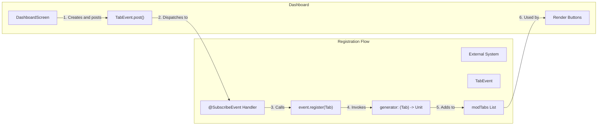
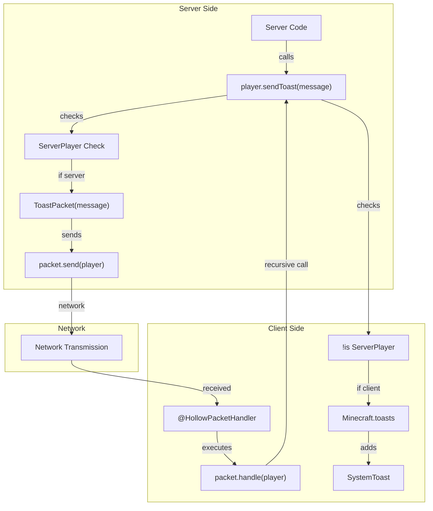

# Other Panels

<details>
<summary>Relevant source files</summary>

The following files were used as context for generating this wiki page:

- [src/main/java/ru/hollowhorizon/hollowengine/client/gui/DashboardScreen.kt](src/main/java/ru/hollowhorizon/hollowengine/client/gui/DashboardScreen.kt)
- [src/main/java/ru/hollowhorizon/hollowengine/client/gui/NPCToolGui.kt](src/main/java/ru/hollowhorizon/hollowengine/client/gui/NPCToolGui.kt)
- [src/main/java/ru/hollowhorizon/hollowengine/client/gui/codeblocks/BlockContextMenu.kt](src/main/java/ru/hollowhorizon/hollowengine/client/gui/codeblocks/BlockContextMenu.kt)
- [src/main/java/ru/hollowhorizon/hollowengine/client/gui/modificators/BiomeModificator.kt](src/main/java/ru/hollowhorizon/hollowengine/client/gui/modificators/BiomeModificator.kt)
- [src/main/java/ru/hollowhorizon/hollowengine/client/gui/npcs/NPCMenuGui.kt](src/main/java/ru/hollowhorizon/hollowengine/client/gui/npcs/NPCMenuGui.kt)
- [src/main/java/ru/hollowhorizon/hollowengine/client/gui/scripting/GuiPackets.kt](src/main/java/ru/hollowhorizon/hollowengine/client/gui/scripting/GuiPackets.kt)
- [src/main/java/ru/hollowhorizon/hollowengine/client/gui/scripting/ServerIdeWarning.kt](src/main/java/ru/hollowhorizon/hollowengine/client/gui/scripting/ServerIdeWarning.kt)
- [src/main/java/ru/hollowhorizon/hollowengine/client/gui/scripting/files/ImageFile.kt](src/main/java/ru/hollowhorizon/hollowengine/client/gui/scripting/files/ImageFile.kt)
- [src/main/java/ru/hollowhorizon/hollowengine/client/gui/scripting/files/prefabs/EntityEditorScreen.kt](src/main/java/ru/hollowhorizon/hollowengine/client/gui/scripting/files/prefabs/EntityEditorScreen.kt)
- [src/main/java/ru/hollowhorizon/hollowengine/client/gui/scripting/files/prefabs/ItemPrefabEditorFile.kt](src/main/java/ru/hollowhorizon/hollowengine/client/gui/scripting/files/prefabs/ItemPrefabEditorFile.kt)
- [src/main/java/ru/hollowhorizon/hollowengine/client/gui/scripting/files/prefabs/PrefabEditorFile.kt](src/main/java/ru/hollowhorizon/hollowengine/client/gui/scripting/files/prefabs/PrefabEditorFile.kt)
- [src/main/java/ru/hollowhorizon/hollowengine/client/gui/scripting/panels/ConsolePanel.kt](src/main/java/ru/hollowhorizon/hollowengine/client/gui/scripting/panels/ConsolePanel.kt)
- [src/main/java/ru/hollowhorizon/hollowengine/client/gui/scripting/panels/LanguageEditorPanel.kt](src/main/java/ru/hollowhorizon/hollowengine/client/gui/scripting/panels/LanguageEditorPanel.kt)
- [src/main/java/ru/hollowhorizon/hollowengine/client/gui/scripting/theme/ThemeEditor.kt](src/main/java/ru/hollowhorizon/hollowengine/client/gui/scripting/theme/ThemeEditor.kt)
- [src/main/resources/assets/hollowengine/lang/en_us.json](src/main/resources/assets/hollowengine/lang/en_us.json)
- [src/main/resources/assets/hollowengine/lang/ru_ru.json](src/main/resources/assets/hollowengine/lang/ru_ru.json)

</details>


This document covers miscellaneous IDE panels beyond the main code editors. These panels extend the base `DockPanel` class and provide utility functionality within the scripting environment. This page focuses on the `ConsolePanel`, `DocsPanel`, and `MarkdownEditorPanel`, as well as documenting the common `DockPanel` base class that all panels inherit from.

**Scope:** This page documents the base `DockPanel` architecture and specialized utility panels. For information about the main code editors, see [Text Script Editor](#4) and [Visual Block Editor](#5). For the file navigation panel, see [File Tree and Navigation](#3.3).
</thinking>

</thinking>


## Dashboard Architecture

The dashboard is implemented as a `DashboardScreen`, which extends `KoolScreen` to provide a Kool UI-based overlay that can be displayed on top of the game. Unlike the IDE, which is a comprehensive editing environment, the dashboard serves as a simple menu for accessing specific features.

```mermaid
graph TB
    subgraph "Screen Layer"
        DS["DashboardScreen"]
        KS["KoolScreen<br/>(Base Class)"]
        Scene["Kool Scene"]
    end
    
    subgraph "Event System"
        TE["TabEvent"]
        TabList["ArrayList&lt;Tab&gt;"]
        Tab["Tab<br/>(name, onClick)"]
    end
    
    subgraph "UI Components"
        Panel["PanelSurface"]
        Title["Text: 'HollowEngine Меню'"]
        Column["Column Layout"]
        Buttons["Button (per Tab)"]
    end
    
    DS --|extends| KS
    KS --|creates| Scene
    DS --|posts| TE
    TE --|populates| TabList
    TabList --|contains| Tab
    DS --|renders| Panel
    Panel --|contains| Title
    Panel --|contains| Column
    Column --|contains| Buttons
    Buttons --|executes| Tab
```

**Sources:** [src/main/java/ru/hollowhorizon/hollowengine/client/gui/DashboardScreen.kt:16-41]()

### DashboardScreen Class

The `DashboardScreen` class coordinates the dashboard display and tab management:

| Component | Type | Description |
|-----------|------|-------------|
| **Base Class** | `KoolScreen` | Provides Kool UI integration and scene management |
| **Tab Collection** | `ArrayList<Tab>` | Dynamic list of menu options populated by `TabEvent` |
| **UI Layout** | Panel Surface | Centered panel with border styling |
| **Title** | Text Component | Main menu header using MONOCRAFT font |
| **Tab Buttons** | Button Components | Interactive buttons for each registered tab |

The scene setup follows this workflow:

1. **Tab Collection**: Creates an empty `ArrayList<Tab>` and posts a `TabEvent` to allow registration [DashboardScreen.kt:19-20]()
2. **UI Scene Setup**: Initializes the Kool UI scene [DashboardScreen.kt:22]()
3. **Panel Creation**: Adds a centered panel surface with border styling [DashboardScreen.kt:24-25]()
4. **Title Display**: Renders the "HollowEngine Меню" header text [DashboardScreen.kt:27-29]()
5. **Button Generation**: Creates a button for each registered tab with click handlers [DashboardScreen.kt:34-38]()

**Sources:** [src/main/java/ru/hollowhorizon/hollowengine/client/gui/DashboardScreen.kt:16-41]()

## Tab Registration System

The dashboard uses an event-driven extensibility mechanism through the `TabEvent` class, allowing any system or mod to register menu entries without modifying the dashboard code directly.



**Sources:** [src/main/java/ru/hollowhorizon/hollowengine/client/gui/DashboardScreen.kt:44-48]()

### TabEvent Class

The `TabEvent` is a simple event class that implements both `Event` and `ClientEvent` interfaces:

| Property | Type | Description |
|----------|------|-------------|
| **generator** | `(Tab) -> Unit` | Lambda function that adds tabs to the collection |
| **Interfaces** | `Event, ClientEvent` | Marks this as a client-side event in the event system |

**Key Methods:**

- **`register(tab: Tab)`**: Adds a new tab to the dashboard by invoking the generator function [DashboardScreen.kt:45-47]()

**Sources:** [src/main/java/ru/hollowhorizon/hollowengine/client/gui/DashboardScreen.kt:44-48]()

### Tab Data Class

The `Tab` class is a simple data container:

| Property | Type | Description |
|----------|------|-------------|
| **name** | `String` | Display text for the button |
| **onClick** | `() -> Unit` | Lambda executed when the button is clicked |

**Sources:** [src/main/java/ru/hollowhorizon/hollowengine/client/gui/DashboardScreen.kt:43]()

### Registration Example

To register a custom tab in the dashboard, a system would use an event subscriber:

```kotlin
@SubscribeEvent
fun onDashboardLoad(event: DashboardScreen.TabEvent) {
    event.register(DashboardScreen.Tab("My Feature") {
        // Action when clicked, e.g., open a screen
        Minecraft.getInstance().setScreen(MyCustomScreen())
    })
}
```

The tab will automatically appear in the dashboard's button list when the dashboard is opened.

**Sources:** [src/main/java/ru/hollowhorizon/hollowengine/client/gui/DashboardScreen.kt:19-20,34-38]()

## Toast Notification System

The toast notification system provides a way to display temporary messages to players, similar to Minecraft's achievement toasts. This system supports both client-side and server-initiated notifications through network packets.



**Sources:** [src/main/java/ru/hollowhorizon/hollowengine/client/gui/scripting/GuiPackets.kt:1-29]()

### ToastPacket

The `ToastPacket` is a serializable network packet that transmits toast notifications from server to client:

| Annotation | Description |
|------------|-------------|
| **@HollowPacketHandler** | Marks this as a packet handler with `Direction.TO_CLIENT` |
| **@Serializable** | Enables Kotlinx serialization for network transmission |

**Properties:**

| Property | Type | Serializer | Description |
|----------|------|------------|-------------|
| **message** | `Component` | `ForTextComponent` | The text component to display in the toast |

**Methods:**

- **`handle(player: Player)`**: Executes when the packet is received, calling `player.sendToast(message)` [GuiPackets.kt:17]()

**Sources:** [src/main/java/ru/hollowhorizon/hollowengine/client/gui/scripting/GuiPackets.kt:14-18]()

### sendToast Extension Function

The `sendToast` function provides a unified API for displaying toasts, automatically handling client/server context:

```kotlin
fun Player.sendToast(message: Component)
```

**Behavior:**

1. **Client Context** (`!is ServerPlayer`): Directly adds a `SystemToast` to `Minecraft.getInstance().toasts` [GuiPackets.kt:21-26]()
2. **Server Context** (`is ServerPlayer`): Creates and sends a `ToastPacket` to the client [GuiPackets.kt:28]()

The function uses `SystemToast.SystemToastIds.PERIODIC_NOTIFICATION` as the toast type and "Уведомление" (Russian for "Notification") as the title.

**Sources:** [src/main/java/ru/hollowhorizon/hollowengine/client/gui/scripting/GuiPackets.kt:20-29]()

### Toast Display Configuration

The toast notification uses Minecraft's `SystemToast` class with the following configuration:

| Parameter | Value | Description |
|-----------|-------|-------------|
| **Toast ID** | `PERIODIC_NOTIFICATION` | System toast type identifier |
| **Title** | `"Уведомление".literal` | Fixed title (hardcoded in Russian) |
| **Message** | `Component` | User-provided message text |

**Sources:** [src/main/java/ru/hollowhorizon/hollowengine/client/gui/scripting/GuiPackets.kt:22-26]()

## Usage Patterns

### Opening the Dashboard

The dashboard can be opened programmatically by setting it as the current screen:

```kotlin
Minecraft.getInstance().setScreen(DashboardScreen())
```

This is typically triggered by a keybind, command, or item interaction.

**Sources:** [src/main/java/ru/hollowhorizon/hollowengine/client/gui/DashboardScreen.kt:16]()

### Registering Dashboard Tabs

Systems can register tabs by subscribing to the `TabEvent`:

```kotlin
@SubscribeEvent
fun registerDashboardTab(event: DashboardScreen.TabEvent) {
    event.register(DashboardScreen.Tab("Script Editor") {
        // Open the scripting environment
        Minecraft.getInstance().setScreen(ScriptingEnvironmentOverlay())
    })
}
```

**Sources:** [src/main/java/ru/hollowhorizon/hollowengine/client/gui/DashboardScreen.kt:44-48]()

### Displaying Toast Notifications

From server-side code:

```kotlin
// Server context
val player: ServerPlayer = ...
player.sendToast("Operation completed".literal)
```

From client-side code:

```kotlin
// Client context
val player: LocalPlayer = Minecraft.getInstance().player!!
player.sendToast("File saved".literal)
```

The `sendToast` function automatically handles the network transmission if needed.

**Sources:** [src/main/java/ru/hollowhorizon/hollowengine/client/gui/scripting/GuiPackets.kt:20-29]()

## KoolGui Interface

The codebase also defines a simple `KoolGui` functional interface for creating Kool UI scenes:

```kotlin
fun interface KoolGui {
    fun Scene.setup()
}
```

This interface standardizes the pattern of setting up Kool scenes and is used throughout the GUI system. The `DashboardScreen` follows this pattern by implementing `Scene.setup()` as an override.

**Sources:** [src/main/java/ru/hollowhorizon/hollowengine/client/gui/DashboardScreen.kt:12-14]()

## Styling and Layout

The dashboard uses the following styling characteristics:

| Element | Styling |
|---------|---------|
| **Panel** | Centered alignment (X and Y), border with `colors.primaryVariant` at 3dp thickness |
| **Title** | MONOCRAFT font at 30f size, 10dp margin, center-aligned horizontally |
| **Button Column** | 10dp margin, center-aligned horizontally |
| **Buttons** | MONOCRAFT font at 30f size, 10dp margin, click handlers attached |

All font sizes use the MONOCRAFT font loaded through `KoolManager.MONOCRAFT`, which provides a pixel-art aesthetic consistent with Minecraft's visual style.

**Sources:** [src/main/java/ru/hollowhorizon/hollowengine/client/gui/DashboardScreen.kt:25-38]()