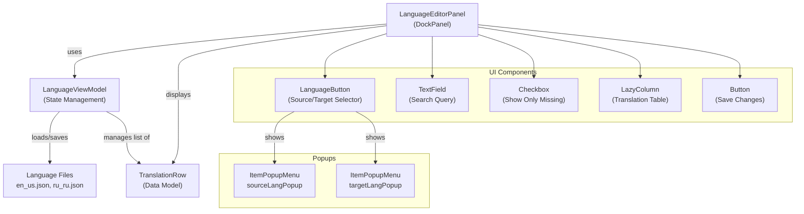
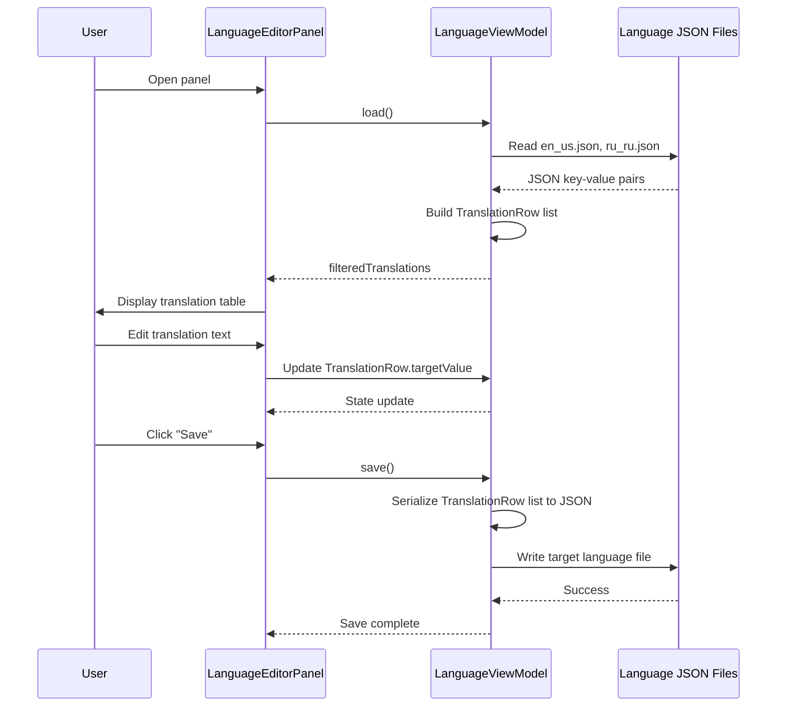
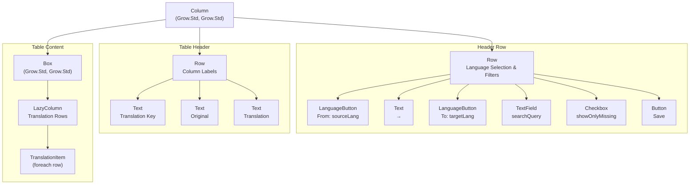
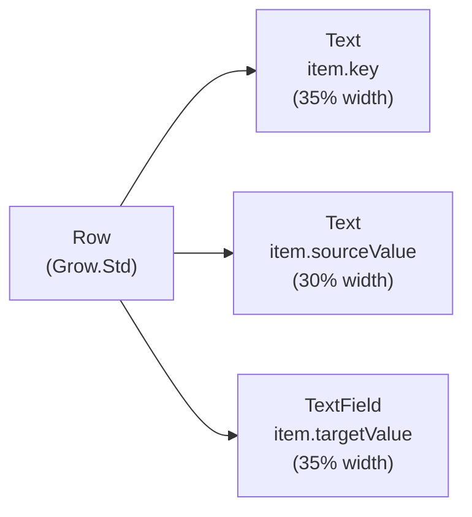
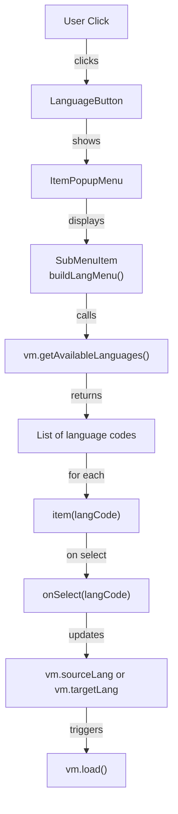
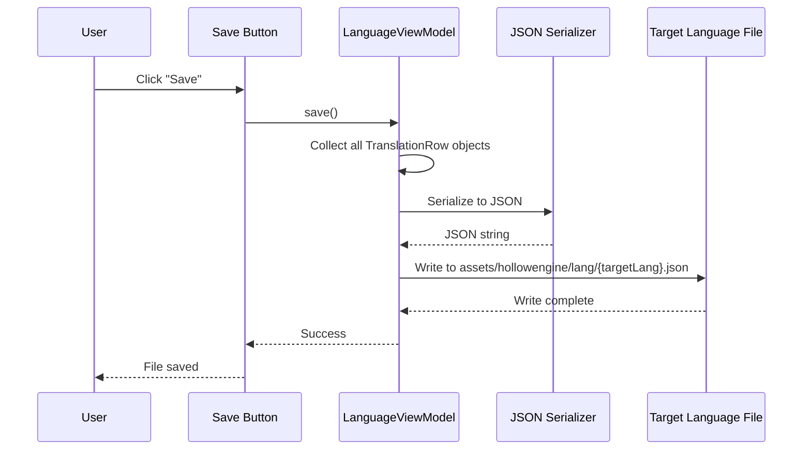

# Language Editor

<details>
<summary>Relevant source files</summary>

The following files were used as context for generating this wiki page:

- [src/main/java/ru/hollowhorizon/hollowengine/client/gui/DashboardScreen.kt](src/main/java/ru/hollowhorizon/hollowengine/client/gui/DashboardScreen.kt)
- [src/main/java/ru/hollowhorizon/hollowengine/client/gui/NPCToolGui.kt](src/main/java/ru/hollowhorizon/hollowengine/client/gui/NPCToolGui.kt)
- [src/main/java/ru/hollowhorizon/hollowengine/client/gui/codeblocks/BlockContextMenu.kt](src/main/java/ru/hollowhorizon/hollowengine/client/gui/codeblocks/BlockContextMenu.kt)
- [src/main/java/ru/hollowhorizon/hollowengine/client/gui/modificators/BiomeModificator.kt](src/main/java/ru/hollowhorizon/hollowengine/client/gui/modificators/BiomeModificator.kt)
- [src/main/java/ru/hollowhorizon/hollowengine/client/gui/npcs/NPCMenuGui.kt](src/main/java/ru/hollowhorizon/hollowengine/client/gui/npcs/NPCMenuGui.kt)
- [src/main/java/ru/hollowhorizon/hollowengine/client/gui/scripting/GuiPackets.kt](src/main/java/ru/hollowhorizon/hollowengine/client/gui/scripting/GuiPackets.kt)
- [src/main/java/ru/hollowhorizon/hollowengine/client/gui/scripting/ServerIdeWarning.kt](src/main/java/ru/hollowhorizon/hollowengine/client/gui/scripting/ServerIdeWarning.kt)
- [src/main/java/ru/hollowhorizon/hollowengine/client/gui/scripting/files/ImageFile.kt](src/main/java/ru/hollowhorizon/hollowengine/client/gui/scripting/files/ImageFile.kt)
- [src/main/java/ru/hollowhorizon/hollowengine/client/gui/scripting/files/prefabs/EntityEditorScreen.kt](src/main/java/ru/hollowhorizon/hollowengine/client/gui/scripting/files/prefabs/EntityEditorScreen.kt)
- [src/main/java/ru/hollowhorizon/hollowengine/client/gui/scripting/files/prefabs/ItemPrefabEditorFile.kt](src/main/java/ru/hollowhorizon/hollowengine/client/gui/scripting/files/prefabs/ItemPrefabEditorFile.kt)
- [src/main/java/ru/hollowhorizon/hollowengine/client/gui/scripting/files/prefabs/PrefabEditorFile.kt](src/main/java/ru/hollowhorizon/hollowengine/client/gui/scripting/files/prefabs/PrefabEditorFile.kt)
- [src/main/java/ru/hollowhorizon/hollowengine/client/gui/scripting/panels/ConsolePanel.kt](src/main/java/ru/hollowhorizon/hollowengine/client/gui/scripting/panels/ConsolePanel.kt)
- [src/main/java/ru/hollowhorizon/hollowengine/client/gui/scripting/panels/LanguageEditorPanel.kt](src/main/java/ru/hollowhorizon/hollowengine/client/gui/scripting/panels/LanguageEditorPanel.kt)
- [src/main/java/ru/hollowhorizon/hollowengine/client/gui/scripting/theme/ThemeEditor.kt](src/main/java/ru/hollowhorizon/hollowengine/client/gui/scripting/theme/ThemeEditor.kt)
- [src/main/resources/assets/hollowengine/lang/en_us.json](src/main/resources/assets/hollowengine/lang/en_us.json)
- [src/main/resources/assets/hollowengine/lang/ru_ru.json](src/main/resources/assets/hollowengine/lang/ru_ru.json)

</details>


The Language Editor is a specialized IDE panel for managing translations across multiple languages in HollowEngine. It provides a tabular interface for viewing and editing translation key-value pairs, with support for filtering, searching, and synchronizing translations between different language files.

For information about the general IDE panel system, see [IDE Panel System](#3.5). For the broader IDE architecture, see [In-Game IDE](#3).

## Purpose and Scope

The Language Editor enables content creators to:
- View and compare translations between a source language and target language
- Edit translation strings directly within the IDE
- Filter translations by search query or empty values
- Save changes back to language JSON files
- Switch between different language pairs dynamically

The system manages translation files stored in `src/main/resources/assets/hollowengine/lang/` as JSON files (e.g., `en_us.json`, `ru_ru.json`).

Sources: [src/main/java/ru/hollowhorizon/hollowengine/client/gui/scripting/panels/LanguageEditorPanel.kt:1-166]()

---

## System Architecture



**System Architecture: Language Editor Component Structure**

The Language Editor follows a Model-View-ViewModel pattern:

- **LanguageEditorPanel**: UI composition and user interaction handling
- **LanguageViewModel**: Business logic for loading, filtering, and saving translations
- **TranslationRow**: Data model representing a single translation entry with key, source value, and target value
- **ItemPopupMenu**: Reusable popup for language selection

Sources: [src/main/java/ru/hollowhorizon/hollowengine/client/gui/scripting/panels/LanguageEditorPanel.kt:1-26]()

---

## Panel Implementation

### Class Definition

The `LanguageEditorPanel` extends `DockPanel` and is registered as a dockable tool window in the IDE:

| Property | Type | Purpose |
|----------|------|---------|
| `dock` | `Dock` | Parent docking container |
| `icon` | `String` | Icon resource path for the panel tab |
| `vm` | `LanguageViewModel` | View model managing translation state |
| `sourceLangPopup` | `ItemPopupMenu<Unit>` | Popup menu for selecting source language |
| `targetLangPopup` | `ItemPopupMenu<Unit>` | Popup menu for selecting target language |

The panel initializes with:

```
LanguageEditorPanel(dock: Dock) : DockPanel("hollowengine.gui.ide.translations", dock)
```

On initialization, it calls `vm.load()` to populate the translation data from disk.

Sources: [src/main/java/ru/hollowhorizon/hollowengine/client/gui/scripting/panels/LanguageEditorPanel.kt:16-25]()

---

## Data Flow



**Data Flow: Translation Loading and Editing Lifecycle**

1. **Loading**: ViewModel reads JSON files from `assets/hollowengine/lang/` directory
2. **Parsing**: JSON key-value pairs converted to `TranslationRow` objects
3. **Filtering**: Rows filtered by search query and empty-value flag
4. **Display**: Filtered rows rendered in `LazyColumn` table
5. **Editing**: User modifies `targetValue` via `TextField` components
6. **Saving**: Modified rows serialized back to target language JSON file

Sources: [src/main/java/ru/hollowhorizon/hollowengine/client/gui/scripting/panels/LanguageEditorPanel.kt:23-25](), [src/main/java/ru/hollowhorizon/hollowengine/client/gui/scripting/panels/LanguageEditorPanel.kt:77-82]()

---

## UI Layout Structure



**UI Layout: Language Editor Panel Composition**

The panel uses a vertical `Column` layout with three main sections:

1. **Header Row** (40dp height): Language selection, search, filters, and save button
2. **Table Header Row**: Column labels for key, source text, and translation
3. **Table Content**: Scrollable `LazyColumn` of `TranslationItem` rows

Sources: [src/main/java/ru/hollowhorizon/hollowengine/client/gui/scripting/panels/LanguageEditorPanel.kt:28-103]()

---

## Translation Row Component

### TranslationItem Composable

Each translation entry is rendered as a `TranslationItem`:



**Translation Row Layout**

| Column | Content | Width | Editable |
|--------|---------|-------|----------|
| Translation Key | `item.key` | 35% | No |
| Original | `item.sourceValue` | 30% | No |
| Translation | `item.targetValue` | 35% | Yes |

The row background alternates between even/odd rows for readability. The key text color changes to `colors.primary` if the target value is empty, highlighting missing translations.

Sources: [src/main/java/ru/hollowhorizon/hollowengine/client/gui/scripting/panels/LanguageEditorPanel.kt:138-165]()

---

## State Management

### ViewModel Responsibilities

The `LanguageViewModel` manages the following state:

| Property | Type | Purpose |
|----------|------|---------|
| `sourceLang` | `MutableStateValue<String>` | Currently selected source language code |
| `targetLang` | `MutableStateValue<String>` | Currently selected target language code |
| `searchQuery` | `MutableStateValue<String>` | Current search filter text |
| `showOnlyMissing` | `MutableStateValue<Boolean>` | Filter flag for empty translations |
| `filteredTranslations` | `List<TranslationRow>` | Filtered list of translation rows to display |

### Reactive Updates

State changes trigger automatic UI updates through Kool's reactive system:

1. **Language Change**: When `sourceLang` or `targetLang` changes, `vm.load()` reloads translation data
2. **Search Query Change**: When `searchQuery` changes, `vm.applyFilters()` updates the filtered list
3. **Empty Filter Toggle**: When `showOnlyMissing` changes, `vm.applyFilters()` updates the filtered list
4. **Text Edit**: When a `TranslationRow.targetValue` changes, the state automatically propagates to the UI

Sources: [src/main/java/ru/hollowhorizon/hollowengine/client/lang/LanguageViewModel.kt]() (referenced), [src/main/java/ru/hollowhorizon/hollowengine/client/gui/scripting/panels/LanguageEditorPanel.kt:34-73]()

---

## Language Selection System



**Language Selection Flow**

The panel provides two language selection buttons:

1. **Source Language Button**: Displays "From: {language code}"
2. **Target Language Button**: Displays "To: {language code}"

Both buttons use the same `LanguageButton` composable pattern:
- Renders a hoverable box with label text
- On click, shows `ItemPopupMenu` with `SubMenuItem` containing available languages
- Available languages retrieved from `vm.getAvailableLanguages()`
- On selection, updates the corresponding state and reloads translations

Sources: [src/main/java/ru/hollowhorizon/hollowengine/client/gui/scripting/panels/LanguageEditorPanel.kt:34-51](), [src/main/java/ru/hollowhorizon/hollowengine/client/gui/scripting/panels/LanguageEditorPanel.kt:105-136]()

---

## File Format

### JSON Structure

Language files follow a flat key-value JSON structure:

```json
{
  "hollowengine.gui.lang_editor.from": "From: %s",
  "hollowengine.gui.lang_editor.to": "To: %s",
  "hollowengine.gui.lang_editor.search": "Search...",
  "hollowengine.gui.lang_editor.empty_only": "Empty",
  "hollowengine.gui.lang_editor.save": "Save"
}
```

### Translation Key Naming Conventions

Keys follow a hierarchical dot-notation pattern:

| Pattern | Example | Description |
|---------|---------|-------------|
| `modid.category.subcategory.key` | `hollowengine.gui.ide.translations` | Main structure |
| `modid.gui.component.property` | `hollowengine.gui.lang_editor.from` | GUI-related translations |
| `modid.gui.component.action` | `hollowengine.gui.lang_editor.save` | Action labels |
| `modid.component.element.state` | `hollowengine.gui.codeblocks.block.print` | Component-specific labels |

### File Locations

| Language | File Path |
|----------|-----------|
| English (US) | `src/main/resources/assets/hollowengine/lang/en_us.json` |
| Russian | `src/main/resources/assets/hollowengine/lang/ru_ru.json` |

Sources: [src/main/resources/assets/hollowengine/lang/en_us.json:140-148](), [src/main/resources/assets/hollowengine/lang/ru_ru.json:140-148]()

---

## Filtering System

### Search Query Filter

The search filter matches against translation keys using substring matching:

```
searchQuery.use() -> vm.applyFilters() -> filteredTranslations
```

The filter is case-sensitive and matches the full key string.

### Empty Translation Filter

The "Empty" checkbox filters the list to show only rows where `targetValue` is blank or empty:

```
showOnlyMissing.use() -> vm.applyFilters() -> filteredTranslations (where targetValue.isEmpty())
```

This is useful for identifying missing translations that need to be added.

### Combined Filtering

Both filters can be active simultaneously, creating an AND condition:
- Row matches search query AND target value is empty

Sources: [src/main/java/ru/hollowhorizon/hollowengine/client/gui/scripting/panels/LanguageEditorPanel.kt:55-73]()

---

## Save Operation

### Save Flow



**Save Operation Sequence**

The save button triggers `vm.save()`, which:
1. Collects all translation rows (both edited and unedited)
2. Serializes the key-value pairs to JSON format
3. Writes the JSON to the target language file
4. Preserves the original source language file (read-only reference)

Only the target language file is modified during save operations.

Sources: [src/main/java/ru/hollowhorizon/hollowengine/client/gui/scripting/panels/LanguageEditorPanel.kt:77-82]()

---

## Integration with IDE

### Panel Registration

The Language Editor is registered as a dockable panel in the IDE system. It can be:
- Docked to any IDE window edge
- Floated as a separate window
- Tabbed with other panels
- Closed and reopened via the Windows menu

### Localization Key Extension

The panel uses the `.lang` extension for accessing translation keys:

```kotlin
"hollowengine.gui.lang_editor.from".lang
```

This extension resolves the key against the current game language, enabling the editor UI itself to be translated.

### Icon Resource

The panel icon is defined as:
```kotlin
override val icon = Assets.Hollowengine.Textures.Gui.Icons.LANGUAGE
```

This SVG icon appears in the panel tab when docked or in the Windows menu.

Sources: [src/main/java/ru/hollowhorizon/hollowengine/client/gui/scripting/panels/LanguageEditorPanel.kt:16-18](), [src/main/java/ru/hollowhorizon/hollowengine/client/gui/scripting/panels/DockPanel.kt]() (base class)

---

## Usage Workflow

### Typical Translation Workflow

1. **Open Panel**: Access via Windows menu or keyboard shortcut
2. **Select Languages**: Choose source language (e.g., `en_us`) and target language (e.g., `ru_ru`)
3. **Enable Filter**: Check "Empty Only" to show untranslated keys
4. **Search**: Use search field to find specific translation keys
5. **Translate**: Click into the "Translation" column and type the translated text
6. **Save**: Click "Save" button to write changes to disk
7. **Verify**: Reload the game or resources to see translations in-game

### Multi-Language Support

To add a new language:
1. Create a new JSON file in `assets/hollowengine/lang/` (e.g., `fr_fr.json`)
2. Copy the structure from `en_us.json`
3. Open the Language Editor and select the new language as target
4. Translate all keys where the target value is empty
5. Save the file

Sources: [src/main/java/ru/hollowhorizon/hollowengine/client/gui/scripting/panels/LanguageEditorPanel.kt:27-103]()

---

## Related Systems

The Language Editor integrates with several other HollowEngine systems:

- **Localization System** ([#3.7](#3.7)): The `.lang` extension and translation key resolution
- **Docking System** ([#3.3](#3.3)): Panel docking, floating, and layout persistence
- **File Management** ([#3.2](#3.2)): Reading and writing language JSON files
- **IDE Theming** ([#3.6](#3.6)): Panel colors and styling from `IdeTheme`
- **Popup System**: `ItemPopupMenu` for language selection menus

Sources: [src/main/java/ru/hollowhorizon/hollowengine/client/gui/scripting/panels/LanguageEditorPanel.kt:1-166]()