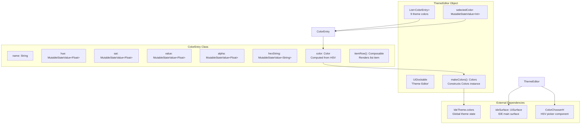
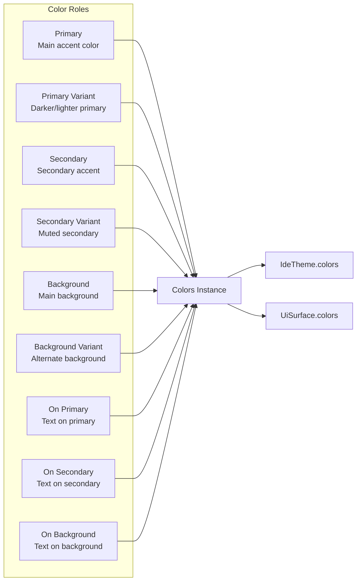
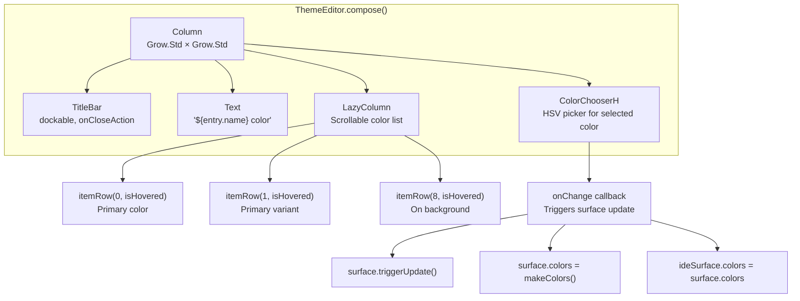
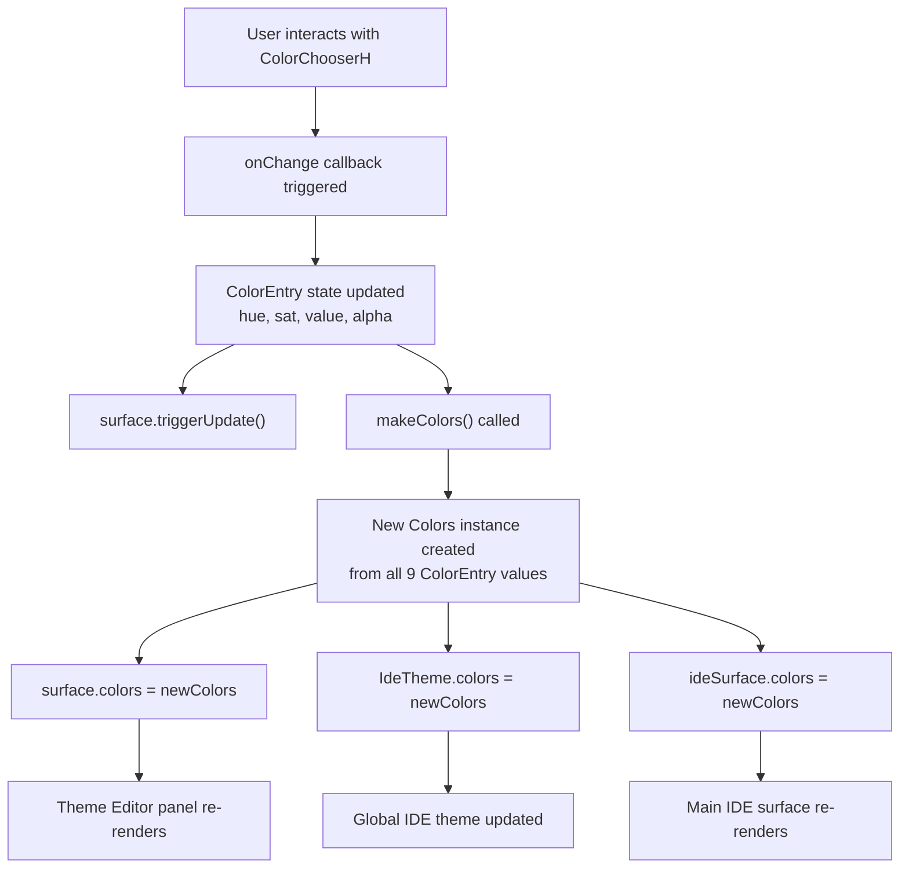

# Theme Editor

<details>
<summary>Relevant source files</summary>

The following files were used as context for generating this wiki page:

- [src/main/java/ru/hollowhorizon/hollowengine/client/gui/DashboardScreen.kt](src/main/java/ru/hollowhorizon/hollowengine/client/gui/DashboardScreen.kt)
- [src/main/java/ru/hollowhorizon/hollowengine/client/gui/NPCToolGui.kt](src/main/java/ru/hollowhorizon/hollowengine/client/gui/NPCToolGui.kt)
- [src/main/java/ru/hollowhorizon/hollowengine/client/gui/codeblocks/BlockContextMenu.kt](src/main/java/ru/hollowhorizon/hollowengine/client/gui/codeblocks/BlockContextMenu.kt)
- [src/main/java/ru/hollowhorizon/hollowengine/client/gui/modificators/BiomeModificator.kt](src/main/java/ru/hollowhorizon/hollowengine/client/gui/modificators/BiomeModificator.kt)
- [src/main/java/ru/hollowhorizon/hollowengine/client/gui/npcs/NPCMenuGui.kt](src/main/java/ru/hollowhorizon/hollowengine/client/gui/npcs/NPCMenuGui.kt)
- [src/main/java/ru/hollowhorizon/hollowengine/client/gui/scripting/GuiPackets.kt](src/main/java/ru/hollowhorizon/hollowengine/client/gui/scripting/GuiPackets.kt)
- [src/main/java/ru/hollowhorizon/hollowengine/client/gui/scripting/ServerIdeWarning.kt](src/main/java/ru/hollowhorizon/hollowengine/client/gui/scripting/ServerIdeWarning.kt)
- [src/main/java/ru/hollowhorizon/hollowengine/client/gui/scripting/files/ImageFile.kt](src/main/java/ru/hollowhorizon/hollowengine/client/gui/scripting/files/ImageFile.kt)
- [src/main/java/ru/hollowhorizon/hollowengine/client/gui/scripting/files/prefabs/EntityEditorScreen.kt](src/main/java/ru/hollowhorizon/hollowengine/client/gui/scripting/files/prefabs/EntityEditorScreen.kt)
- [src/main/java/ru/hollowhorizon/hollowengine/client/gui/scripting/files/prefabs/ItemPrefabEditorFile.kt](src/main/java/ru/hollowhorizon/hollowengine/client/gui/scripting/files/prefabs/ItemPrefabEditorFile.kt)
- [src/main/java/ru/hollowhorizon/hollowengine/client/gui/scripting/files/prefabs/PrefabEditorFile.kt](src/main/java/ru/hollowhorizon/hollowengine/client/gui/scripting/files/prefabs/PrefabEditorFile.kt)
- [src/main/java/ru/hollowhorizon/hollowengine/client/gui/scripting/panels/ConsolePanel.kt](src/main/java/ru/hollowhorizon/hollowengine/client/gui/scripting/panels/ConsolePanel.kt)
- [src/main/java/ru/hollowhorizon/hollowengine/client/gui/scripting/panels/LanguageEditorPanel.kt](src/main/java/ru/hollowhorizon/hollowengine/client/gui/scripting/panels/LanguageEditorPanel.kt)
- [src/main/java/ru/hollowhorizon/hollowengine/client/gui/scripting/theme/ThemeEditor.kt](src/main/java/ru/hollowhorizon/hollowengine/client/gui/scripting/theme/ThemeEditor.kt)
- [src/main/resources/assets/hollowengine/lang/en_us.json](src/main/resources/assets/hollowengine/lang/en_us.json)
- [src/main/resources/assets/hollowengine/lang/ru_ru.json](src/main/resources/assets/hollowengine/lang/ru_ru.json)

</details>


The Theme Editor is a specialized UI panel within the HollowEngine IDE that allows users to customize the color scheme of the development environment. It provides a visual interface for editing the theme's color palette using HSV color pickers with real-time preview.

For information about the overall IDE structure and panel system, see [IDE Overview and Architecture](#3.1). For details on the docking system that hosts the Theme Editor, see [Docking System](#3.3).

---

## Overview

The Theme Editor enables customization of the IDE's visual appearance by modifying the color palette defined in `IdeTheme.colors`. Users can select individual color roles (primary, secondary, background, etc.) and adjust their hue, saturation, value, and alpha channels using interactive color pickers.

**Key Features:**
- Live editing of 9 theme color roles
- HSV color picker with hex string input
- Real-time preview of color changes
- Persistent color state across sessions
- Integration with the IDE's docking panel system

**Sources:** [src/main/java/ru/hollowhorizon/hollowengine/client/gui/scripting/theme/ThemeEditor.kt:1-142]()

---

## Architecture

### Component Structure

The Theme Editor is implemented as a singleton object (`ThemeEditor`) that composes a dockable UI panel. It manages an internal list of `ColorEntry` instances, each representing one customizable color role in the theme.



**Sources:** [src/main/java/ru/hollowhorizon/hollowengine/client/gui/scripting/theme/ThemeEditor.kt:8-11](), [src/main/java/ru/hollowhorizon/hollowengine/client/gui/scripting/theme/ThemeEditor.kt:76-141]()

---

### ColorEntry Data Structure

Each `ColorEntry` instance tracks the mutable state for one theme color:

| Property | Type | Purpose |
|----------|------|---------|
| `name` | `String` | Display name (e.g., "Primary", "Background") |
| `hue` | `MutableStateValue<Float>` | Hue component (0-360°) |
| `sat` | `MutableStateValue<Float>` | Saturation component (0-1) |
| `value` | `MutableStateValue<Float>` | Value/brightness component (0-1) |
| `alpha` | `MutableStateValue<Float>` | Alpha/opacity component (0-1) |
| `hexString` | `MutableStateValue<String>` | Hex color representation |
| `color` | `Color` (computed) | Composed RGBA color from HSV values |

**Sources:** [src/main/java/ru/hollowhorizon/hollowengine/client/gui/scripting/theme/ThemeEditor.kt:76-95]()

---

## Theme Color Palette

The Theme Editor manages 9 distinct color roles that define the IDE's appearance:



**Sources:** [src/main/java/ru/hollowhorizon/hollowengine/client/gui/scripting/theme/ThemeEditor.kt:13-23](), [src/main/java/ru/hollowhorizon/hollowengine/client/gui/scripting/theme/ThemeEditor.kt:26-37]()

---

## User Interface

### Layout Structure

The Theme Editor panel is divided into two main areas:

1. **Top Section**: Active color editor with HSV picker
2. **Bottom Section**: Scrollable list of all color entries



**Sources:** [src/main/java/ru/hollowhorizon/hollowengine/client/gui/scripting/theme/ThemeEditor.kt:39-74]()

---

### Color List Items

Each color entry in the scrollable list displays:

- **Color preview box** (80×64 dp) showing the current color
- **Color name** (e.g., "Primary", "Background")
- **Hex representation** (#RRGGBBAA)
- **HSVA values** (Hue: 0-360, Saturation: 0-100%, Value: 0-100%, Alpha: 0-100%)

**Visual States:**
- **Hovered**: Secondary color with 50% opacity background
- **Selected**: Secondary color with 30% opacity background
- **Even rows**: Subtle background tint for readability

**Sources:** [src/main/java/ru/hollowhorizon/hollowengine/client/gui/scripting/theme/ThemeEditor.kt:97-141]()

---

## Data Flow

### Color Change Propagation

When a user modifies a color using the HSV picker, the changes propagate through the system as follows:



**Sources:** [src/main/java/ru/hollowhorizon/hollowengine/client/gui/scripting/theme/ThemeEditor.kt:50-54]()

---

## Integration with IDE

### Opening the Theme Editor

The Theme Editor is accessed through the IDE's settings menu. The menu path is:

**Settings → Theme**

The localization key for the menu item is `"hollowengine.gui.ide.settings.theme"`, which translates to:
- English: "Theme"
- Russian: "Тема"

**Sources:** [src/main/resources/assets/hollowengine/lang/en_us.json:30](), [src/main/resources/assets/hollowengine/lang/ru_ru.json:30]()

---

### Dockable Panel Properties

The Theme Editor is instantiated as a dockable panel with the following configuration:

```kotlin
val dockable = UiDockable(
    "Theme Editor",
    floatingWidth = Dp(100f),
    floatingHeight = Dp(100f)
)
```

**Required References:**
- `ideSurface: UiSurface` - Reference to the main IDE surface for applying theme changes
- `onRemove: () -> Unit` - Callback invoked when the panel is closed

**Sources:** [src/main/java/ru/hollowhorizon/hollowengine/client/gui/scripting/theme/ThemeEditor.kt:9-11]()

---

## Usage Example

### Editing a Theme Color

1. **Select a color role**: Click on any color entry in the scrollable list (e.g., "Primary")
2. **Adjust HSV values**: Use the color wheel in the `ColorChooserH` component to modify hue, saturation, and value
3. **Adjust alpha**: Use the alpha slider to control transparency
4. **Enter hex values**: Optionally type a hex color code directly
5. **Preview changes**: Changes are applied immediately to the IDE interface

**Code Flow:**

```
User clicks "Primary" in color list
  → selectedColor.set(0)
  → UI re-composes with entry = colorEntries[0]
  → ColorChooserH displays current primary color

User drags color wheel
  → ColorChooserH onChange callback fires
  → colorEntries[0].hue.set(newHue)
  → colorEntries[0].sat.set(newSat)
  → colorEntries[0].value.set(newVal)
  → surface.triggerUpdate()
  → makeColors() constructs new Colors instance
  → IdeTheme.colors updated
  → IDE panels re-render with new theme
```

**Sources:** [src/main/java/ru/hollowhorizon/hollowengine/client/gui/scripting/theme/ThemeEditor.kt:39-74]()

---

## Theme Application

### Global Theme State

The `IdeTheme.colors` property holds the current theme's `Colors` instance. This is referenced throughout the IDE by various panels and components:

**Example Usage in Other Components:**

- **NPCToolGui**: Uses `IdeTheme.sizes` and `IdeTheme.colors` for consistent styling
- **DockPanel subclasses**: Reference `IdeTheme.colors` for background, text, and border colors
- **Modal dialogs**: Apply theme colors for consistent appearance

**Sources:** [src/main/java/ru/hollowhorizon/hollowengine/client/gui/NPCToolGui.kt:49-52](), [src/main/java/ru/hollowhorizon/hollowengine/client/gui/scripting/theme/ThemeEditor.kt:40]()

---

## Technical Details

### Color Conversion

Colors are stored internally as HSV (Hue, Saturation, Value) to facilitate intuitive editing:

1. **Input**: Initial `Color` (RGBA format)
2. **Conversion**: `Color.toHsv()` extracts HSV components
3. **Editing**: User modifies HSV values via color picker
4. **Output**: `Color.Hsv(h, s, v).toSrgb(a = alpha)` converts back to RGBA

This approach allows users to:
- Adjust brightness without changing hue
- Modify saturation independently
- Control transparency separately

**Sources:** [src/main/java/ru/hollowhorizon/hollowengine/client/gui/scripting/theme/ThemeEditor.kt:83](), [src/main/java/ru/hollowhorizon/hollowengine/client/gui/scripting/theme/ThemeEditor.kt:89-95]()

---

## Limitations

1. **No persistence**: Theme changes are not saved between sessions. They exist only in memory during the current IDE session.
2. **Fixed color roles**: The 9 color roles are hardcoded and cannot be extended.
3. **No presets**: No built-in theme presets or ability to save/load custom themes.
4. **No undo/redo**: Color changes cannot be undone except by manually reverting to previous values.

**Sources:** [src/main/java/ru/hollowhorizon/hollowengine/client/gui/scripting/theme/ThemeEditor.kt:13-23]()