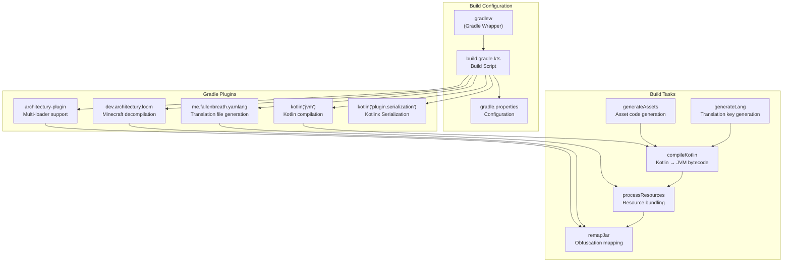
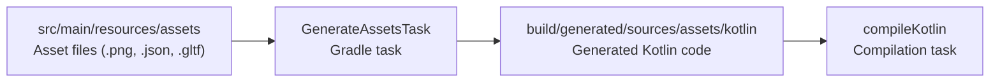
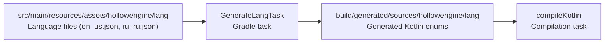
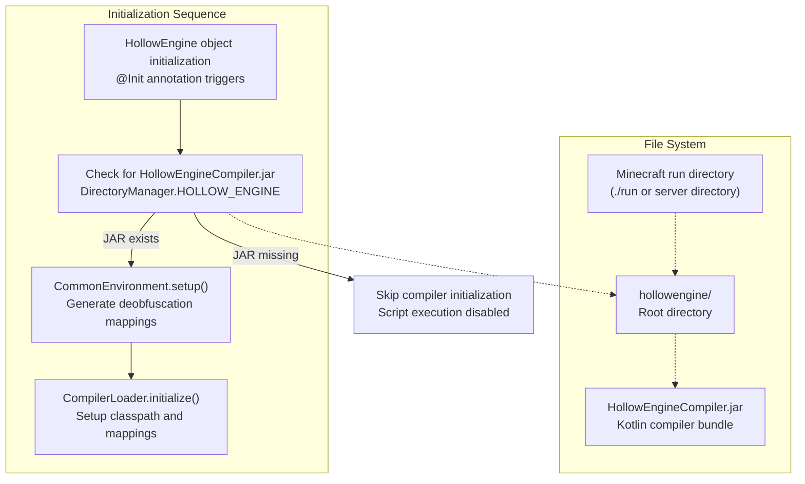
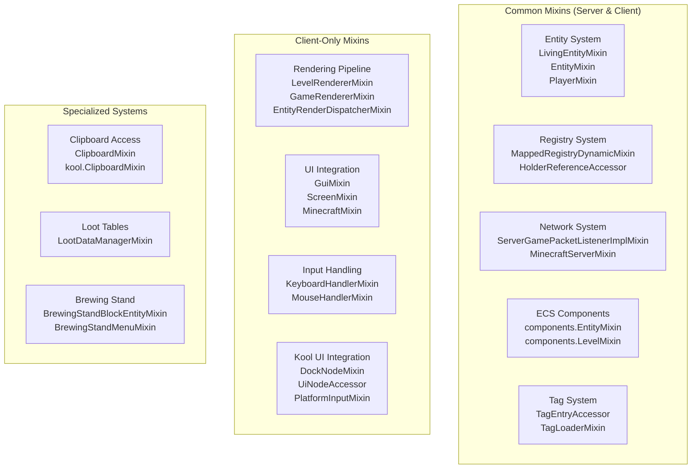

# Installation and Setup

<details>
<summary>Relevant source files</summary>

The following files were used as context for generating this wiki page:

- [build.gradle.kts](build.gradle.kts)
- [gradle.properties](gradle.properties)
- [src/main/java/ru/hollowhorizon/hollowengine/HollowEngine.kt](src/main/java/ru/hollowhorizon/hollowengine/HollowEngine.kt)
- [src/main/resources/hollowengine.mixins.json](src/main/resources/hollowengine.mixins.json)

</details>


This page covers the initial setup process for building and running HollowEngine, including prerequisites, build configuration, compiler initialization, and first-launch setup. For information about the project's directory structure after setup, see [Project Structure and Directories](#2.3). For details on the mod's initialization sequence, see [Mod Initialization](#2.4).

---

## Prerequisites

### Required Software

HollowEngine requires the following software to build and run:

| Component | Version | Purpose |
|-----------|---------|---------|
| Java Development Kit | 17+ | Required for Minecraft 1.20.1+ and Kotlin compilation |
| Gradle | 7.6+ (via wrapper) | Build system and dependency management |
| Git | Any recent version | Source control for cloning the repository |

**Sources:** [build.gradle.kts:1-148]()

### Recommended IDE

**IntelliJ IDEA** is the recommended IDE for development:
- **Edition**: Community or Ultimate
- **Plugins Required**:
  - Kotlin plugin (bundled with IntelliJ IDEA)
  - Minecraft Development plugin (optional, for enhanced mod support)
  
The build system uses Architectury Loom, which integrates with IntelliJ's Gradle support to provide Minecraft-specific development features.

**Sources:** [build.gradle.kts:8-16]()

### Minecraft Version Support

HollowEngine uses Stonecutter for multi-version support. The following versions are supported:

- **Minecraft 1.20.1**: Stable release target
- **Minecraft 1.21.1**: Experimental support

Version-specific dependencies (such as JEI) are automatically selected based on the Stonecutter configuration.

**Sources:** [build.gradle.kts:64-72]()

---

## Cloning and Building

### Repository Setup

```bash
# Clone the repository
git clone https://github.com/HollowHorizon/HollowEngine.git
cd HollowEngine

# Initialize Gradle wrapper (if not already present)
./gradlew wrapper --gradle-version 8.5

# Build the project
./gradlew build
```

### Gradle Configuration Overview

The build system uses several Gradle plugins:



**Gradle Build Flow**

**Sources:** [build.gradle.kts:8-16](), [build.gradle.kts:122-144]()

---

## Project Configuration

### gradle.properties

The `gradle.properties` file defines core project metadata and build settings:

| Property | Default Value | Purpose |
|----------|---------------|---------|
| `modId` | `hollowengine` | Mod identifier used throughout the codebase |
| `modName` | `HollowEngine` | Display name |
| `modVersion` | `2.0.0-snapshot-1` | Semantic version |
| `modAuthor` | `HollowHorizon` | Author metadata |
| `license` | `MIT` | Open source license |
| `hollowcore` | `2.3.12` | HollowCore dependency version |
| `kotlinVersion` | `2.3.0` | Kotlin compiler version |
| `koolVersion` | `0.20.0-SNAPSHOT` | Kool UI framework version |
| `compiler_plugin` | `1.5.1` | Compiler plugin version |

**JVM Configuration:**
```properties
org.gradle.jvmargs=-Xmx6096m -Dfile.encoding=UTF-8
org.gradle.parallel=true
org.gradle.daemon=false
```

- **Heap Size**: 6GB allocated for Minecraft decompilation and asset processing
- **Parallel Builds**: Enabled for faster compilation
- **Gradle Daemon**: Disabled to prevent memory leaks during development

**Sources:** [gradle.properties:1-22]()

### Mod Metadata

The build script constructs a `ModProject` container that defines mod entry points:

```kotlin
val container = ModProject(
    modId = modId,
    modName = modName,
    modVersion = modVersion,
    license = license,
    
    entryPoints = mapOf(
        "main" to listOf("ru.hollowhorizon.hollowengine.fabric.HCFabric::onCommonInitialize"),
        "client" to listOf("ru.hollowhorizon.hollowengine.fabric.HCFabric::onClientInitialize")
    ),
    dependencies = mapOf(),
    
    username = "TheHollowHorizon"
)
```

These entry points are invoked by the Fabric Loader during mod initialization on both server and client.

**Sources:** [build.gradle.kts:23-36]()

---

## Dependency Architecture

### Core Dependencies

```mermaid
graph TB
    subgraph "Language & Runtime"
        Kotlin["kotlin-stdlib-jdk8<br/>kotlin-reflect<br/>Version: 2.3.0"]
        KotlinX["kotlinx-serialization<br/>kotlinx-coroutines<br/>kotlinx-datetime"]
        Compose["androidx.compose.runtime<br/>Version: 1.10.3"]
    end
    
    subgraph "UI & Graphics"
        Kool["de.fabmax.kool:kool-core-desktop<br/>3D rendering framework<br/>Version: 0.20.0-SNAPSHOT"]
        JSVG["com.github.weisj:jsvg<br/>SVG rendering<br/>Version: 2.0.0"]
    end
    
    subgraph "ECS & Game Logic"
        Geary["com.mineinabyss:geary-core<br/>geary-prefabs<br/>geary-actions<br/>geary-serialization<br/>Version: 0.28"]
        Koin["io.insert-koin:koin-core<br/>Dependency injection<br/>Version: 4.0.0"]
    end
    
    subgraph "Serialization & Config"
        TomlKT["net.peanuuutz.tomlkt<br/>TOML parsing<br/>Version: 0.5.0"]
        Kaml["com.charleskorn.kaml<br/>YAML parsing<br/>Version: 0.104.0"]
    end
    
    subgraph "Minecraft Integration"
        ArchitecturyLoom["Architectury Loom<br/>Minecraft decompilation"]
        Mixins["Mixin Framework<br/>Runtime bytecode modification"]
        JEI["mezz.jei<br/>Just Enough Items API<br/>Version: 15.20.0.105 / 19.25.1.332"]
    end
    
    Kotlin --> KotlinX
    KotlinX --> Compose
    
    Kool --> JSVG
    
    Geary --> Koin
    Geary --> Kaml
    
    TomlKT --> Kaml
    
    ArchitecturyLoom --> Mixins
    Mixins --> JEI
```



**Dependency Purpose Matrix**

**Sources:** [build.gradle.kts:44-120]()

### Repository Configuration

The build script configures multiple Maven repositories:

```kotlin
repositories {
    maven("https://jitpack.io")           // Third-party GitHub projects
    maven("https://maven.blamejared.com/") // JEI and related mods
    mavenLocal()                           // Local Maven cache
    flatDir { dirs(rootProject.file("libs")) } // Local JAR files
}
```

The `flatDir` repository allows including external JARs (such as `HollowEngineCompiler.jar`) directly.

**Sources:** [build.gradle.kts:44-49]()

---

## Code Generation Tasks

### Asset Generation



**GenerateAssetsTask Configuration**

The `generateAssets` task creates Kotlin code that references asset files at compile time:

```kotlin
val generateAssets by tasks.registering(GenerateAssetsTask::class) {
    generatedPackage.set("ru.hollowhorizon.hollowengine.generated")
    assetsDirectory.set(rootProject.file("src/main/resources/assets"))
    outputDirectory.set(layout.buildDirectory.dir("generated/sources/assets/kotlin"))
}
```

This enables type-safe asset references such as `Assets.Models.PLAYER` instead of error-prone string paths.

**Sources:** [build.gradle.kts:122-126]()

### Language Key Generation



**GenerateLangTask Configuration**

The `generateLang` task creates type-safe translation key references:

```kotlin
val generateLang by tasks.registering(GenerateLangTask::class) {
    generatedPackage.set("ru.hollowhorizon.hollowengine.generated")
    langDirectory.set(rootProject.file("src/main/resources/assets/hollowengine/lang"))
    outputDirectory.set(layout.buildDirectory.dir("generated/sources/hollowengine/lang"))
}
```

This generates enums like `Lang.IDE.TITLE` for compile-time validated translations.

**Sources:** [build.gradle.kts:128-132]()

### Source Set Configuration

Both generated source directories are registered with the main source set:

```kotlin
sourceSets {
    main {
        java.srcDir(generateAssets.map { it.outputDirectory })
        java.srcDir(generateLang.map { it.outputDirectory })
    }
}

tasks.withType<KotlinCompile> {
    dependsOn(generateAssets)
    dependsOn(generateLang)
}
```

This ensures generation runs before Kotlin compilation and that the IDE recognizes generated code.

**Sources:** [build.gradle.kts:134-144]()

---

## Compiler Initialization

### HollowEngineCompiler.jar

HollowEngine uses a separate compiler JAR (`HollowEngineCompiler.jar`) for runtime Kotlin script compilation. This JAR must be placed in the `hollowengine/` directory in the Minecraft run directory.



**CompilerLoader Initialization**

**Sources:** [HollowEngine.kt:1-34](), [build.gradle.kts:1-148]()

### Initialization Code

```kotlin
@Init
object HollowEngine {
    const val MODID = "hollowengine"
    val LOGGER = LogManager.getLogger()
    val compilerLoader = CompilerLoader(
        DirectoryManager.HOLLOW_ENGINE.resolve("HollowEngineCompiler.jar").toFile()
    )
    
    init {
        LOGGER.info("Initializing Hollow Engine 2.0!")
        
        if (compilerLoader.hasCompilerJar()) {
            val (mappings, classpath) = CommonEnvironment.setup()
            compilerLoader.initialize(File(System.getProperty("java.home")), classpath, mappings)
        }
    }
}
```

**Key Components:**
- **`@Init`**: Annotation triggers initialization during mod loading
- **`LOGGER`**: Log4j logger for tracking initialization status
- **`compilerLoader`**: Manages runtime Kotlin compilation
- **`CommonEnvironment.setup()`**: Generates Minecraft deobfuscation mappings for compiled scripts
- **`compilerLoader.initialize()`**: Configures compiler with JDK path, classpath, and mappings

**Sources:** [HollowEngine.kt:16-33]()

---

## Mixin System Configuration

### Mixin Registration

HollowEngine uses Mixin to inject behavior into Minecraft classes at runtime. The mixin configuration is defined in `hollowengine.mixins.json`:

```json
{
  "required": true,
  "minVersion": "0.8",
  "package": "ru.hollowhorizon.hollowengine.mixins",
  "refmap": "${mod_id}.refmap.json",
  "compatibilityLevel": "JAVA_17",
  "mixins": [...],
  "client": [...],
  "server": []
}
```

**Configuration Properties:**
| Property | Value | Purpose |
|----------|-------|---------|
| `required` | `true` | Mod will not load if mixins fail to apply |
| `minVersion` | `0.8` | Minimum Mixin framework version |
| `package` | `ru.hollowhorizon.hollowengine.mixins` | Base package for mixin classes |
| `compatibilityLevel` | `JAVA_17` | Java bytecode version target |

**Sources:** [hollowengine.mixins.json:1-80]()

### Mixin Categories



**Mixin Purpose Matrix**

**Sources:** [hollowengine.mixins.json:7-75]()

### Critical Mixins

**EntityMixin (ECS Integration)**
- **Target**: `net.minecraft.world.entity.Entity`
- **Purpose**: Attaches `EntityScope` for script execution persistence
- **Location**: `components.EntityMixin`

**LevelRendererMixin (Rendering)**
- **Target**: `net.minecraft.client.renderer.LevelRenderer`
- **Purpose**: Integrates 3D model rendering pipeline
- **Location**: `client.LevelRendererMixin`

**MinecraftMixin (Client Lifecycle)**
- **Target**: `net.minecraft.client.Minecraft`
- **Purpose**: Hooks IDE overlay and input handling
- **Location**: `client.MinecraftMixin`

For detailed information on how mixins modify runtime behavior, see [Mixin System](#12.5).

**Sources:** [hollowengine.mixins.json:29-30](), [hollowengine.mixins.json:48](), [hollowengine.mixins.json:59]()

---

## Running the Mod

### Run Configurations

Architectury Loom provides Gradle tasks for launching Minecraft:

| Task | Purpose | Profile |
|------|---------|---------|
| `runClient` | Launch Minecraft client | Development client with hot reload |
| `runServer` | Launch dedicated server | Headless server for testing |
| `runData` | Run data generators | Generate assets and tags |

**Example:**
```bash
# Launch development client
./gradlew runClient

# Launch server
./gradlew runServer

# Generate datagen assets
./gradlew runData
```

### JVM Arguments

The development environment uses the JVM arguments from `gradle.properties`:

```properties
org.gradle.jvmargs=-Xmx6096m -Dfile.encoding=UTF-8
```

For production environments, adjust the heap size based on server requirements. HollowEngine's script execution and model rendering may require additional memory.

**Sources:** [gradle.properties:19-21]()

---

## First Launch Setup

### Automatic Directory Creation

On first launch, `DirectoryManager` automatically creates the required directory structure:

```
minecraft_root/
└── hollowengine/
    ├── HollowEngineCompiler.jar      (Place manually)
    ├── scripts/                      (Auto-created)
    │   ├── *.kts                     (Kotlin scripts)
    │   └── *.bc                      (Block code files)
    ├── prefabs/                      (Auto-created)
    │   └── *.entity.prefab           (Entity definitions)
    └── assets/                       (Auto-created)
        ├── models/                   (3D models)
        ├── textures/                 (Textures)
        └── animations/               (Animation controllers)
```

For detailed information on directory structure and file organization, see [Project Structure and Directories](#2.3).

**Sources:** [HollowEngine.kt:20]()

### Compiler JAR Setup

**Obtaining the Compiler JAR:**

The `HollowEngineCompiler.jar` is required for runtime script compilation. If the JAR is missing, a warning will appear in logs:

```
[HollowEngine] Compiler JAR not found at: hollowengine/HollowEngineCompiler.jar
[HollowEngine] Script compilation will be disabled.
```

**Manual Installation:**
1. Download `HollowEngineCompiler.jar` from the mod's releases page
2. Place it in `<minecraft_root>/hollowengine/HollowEngineCompiler.jar`
3. Restart Minecraft

The compiler will initialize during mod loading and enable runtime script execution.

**Sources:** [HollowEngine.kt:25-28]()

### Initialization Logs

Expected console output on successful initialization:

```
[HollowEngine] Initializing Hollow Engine 2.0!
[CommonEnvironment] Setting up deobfuscation mappings...
[CommonEnvironment] Classpath configured with 247 entries
[CompilerLoader] Kotlin compiler initialized successfully
[DirectoryManager] Created directory: hollowengine/scripts
[DirectoryManager] Created directory: hollowengine/prefabs
[DirectoryManager] Created directory: hollowengine/assets
```

If any errors occur during initialization, check the `logs/latest.log` file for diagnostic information.

**Sources:** [HollowEngine.kt:23-28]()

---

## Next Steps

After successful installation and first launch:

1. **Verify Build System**: See [Build System and Dependencies](#2.2) for detailed build configuration
2. **Explore Directory Structure**: See [Project Structure and Directories](#2.3) for file organization
3. **Understand Initialization**: See [Mod Initialization](#2.4) for the complete startup sequence
4. **Open the IDE**: Press `F10` in-game to access the scripting environment (see [IDE Overview and Architecture](#3.1))

**Sources:** [build.gradle.kts:1-148](), [HollowEngine.kt:1-34]()