# Advanced Topics

<details>
<summary>Relevant source files</summary>

The following files were used as context for generating this wiki page:

- [src/main/java/ru/hollowhorizon/hollowengine/common/codeblocks/blocks/players/OnPlayerChatBlock.kt](src/main/java/ru/hollowhorizon/hollowengine/common/codeblocks/blocks/players/OnPlayerChatBlock.kt)
- [src/main/java/ru/hollowhorizon/hollowengine/common/codeblocks/execution/BlockFrameStackElement.kt](src/main/java/ru/hollowhorizon/hollowengine/common/codeblocks/execution/BlockFrameStackElement.kt)
- [src/main/java/ru/hollowhorizon/hollowengine/common/codeblocks/execution/CodeBlockInterpreter.kt](src/main/java/ru/hollowhorizon/hollowengine/common/codeblocks/execution/CodeBlockInterpreter.kt)
- [src/main/java/ru/hollowhorizon/hollowengine/common/codeblocks/runtime/BlocksSystem.kt](src/main/java/ru/hollowhorizon/hollowengine/common/codeblocks/runtime/BlocksSystem.kt)
- [src/main/java/ru/hollowhorizon/hollowengine/common/codeblocks/runtime/BlocksSystemSavedData.kt](src/main/java/ru/hollowhorizon/hollowengine/common/codeblocks/runtime/BlocksSystemSavedData.kt)
- [src/main/java/ru/hollowhorizon/hollowengine/common/codeblocks/runtime/OwnerScopeRestoredEvent.kt](src/main/java/ru/hollowhorizon/hollowengine/common/codeblocks/runtime/OwnerScopeRestoredEvent.kt)
- [src/main/java/ru/hollowhorizon/hollowengine/common/codeblocks/runtime/ScriptFile.kt](src/main/java/ru/hollowhorizon/hollowengine/common/codeblocks/runtime/ScriptFile.kt)
- [src/main/java/ru/hollowhorizon/hollowengine/common/codeblocks/runtime/ScriptInstance.kt](src/main/java/ru/hollowhorizon/hollowengine/common/codeblocks/runtime/ScriptInstance.kt)
- [src/main/java/ru/hollowhorizon/hollowengine/common/commands/HollowEngineCommands.kt](src/main/java/ru/hollowhorizon/hollowengine/common/commands/HollowEngineCommands.kt)
- [src/main/java/ru/hollowhorizon/hollowengine/common/coroutines/EntityScope.kt](src/main/java/ru/hollowhorizon/hollowengine/common/coroutines/EntityScope.kt)
- [src/main/java/ru/hollowhorizon/hollowengine/common/coroutines/SingleThreadDispatcher.kt](src/main/java/ru/hollowhorizon/hollowengine/common/coroutines/SingleThreadDispatcher.kt)
- [src/main/java/ru/hollowhorizon/hollowengine/common/dev/DevLogger.kt](src/main/java/ru/hollowhorizon/hollowengine/common/dev/DevLogger.kt)
- [src/main/java/ru/hollowhorizon/hollowengine/mixins/components/EntityMixin.java](src/main/java/ru/hollowhorizon/hollowengine/mixins/components/EntityMixin.java)
- [src/test/kotlin/CodeBlockExecutionCoreTests.kt](src/test/kotlin/CodeBlockExecutionCoreTests.kt)
- [src/test/kotlin/ScriptExecutionLifecycleTests.kt](src/test/kotlin/ScriptExecutionLifecycleTests.kt)

</details>


This page documents advanced systems in HollowEngine for developers who need to extend the framework, integrate with low-level systems, or understand the internal architecture. Topics covered include the serializable coroutine system, entity lifecycle management, mixin-based integration, NBT persistence architecture, event-driven execution patterns, and development of custom blocks.

For basic usage of the scripting system, see [Script Execution and Runtime](#7). For information about the visual block editor interface, see [Visual Block Editor](#5). For creating custom IDE panels, see [Custom Panel Development](#12.4).

---

## Serializable Coroutine System

HollowEngine implements a serializable coroutine system that allows suspended coroutines to be persisted to NBT and restored across server restarts. This is the foundation for script persistence when entities unload or servers restart.

### EntityScope Architecture

The `EntityScope` class implements `SerializableCoroutineScope` and manages serializable coroutine executions. Each entity in the game has an `EntityScope` instance attached via mixin injection.

**Core Components Diagram**

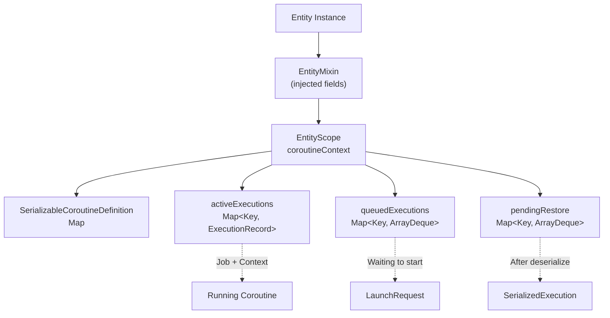
```mermaid
graph TB
    Entity["Entity Instance"]
    EntityMixin["EntityMixin<br/>(injected fields)"]
    EntityScope["EntityScope<br/>coroutineContext"]
    Definitions["SerializableCoroutineDefinition<br/>Map"]
    ActiveExecs["activeExecutions<br/>Map&lt;Key, ExecutionRecord&gt;"]
    QueuedExecs["queuedExecutions<br/>Map&lt;Key, ArrayDeque&gt;"]
    PendingRestore["pendingRestore<br/>Map&lt;Key, ArrayDeque&gt;"]
    
    Entity --> EntityMixin
    EntityMixin --> EntityScope
    EntityScope --> Definitions
    EntityScope --> ActiveExecs
    EntityScope --> QueuedExecs
    EntityScope --> PendingRestore
    
    ActiveExecs -.->|"Job + Context"| Coroutine["Running Coroutine"]
    QueuedExecs -.->|"Waiting to start"| LaunchRequest["LaunchRequest"]
    PendingRestore -.->|"After deserialize"| SerializedExecution["SerializedExecution"]
```

Sources: [src/main/java/ru/hollowhorizon/hollowengine/common/coroutines/EntityScope.kt:31-76](), [src/main/java/ru/hollowhorizon/hollowengine/mixins/components/EntityMixin.java:35-52]()

### SerializableCoroutineKey System

Each serializable coroutine is identified by a `SerializableCoroutineKey` composed of multiple `SerializableCoroutineKeyPart` components. This allows unique identification of script executions even after restoration.

**Key Composition Example**

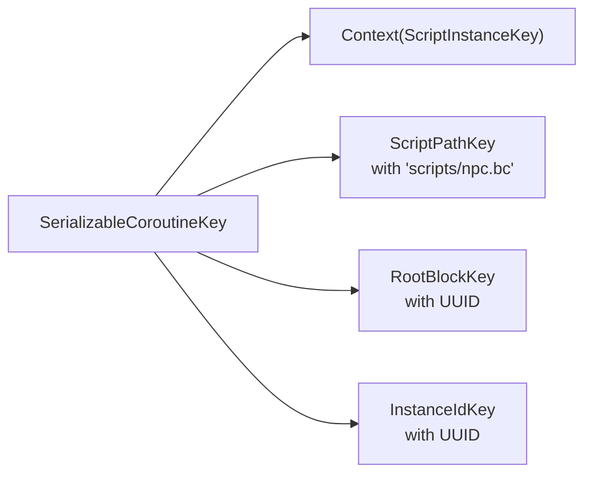
```mermaid
graph LR
    Key["SerializableCoroutineKey"]
    Part1["Context(ScriptInstanceKey)"]
    Part2["ScriptPathKey<br/>with 'scripts/npc.bc'"]
    Part3["RootBlockKey<br/>with UUID"]
    Part4["InstanceIdKey<br/>with UUID"]
    
    Key --> Part1
    Key --> Part2
    Key --> Part3
    Key --> Part4
```

The key construction happens in `ScriptInstance`:

| Component | Purpose |
|-----------|---------|
| `Context(ScriptInstanceKey)` | Identifies this as a script instance coroutine |
| `ScriptPathKey` | The file path of the script |
| `RootBlockKey` | The UUID of the start block being executed |
| `InstanceIdKey` | Unique instance ID for this execution |

Sources: [src/main/java/ru/hollowhorizon/hollowengine/common/codeblocks/runtime/ScriptInstance.kt:34-39]()

### SerializableCoroutineDefinition

Before launching a serializable coroutine, you must register a `SerializableCoroutineDefinition` that specifies how to create and execute it:

```kotlin
SerializableCoroutineDefinition(
    key = serializableKey,
    contextFactory = { BlockFrameStackElement(instance) },
    context = ScriptContextElement(instance) + triggerContext,
    start = CoroutineStart.DEFAULT,
    block = { /* coroutine body */ }
)
```

Sources: [src/main/java/ru/hollowhorizon/hollowengine/common/codeblocks/runtime/ScriptInstance.kt:110-148]()

### LaunchPolicy Options

When launching a serializable coroutine, you specify a `LaunchPolicy` that determines behavior when an execution with the same key is already running:

| Policy | Behavior |
|--------|----------|
| `CANCEL_OLD` | Cancel the existing execution and start new one |
| `DROP_NEW` | Ignore the new launch request, keep existing execution |
| `ENQUEUE` | Queue the new request to start after current execution completes |

**Launch Policy State Machine**

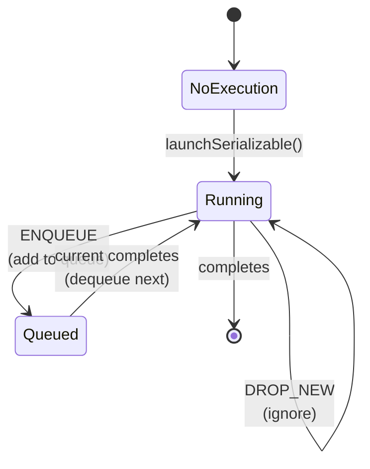
```mermaid
stateDiagram-v2
    [*] --> NoExecution
    NoExecution --> Running: launchSerializable()
    Running --> Running: CANCEL_OLD<br/>(cancel + restart)
    Running --> Running: DROP_NEW<br/>(ignore)
    Running --> Queued: ENQUEUE<br/>(add to queue)
    Queued --> Running: current completes<br/>(dequeue next)
    Running --> [*]: completes
```

Sources: [src/main/java/ru/hollowhorizon/hollowengine/common/coroutines/EntityScope.kt:126-152]()

### Persistence and Restoration Flow

**Serialization Process**

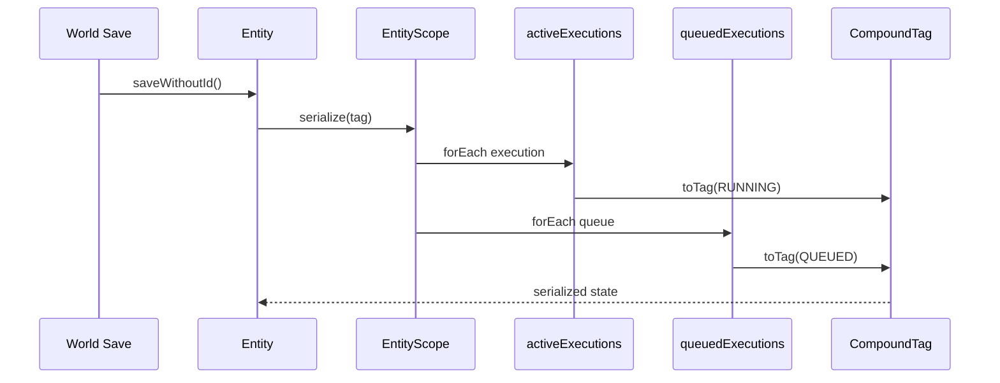
```mermaid
sequenceDiagram
    participant World as World Save
    participant Entity as Entity
    participant Scope as EntityScope
    participant Active as activeExecutions
    participant Queued as queuedExecutions
    participant NBT as CompoundTag
    
    World->>Entity: saveWithoutId()
    Entity->>Scope: serialize(tag)
    Scope->>Active: forEach execution
    Active->>NBT: toTag(RUNNING)
    Scope->>Queued: forEach queue
    Queued->>NBT: toTag(QUEUED)
    NBT-->>Entity: serialized state
```

**Deserialization and Restoration Process**

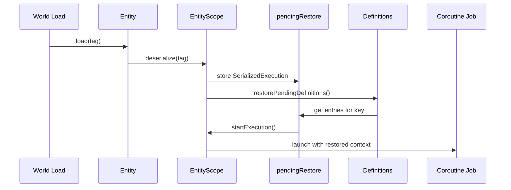
```mermaid
sequenceDiagram
    participant World as World Load
    participant Entity as Entity
    participant Scope as EntityScope
    participant Pending as pendingRestore
    participant Def as Definitions
    participant Job as Coroutine Job
    
    World->>Entity: load(tag)
    Entity->>Scope: deserialize(tag)
    Scope->>Pending: store SerializedExecution
    Scope->>Def: restorePendingDefinitions()
    Def->>Pending: get entries for key
    Pending->>Scope: startExecution()
    Scope->>Job: launch with restored context
```

The key insight is that deserialization happens before definitions are registered. When a definition is registered later (via `registerSerializable()`), the scope checks `pendingRestore` and automatically launches any waiting executions.

Sources: [src/main/java/ru/hollowhorizon/hollowengine/common/coroutines/EntityScope.kt:40-77](), [src/main/java/ru/hollowhorizon/hollowengine/common/coroutines/EntityScope.kt:166-182]()

---

## Entity Scope and Script Lifecycle

### Script Instance States

A `ScriptInstance` progresses through multiple lifecycle states during execution and persistence.

**Script Instance State Machine**

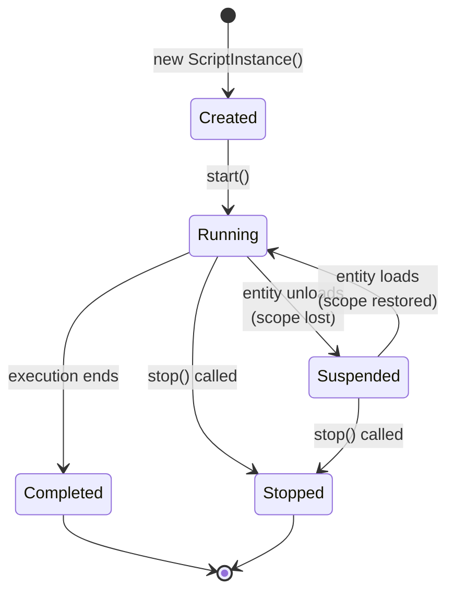
```mermaid
stateDiagram-v2
    [*] --> Created: new ScriptInstance()
    Created --> Running: start()
    Running --> Suspended: entity unloads<br/>(scope lost)
    Suspended --> Running: entity loads<br/>(scope restored)
    Running --> Completed: execution ends
    Running --> Stopped: stop() called
    Suspended --> Stopped: stop() called
    Completed --> [*]
    Stopped --> [*]
```

### Key State Tracking Fields

| Field | Type | Purpose |
|-------|------|---------|
| `isDefinitionRegistered` | Boolean | Whether the coroutine definition is registered in EntityScope |
| `isStopped` | Boolean | Whether stop() has been called |
| `isCleanedUp` | Boolean | Whether cleanup has completed |
| `traceStarted` | Boolean | Whether dev logging trace is active |
| `activeStack` | BlockFrameStackElement? | Currently executing block stack (null when suspended) |
| `initialStackSnapshot` | CompoundTag? | Saved stack state for resumption |

Sources: [src/main/java/ru/hollowhorizon/hollowengine/common/codeblocks/runtime/ScriptInstance.kt:40-47]()

### Suspension and Resumption Logic

When an entity unloads (chunk unload, dimension change), the associated `EntityScope` becomes unavailable. The script execution detects this and suspends gracefully.

**Suspension Detection**

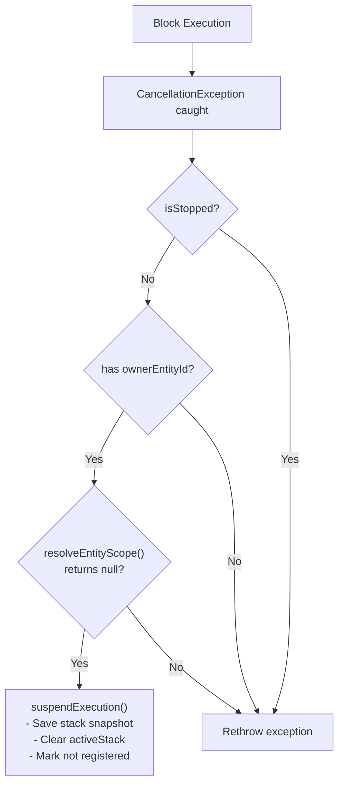
```mermaid
graph TB
    Execute["Block Execution"]
    Cancelled["CancellationException caught"]
    CheckStopped{"isStopped?"}
    CheckOwner{"has ownerEntityId?"}
    CheckScope{"resolveEntityScope()<br/>returns null?"}
    SuspendExecution["suspendExecution()<br/>- Save stack snapshot<br/>- Clear activeStack<br/>- Mark not registered"]
    Rethrow["Rethrow exception"]
    
    Execute --> Cancelled
    Cancelled --> CheckStopped
    CheckStopped -->|No| CheckOwner
    CheckStopped -->|Yes| Rethrow
    CheckOwner -->|Yes| CheckScope
    CheckOwner -->|No| Rethrow
    CheckScope -->|Yes| SuspendExecution
    CheckScope -->|No| Rethrow
```

The critical code is in the coroutine exception handler:

```kotlin
catch (cancelled: CancellationException) {
    if (!isStopped && ownerEntityId != null && ownerFile.resolveEntityScope(ownerEntityId) == null) {
        suspendedByScopeLoss = true
        suspendExecution()
    }
    throw cancelled
}
```

Sources: [src/main/java/ru/hollowhorizon/hollowengine/common/codeblocks/runtime/ScriptInstance.kt:127-132](), [src/main/java/ru/hollowhorizon/hollowengine/common/codeblocks/runtime/ScriptInstance.kt:169-177]()

### OwnerScopeRestoredEvent

When an entity is loaded from NBT, after deserialization completes, `OwnerScopeRestoredEvent` is posted to the event bus. Script files listen for this event to resume suspended instances.

**Restoration Flow**

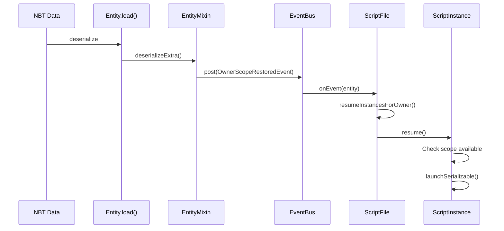
```mermaid
sequenceDiagram
    participant NBT as NBT Data
    participant Entity as Entity.load()
    participant Mixin as EntityMixin
    participant Bus as EventBus
    participant Script as ScriptFile
    participant Instance as ScriptInstance
    
    NBT->>Entity: deserialize
    Entity->>Mixin: deserializeExtra()
    Mixin->>Bus: post(OwnerScopeRestoredEvent)
    Bus->>Script: onEvent(entity)
    Script->>Script: resumeInstancesForOwner()
    Script->>Instance: resume()
    Instance->>Instance: Check scope available
    Instance->>Instance: launchSerializable()
```

The event handler in `ScriptFile`:

```kotlin
private fun registerOwnerScopeListener() {
    val listener = object : EventListener<OwnerScopeRestoredEvent> {
        override fun onEvent(event: OwnerScopeRestoredEvent) {
            if (!isEnabled) return
            resumeInstancesForOwner(event.entity.uuid)
        }
    }
    EventBus.registerNoInline(OwnerScopeRestoredEvent::class.java, listener)
}
```

Sources: [src/main/java/ru/hollowhorizon/hollowengine/common/codeblocks/runtime/ScriptFile.kt:171-181](), [src/main/java/ru/hollowhorizon/hollowengine/mixins/components/EntityMixin.java:64-69](), [src/main/java/ru/hollowhorizon/hollowengine/common/codeblocks/runtime/OwnerScopeRestoredEvent.kt:1-9]()

### Offline Launch Queue

When a script is triggered for an entity that is currently unloaded, the launch request is queued in `offlineLaunches`. When the entity loads, these queued launches are processed.

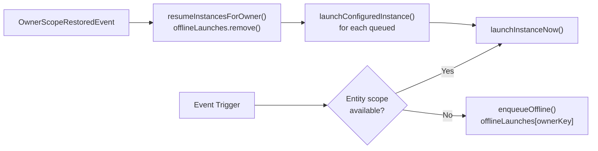
```mermaid
graph LR
    Trigger["Event Trigger"]
    CheckScope{"Entity scope<br/>available?"}
    LaunchNow["launchInstanceNow()"]
    EnqueueOffline["enqueueOffline()<br/>offlineLaunches[ownerKey]"]
    ScopeRestored["OwnerScopeRestoredEvent"]
    DequeueOffline["resumeInstancesForOwner()<br/>offlineLaunches.remove()"]
    ProcessQueue["launchConfiguredInstance()<br/>for each queued"]
    
    Trigger --> CheckScope
    CheckScope -->|Yes| LaunchNow
    CheckScope -->|No| EnqueueOffline
    ScopeRestored --> DequeueOffline
    DequeueOffline --> ProcessQueue
    ProcessQueue --> LaunchNow
```

Sources: [src/main/java/ru/hollowhorizon/hollowengine/common/codeblocks/runtime/ScriptFile.kt:257-265](), [src/main/java/ru/hollowhorizon/hollowengine/common/codeblocks/runtime/ScriptFile.kt:338-345]()

---

## Mixin System Integration

HollowEngine uses Fabric/Architectury mixins to inject functionality into Minecraft's base classes at runtime. The primary mixin is `EntityMixin`, which adds `EntityScope` and Geary ECS entity tracking to every entity.

### EntityMixin Injection Points

**Mixin Target Class Diagram**

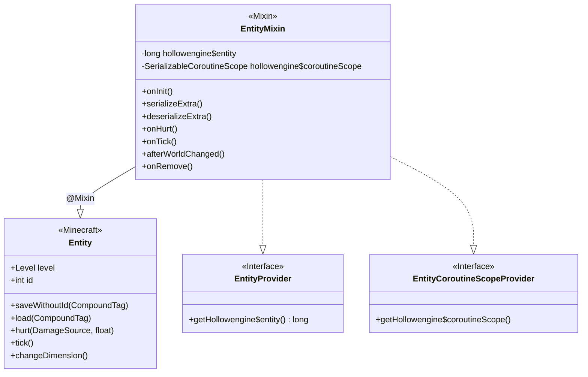
```mermaid
classDiagram
    class Entity {
        <<Minecraft>>
        +Level level
        +int id
        +saveWithoutId(CompoundTag)
        +load(CompoundTag)
        +hurt(DamageSource, float)
        +tick()
        +changeDimension()
    }
    
    class EntityMixin {
        <<Mixin>>
        -long hollowengine$entity
        -SerializableCoroutineScope hollowengine$coroutineScope
        +onInit()
        +serializeExtra()
        +deserializeExtra()
        +onHurt()
        +onTick()
        +afterWorldChanged()
        +onRemove()
    }
    
    class EntityProvider {
        <<Interface>>
        +getHollowengine$entity() long
    }
    
    class EntityCoroutineScopeProvider {
        <<Interface>>
        +getHollowengine$coroutineScope()
    }
    
    EntityMixin --|> Entity : @Mixin
    EntityMixin ..|> EntityProvider
    EntityMixin ..|> EntityCoroutineScopeProvider
```

### Injected Fields

The mixin adds two fields to every `Entity` instance:

| Field | Type | Purpose |
|-------|------|---------|
| `hollowengine$entity` | `long` | Geary ECS entity ID for component storage |
| `hollowengine$coroutineScope` | `SerializableCoroutineScope` | EntityScope instance for script execution |

These fields are initialized in the constructor injection:

```java
@Inject(method = "<init>", at = @At("RETURN"))
private void onInit(EntityType<?> entityType, Level level, CallbackInfo ci) {
    hollowengine$entity = GearyHelper.create(level(), (Entity) (Object) this);
    hollowengine$coroutineScope = new EntityScope((Entity) (Object) this);
}
```

Sources: [src/main/java/ru/hollowhorizon/hollowengine/mixins/components/EntityMixin.java:36-52]()

### Serialization Hook Injection

The mixin injects serialization hooks into `Entity.saveWithoutId()` and `Entity.load()` to persist both the Geary entity components and the EntityScope state.

**Serialization Injection Points**

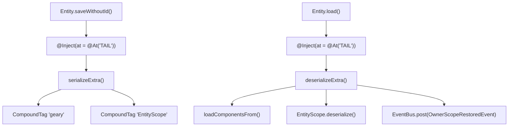
```mermaid
graph TB
    SaveWithoutId["Entity.saveWithoutId()"]
    AtTail["@Inject(at = @At('TAIL'))"]
    SerializeExtra["serializeExtra()"]
    GearyTag["CompoundTag 'geary'"]
    ScopeTag["CompoundTag 'EntityScope'"]
    
    SaveWithoutId --> AtTail
    AtTail --> SerializeExtra
    SerializeExtra --> GearyTag
    SerializeExtra --> ScopeTag
    
    Load["Entity.load()"]
    AtTailLoad["@Inject(at = @At('TAIL'))"]
    DeserializeExtra["deserializeExtra()"]
    RestoreGeary["loadComponentsFrom()"]
    RestoreScope["EntityScope.deserialize()"]
    PostEvent["EventBus.post(OwnerScopeRestoredEvent)"]
    
    Load --> AtTailLoad
    AtTailLoad --> DeserializeExtra
    DeserializeExtra --> RestoreGeary
    DeserializeExtra --> RestoreScope
    DeserializeExtra --> PostEvent
```

Sources: [src/main/java/ru/hollowhorizon/hollowengine/mixins/components/EntityMixin.java:54-69]()

### Entity Event Injection

The mixin also injects event hooks for entity events:

- `Entity.hurt()` - Posts `EntityEvent.Hurt` (cancellable)
- `Entity.changeDimension()` - Posts `EntityEvent.ChangeDimension` after transfer
- `Entity.setRemoved()` - Cleans up Geary entity and cancels EntityScope coroutines

**Event Injection Example**

```java
@Inject(method = "hurt", at = @At("HEAD"), cancellable = true)
public void onHurt(DamageSource damageSource, float amount, CallbackInfoReturnable<Boolean> cir) {
    var event = new EntityEvent.Hurt((Entity) (Object) this, damageSource, amount);
    EventBus.post(event);
    if (event.isCanceled()) cir.setReturnValue(false);
}
```

Sources: [src/main/java/ru/hollowhorizon/hollowengine/mixins/components/EntityMixin.java:71-76](), [src/main/java/ru/hollowhorizon/hollowengine/mixins/components/EntityMixin.java:83-106](), [src/main/java/ru/hollowhorizon/hollowengine/mixins/components/EntityMixin.java:108-114]()

### SingleThreadDispatcher Integration

Each `EntityScope` is created with a dispatcher that ensures all coroutines execute on the correct thread. The server uses `MinecraftServer.dispatcher`, while clients use `Minecraft.dispatcher`.

```kotlin
constructor(entity: Entity) : this(
    SupervisorJob() + 
    (entity.server?.dispatcher ?: Minecraft.getInstance().dispatcher)
)
```

The `SingleThreadDispatcher` class extends `CoroutineDispatcher` and `Delay` to provide tick-based scheduling that integrates with Minecraft's tick loop.

Sources: [src/main/java/ru/hollowhorizon/hollowengine/common/coroutines/EntityScope.kt:32](), [src/main/java/ru/hollowhorizon/hollowengine/common/coroutines/SingleThreadDispatcher.kt:17-134]()

---

## NBT Persistence Architecture

HollowEngine implements a comprehensive NBT serialization system that persists script execution state, coroutine stacks, and entity scope data across server restarts.

### Persistence Layer Hierarchy

**NBT Serialization Hierarchy**

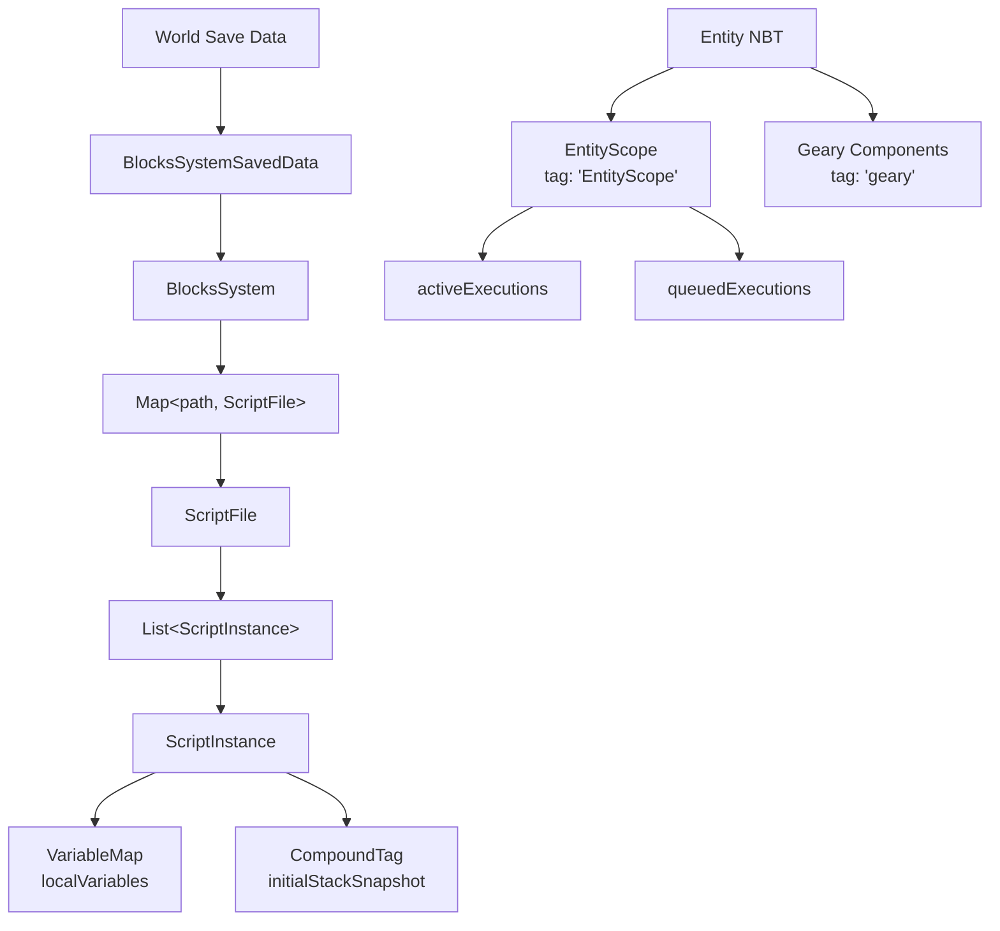
```mermaid
graph TB
    WorldSave["World Save Data"]
    BlocksSystemSavedData["BlocksSystemSavedData"]
    BlocksSystem["BlocksSystem"]
    ScriptFiles["Map&lt;path, ScriptFile&gt;"]
    ScriptFile["ScriptFile"]
    ScriptInstances["List&lt;ScriptInstance&gt;"]
    ScriptInstance["ScriptInstance"]
    LocalVars["VariableMap<br/>localVariables"]
    StackSnapshot["CompoundTag<br/>initialStackSnapshot"]
    
    EntityNBT["Entity NBT"]
    EntityScope["EntityScope<br/>tag: 'EntityScope'"]
    ActiveExecs["activeExecutions"]
    QueuedExecs["queuedExecutions"]
    
    GearyTag["Geary Components<br/>tag: 'geary'"]
    
    WorldSave --> BlocksSystemSavedData
    BlocksSystemSavedData --> BlocksSystem
    BlocksSystem --> ScriptFiles
    ScriptFiles --> ScriptFile
    ScriptFile --> ScriptInstances
    ScriptInstances --> ScriptInstance
    ScriptInstance --> LocalVars
    ScriptInstance --> StackSnapshot
    
    EntityNBT --> EntityScope
    EntityScope --> ActiveExecs
    EntityScope --> QueuedExecs
    EntityNBT --> GearyTag
```

### BlocksSystemSavedData Structure

`BlocksSystemSavedData` is a `SavedData` implementation that wraps `BlocksSystem` and persists to the overworld dimension's data storage.

**Serialization Structure**

```yaml
hollowengine_blocks_system:
  scripts:
    "hollowengine/scripts/example.bc":
      enabled: true/false
      instances:
        - instanceId: UUID
          ownerEntityId: UUID (optional)
          rootBlockId: UUID
          locals:
            "variableName": {...}
          stack:
            frames:
              - uuid: UUID (current block)
                ... (block frame data)
```

Sources: [src/main/java/ru/hollowhorizon/hollowengine/common/codeblocks/runtime/BlocksSystemSavedData.kt:10-54](), [src/main/java/ru/hollowhorizon/hollowengine/common/codeblocks/runtime/BlocksSystem.kt:29-44]()

### ScriptInstance Serialization

Each `ScriptInstance` serializes:

1. **Instance metadata**: `instanceId`, `ownerEntityId`, `rootBlockId`
2. **Local variables**: Full `VariableMap` with all script-local variables
3. **Stack snapshot**: Complete `BlockFrameStackElement` state if execution is suspended

**ScriptInstance Save/Load Flow**

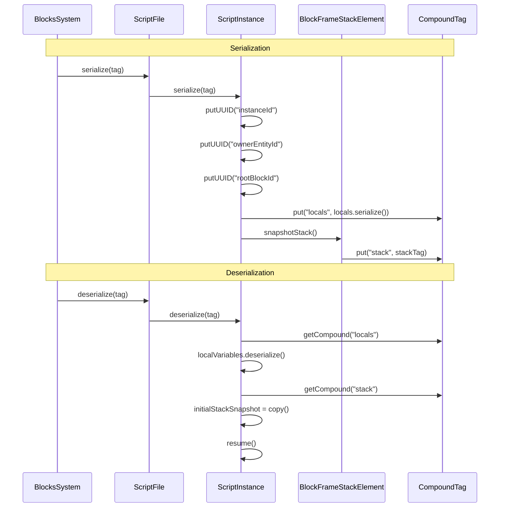
```mermaid
sequenceDiagram
    participant System as BlocksSystem
    participant File as ScriptFile
    participant Inst as ScriptInstance
    participant Stack as BlockFrameStackElement
    participant NBT as CompoundTag
    
    Note over System,NBT: Serialization
    System->>File: serialize(tag)
    File->>Inst: serialize(tag)
    Inst->>Inst: putUUID("instanceId")
    Inst->>Inst: putUUID("ownerEntityId")
    Inst->>Inst: putUUID("rootBlockId")
    Inst->>NBT: put("locals", locals.serialize())
    Inst->>Stack: snapshotStack()
    Stack->>NBT: put("stack", stackTag)
    
    Note over System,NBT: Deserialization
    System->>File: deserialize(tag)
    File->>Inst: deserialize(tag)
    Inst->>NBT: getCompound("locals")
    Inst->>Inst: localVariables.deserialize()
    Inst->>NBT: getCompound("stack")
    Inst->>Inst: initialStackSnapshot = copy()
    Inst->>Inst: resume()
```

Sources: [src/main/java/ru/hollowhorizon/hollowengine/common/codeblocks/runtime/ScriptInstance.kt:188-200](), [src/main/java/ru/hollowhorizon/hollowengine/common/codeblocks/runtime/ScriptFile.kt:83-127]()

### BlockFrameStackElement Serialization

The `BlockFrameStackElement` maintains a stack of `BlockFrame` instances that track execution state for nested block scopes (loops, if statements, etc.).

**Frame Stack Structure**

```yaml
stack:
  frames:
    - uuid: <current block UUID>
      times: 5 (for RepeatBlock)
      index: 2 (current iteration)
      wait_run_id: 1 (for custom blocks)
      ... (other block-specific state)
    - uuid: <parent block UUID>
      ...
```

Each frame is a `BlockFrame` wrapping a `CompoundTag` that blocks can use to store and restore state via `remember()` and `forget()`.

Sources: [src/main/java/ru/hollowhorizon/hollowengine/common/codeblocks/execution/BlockFrameStackElement.kt:44-54]()

### EntityScope Serialization

The `EntityScope` serializes all active and queued serializable coroutine executions.

**EntityScope NBT Structure**

```yaml
EntityScope:
  executions:
    - key:
        parts:
          - type: "Context"
            value: "ScriptInstanceKey"
          - type: "With"
            key: "ScriptPathKey"
            value: "scripts/example.bc"
          ...
      state: "RUNNING" or "QUEUED"
      context:
        frames:
          - ... (BlockFrameStackElement)
```

The critical insight is that each execution stores:
1. Its unique `SerializableCoroutineKey`
2. Its state (`RUNNING` or `QUEUED`)
3. The serialized `SerializableCoroutineContextElement` (typically `BlockFrameStackElement`)

When deserialized, these are stored in `pendingRestore` until their corresponding definitions are registered, at which point they resume automatically.

Sources: [src/main/java/ru/hollowhorizon/hollowengine/common/coroutines/EntityScope.kt:40-77](), [src/main/java/ru/hollowhorizon/hollowengine/common/coroutines/EntityScope.kt:226-255]()

---

## Event-Driven Execution

HollowEngine supports event-driven script execution through the `EventDrivenStartBlock` interface. When game events occur, matching start blocks automatically spawn new script instances with event context.

### EventDrivenStartBlock Interface

The interface requires implementation of:

```kotlin
interface EventDrivenStartBlock<E : Event> {
    val eventType: Class<E>
    fun shouldHandle(event: E): Boolean = true
    fun resolveScopeEntity(event: E): Entity?
}
```

**Event-Driven Execution Flow**

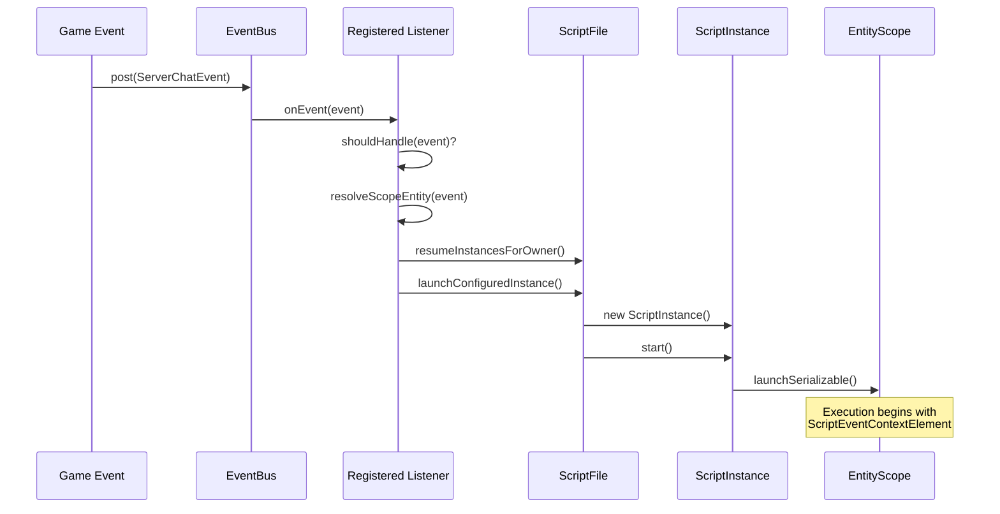
```mermaid
sequenceDiagram
    participant Game as Game Event
    participant Bus as EventBus
    participant Listener as Registered Listener
    participant File as ScriptFile
    participant Instance as ScriptInstance
    participant Scope as EntityScope
    
    Game->>Bus: post(ServerChatEvent)
    Bus->>Listener: onEvent(event)
    Listener->>Listener: shouldHandle(event)?
    Listener->>Listener: resolveScopeEntity(event)
    Listener->>File: resumeInstancesForOwner()
    Listener->>File: launchConfiguredInstance()
    File->>Instance: new ScriptInstance()
    File->>Instance: start()
    Instance->>Scope: launchSerializable()
    Note over Scope: Execution begins with<br/>ScriptEventContextElement
```

Sources: [src/main/java/ru/hollowhorizon/hollowengine/common/codeblocks/runtime/ScriptFile.kt:150-169]()

### OnPlayerChatBlock Example

The `OnPlayerChatBlock` is a concrete implementation of `EventDrivenStartBlock` that triggers when players send chat messages.

**Block Implementation Structure**

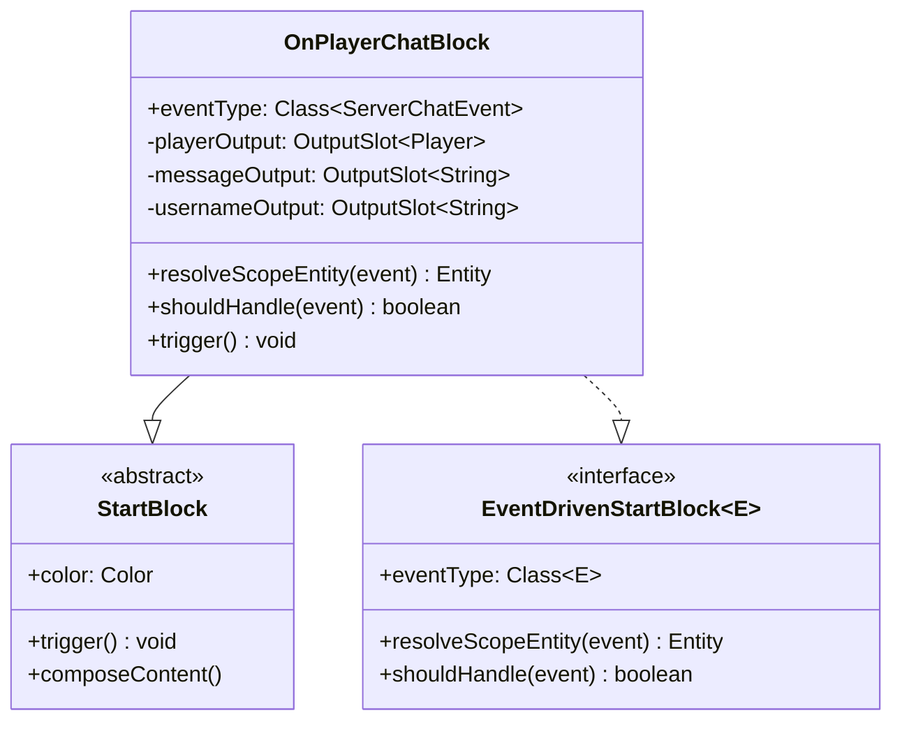
```mermaid
classDiagram
    class OnPlayerChatBlock {
        +eventType: Class~ServerChatEvent~
        +resolveScopeEntity(event) Entity
        +shouldHandle(event) boolean
        -playerOutput: OutputSlot~Player~
        -messageOutput: OutputSlot~String~
        -usernameOutput: OutputSlot~String~
        +trigger() void
    }
    
    class StartBlock {
        <<abstract>>
        +trigger() void
        +composeContent()
        +color: Color
    }
    
    class EventDrivenStartBlock~E~ {
        <<interface>>
        +eventType: Class~E~
        +resolveScopeEntity(event) Entity
        +shouldHandle(event) boolean
    }
    
    OnPlayerChatBlock --|> StartBlock
    OnPlayerChatBlock ..|> EventDrivenStartBlock
```

Key implementation details:

1. **Event Type**: `eventType` returns `ServerChatEvent::class.java`
2. **Scope Resolution**: `resolveScopeEntity()` returns `event.player` to bind execution to player's EntityScope
3. **Event Access**: `trigger()` calls `currentScriptEvent<ServerChatEvent>()` to retrieve event from context
4. **Output Emission**: Event data is emitted through output slots for downstream blocks to consume

Sources: [src/main/java/ru/hollowhorizon/hollowengine/common/codeblocks/blocks/players/OnPlayerChatBlock.kt:19-85]()

### Event Context Propagation

When an event triggers a script, the event is stored in a `ScriptEventContextElement` added to the coroutine context:

```kotlin
val listener = object : EventListener<E> {
    override fun onEvent(event: E) {
        launchConfiguredInstance(
            rootBlock = trigger as StartBlock,
            ownerKey = entity.uuid.toOwnerKey(),
            triggerContext = ScriptEventContextElement(event)
        )
    }
}
```

Within the script execution, blocks can retrieve the event:

```kotlin
suspend inline fun <reified E : Event> currentScriptEvent(): E? {
    return currentCoroutineContext()[ScriptEventContextElement.Key]?.event as? E
}
```

Sources: [src/main/java/ru/hollowhorizon/hollowengine/common/codeblocks/runtime/ScriptFile.kt:151-169]()

### Listener Registration and Lifecycle

Event listeners are registered when a script is enabled and unregistered when disabled.

**Listener Lifecycle**

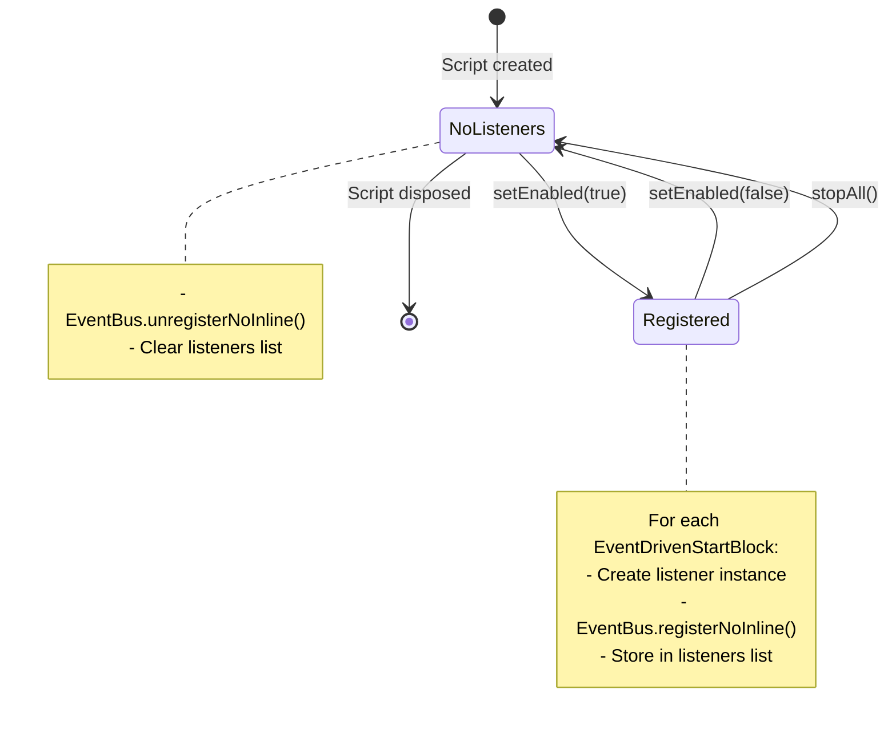
```mermaid
stateDiagram-v2
    [*] --> NoListeners: Script created
    NoListeners --> Registered: setEnabled(true)
    Registered --> NoListeners: setEnabled(false)
    Registered --> NoListeners: stopAll()
    NoListeners --> [*]: Script disposed
    
    note right of Registered
        For each EventDrivenStartBlock:
        - Create listener instance
        - EventBus.registerNoInline()
        - Store in listeners list
    end note
    
    note right of NoListeners
        - EventBus.unregisterNoInline()
        - Clear listeners list
    end note
```

The `ScriptFile` maintains a list of `ListenerBinding` instances that track registered listeners so they can be properly cleaned up:

```kotlin
private data class ListenerBinding(
    val eventType: Class<Event>,
    val listener: EventListener<Event>
)
```

Sources: [src/main/java/ru/hollowhorizon/hollowengine/common/codeblocks/runtime/ScriptFile.kt:60-71](), [src/main/java/ru/hollowhorizon/hollowengine/common/codeblocks/runtime/ScriptFile.kt:297-302]()

---

## Custom Block Development

Custom blocks extend the visual scripting system with new functionality. Blocks are categorized as either `StatementBlock` (imperative actions) or `ExpressionBlock` (values).

### Block Class Hierarchy

**Block Type Hierarchy**

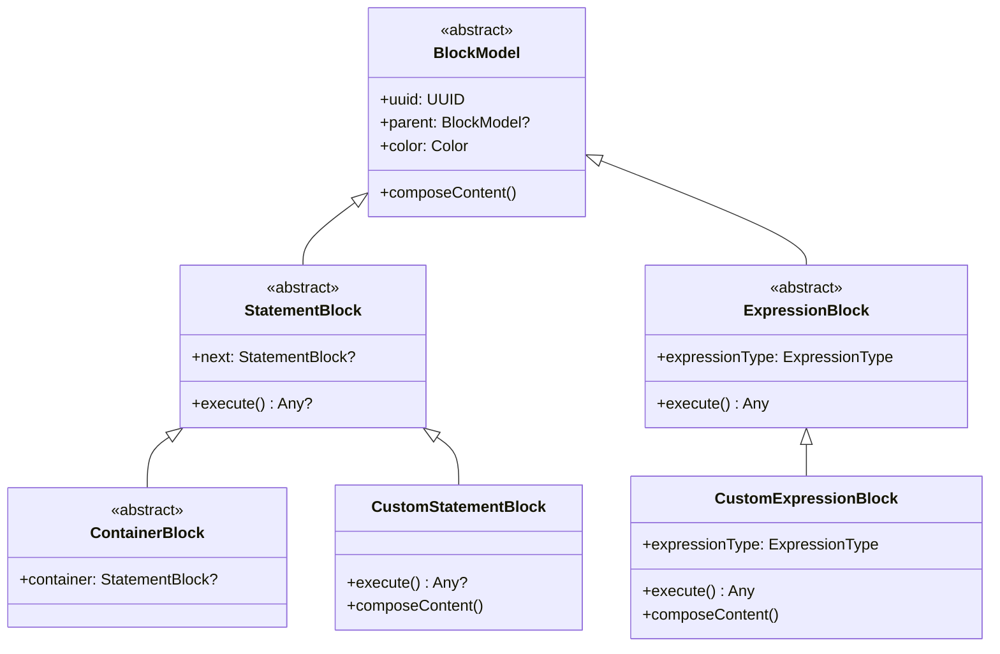
```mermaid
classDiagram
    class BlockModel {
        <<abstract>>
        +uuid: UUID
        +parent: BlockModel?
        +color: Color
        +composeContent()
    }
    
    class StatementBlock {
        <<abstract>>
        +next: StatementBlock?
        +execute() Any?
    }
    
    class ExpressionBlock {
        <<abstract>>
        +expressionType: ExpressionType
        +execute() Any
    }
    
    class ContainerBlock {
        <<abstract>>
        +container: StatementBlock?
    }
    
    BlockModel <|-- StatementBlock
    BlockModel <|-- ExpressionBlock
    StatementBlock <|-- ContainerBlock
    
    class CustomStatementBlock {
        +execute() Any?
        +composeContent()
    }
    
    class CustomExpressionBlock {
        +expressionType: ExpressionType
        +execute() Any
        +composeContent()
    }
    
    StatementBlock <|-- CustomStatementBlock
    ExpressionBlock <|-- CustomExpressionBlock
```

### Creating a StatementBlock

A minimal `StatementBlock` implementation requires:

1. Override `execute()` - Implement the block's behavior
2. Override `composeContent()` - Define the visual appearance
3. Override `color` - Specify the block's color category
4. Add `@Serializable` and `@SerialName` annotations

**Example: Simple Logging Block**

```kotlin
@Serializable
@SerialName("custom:log_message")
class LogMessageBlock : StatementBlock() {
    private val message by input<String>(name = "message")
    
    override val color: Color get() = CodeBlocksColors.CONTROL
    
    override suspend fun execute() {
        val msg = message.evaluate()
        LOGGER.info("Script log: $msg")
    }
    
    override fun InputSlotScope.composeContent() {
        Row {
            Text("Log:") { modifier.textColor(Color.WHITE) }
            InputSlot(message)
        }
    }
}
```

### Creating an ExpressionBlock

`ExpressionBlock` implementations must additionally:

1. Override `expressionType` - Specify the return type
2. Return a value from `execute()` matching the expression type

**Example: Random Number Block**

```kotlin
@Serializable
@SerialName("custom:random_number")
class RandomNumberBlock : ExpressionBlock() {
    private val min by input<Number>(name = "min", default = { NumberBlock(0.0) })
    private val max by input<Number>(name = "max", default = { NumberBlock(1.0) })
    
    override val color: Color get() = CodeBlocksColors.MATH
    override val expressionType = typeOf<Number>()
    
    override suspend fun execute(): Any {
        val minVal = min.evaluate().toDouble()
        val maxVal = max.evaluate().toDouble()
        return Math.random() * (maxVal - minVal) + minVal
    }
    
    override fun InputSlotScope.composeContent() {
        Row {
            Text("random") { modifier.textColor(Color.WHITE) }
            InputSlot(min)
            Text("to") { modifier.textColor(Color.WHITE) }
            InputSlot(max)
        }
    }
}
```

### Input and Output Slots

Blocks use delegated properties to define input and output connections:

**Input Slot Types**

| Delegate | Purpose | Example |
|----------|---------|---------|
| `by input<T>()` | Required input | `by input<Number>("value")` |
| `by inputOrNull<T>()` | Optional input | `by inputOrNull<String>("message")` |
| `by inputDefault<T>()` | Input with default | `by inputDefault("count") { NumberBlock(1.0) }` |

**Output Slot Types**

| Delegate | Purpose | Example |
|----------|---------|---------|
| `by output<T>()` | Basic output | `by output<String>("result")` |
| `by outputDefault<T>()` | Output with default block | `by outputDefault("player") { EventOutputVariableBlock("player") }` |

The delegates handle serialization automatically and provide accessor methods:

```kotlin
// Input evaluation
val value = inputSlot.evaluate()

// Output emission
outputSlot.emit(value)
```

Sources: Test examples show patterns at [src/test/kotlin/CodeBlockExecutionCoreTests.kt:99-134]()

### ContainerBlock Pattern

Blocks that contain other statement chains (loops, conditionals) extend `ContainerBlock`:

```kotlin
@Serializable
@SerialName("custom:retry_block")
class RetryBlock : ContainerBlock() {
    private val times by input<Number>("times")
    override val color: Color get() = CodeBlocksColors.CONTROL
    
    override suspend fun execute() {
        val count = times.evaluate().toInt()
        repeat(count) {
            try {
                container?.let { executeInner(it) }
                return // Success
            } catch (e: Exception) {
                if (it == count - 1) throw e
            }
        }
    }
    
    override fun InputSlotScope.composeContent() {
        Column {
            Row {
                Text("retry") { modifier.textColor(Color.WHITE) }
                InputSlot(times)
                Text("times") { modifier.textColor(Color.WHITE) }
            }
            ContainerSlot()
        }
    }
}
```

The `container` field holds the nested statement chain, and `executeInner()` executes it.

### Block Registration

Custom blocks are registered with the `BlockRepository` system via `BlockProvider` and `BlockModule` classes. Registration typically happens in a module's initialization.

**Registration Flow**

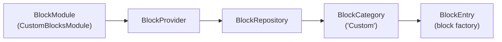
```mermaid
graph LR
    Module["BlockModule<br/>(CustomBlocksModule)"]
    Provider["BlockProvider"]
    Repository["BlockRepository"]
    Category["BlockCategory<br/>('Custom')"]
    Entry["BlockEntry<br/>(block factory)"]
    
    Module --> Provider
    Provider --> Repository
    Repository --> Category
    Category --> Entry
```

Example registration:

```kotlin
object CustomBlocksModule : BlockModule {
    override fun provide(): BlockProvider = BlockProvider(
        category = BlockCategory("Custom", CodeBlocksColors.CUSTOM),
        blocks = listOf(
            BlockEntry.of<LogMessageBlock>("Log Message"),
            BlockEntry.of<RandomNumberBlock>("Random Number"),
            BlockEntry.of<RetryBlock>("Retry")
        )
    )
}

// In BlocksSystem initialization
val format = CodeBlockFormat(BlockRepository.create("Scripts") {
    include(StandardModules.AllBasics)
    include(CustomBlocksModule)
})
```

Sources: [src/main/java/ru/hollowhorizon/hollowengine/common/codeblocks/runtime/BlocksSystem.kt:21-27]()

---

## Development and Debugging Tools

HollowEngine provides extensive development tools for debugging script execution, tracing performance, and inspecting runtime state.

### DevLogger Tracing System

The `DevLogger` class provides automatic execution tracing that logs each block executed, including timing and variable state.

**Tracing Architecture**

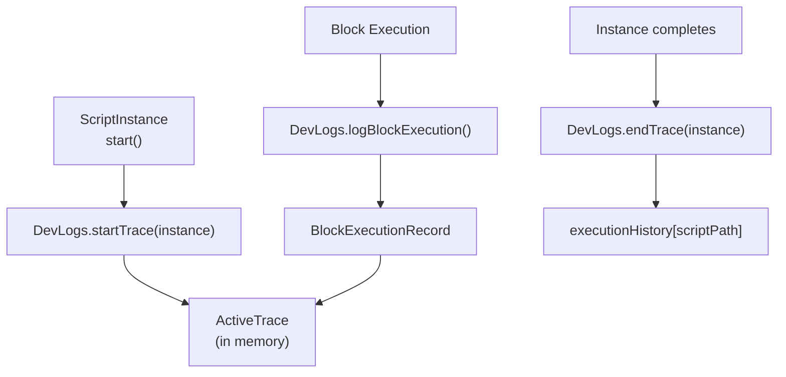
```mermaid
graph TB
    Instance["ScriptInstance<br/>start()"]
    StartTrace["DevLogs.startTrace(instance)"]
    ActiveTrace["ActiveTrace<br/>(in memory)"]
    
    Execute["Block Execution"]
    LogBlock["DevLogs.logBlockExecution()"]
    Record["BlockExecutionRecord"]
    
    Complete["Instance completes"]
    EndTrace["DevLogs.endTrace(instance)"]
    History["executionHistory[scriptPath]"]
    
    Instance --> StartTrace
    StartTrace --> ActiveTrace
    Execute --> LogBlock
    LogBlock --> Record
    Record --> ActiveTrace
    Complete --> EndTrace
    EndTrace --> History
```

Each `BlockExecutionRecord` captures:

| Field | Type | Purpose |
|-------|------|---------|
| `block` | BlockModel | The block that executed |
| `scriptPath` | String | Path to the script file |
| `startTime` | Long | Nanosecond timestamp when execution started |
| `endTime` | Long | Nanosecond timestamp when execution ended |
| `stackDepth` | Int | Nesting level (for indentation) |
| `variables` | Map | Snapshot of local variables |
| `executionTimeMs` | Double | Computed execution time in milliseconds |
| `isSlow` | Boolean | Whether execution exceeded threshold |

Sources: [src/main/java/ru/hollowhorizon/hollowengine/common/dev/DevLogger.kt:21-32](), [src/main/java/ru/hollowhorizon/hollowengine/common/dev/DevLogger.kt:40-91]()

### DevLogger Configuration

The tracing system is configurable via `DevLoggerConfig`:

```kotlin
object DevLoggerConfig {
    var ENABLED = true
    var SHOW_STACK_DEPTH = true
    var SHOW_VARIABLES = true
    var SHOW_TIMING = true
    var COLORIZE_OUTPUT = true
    var MAX_VARIABLE_COUNT = 5
    var MIN_EXECUTION_TIME_MS = 1L
}
```

Example log output (with colors):

```
▶ START TRACE │ hollowengine/scripts/example.bc
  ├─ IfBlock
    ├─ PrintBlock [2.341ms] │ message="Hello"
  ├─ DelayBlock [1000.123ms]
  ├─ RepeatBlock
    ├─ MathBlock │ a=5, b=3, result=8
▼ END TRACE │ hollowengine/scripts/example.bc │ 5 blocks, 2 slow [1003.567ms]
```

Sources: [src/main/java/ru/hollowhorizon/hollowengine/common/dev/DevLogger.kt:11-19](), [src/main/java/ru/hollowhorizon/hollowengine/common/dev/DevLogger.kt:106-175]()

### Command System Integration

The command system provides administrative tools for inspecting and controlling script execution.

**Command Structure**

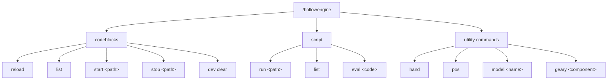
```mermaid
graph TB
    Root["/hollowengine"]
    
    CodeBlocks["codeblocks"]
    Reload["reload"]
    List["list"]
    Start["start &lt;path&gt;"]
    Stop["stop &lt;path&gt;"]
    DevClear["dev clear"]
    
    Script["script"]
    Run["run &lt;path&gt;"]
    ScriptList["list"]
    Eval["eval &lt;code&gt;"]
    
    Utility["utility commands"]
    Hand["hand"]
    Pos["pos"]
    Model["model &lt;name&gt;"]
    Geary["geary &lt;component&gt;"]
    
    Root --> CodeBlocks
    CodeBlocks --> Reload
    CodeBlocks --> List
    CodeBlocks --> Start
    CodeBlocks --> Stop
    CodeBlocks --> DevClear
    
    Root --> Script
    Script --> Run
    Script --> ScriptList
    Script --> Eval
    
    Root --> Utility
    Utility --> Hand
    Utility --> Pos
    Utility --> Model
    Utility --> Geary
```

**Key Commands**

| Command | Purpose | Permission |
|---------|---------|------------|
| `/hollowengine codeblocks reload` | Reload all .bc scripts from disk | Level 2 |
| `/hollowengine codeblocks list` | List all loaded scripts | Level 2 |
| `/hollowengine codeblocks start <path>` | Enable a specific script | Level 2 |
| `/hollowengine codeblocks stop <path>` | Disable a specific script | Level 2 |
| `/hollowengine codeblocks dev clear` | Clear dev log history | Level 2 |
| `/hollowengine script run <path>` | Compile and run .kts script | Level 2 |
| `/hollowengine script eval <code>` | Evaluate Kotlin expression | Level 2 |
| `/hollowengine hand` | Copy held item to clipboard | Any |
| `/hollowengine model <name>` | Show model info (animations, textures) | Any |

Sources: [src/main/java/ru/hollowhorizon/hollowengine/common/commands/HollowEngineCommands.kt:53-303]()

### Network Packets for Dev Tools

Several packets support development workflow:

**Development Packet Flow**

```mermaid
sequenceDiagram
    participant Client as Client
    participant Server as Server
    participant Clipboard as Clipboard
    
    Note over Client,Server: Copy Text to Clipboard
    Server->>Client: CopyTextPacket(text)
    Client->>Client: Display chat message
    Client->>Clipboard: Set clipboard text
    
    Note over Client,Server: Show Model Info
    Server->>Client: ShowModelInfoPacket(modelName)
    Client->>Client: Wait for model load
    Client->>Client: Display animations list
    Client->>Client: Display textures list
```

**CopyTextPacket**

Sends text to client clipboard and displays a clickable chat message:

```kotlin
@Serializable
class CopyTextPacket(val text: String) : HollowPacket {
    override fun handle(player: Player) {
        player.sendSystemMessage(
            "hollowengine.commands.copy".mcTranslate(text.literal)
                .onHoverText("hollowengine.tooltips.copy".mcTranslate)
                .onClickCopy(text)
        )
        mc.keyboardHandler.clipboard = text
    }
}
```

**ShowModelInfoPacket**

Loads a model asynchronously and displays its available animations and textures:

```kotlin
@Serializable
class ShowModelInfoPacket(val model: String) : HollowPacket {
    override fun handle(player: Player) {
        Minecraft.getInstance().coroutineScope.launch {
            val hollowModel = HollowModelManager.getOrCreate(location)
                .filter { it !== AnimatedModel.EMPTY }
                .first()
            
            // Display animations
            hollowModel.animations.keys.forEach { anim ->
                player.sendSystemMessage(("- ".literal + anim.literal)
                    .onClickCopy(anim))
            }
            
            // Display textures
            hollowModel.model.materials.forEach { material ->
                player.sendSystemMessage(("- ".literal + texture.literal)
                    .onClickCopy(texture))
            }
        }
    }
}
```

Sources: [src/main/java/ru/hollowhorizon/hollowengine/common/commands/HollowEngineCommands.kt:393-442]()

### Development History Access

Scripts can query execution history for analysis:

```kotlin
// Get all execution records for a script
val history = BlocksSystem.getDevHistory("scripts/example.bc")

// Get only slow executions (exceeded threshold)
val slow = BlocksSystem.getDevSlow("scripts/example.bc")

// Clear all history
BlocksSystem.clearDevHistory()
```

These functions delegate to the `DevLogger` singleton:

```kotlin
fun BlocksSystem.getDevHistory(scriptPath: String) = DevLogs.getHistory(scriptPath)
fun BlocksSystem.getDevSlow(scriptPath: String) = DevLogs.getSlow(scriptPath)
fun BlocksSystem.clearDevHistory() = DevLogs.clear()
```

The history can be used to generate performance reports, identify bottlenecks, or display execution traces in the IDE.

Sources: [src/main/java/ru/hollowhorizon/hollowengine/common/codeblocks/runtime/BlocksSystem.kt:116-118](), [src/main/java/ru/hollowhorizon/hollowengine/common/dev/DevLogger.kt:93-103]()