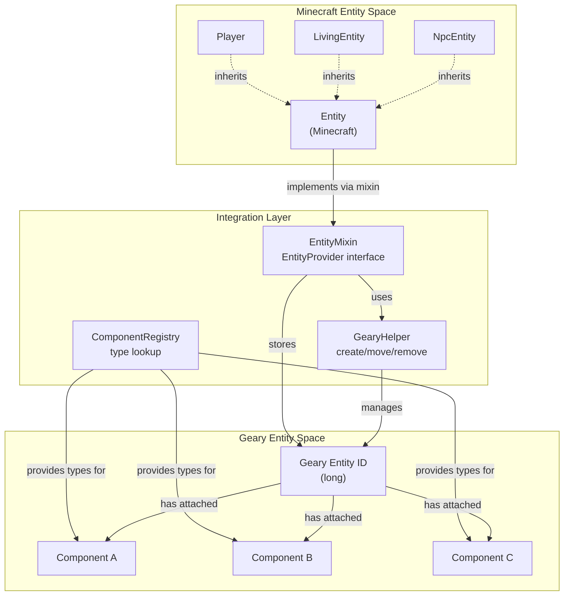
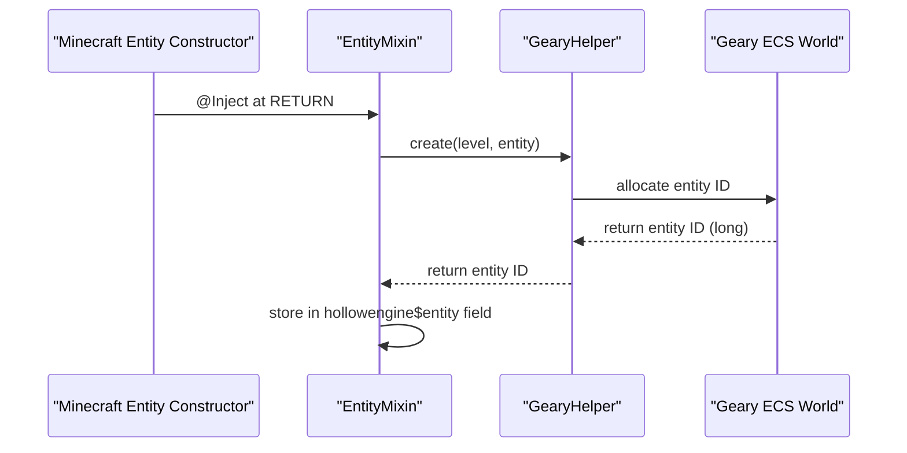
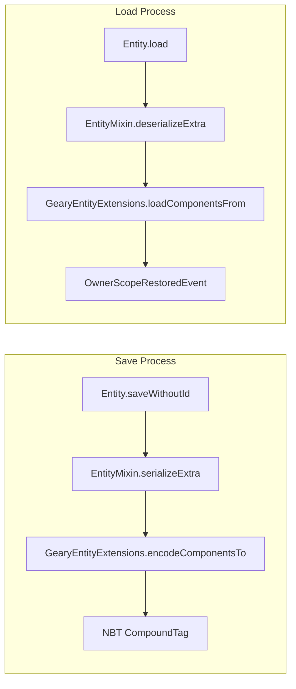
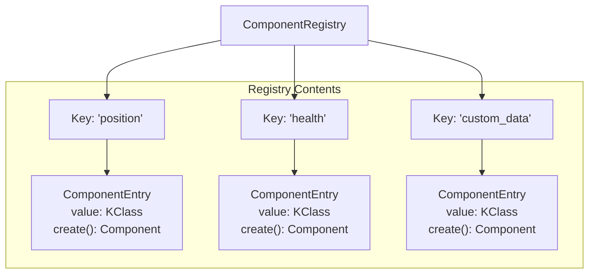
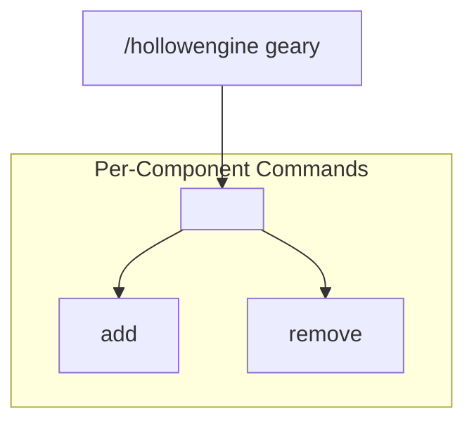
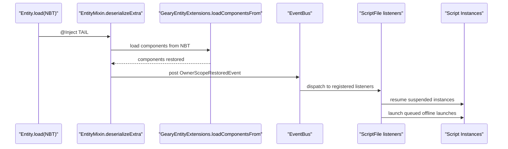
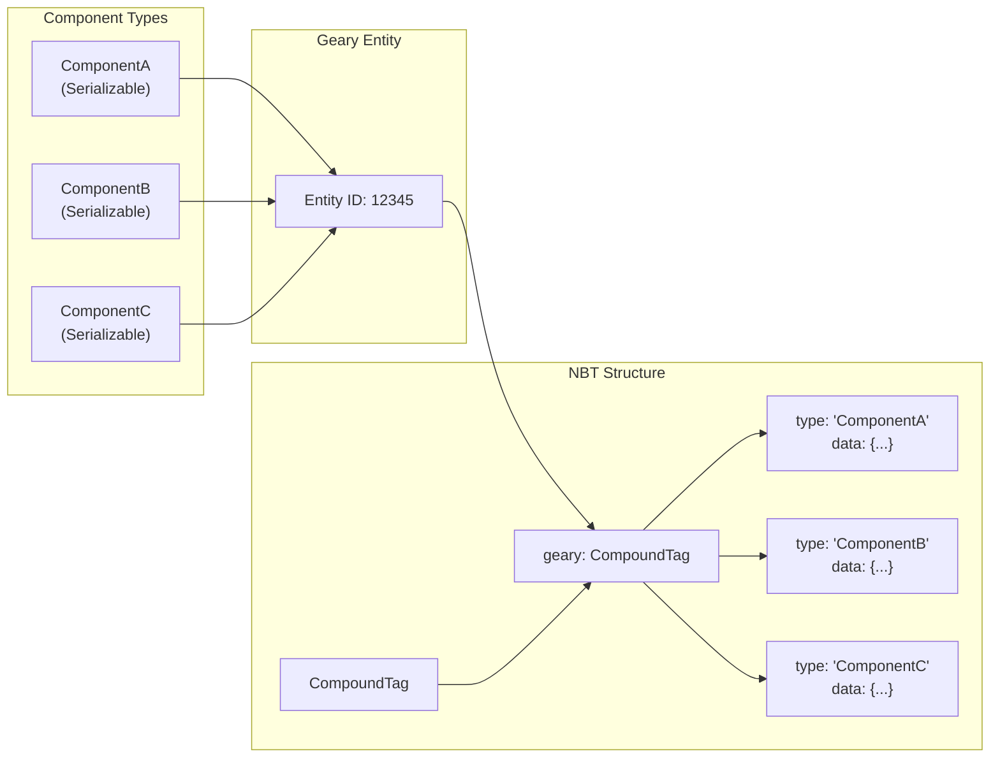

# Geary ECS Integration

<details>
<summary>Relevant source files</summary>

The following files were used as context for generating this wiki page:

- [src/main/java/ru/hollowhorizon/hollowengine/common/codeblocks/blocks/players/OnPlayerChatBlock.kt](src/main/java/ru/hollowhorizon/hollowengine/common/codeblocks/blocks/players/OnPlayerChatBlock.kt)
- [src/main/java/ru/hollowhorizon/hollowengine/common/codeblocks/execution/BlockFrameStackElement.kt](src/main/java/ru/hollowhorizon/hollowengine/common/codeblocks/execution/BlockFrameStackElement.kt)
- [src/main/java/ru/hollowhorizon/hollowengine/common/codeblocks/execution/CodeBlockInterpreter.kt](src/main/java/ru/hollowhorizon/hollowengine/common/codeblocks/execution/CodeBlockInterpreter.kt)
- [src/main/java/ru/hollowhorizon/hollowengine/common/codeblocks/runtime/BlocksSystem.kt](src/main/java/ru/hollowhorizon/hollowengine/common/codeblocks/runtime/BlocksSystem.kt)
- [src/main/java/ru/hollowhorizon/hollowengine/common/codeblocks/runtime/BlocksSystemSavedData.kt](src/main/java/ru/hollowhorizon/hollowengine/common/codeblocks/runtime/BlocksSystemSavedData.kt)
- [src/main/java/ru/hollowhorizon/hollowengine/common/codeblocks/runtime/OwnerScopeRestoredEvent.kt](src/main/java/ru/hollowhorizon/hollowengine/common/codeblocks/runtime/OwnerScopeRestoredEvent.kt)
- [src/main/java/ru/hollowhorizon/hollowengine/common/codeblocks/runtime/ScriptFile.kt](src/main/java/ru/hollowhorizon/hollowengine/common/codeblocks/runtime/ScriptFile.kt)
- [src/main/java/ru/hollowhorizon/hollowengine/common/codeblocks/runtime/ScriptInstance.kt](src/main/java/ru/hollowhorizon/hollowengine/common/codeblocks/runtime/ScriptInstance.kt)
- [src/main/java/ru/hollowhorizon/hollowengine/common/commands/HollowEngineCommands.kt](src/main/java/ru/hollowhorizon/hollowengine/common/commands/HollowEngineCommands.kt)
- [src/main/java/ru/hollowhorizon/hollowengine/common/coroutines/EntityScope.kt](src/main/java/ru/hollowhorizon/hollowengine/common/coroutines/EntityScope.kt)
- [src/main/java/ru/hollowhorizon/hollowengine/common/coroutines/SingleThreadDispatcher.kt](src/main/java/ru/hollowhorizon/hollowengine/common/coroutines/SingleThreadDispatcher.kt)
- [src/main/java/ru/hollowhorizon/hollowengine/common/dev/DevLogger.kt](src/main/java/ru/hollowhorizon/hollowengine/common/dev/DevLogger.kt)
- [src/main/java/ru/hollowhorizon/hollowengine/mixins/components/EntityMixin.java](src/main/java/ru/hollowhorizon/hollowengine/mixins/components/EntityMixin.java)
- [src/test/kotlin/CodeBlockExecutionCoreTests.kt](src/test/kotlin/CodeBlockExecutionCoreTests.kt)
- [src/test/kotlin/ScriptExecutionLifecycleTests.kt](src/test/kotlin/ScriptExecutionLifecycleTests.kt)

</details>


## Purpose and Scope

This document explains how HollowEngine integrates the **Geary Entity-Component-System (ECS)** framework to provide a flexible component-based architecture for extending Minecraft entities. Geary ECS allows attaching arbitrary data components to entities with automatic serialization, client-server synchronization, and a polymorphic type system.

This page covers the technical implementation of the Geary integration layer, including entity lifecycle management, component registration, and persistence. For information about how scripts interact with entities at runtime, see [Entity System](#10.4). For details on NBT serialization patterns, see [Serialization and Persistence](#12.2).

---

## Integration Architecture

HollowEngine integrates Geary ECS by attaching a Geary entity to every Minecraft `Entity` instance via mixin injection. This creates a parallel entity space where components can be attached without modifying Minecraft's entity class hierarchy.

### Entity Mapping Diagram



**Sources:** [src/main/java/ru/hollowhorizon/hollowengine/mixins/components/EntityMixin.java:34-52]()

### Key Integration Points

| Integration Point | Implementation | Purpose |
|------------------|----------------|---------|
| **Entity Creation** | `EntityMixin.<init>` | Creates parallel Geary entity when Minecraft entity spawns |
| **Entity Persistence** | `EntityMixin.serializeExtra` / `deserializeExtra` | Saves/loads Geary components to/from NBT |
| **Entity Removal** | `EntityMixin.onRemove` | Cleans up Geary entity when Minecraft entity is removed |
| **Dimension Changes** | `EntityMixin.onSetLevel` / `afterWorldChanged` | Migrates Geary entity across worlds |
| **ID Changes** | `EntityMixin.onSetId` | Updates Geary entity tracking when entity ID changes |

**Sources:** [src/main/java/ru/hollowhorizon/hollowengine/mixins/components/EntityMixin.java:48-119]()

---

## Entity Lifecycle Management

### Creation and Initialization

When a Minecraft entity is constructed, the mixin injects initialization code that creates a corresponding Geary entity:



The `GearyHelper.create()` method allocates a new Geary entity ID and associates it with the Minecraft entity and its world. This ID is stored in a private field injected by the mixin.

**Sources:** [src/main/java/ru/hollowhorizon/hollowengine/mixins/components/EntityMixin.java:48-52]()

### Serialization and Deserialization

Geary components are persisted to NBT during entity saving and restored during loading:



The serialization process:
1. **Injection Point:** `@Inject(method = "saveWithoutId", at = @At("TAIL"))` - After standard entity NBT is written
2. **Component Encoding:** `GearyEntityExtensions.encodeComponentsTo()` encodes all components attached to the Geary entity
3. **NBT Storage:** Components are stored in a nested `"geary"` tag within the entity NBT

The deserialization process:
1. **Injection Point:** `@Inject(method = "load", at = @At("TAIL"))` - After standard entity NBT is read
2. **Component Decoding:** `GearyEntityExtensions.loadComponentsFrom()` restores components from NBT
3. **Event Dispatch:** `OwnerScopeRestoredEvent` is posted to notify systems that entity scope is available

**Sources:** [src/main/java/ru/hollowhorizon/hollowengine/mixins/components/EntityMixin.java:54-69]()

### Dimension Transitions

When entities change dimensions (e.g., portal travel), the Geary entity must be migrated to the new world's ECS instance:

**World Change Handler:**
- **Injection:** `@Inject(method = "setLevel", at = @At("HEAD"))`
- **Action:** `GearyHelper.move(oldLevel, newLevel, entityId, entity)` transfers the Geary entity to the destination world's ECS

**Post-Transition Event:**
- **Injection:** `@Inject(method = "changeDimension", at = @At("RETURN"))`
- **Action:** Posts `EntityEvent.ChangeDimension` to notify listeners that entity transitioned

This ensures component data survives dimension changes and scripts can respond to transitions.

**Sources:** [src/main/java/ru/hollowhorizon/hollowengine/mixins/components/EntityMixin.java:83-106]()

### Entity Removal

When an entity is removed from the world, its Geary entity must be cleaned up:

**Cleanup Sequence:**
1. **Injection:** `@Inject(method = "setRemoved", at = @At("HEAD"))`
2. **Exception:** Skip cleanup for `Player` instances (they have special lifecycle)
3. **Geary Cleanup:** `GearyHelper.removeEntity(level, id)` removes the Geary entity
4. **Coroutine Cleanup:** `CoroutineScopeKt.cancel(scope, null)` cancels any running entity scripts

This prevents memory leaks by ensuring Geary entities don't outlive their Minecraft counterparts.

**Sources:** [src/main/java/ru/hollowhorizon/hollowengine/mixins/components/EntityMixin.java:108-114]()

---

## Component System

### Component Registry

The `ComponentRegistry` maintains a map of component type names to their serializers and factory functions:



The registry stores:
- **Key:** String identifier (typically component class simple name)
- **Value:** `ComponentEntry` containing:
  - `value`: Kotlin reflection class (`KClass`)
  - `create()`: Factory function returning a default instance

**Sources:** [src/main/java/ru/hollowhorizon/hollowengine/common/commands/HollowEngineCommands.kt:38]()

### Adding Components

Components can be added to entities using two persistence strategies:

**Persisting Components (Server-Only):**
```kotlin
// From command implementation
entity.entity.setPersisting(componentInstance, componentClass)
```
- Stored in NBT
- Not synchronized to clients
- Available on server only

**Syncing Components (Client-Server):**
```kotlin
// Requires @Syncable annotation
entity.entity.setSyncing(componentInstance, componentClass)
```
- Stored in NBT
- Automatically synchronized to clients
- Available on both sides
- Component class must be annotated with `@Syncable`

The distinction is determined by checking for the `@Syncable` annotation using reflection:

```kotlin
val isSyncing = componentClass.hasAnnotation<Syncable>()
```

**Sources:** [src/main/java/ru/hollowhorizon/hollowengine/common/commands/HollowEngineCommands.kt:126-137]()

### Removing Components

Components are removed by calling:

```kotlin
entity.entity.remove(componentClass)
```

This removes the component from the Geary entity and triggers synchronization if it was a syncing component.

**Sources:** [src/main/java/ru/hollowhorizon/hollowengine/common/commands/HollowEngineCommands.kt:140-146]()

### Syncable Annotation

The `@Syncable` annotation marks component classes that should be synchronized between client and server:

```kotlin
@Syncable
data class MyComponent(val data: String)
```

During component addition, the system checks for this annotation:
- **Present:** Uses `setSyncing()` - component replicates to clients
- **Absent:** Uses `setPersisting()` - component remains server-only

**Sources:** [src/main/java/ru/hollowhorizon/hollowengine/common/commands/HollowEngineCommands.kt:21, 126]()

---

## Administrative Commands

HollowEngine provides admin commands for managing Geary components at runtime:

### Command Structure



### Command Implementation

The command system dynamically generates subcommands for each registered component:

```kotlin
"geary" {
    ComponentRegistry.keys.forEach { componentName ->
        val entry = ComponentRegistry[componentName]!!
        val isSyncing = entry.value.hasAnnotation<Syncable>()
        
        "$componentName" {
            "add"(arg("entity", EntityArgument.entity())) {
                executes {
                    val entity = EntityArgument.getEntity(this, "entity")
                    if (isSyncing) {
                        entity.entity.setSyncing(entry.create(), entry.value)
                    } else {
                        entity.entity.setPersisting(entry.create(), entry.value)
                    }
                    SUCCESS
                }
            }
            
            "remove"(arg("entity", EntityArgument.entity())) {
                executes {
                    val entity = EntityArgument.getEntity(this, "entity")
                    entity.entity.remove(entry.value)
                    SUCCESS
                }
            }
        }
    }
}
```

### Example Usage

| Command | Description |
|---------|-------------|
| `/hollowengine geary position add @e[type=zombie]` | Adds `position` component to all zombies |
| `/hollowengine geary health remove @p` | Removes `health` component from nearest player |
| `/hollowengine geary custom_data add @s` | Adds `custom_data` component to command sender |

**Sources:** [src/main/java/ru/hollowhorizon/hollowengine/common/commands/HollowEngineCommands.kt:123-149]()

---

## Integration with Entity Scope

The Geary ECS integration is tightly coupled with the `EntityScope` coroutine system. When an entity's NBT is loaded, the system posts an `OwnerScopeRestoredEvent` to signal that the entity's scope is available:



This event is critical for script execution persistence:

1. **Entity Unloads:** Scripts attached to the entity are suspended and serialized
2. **Entity Reloads:** Components and scope are restored from NBT
3. **Event Fires:** `OwnerScopeRestoredEvent(entity)` notifies script system
4. **Scripts Resume:** Suspended script instances resume execution

**Sources:** [src/main/java/ru/hollowhorizon/hollowengine/mixins/components/EntityMixin.java:64-69](), [src/main/java/ru/hollowhorizon/hollowengine/common/codeblocks/runtime/OwnerScopeRestoredEvent.kt:1-9]()

---

## Script API Access

Scripts and code can access Geary entities through the `EntityProvider` interface mixed into all entities:

### Accessing the Geary Entity

```kotlin
val minecraftEntity: Entity = // ...
val gearyEntityId: Long = minecraftEntity.entity
```

The `.entity` property (exposed via `EntityProvider` interface) returns the Geary entity ID.

### Component Operations in Scripts

Event-driven blocks can extract entities from events and work with their components:

**Example from OnPlayerChatBlock:**
```kotlin
override fun resolveScopeEntity(event: ServerChatEvent) = event.player
```

The returned entity can then have components added/removed via the Geary API.

**Sources:** [src/main/java/ru/hollowhorizon/hollowengine/common/codeblocks/blocks/players/OnPlayerChatBlock.kt:45]()

---

## Polymorphic Serialization

Geary's component system uses polymorphic serialization to handle arbitrary component types:

### Serialization Flow



Each component is serialized with:
- **Type identifier:** String name from `ComponentRegistry`
- **Data payload:** Component-specific serialized data

During deserialization, the type identifier is used to look up the appropriate deserializer from the registry, enabling extensible component types without hardcoded NBT schemas.

**Sources:** [src/main/java/ru/hollowhorizon/hollowengine/mixins/components/EntityMixin.java:54-69]()

---

## Summary

The Geary ECS integration provides HollowEngine with:

| Feature | Benefit |
|---------|---------|
| **Entity-Component Architecture** | Flexible entity data without class inheritance |
| **Automatic Persistence** | Components survive server restarts via NBT |
| **Client-Server Sync** | Syncable components replicate automatically |
| **Polymorphic Types** | Extensible component system via registry |
| **Script Integration** | Components accessible from visual/text scripts |
| **Admin Tools** | Commands for runtime component management |
| **Lifecycle Management** | Components survive dimension changes and chunk unloading |

The integration is implemented primarily through mixin injection into Minecraft's `Entity` class, ensuring minimal runtime overhead and compatibility with other mods.

**Sources:** [src/main/java/ru/hollowhorizon/hollowengine/mixins/components/EntityMixin.java:1-133](), [src/main/java/ru/hollowhorizon/hollowengine/common/commands/HollowEngineCommands.kt:1-447]()