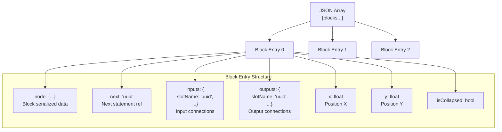
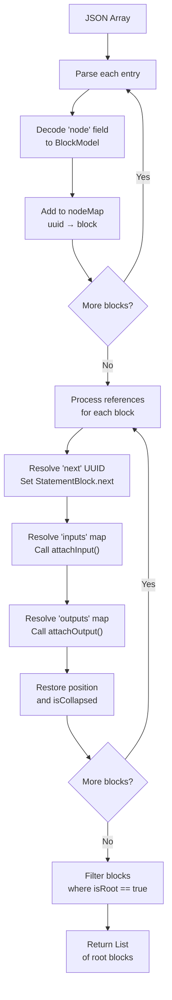
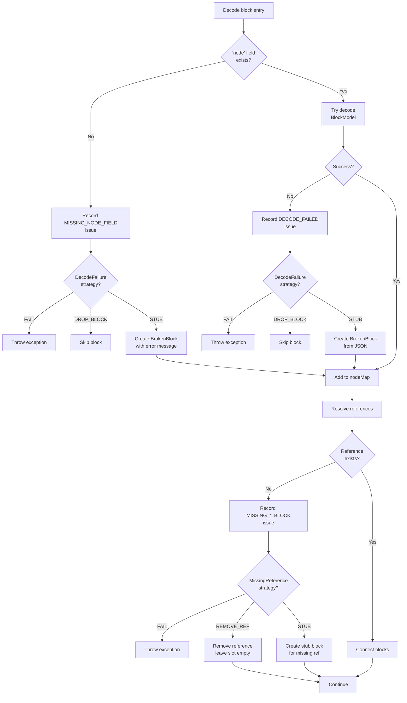
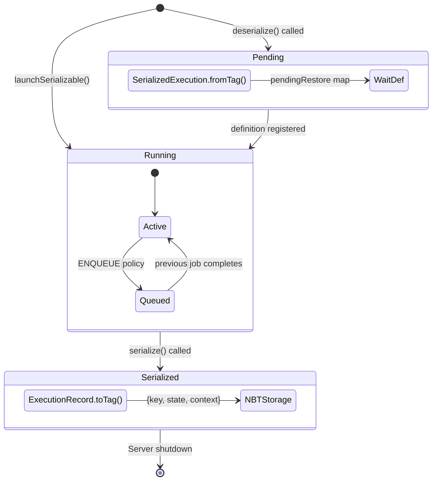
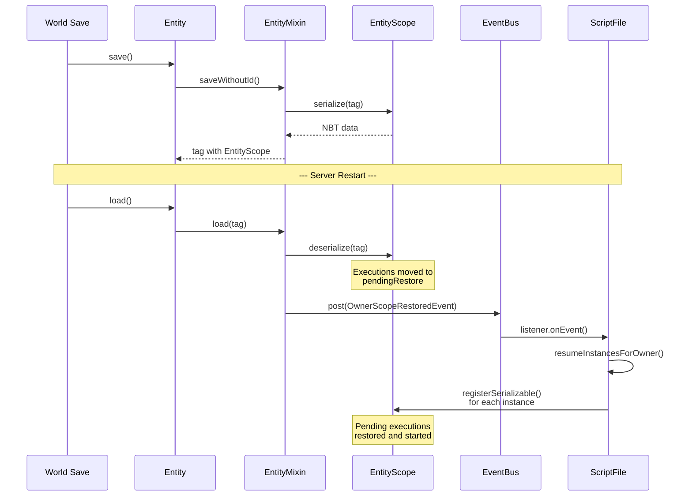
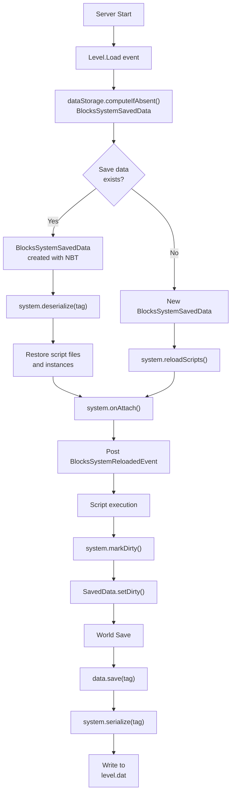
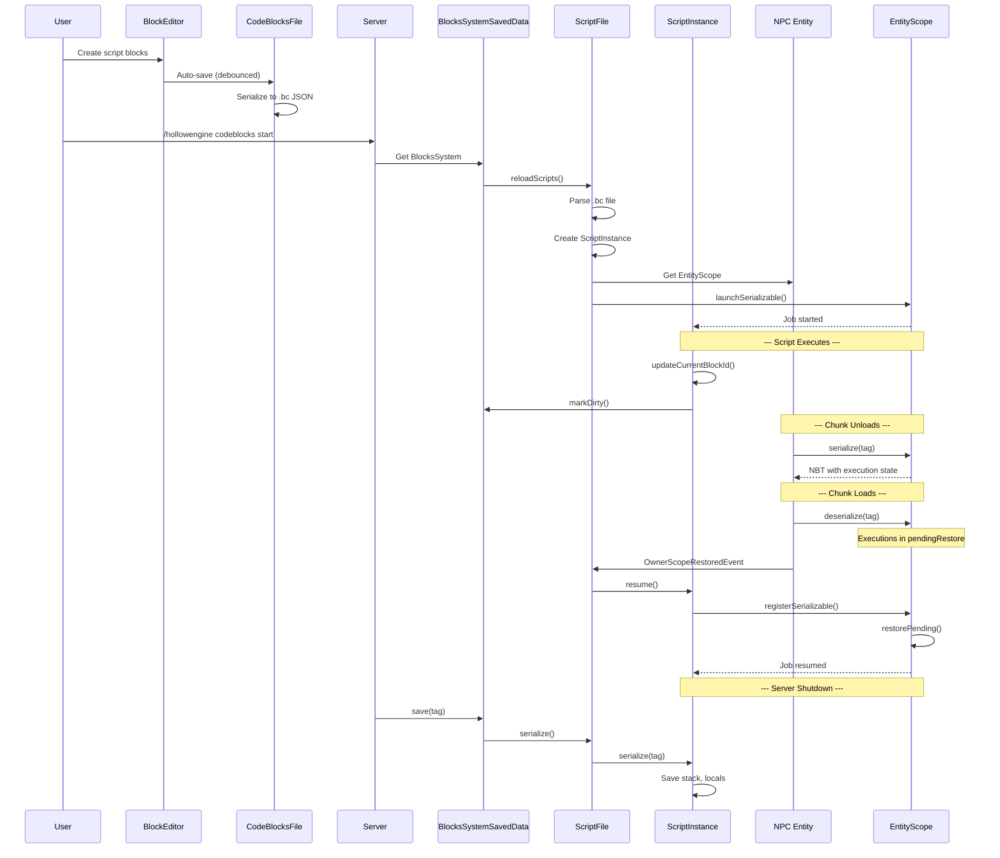

# Serialization and Persistence

<details>
<summary>Relevant source files</summary>

The following files were used as context for generating this wiki page:

- [src/main/java/ru/hollowhorizon/hollowengine/client/gui/codeblocks/BlockController.kt](src/main/java/ru/hollowhorizon/hollowengine/client/gui/codeblocks/BlockController.kt)
- [src/main/java/ru/hollowhorizon/hollowengine/client/gui/codeblocks/BlockEditor.kt](src/main/java/ru/hollowhorizon/hollowengine/client/gui/codeblocks/BlockEditor.kt)
- [src/main/java/ru/hollowhorizon/hollowengine/client/gui/codeblocks/BlocksPanel.kt](src/main/java/ru/hollowhorizon/hollowengine/client/gui/codeblocks/BlocksPanel.kt)
- [src/main/java/ru/hollowhorizon/hollowengine/client/gui/codeblocks/DragState.kt](src/main/java/ru/hollowhorizon/hollowengine/client/gui/codeblocks/DragState.kt)
- [src/main/java/ru/hollowhorizon/hollowengine/client/gui/codeblocks/InputSlotScope.kt](src/main/java/ru/hollowhorizon/hollowengine/client/gui/codeblocks/InputSlotScope.kt)
- [src/main/java/ru/hollowhorizon/hollowengine/client/gui/codeblocks/PuzzleShapes.kt](src/main/java/ru/hollowhorizon/hollowengine/client/gui/codeblocks/PuzzleShapes.kt)
- [src/main/java/ru/hollowhorizon/hollowengine/client/gui/codeblocks/ScratchBlockBackground.kt](src/main/java/ru/hollowhorizon/hollowengine/client/gui/codeblocks/ScratchBlockBackground.kt)
- [src/main/java/ru/hollowhorizon/hollowengine/client/gui/codeblocks/SlotBackground.kt](src/main/java/ru/hollowhorizon/hollowengine/client/gui/codeblocks/SlotBackground.kt)
- [src/main/java/ru/hollowhorizon/hollowengine/client/gui/kool/KeyHandlerNode.kt](src/main/java/ru/hollowhorizon/hollowengine/client/gui/kool/KeyHandlerNode.kt)
- [src/main/java/ru/hollowhorizon/hollowengine/client/gui/scripting/files/codeblocks/CodeBlocksFile.kt](src/main/java/ru/hollowhorizon/hollowengine/client/gui/scripting/files/codeblocks/CodeBlocksFile.kt)
- [src/main/java/ru/hollowhorizon/hollowengine/client/kool/KoolHooks.java](src/main/java/ru/hollowhorizon/hollowengine/client/kool/KoolHooks.java)
- [src/main/java/ru/hollowhorizon/hollowengine/common/codeblocks/BlockRepository.kt](src/main/java/ru/hollowhorizon/hollowengine/common/codeblocks/BlockRepository.kt)
- [src/main/java/ru/hollowhorizon/hollowengine/common/codeblocks/BlocksScope.kt](src/main/java/ru/hollowhorizon/hollowengine/common/codeblocks/BlocksScope.kt)
- [src/main/java/ru/hollowhorizon/hollowengine/common/codeblocks/CodeBlock.kt](src/main/java/ru/hollowhorizon/hollowengine/common/codeblocks/CodeBlock.kt)
- [src/main/java/ru/hollowhorizon/hollowengine/common/codeblocks/blocks/players/OnPlayerChatBlock.kt](src/main/java/ru/hollowhorizon/hollowengine/common/codeblocks/blocks/players/OnPlayerChatBlock.kt)
- [src/main/java/ru/hollowhorizon/hollowengine/common/codeblocks/execution/BlockFrameStackElement.kt](src/main/java/ru/hollowhorizon/hollowengine/common/codeblocks/execution/BlockFrameStackElement.kt)
- [src/main/java/ru/hollowhorizon/hollowengine/common/codeblocks/execution/CodeBlockInterpreter.kt](src/main/java/ru/hollowhorizon/hollowengine/common/codeblocks/execution/CodeBlockInterpreter.kt)
- [src/main/java/ru/hollowhorizon/hollowengine/common/codeblocks/model/BlockModel.kt](src/main/java/ru/hollowhorizon/hollowengine/common/codeblocks/model/BlockModel.kt)
- [src/main/java/ru/hollowhorizon/hollowengine/common/codeblocks/runtime/BlocksSystem.kt](src/main/java/ru/hollowhorizon/hollowengine/common/codeblocks/runtime/BlocksSystem.kt)
- [src/main/java/ru/hollowhorizon/hollowengine/common/codeblocks/runtime/BlocksSystemSavedData.kt](src/main/java/ru/hollowhorizon/hollowengine/common/codeblocks/runtime/BlocksSystemSavedData.kt)
- [src/main/java/ru/hollowhorizon/hollowengine/common/codeblocks/runtime/OwnerScopeRestoredEvent.kt](src/main/java/ru/hollowhorizon/hollowengine/common/codeblocks/runtime/OwnerScopeRestoredEvent.kt)
- [src/main/java/ru/hollowhorizon/hollowengine/common/codeblocks/runtime/ScriptFile.kt](src/main/java/ru/hollowhorizon/hollowengine/common/codeblocks/runtime/ScriptFile.kt)
- [src/main/java/ru/hollowhorizon/hollowengine/common/codeblocks/runtime/ScriptInstance.kt](src/main/java/ru/hollowhorizon/hollowengine/common/codeblocks/runtime/ScriptInstance.kt)
- [src/main/java/ru/hollowhorizon/hollowengine/common/codeblocks/serialization/CodeBlockFormat.kt](src/main/java/ru/hollowhorizon/hollowengine/common/codeblocks/serialization/CodeBlockFormat.kt)
- [src/main/java/ru/hollowhorizon/hollowengine/common/codeblocks/serialization/CodeBlockSerializer.kt](src/main/java/ru/hollowhorizon/hollowengine/common/codeblocks/serialization/CodeBlockSerializer.kt)
- [src/main/java/ru/hollowhorizon/hollowengine/common/commands/HollowEngineCommands.kt](src/main/java/ru/hollowhorizon/hollowengine/common/commands/HollowEngineCommands.kt)
- [src/main/java/ru/hollowhorizon/hollowengine/common/coroutines/EntityScope.kt](src/main/java/ru/hollowhorizon/hollowengine/common/coroutines/EntityScope.kt)
- [src/main/java/ru/hollowhorizon/hollowengine/common/coroutines/SingleThreadDispatcher.kt](src/main/java/ru/hollowhorizon/hollowengine/common/coroutines/SingleThreadDispatcher.kt)
- [src/main/java/ru/hollowhorizon/hollowengine/common/dev/DevLogger.kt](src/main/java/ru/hollowhorizon/hollowengine/common/dev/DevLogger.kt)
- [src/main/java/ru/hollowhorizon/hollowengine/mixins/components/EntityMixin.java](src/main/java/ru/hollowhorizon/hollowengine/mixins/components/EntityMixin.java)
- [src/main/resources/assets/hollowengine/textures/gui/icons/global.svg](src/main/resources/assets/hollowengine/textures/gui/icons/global.svg)
- [src/main/resources/assets/hollowengine/textures/gui/icons/maximize.svg](src/main/resources/assets/hollowengine/textures/gui/icons/maximize.svg)
- [src/test/kotlin/CodeBlockExecutionCoreTests.kt](src/test/kotlin/CodeBlockExecutionCoreTests.kt)
- [src/test/kotlin/ScriptExecutionLifecycleTests.kt](src/test/kotlin/ScriptExecutionLifecycleTests.kt)

</details>


This document covers how HollowEngine persists visual block scripts, script execution state, and entity-bound coroutines to disk. The system ensures that running scripts survive server restarts, chunk unloading, and even file corruption through robust recovery mechanisms.

For basic block model structure and execution, see [Block System Architecture](#6.1). For entity-component persistence via Geary ECS, see [Geary ECS Integration](#12.1). For the broader script execution lifecycle, see [Script Execution and Runtime](#7).

---

## Overview of Persistence Layers

HollowEngine maintains three distinct persistence layers, each serving a different purpose:

| Persistence Layer | Format | Scope | What It Saves |
|------------------|--------|-------|---------------|
| **Block Graph Serialization** | JSON | Per `.bc` file | Block tree structure, connections, positions, types |
| **Script Execution State** | NBT | Per world save | Active script instances, execution stacks, local variables |
| **Entity Scope State** | NBT | Per entity | Coroutine state, serializable context elements, queued executions |

Sources: [src/main/java/ru/hollowhorizon/hollowengine/common/codeblocks/serialization/CodeBlockSerializer.kt:1-320](), [src/main/java/ru/hollowhorizon/hollowengine/common/codeblocks/runtime/ScriptInstance.kt:188-215](), [src/main/java/ru/hollowhorizon/hollowengine/common/coroutines/EntityScope.kt:40-77]()

---

## Block Graph Serialization

### JSON Format Structure

Visual block scripts are serialized to `.bc` files using `CodeBlockFormat` and `CodeBlockSerializer`. The serialization format stores blocks as a flat array where each entry contains the block's data plus references to connected blocks.

**Diagram: Block Graph JSON Structure**



Sources: [src/main/java/ru/hollowhorizon/hollowengine/common/codeblocks/serialization/CodeBlockSerializer.kt:25-62]()

### Serialization Process

The `CodeBlockSerializer` class implements `KSerializer<List<BlockModel>>` and transforms the block graph into a JSON array:

1. **Flattening**: All blocks are collected via `BlockModel.flatten()` which recursively walks inputs, outputs, and statement chains
2. **Encoding**: Each block is encoded with its polymorphic type preserved via `SerializersModule`
3. **Reference Mapping**: UUIDs link blocks together (next statement, input slots, output slots)
4. **Position Storage**: Root blocks save their `positionX` and `positionY` values
5. **UI State**: The `isCollapsed` state is persisted for container blocks

**Key Classes:**
- `CodeBlockSerializer` - main serializer implementation
- `CodeBlockFormat` - manages JSON configuration and polymorphic module
- `BlockProvider` - provides type information for deserialization

Sources: [src/main/java/ru/hollowhorizon/hollowengine/common/codeblocks/serialization/CodeBlockSerializer.kt:18-63](), [src/main/java/ru/hollowhorizon/hollowengine/common/codeblocks/CodeBlock.kt:11-41]()

### Deserialization and Reconstruction

The deserialization process reverses the flattening:

1. **Parse Nodes**: Decode each JSON object's `node` field into a `BlockModel` instance
2. **Build UUID Map**: Create `nodeMap: UUID -> BlockModel` for reference resolution
3. **Reconnect Graph**: Process `next`, `inputs`, and `outputs` to restore connections
4. **Restore UI State**: Apply positions and collapse states
5. **Filter Roots**: Return only blocks where `isRoot == true`

**Diagram: Deserialization Workflow**



Sources: [src/main/java/ru/hollowhorizon/hollowengine/common/codeblocks/serialization/CodeBlockSerializer.kt:65-281]()

---

## Script Recovery Policies

### Recovery Strategy Configuration

`ScriptRecoveryPolicy` defines how the system handles corrupted or incomplete block files. Three strategies exist for different failure scenarios:

| Policy Type | Failure Scenarios | Available Strategies |
|------------|------------------|---------------------|
| `DecodeFailureStrategy` | Block type not found, malformed JSON | `FAIL`, `DROP_BLOCK`, `REPLACE_WITH_STUB` |
| `MissingReferenceStrategy` | Referenced UUID doesn't exist | `FAIL`, `REMOVE_REFERENCE`, `REPLACE_WITH_STUB` |
| Recovery mode | Overall behavior | `strict()`, `lenient()` |

**Strict Policy** (`ScriptRecoveryPolicy.strict()`):
- `DecodeFailureStrategy.FAIL` - throw exception on any decode error
- `MissingReferenceStrategy.FAIL` - throw exception on missing references

**Lenient Policy** (`ScriptRecoveryPolicy.lenient()`):
- `DecodeFailureStrategy.REPLACE_WITH_STUB` - insert `BrokenStatementBlock`/`BrokenExpressionBlock`
- `MissingReferenceStrategy.REPLACE_WITH_STUB` - create stub blocks with error messages

Sources: [src/main/java/ru/hollowhorizon/hollowengine/common/codeblocks/recovery/domain/ScriptRecoveryPolicy.kt]() (referenced in [CodeBlockSerializer.kt:20-21]())

### Issue Tracking and Reporting

The `ScriptLoadIssue` system tracks all problems encountered during deserialization:

**Diagram: Recovery Process with Issue Tracking**



Sources: [src/main/java/ru/hollowhorizon/hollowengine/common/codeblocks/serialization/CodeBlockSerializer.kt:75-280]()

### Backup Creation and Recovery Use Cases

The `PersistRecoveredScriptUseCase` creates timestamped backups when recovery occurs:

1. **Trigger**: `ScriptLoadReport` contains issues
2. **Backup**: Copy original file to `.bc.backup.YYYYMMDD_HHMMSS`
3. **Logging**: Warn with issue count and backup path
4. **Result**: Return backup file path or null if no issues

This ensures users can recover from automatic fixes that may have altered script logic.

Sources: [src/main/java/ru/hollowhorizon/hollowengine/common/codeblocks/recovery/usecase/PersistRecoveredScriptUseCase.kt]() (referenced in [CodeBlocksFile.kt:48-62]())

---

## Script Execution State Persistence

### ScriptInstance NBT Structure

`ScriptInstance` serializes its runtime state to NBT, allowing script execution to pause and resume across server restarts. The saved state includes:

**NBT Schema for ScriptInstance:**

```
ScriptInstance Tag {
    "instanceId": UUID
    "ownerEntityId": UUID (optional, for entity-bound scripts)
    "rootBlockId": UUID (which StartBlock this instance is running)
    "locals": CompoundTag {
        VariableMap serialization
    }
    "stack": CompoundTag (optional, if execution is suspended) {
        BlockFrameStackElement serialization
    }
}
```

**Key Methods:**
- `ScriptInstance.serialize(tag: CompoundTag)` at [ScriptInstance.kt:188-194]()
- `ScriptInstance.deserialize(tag: CompoundTag)` at [ScriptInstance.kt:196-200]()

Sources: [src/main/java/ru/hollowhorizon/hollowengine/common/codeblocks/runtime/ScriptInstance.kt:188-215]()

### BlockFrameStackElement Persistence

The execution stack tracks where the script is currently executing. Each frame represents a nested execution scope (e.g., inside a loop or function call).

**Frame Stack Structure:**

```
BlockFrameStackElement Tag {
    "frames": ListTag [
        CompoundTag {  // Frame 0 (outer)
            "uuid": UUID (current block being executed)
            ... (remembered values via remember())
        },
        CompoundTag {  // Frame 1 (nested)
            "uuid": UUID
            ...
        }
    ]
}
```

The `BlockFrameStackElement` class:
- Maintains a `Stack<BlockFrame>` in memory
- Serializes all frames to NBT
- On deserialization, reconstructs the stack
- Resumes execution from the last saved UUID

Sources: [src/main/java/ru/hollowhorizon/hollowengine/common/codeblocks/execution/BlockFrameStackElement.kt:44-59]()

### VariableMap Serialization

Local script variables are persisted using a type-aware serialization system. Each variable stores:

1. **Type Information**: The `ExpressionType` of the variable
2. **Value Container**: A `TypedContainer<T>` wrapping the actual value
3. **NBT Encoding**: Primitives and serializable objects encoded to NBT

**Variable Declaration and Persistence Flow:**

```mermaid
flowchart LR
    Declare["LocalVariableDeclaration<br/>block in script"] --> Scan["ScriptFile scans<br/>all blocks for<br/>LocalVariableDeclaration"]
    Scan --> BuildMap["declaredLocalVariables<br/>Map<String, ExpressionType>"]
    BuildMap --> Instance["ScriptInstance created"]
    Instance --> InitVars["Initialize VariableMap<br/>with createContainer()"]
    InitVars --> Execute["Script execution<br/>reads/writes variables"]
    Execute --> Serialize["Serialize VariableMap<br/>to NBT"]
    Serialize --> Save["Save to world data"]
    
    Save --> Load["Load from world data"]
    Load --> Deserialize["Deserialize VariableMap<br/>from NBT"]
    Deserialize --> Resume["Resume execution<br/>with restored values"]
```



Sources: [src/main/java/ru/hollowhorizon/hollowengine/common/codeblocks/runtime/ScriptFile.kt:34-37](), [src/main/java/ru/hollowhorizon/hollowengine/common/codeblocks/runtime/ScriptInstance.kt:192-198](), [src/main/java/ru/hollowhorizon/hollowengine/common/codeblocks/runtime/VariableMap.kt]() (referenced in imports)

---

## Entity Scope Persistence

### SerializableCoroutineScope

`EntityScope` extends `SerializableCoroutineScope` to persist coroutine execution state. This allows entity-bound scripts to survive chunk unloading and entity respawning.

**Core Persistence Mechanism:**

The `EntityScope` maintains three maps that track coroutine state:

| Map | Type | Purpose |
|-----|------|---------|
| `definitions` | `Map<SerializableCoroutineKey, SerializableCoroutineDefinition>` | Registered coroutine blueprints |
| `activeExecutions` | `Map<SerializableCoroutineKey, ExecutionRecord>` | Currently running coroutines |
| `queuedExecutions` | `Map<SerializableCoroutineKey, ArrayDeque<LaunchRequest>>` | Pending launches (for ENQUEUE policy) |
| `pendingRestore` | `Map<SerializableCoroutineKey, ArrayDeque<SerializedExecution>>` | Deserialized state awaiting definition registration |

**Diagram: EntityScope Serialization Lifecycle**



Sources: [src/main/java/ru/hollowhorizon/hollowengine/common/coroutines/EntityScope.kt:40-77](), [src/main/java/ru/hollowhorizon/hollowengine/common/coroutines/EntityScope.kt:166-183]()

### SerializableCoroutineKey

The `SerializableCoroutineKey` uniquely identifies a coroutine instance and encodes it to NBT. It's composed of multiple `SerializableCoroutineKeyPart` instances:

**Example Key Structure for ScriptInstance:**

```kotlin
SerializableCoroutineKey.of(
    SerializableCoroutineKeyPart.Context(ScriptInstanceKey),
    ScriptPathKey with ownerFile.path,
    RootBlockKey with rootBlock.uuid,
    InstanceIdKey with instanceId
)
```

Each part contributes to a composite key that ensures uniqueness across:
- Different script files
- Different start blocks within a file  
- Multiple instances of the same start block
- Different entity owners

Sources: [src/main/java/ru/hollowhorizon/hollowengine/common/codeblocks/runtime/ScriptInstance.kt:34-39](), [src/main/java/ru/hollowhorizon/hollowengine/common/coroutines/SerializableCoroutineKey.kt]() (referenced in imports)

### EntityMixin NBT Integration

The `EntityMixin` class injects serialization hooks into Minecraft's `Entity` class to persist both Geary components and the `EntityScope`:

**Injection Points:**

1. **Save**: `@Inject(method = "saveWithoutId", at = @At("TAIL"))`
   - Serializes Geary components to `geary` tag
   - Serializes `EntityScope` to `EntityScope` tag

2. **Load**: `@Inject(method = "load", at = @At("TAIL"))`  
   - Deserializes Geary components
   - Deserializes `EntityScope`
   - Fires `OwnerScopeRestoredEvent`

**NBT Structure on Entity:**

```
Entity NBT {
    ... (vanilla fields)
    "geary": CompoundTag {
        Geary component data
    },
    "EntityScope": CompoundTag {
        "executions": ListTag [
            {
                "key": { SerializableCoroutineKey parts },
                "state": "RUNNING" | "QUEUED",
                "context": { SerializableCoroutineContextElement data }
            },
            ...
        ]
    }
}
```

Sources: [src/main/java/ru/hollowhorizon/hollowengine/mixins/components/EntityMixin.java:54-68]()

### OwnerScopeRestoredEvent

When an entity is loaded and its `EntityScope` is deserialized, an `OwnerScopeRestoredEvent` is fired. This triggers:

1. **Script instance resumption**: Entity-bound scripts resume execution
2. **Offline queue processing**: Scripts that were queued while the entity was unloaded are launched
3. **Coroutine restoration**: Previously running coroutines are reconstructed

**Event Flow:**



Sources: [src/main/java/ru/hollowhorizon/hollowengine/mixins/components/EntityMixin.java:64-68](), [src/main/java/ru/hollowhorizon/hollowengine/common/codeblocks/runtime/ScriptFile.kt:172-181](), [src/main/java/ru/hollowhorizon/hollowengine/common/codeblocks/runtime/OwnerScopeRestoredEvent.kt:1-9]()

---

## World-Level Persistence

### BlocksSystemSavedData

The `BlocksSystemSavedData` class extends Minecraft's `SavedData` to persist the entire code blocks system at the world level. It stores:

1. **Script registry**: All loaded `.bc` files and their instances
2. **Enable/disable state**: Which scripts are currently running
3. **Active instances**: All `ScriptInstance` objects and their execution state

**Integration with World Save:**



Sources: [src/main/java/ru/hollowhorizon/hollowengine/common/codeblocks/runtime/BlocksSystemSavedData.kt:1-54]()

### BlocksSystem Serialization

The `BlocksSystem` class serializes all script files and their instances to a single NBT structure:

**NBT Schema:**

```
BlocksSystem Tag {
    "scripts": CompoundTag {
        "hollowengine/scripts/example.bc": CompoundTag {
            "enabled": boolean
            "instances": ListTag [
                CompoundTag {  // ScriptInstance NBT
                    "instanceId": UUID,
                    "ownerEntityId": UUID,
                    "rootBlockId": UUID,
                    "locals": {...},
                    "stack": {...}
                },
                ...
            ]
        },
        "hollowengine/scripts/another.bc": {...},
        ...
    }
}
```

The serialization process:

1. **Iterate Scripts**: For each `ScriptFile` in `scripts` map
2. **Save Metadata**: Write `enabled` state
3. **Save Instances**: Serialize each `ScriptInstance` in the file
4. **Nest Structure**: Group by script path for organization

Sources: [src/main/java/ru/hollowhorizon/hollowengine/common/codeblocks/runtime/BlocksSystem.kt:29-44]()

### ScriptFile Persistence

Each `ScriptFile` manages its own instances and persists:

1. **Enable state**: Whether the script is currently running
2. **Instance list**: All active `ScriptInstance` objects
3. **Instance restoration**: Matches instances to `StartBlock` by UUID

**Restoration Process:**

When deserializing, `ScriptFile`:

1. Reads `enabled` boolean
2. Iterates through `instances` list tag
3. For each instance tag:
   - Extracts `rootBlockId`
   - Finds matching `StartBlock` in `allBlocks`
   - Creates new `ScriptInstance` with saved `instanceId`
   - Calls `instance.deserialize(instTag)`
   - Calls `instance.resume()` to restart execution
4. Re-registers event listeners if enabled

Sources: [src/main/java/ru/hollowhorizon/hollowengine/common/codeblocks/runtime/ScriptFile.kt:83-127]()

---

## Automatic Save Triggers

### Editor Auto-Save

The block editor implements debounced auto-save to reduce disk writes:

**Debounce Configuration:**

```kotlin
changeEvents
    .debounce(5000L)  // 5 second delay
    .onEach {
        withContext(Dispatchers.IO) {
            save()
        }
    }
    .launchIn(scope)
```

Any modification to the block graph emits to `changeEvents`, which triggers a save after 5 seconds of inactivity.

Sources: [src/main/java/ru/hollowhorizon/hollowengine/client/gui/scripting/files/codeblocks/CodeBlocksFile.kt:71-78]()

### Runtime State Marking

Script execution state is marked dirty whenever:

1. **Instance Creation**: New `ScriptInstance` launched
2. **Instance Completion**: `ScriptInstance` finishes or is stopped
3. **Instance Suspension**: Entity-bound instance loses its scope
4. **Current Block Change**: Execution moves to next block
5. **Variable Modification**: Local variables updated

The `markDirty()` chain:

```
ScriptInstance.updateCurrentBlockId()
  → ScriptFile.system.markDirty()
    → BlocksSystem.markDirty()
      → BlocksSystem.dirtyListener()
        → BlocksSystemSavedData.markDirty()
          → SavedData.setDirty()
```

Sources: [src/main/java/ru/hollowhorizon/hollowengine/common/codeblocks/execution/CodeBlockInterpreter.kt:36](), [src/main/java/ru/hollowhorizon/hollowengine/common/codeblocks/runtime/BlocksSystem.kt:50-52](), [src/main/java/ru/hollowhorizon/hollowengine/common/codeblocks/runtime/BlocksSystemSavedData.kt:15-17]()

---

## Complete Persistence Example

### Scenario: Entity-Bound Script Across Chunk Unload

Consider an NPC entity running a script that loops every 60 seconds. The persistence flow:

**Diagram: Complete Lifecycle with Persistence**



Sources: [src/main/java/ru/hollowhorizon/hollowengine/client/gui/scripting/files/codeblocks/CodeBlocksFile.kt:71-78](), [src/main/java/ru/hollowhorizon/hollowengine/common/codeblocks/runtime/ScriptFile.kt:61-120](), [src/main/java/ru/hollowhorizon/hollowengine/common/coroutines/EntityScope.kt:40-77](), [src/main/java/ru/hollowhorizon/hollowengine/mixins/components/EntityMixin.java:54-68]()

---

This comprehensive serialization and persistence system ensures that HollowEngine's visual scripts, execution state, and entity-bound coroutines survive server restarts, chunk unloading, and even file corruption, providing a robust foundation for persistent game logic.