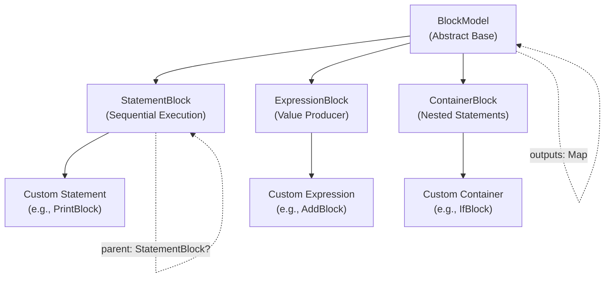
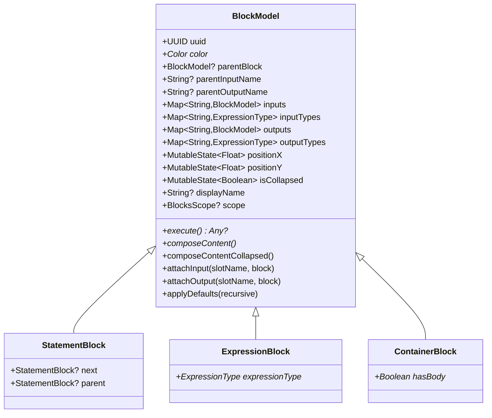
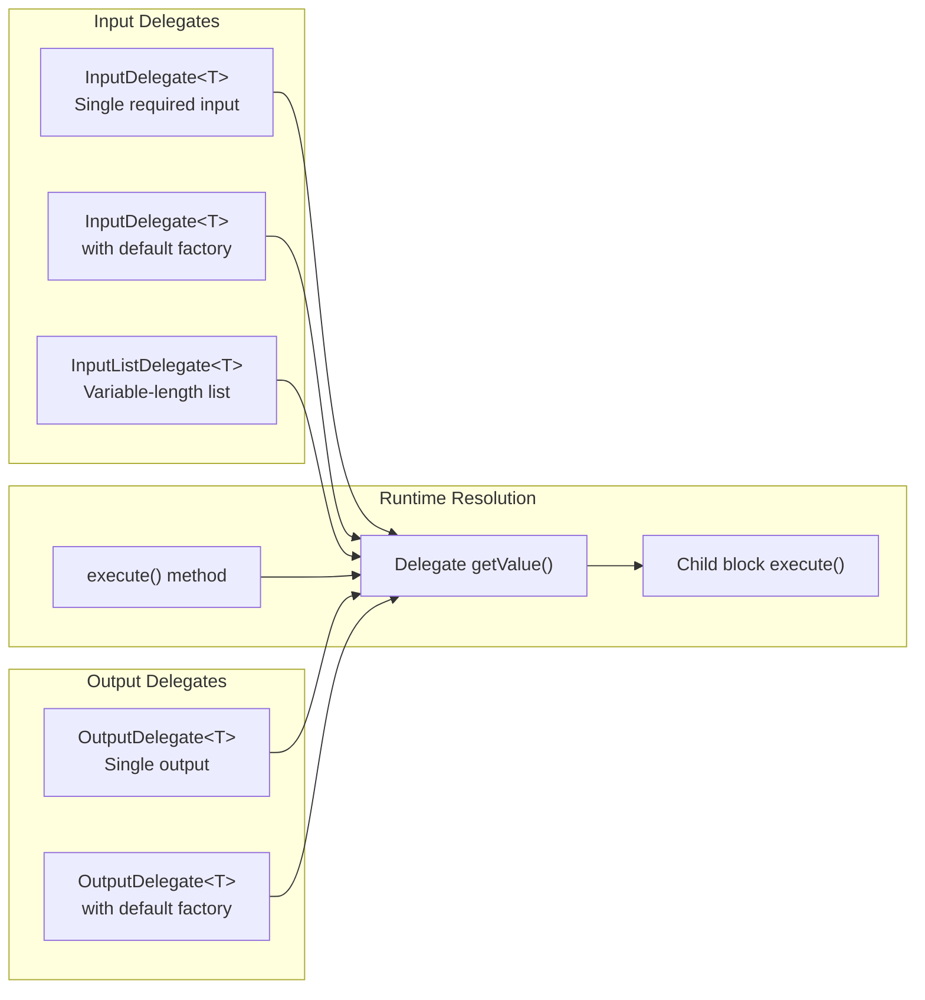
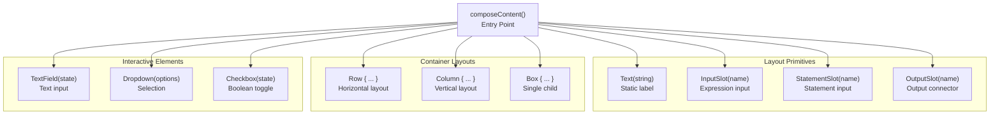
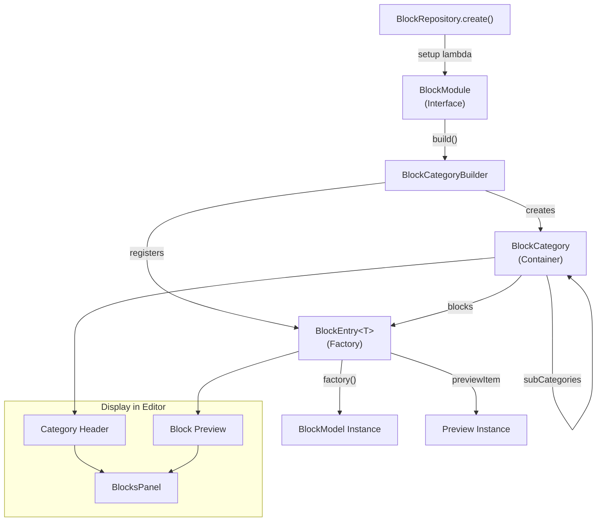
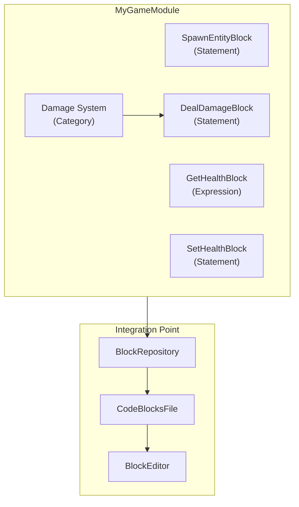

# Custom Block Development

<details>
<summary>Relevant source files</summary>

The following files were used as context for generating this wiki page:

- [src/main/java/ru/hollowhorizon/hollowengine/client/gui/codeblocks/BlockController.kt](src/main/java/ru/hollowhorizon/hollowengine/client/gui/codeblocks/BlockController.kt)
- [src/main/java/ru/hollowhorizon/hollowengine/client/gui/codeblocks/BlocksPanel.kt](src/main/java/ru/hollowhorizon/hollowengine/client/gui/codeblocks/BlocksPanel.kt)
- [src/main/java/ru/hollowhorizon/hollowengine/client/gui/codeblocks/DragState.kt](src/main/java/ru/hollowhorizon/hollowengine/client/gui/codeblocks/DragState.kt)
- [src/main/java/ru/hollowhorizon/hollowengine/client/gui/kool/KeyHandlerNode.kt](src/main/java/ru/hollowhorizon/hollowengine/client/gui/kool/KeyHandlerNode.kt)
- [src/main/java/ru/hollowhorizon/hollowengine/client/gui/scripting/files/codeblocks/CodeBlocksFile.kt](src/main/java/ru/hollowhorizon/hollowengine/client/gui/scripting/files/codeblocks/CodeBlocksFile.kt)
- [src/main/java/ru/hollowhorizon/hollowengine/client/kool/KoolHooks.java](src/main/java/ru/hollowhorizon/hollowengine/client/kool/KoolHooks.java)
- [src/main/java/ru/hollowhorizon/hollowengine/common/codeblocks/BlockRepository.kt](src/main/java/ru/hollowhorizon/hollowengine/common/codeblocks/BlockRepository.kt)
- [src/main/java/ru/hollowhorizon/hollowengine/common/codeblocks/model/BlockModel.kt](src/main/java/ru/hollowhorizon/hollowengine/common/codeblocks/model/BlockModel.kt)

</details>


This document explains how to create custom block types for the visual programming system. Custom blocks extend the visual scripting capabilities by implementing new operations, control structures, or integrations with game systems.

For information about using the visual block editor interface, see [Visual Block Editor](#5). For details on block execution and runtime behavior, see [Block Execution Runtime](#6.4). For understanding the overall block programming architecture, see [Block System Architecture](#6.1).

---

## Block Model Hierarchy

All blocks in the system inherit from `BlockModel`, which provides the foundational structure for visual programming nodes. The hierarchy supports three primary block types that serve different roles in script composition.

**Block Type Hierarchy**



**Key Distinctions**

| Block Type | Purpose | Can Chain | Returns Value | Examples |
|------------|---------|-----------|---------------|----------|
| `StatementBlock` | Performs actions | Yes (via `next`) | No | Print, Set Variable, Wait |
| `ExpressionBlock` | Computes values | No | Yes | Math operations, Get Variable |
| `ContainerBlock` | Groups statements | Yes | No | If/Else, Repeat, While |

Sources: [src/main/java/ru/hollowhorizon/hollowengine/common/codeblocks/model/BlockModel.kt:1-163]()

---

## Core BlockModel Structure

The `BlockModel` class defines the fundamental properties and contracts that all blocks must fulfill. Understanding these members is essential for custom block development.

**Essential BlockModel Members**



**Property Categories**

- **Identity**: `uuid` uniquely identifies each block instance
- **Hierarchy**: `parentBlock`, `parentInputName`, `parentOutputName` track parent relationships
- **Connections**: `inputs` and `outputs` maps store connected child blocks
- **Type System**: `inputTypes` and `outputTypes` define accepted/produced types
- **Visual**: `positionX`, `positionY`, `isCollapsed`, `displayName`, `color`
- **Execution Context**: `scope` provides access to variables and runtime state

Sources: [src/main/java/ru/hollowhorizon/hollowengine/common/codeblocks/model/BlockModel.kt:19-163]()

---

## Creating a Custom Statement Block

Statement blocks perform actions and can be chained together sequentially. They do not return values but may have side effects like modifying variables or interacting with game entities.

**Implementation Pattern**

```kotlin
@Serializable
@SerialName("custom_print")
class CustomPrintBlock : StatementBlock() {
    // Define block color (used for visual styling)
    override val color = Color(0.3f, 0.6f, 0.9f)
    
    // Define inputs with type constraints
    private val message by input<String>("message")
    
    // Execution logic
    override suspend fun execute(): Any? {
        val text = message
        println("Block says: $text")
        return null // Statements don't return values
    }
    
    // UI rendering in block editor
    override fun InputSlotScope.composeContent() {
        Text("print")
        InputSlot("message", isRequired = true)
    }
}
```

**Key Components**

1. **`@Serializable` annotation**: Required for persistence to `.bc` files
2. **`@SerialName` annotation**: Stable identifier for deserialization across code changes
3. **`color` property**: Defines visual appearance in editor
4. **Input delegates**: `by input<T>()` creates typed input slots
5. **`execute()` method**: Implements runtime behavior
6. **`composeContent()` method**: Defines visual layout in editor

Sources: [src/main/java/ru/hollowhorizon/hollowengine/common/codeblocks/model/BlockModel.kt:79-91](), [src/main/java/ru/hollowhorizon/hollowengine/common/codeblocks/model/BlockModel.kt:142-148]()

---

## Creating a Custom Expression Block

Expression blocks compute and return values. They are typically placed in input slots of other blocks and cannot be chained with `next`.

**Implementation Pattern**

```kotlin
@Serializable
@SerialName("custom_add")
class CustomAddBlock : ExpressionBlock() {
    override val color = Color(0.4f, 0.8f, 0.4f)
    override val expressionType = typeOf<Double>()
    
    // Multiple inputs for operation
    private val a by input<Double>("a")
    private val b by input<Double>("b")
    
    override suspend fun execute(): Double {
        return a + b
    }
    
    override fun InputSlotScope.composeContent() {
        InputSlot("a", isRequired = true)
        Text("+")
        InputSlot("b", isRequired = true)
    }
}
```

**Expression-Specific Requirements**

- **`expressionType` property**: Must declare return type for type checking
- **`execute()` return type**: Should match `expressionType`
- **No `next` chaining**: Expressions don't support sequential execution
- **Type safety**: Input types are validated during drag-and-drop

The type system uses `ExpressionType` to ensure blocks are connected correctly. Common types include `StringType`, `NumberType`, `BooleanType`, and `AnyType` (accepts anything).

Sources: [src/main/java/ru/hollowhorizon/hollowengine/common/codeblocks/model/BlockModel.kt:79-91](), [src/main/java/ru/hollowhorizon/hollowengine/common/codeblocks/model/BlockModel.kt:127-140]()

---

## Input and Output Slots

Input and output slots enable blocks to receive values and expose results. The delegate system provides type-safe access with automatic serialization.

**Slot Delegate Types**



**Delegate Usage Examples**

| Pattern | Code | Behavior |
|---------|------|----------|
| Basic input | `val x by input<Int>("x")` | Required input slot, runtime error if empty |
| Default input | `val x by inputDefault<Int>("x") { LiteralBlock(5) }` | Uses default if no connection |
| Input list | `val items by inputList<String>("items")` | Variable number of inputs |
| Basic output | `val result by output<Double>("result")` | Single output slot |
| Default output | `val result by outputDefault<Double>("result") { LiteralBlock(0.0) }` | Pre-filled output |

**Type Registration**

Input and output delegates automatically register their types with the parent block during initialization. This enables the drag-and-drop system to validate connections.

```kotlin
// During block construction:
val inputs = mutableMapOf<String, BlockModel>()
val inputTypes = mutableMapOf<String, ExpressionType>()

// Delegate registration (automatic):
inputTypes["message"] = typeOf<String>()
```

The `BlockController.isValidDrop()` method checks type compatibility before allowing connections, preventing type errors at runtime.

Sources: [src/main/java/ru/hollowhorizon/hollowengine/common/codeblocks/model/BlockModel.kt:79-140](), [src/main/java/ru/hollowhorizon/hollowengine/client/gui/codeblocks/BlockController.kt:624-650]()

---

## Visual Composition with InputSlotScope

The `composeContent()` method defines how blocks appear in the visual editor. It uses Kool UI's declarative composition system within an `InputSlotScope` context.

**InputSlotScope DSL Elements**



**Composition Examples**

**Simple Expression Layout**
```kotlin
override fun InputSlotScope.composeContent() {
    InputSlot("a")
    Text("+")
    InputSlot("b")
}
// Renders: [slot] + [slot]
```

**Statement with Body**
```kotlin
override fun InputSlotScope.composeContent() {
    Row {
        Text("repeat")
        InputSlot("times")
        Text("times")
    }
    StatementSlot("body")
}
// Renders: repeat [slot] times
//          [statement slot]
```

**Interactive Configuration**
```kotlin
private val textValue = mutableStateOf("")

override fun InputSlotScope.composeContent() {
    Text("Value:")
    TextField(textValue.use()) {
        modifier.onChange { textValue.set(it) }
    }
}
```

**Slot Properties**

| Slot Type | Purpose | Visual Appearance |
|-----------|---------|-------------------|
| `InputSlot` | Expression input | Notch for expressions to plug into |
| `StatementSlot` | Statement container | C-shape indent for statement chains |
| `OutputSlot` | Expression output | Tab for connecting to other inputs |

The rendering system uses `PuzzleShapes` and `ScratchBlockBackground` to generate the characteristic jigsaw-like appearance with proper connection points.

Sources: [src/main/java/ru/hollowhorizon/hollowengine/common/codeblocks/model/BlockModel.kt:144-148]()

---

## Block Registration and Discovery

Custom blocks must be registered with the `BlockRepository` system to appear in the block palette. The registration system uses a hierarchical category structure.

**Registration Architecture**



**Registration Implementation**

```kotlin
// Create a block module
val MyCustomModule = BlockModule {
    // Define a category
    category("Math Operations", icon = icons.CALCULATOR) {
        // Register individual blocks
        block<CustomAddBlock>("Add") { CustomAddBlock() }
        block<CustomSubtractBlock>("Subtract") { CustomSubtractBlock() }
        
        // Nested subcategory
        category("Advanced", icon = null) {
            block<CustomPowerBlock>("Power") { CustomPowerBlock() }
        }
    }
}

// Use in repository
val repository = BlockRepository.create("My Scripts") {
    include(MyCustomModule)
    include(StandardModules.AllBasics) // Include standard blocks
}
```

**BlockCategoryBuilder Methods**

| Method | Parameters | Purpose |
|--------|------------|---------|
| `category(name, icon, setup)` | Name, icon resource, builder lambda | Creates nested category |
| `block<T>(name, factory)` | Block name, factory function | Registers block type |
| `dynamicBlocks(generator)` | Generator function | Provides runtime-generated blocks |
| `include(module)` | BlockModule instance | Includes predefined module |

**Display Name Resolution**

The `BlockProvider.resolveDisplayName()` method searches the category tree to find a block's registered name, which is used when the block doesn't have an explicit `displayName` set. This enables the same block class to appear with different names in different contexts.

Sources: [src/main/java/ru/hollowhorizon/hollowengine/common/codeblocks/BlockRepository.kt:1-114](), [src/main/java/ru/hollowhorizon/hollowengine/client/gui/codeblocks/BlocksPanel.kt:20-250]()

---

## Integration Example: Complete Custom Module

This example demonstrates a complete custom block module with multiple block types, proper registration, and integration with the editor.

**Custom Module Structure**



**Complete Implementation**

```kotlin
// 1. Define block classes
@Serializable
@SerialName("spawn_entity")
class SpawnEntityBlock : StatementBlock() {
    override val color = Color(0.8f, 0.4f, 0.2f)
    private val entityType by input<String>("entityType")
    private val x by input<Double>("x")
    private val y by input<Double>("y")
    private val z by input<Double>("z")
    
    override suspend fun execute(): Any? {
        val type = entityType
        val level = scope?.level ?: return null
        // Spawn logic here
        return null
    }
    
    override fun InputSlotScope.composeContent() {
        Row {
            Text("Spawn")
            InputSlot("entityType")
            Text("at")
        }
        Row {
            Text("X:")
            InputSlot("x")
            Text("Y:")
            InputSlot("y")
            Text("Z:")
            InputSlot("z")
        }
    }
}

@Serializable
@SerialName("get_entity_health")
class GetHealthBlock : ExpressionBlock() {
    override val color = Color(0.4f, 0.8f, 0.4f)
    override val expressionType = typeOf<Double>()
    private val entity by input<Any>("entity")
    
    override suspend fun execute(): Double {
        val ent = entity as? LivingEntity ?: return 0.0
        return ent.health.toDouble()
    }
    
    override fun InputSlotScope.composeContent() {
        Text("health of")
        InputSlot("entity")
    }
}

// 2. Create module
object MyGameModule : BlockModule {
    override fun BlockCategoryBuilder.build() {
        category("Entities", icon = icons.ENTITY) {
            block<SpawnEntityBlock>("Spawn Entity") { SpawnEntityBlock() }
            block<GetHealthBlock>("Get Health") { GetHealthBlock() }
            
            category("Damage System", icon = icons.COMBAT) {
                // More blocks...
            }
        }
    }
}

// 3. Integrate with file
class MyCodeBlocksFile(filePath: String, bytes: ByteArray) : EditorFile(filePath) {
    val repository = BlockRepository.create("Game Scripts") {
        include(StandardModules.AllBasics)
        include(MyGameModule) // Include custom module
    }
    
    val format = CodeBlockFormat(repository)
    val editor = BlockEditor(repository) { /* onChange */ }
    
    // ... rest of implementation
}
```

**Module Organization Best Practices**

1. **Group related blocks**: Keep blocks that interact together in the same module
2. **Use consistent colors**: Related blocks should use similar color schemes
3. **Provide defaults**: Use `inputDefault()` for common values
4. **Document with display names**: Clear names help users understand purpose
5. **Test type compatibility**: Ensure input/output types align across related blocks

Sources: [src/main/java/ru/hollowhorizon/hollowengine/client/gui/scripting/files/codeblocks/CodeBlocksFile.kt:32-43](), [src/main/java/ru/hollowhorizon/hollowengine/common/codeblocks/BlockRepository.kt:65-104]()

---

## Advanced Features

### Collapsed Rendering

Blocks can provide a simplified rendering when collapsed, useful for complex blocks with many inputs.

```kotlin
override fun InputSlotScope.composeContentCollapsed() {
    Text(displayName ?: "Complex Operation")
}
```

The `isCollapsed` state is controlled by user interaction in the editor.

### Default Input Values

Pre-populate input slots with default blocks:

```kotlin
private val times by inputDefault<Int>("times") { 
    LiteralBlock(10) 
}
```

Defaults are applied via `applyDefaults(recursive = true)` during block creation.

### Scope Access

Blocks can access the execution scope for context-dependent behavior:

```kotlin
override suspend fun execute(): Any? {
    val variables = scope?.variables
    val level = scope?.level
    val entity = scope?.entity
    // Use context...
}
```

The `scope` property is automatically propagated through parent relationships.

### Parent Relationships

Blocks track their position in the tree via:
- `parentBlock`: Container that owns this block via input/output slot
- `parentInputName` / `parentOutputName`: Which slot this block occupies
- `parent`: Previous statement in chain (for `StatementBlock` only)
- `next`: Next statement in chain (for `StatementBlock` only)

These relationships are managed automatically by `BlockController` during drag-and-drop operations.

### Type System Extension

Create custom `ExpressionType` instances for domain-specific type checking:

```kotlin
object EntityType : ExpressionType {
    override fun accepts(other: ExpressionType) = 
        other == EntityType || other == AnyType
}

class GetPlayerBlock : ExpressionBlock() {
    override val expressionType = EntityType
    // ...
}
```

Sources: [src/main/java/ru/hollowhorizon/hollowengine/common/codeblocks/model/BlockModel.kt:146-148](), [src/main/java/ru/hollowhorizon/hollowengine/common/codeblocks/model/BlockModel.kt:93-120](), [src/main/java/ru/hollowhorizon/hollowengine/common/codeblocks/model/BlockModel.kt:150-158](), [src/main/java/ru/hollowhorizon/hollowengine/client/gui/codeblocks/BlockController.kt:532-543]()

---

## Serialization and Deep Copy

Custom blocks must support serialization and deep copying to enable save/load and copy/paste functionality.

**Serialization Requirements**

```kotlin
@Serializable
@SerialName("my_block") // Stable identifier
class MyBlock : StatementBlock() {
    // All persistent fields must be @Serializable-compatible
    private var configValue: String = "default"
    
    // Transient UI state not serialized
    @Transient
    private val uiState = mutableStateOf("")
}
```

**Deep Copy Mechanism**

The `deepCopy()` method (provided by base classes) recursively clones block trees:

```kotlin
val clone = originalBlock.deepCopy(provider)
```

This creates new `UUID` instances for all blocks, preserving structure but breaking references to the original tree. The `BlockController` uses this for duplication operations.

**Connection State Capture**

During editor operations, `BlockController.captureConnectionState()` saves a block's relationships for undo/redo:

```kotlin
data class ConnectionState(
    val parentBlock: BlockModel?,
    val parentInputName: String?,
    val parentOutputName: String?,
    val parentStatement: StatementBlock?,
    val nextStatement: StatementBlock?,
    val indexInRoot: Int,
    val positionX: Float,
    val positionY: Float
)
```

This enables precise restoration of block positions and connections.

Sources: [src/main/java/ru/hollowhorizon/hollowengine/client/gui/codeblocks/BlockController.kt:532-543](), [src/main/java/ru/hollowhorizon/hollowengine/client/gui/codeblocks/BlockController.kt:663-668]()

---

## Testing Custom Blocks

**Testing Strategy**

1. **Visual Testing**: Create blocks in editor, verify appearance and slot positions
2. **Connection Testing**: Attempt valid and invalid connections, ensure type checking works
3. **Execution Testing**: Run blocks in scripts, verify `execute()` logic
4. **Serialization Testing**: Save/load files, ensure blocks persist correctly
5. **Undo/Redo Testing**: Perform operations, verify history system works

**Debug Logging**

Add logging to understand execution flow:

```kotlin
override suspend fun execute(): Any? {
    HollowEngine.LOGGER.info("Executing MyBlock with input: ${someInput}")
    val result = performOperation()
    HollowEngine.LOGGER.info("MyBlock result: $result")
    return result
}
```

**Common Issues**

| Issue | Cause | Solution |
|-------|-------|----------|
| Block not in palette | Not registered with `BlockRepository` | Add `block<MyBlock>()` call |
| Type mismatch on connect | `inputTypes` doesn't match `expressionType` | Verify `input<T>()` types align |
| Serialization error | Missing `@Serializable` or `@SerialName` | Add required annotations |
| Execution error | Null scope or missing inputs | Check `scope` availability, validate inputs |
| Visual layout broken | Incorrect `composeContent()` structure | Review slot placement, add debug borders |

Sources: [src/main/java/ru/hollowhorizon/hollowengine/client/gui/scripting/files/codeblocks/CodeBlocksFile.kt:32-95]()