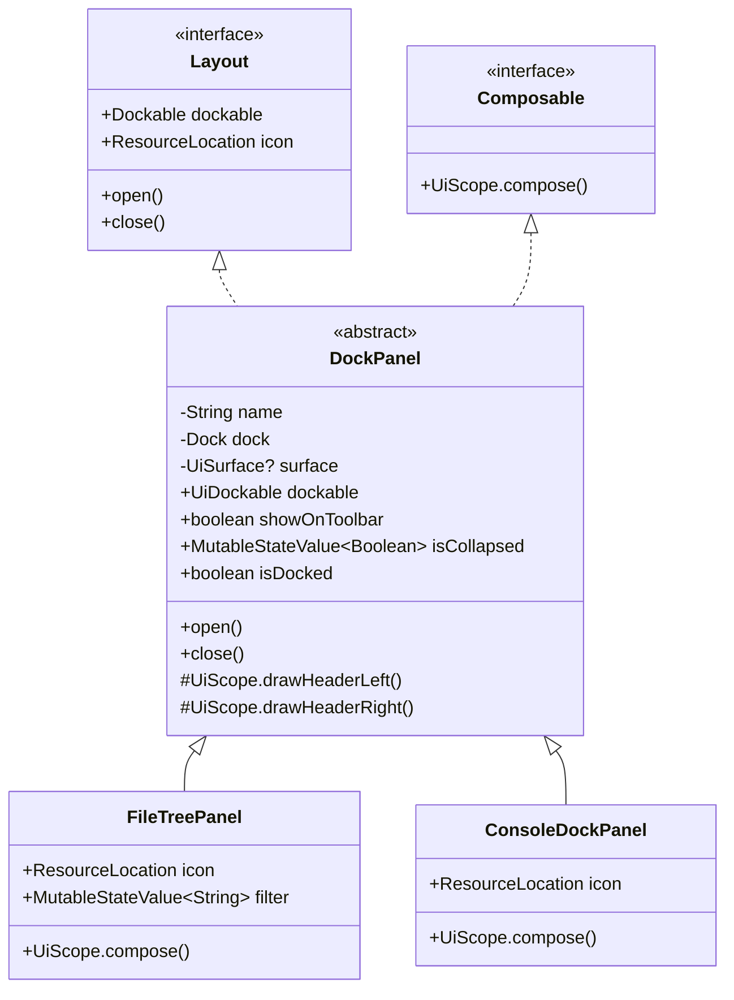
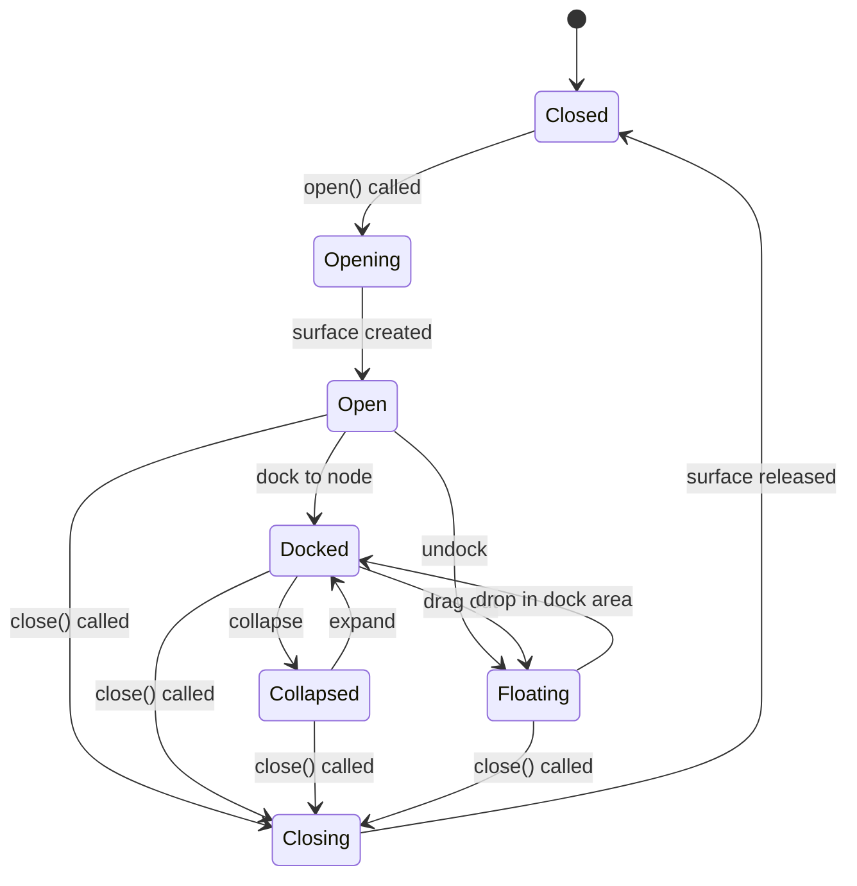
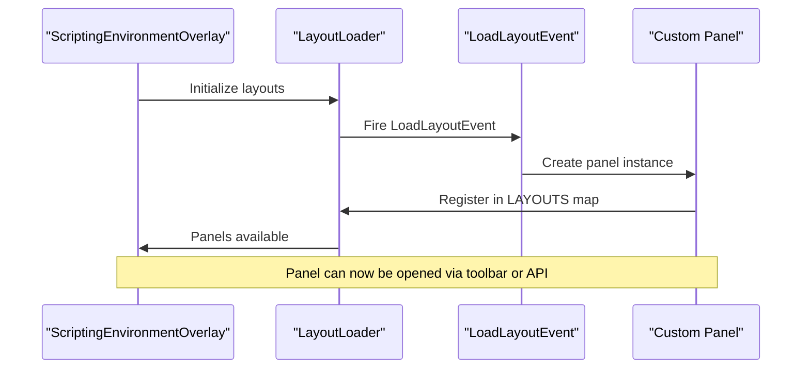
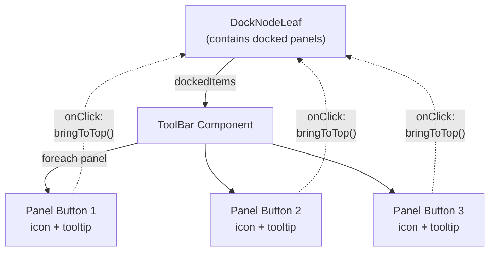
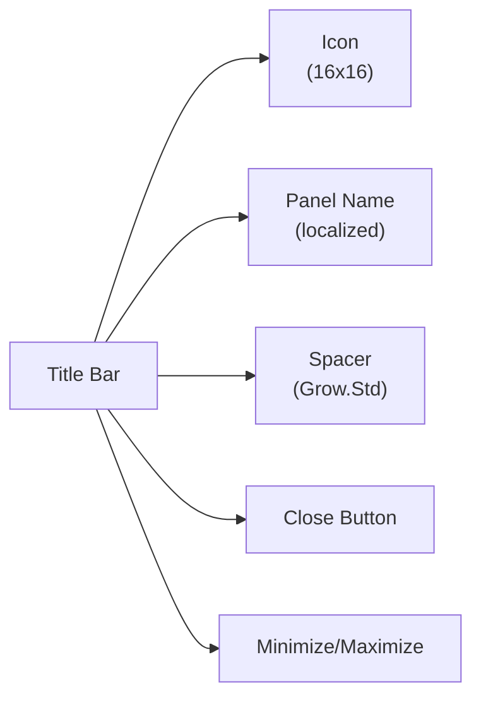
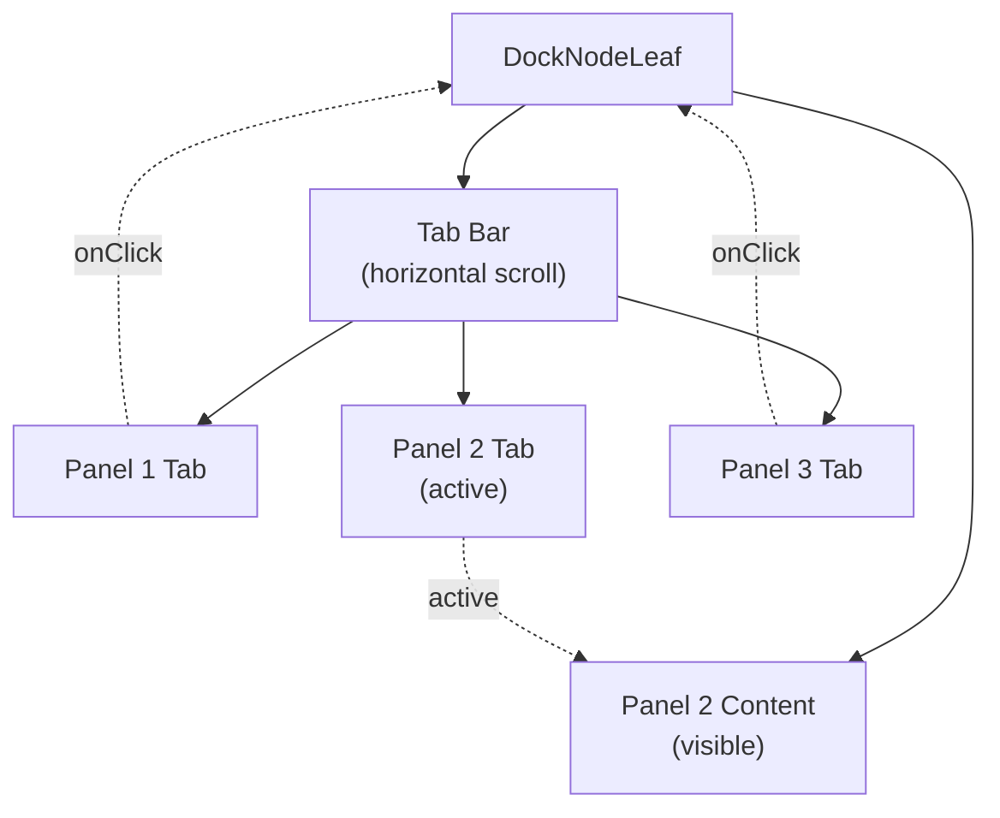

# Custom Panel Development

<details>
<summary>Relevant source files</summary>

The following files were used as context for generating this wiki page:

- [src/main/java/ru/hollowhorizon/hollowengine/client/gui/scripting/FileNode.kt](src/main/java/ru/hollowhorizon/hollowengine/client/gui/scripting/FileNode.kt)
- [src/main/java/ru/hollowhorizon/hollowengine/client/gui/scripting/files/FilesBar.kt](src/main/java/ru/hollowhorizon/hollowengine/client/gui/scripting/files/FilesBar.kt)
- [src/main/java/ru/hollowhorizon/hollowengine/client/gui/scripting/panels/DockPanel.kt](src/main/java/ru/hollowhorizon/hollowengine/client/gui/scripting/panels/DockPanel.kt)
- [src/main/java/ru/hollowhorizon/hollowengine/client/gui/scripting/panels/FileTreePanel.kt](src/main/java/ru/hollowhorizon/hollowengine/client/gui/scripting/panels/FileTreePanel.kt)
- [src/main/java/ru/hollowhorizon/hollowengine/client/gui/scripting/tools/ToolWindow.kt](src/main/java/ru/hollowhorizon/hollowengine/client/gui/scripting/tools/ToolWindow.kt)
- [src/main/java/ru/hollowhorizon/hollowengine/client/keys/HollowEngineKeybinds.kt](src/main/java/ru/hollowhorizon/hollowengine/client/keys/HollowEngineKeybinds.kt)

</details>


This document provides a guide for creating custom IDE panels that integrate with the HollowEngine in-game IDE. Custom panels extend the `DockPanel` base class to create dockable, resizable windows that appear in the IDE interface.

For information about the overall panel system architecture and how panels interact with the docking system, see [Panel System](#3.5). For specific built-in editors like the text editor or block editor, see [Text Script Editor](#4) and [Visual Block Editor](#5).

---

## Panel Architecture Overview

Custom panels in HollowEngine are built on top of the Kool UI framework's docking system. The `DockPanel` abstract class provides the foundation for all IDE panels.

### Class Hierarchy



**Sources:** [src/main/java/ru/hollowhorizon/hollowengine/client/gui/scripting/panels/DockPanel.kt:1-82](), [src/main/java/ru/hollowhorizon/hollowengine/client/gui/scripting/docking/Layout.kt]()

### Key Interfaces

| Interface | Purpose | Required Methods |
|-----------|---------|------------------|
| `Layout` | Docking system integration | `dockable: Dockable`, `icon: ResourceLocation`, `open()`, `close()` |
| `Composable` | UI composition | `UiScope.compose()` |

### DockPanel Base Class

The `DockPanel` class manages the lifecycle and rendering of IDE panels:



**Sources:** [src/main/java/ru/hollowhorizon/hollowengine/client/gui/scripting/panels/DockPanel.kt:14-82]()

---

## Creating a Custom Panel

### Step 1: Extend DockPanel

Create a new class extending `DockPanel` with a constructor that accepts a `Dock` instance:

```kotlin
class MyCustomPanel(dock: Dock) : DockPanel("my.panel.name", dock) {
    override val icon = Assets.Hollowengine.Textures.Gui.Icons.MY_ICON
    
    override fun UiScope.compose() {
        // Panel UI composition goes here
    }
}
```

**Required implementations:**
- `icon`: A `ResourceLocation` pointing to the panel's icon (displayed in toolbar and title bar)
- `compose()`: The UI composition function that defines the panel's content

**Sources:** [src/main/java/ru/hollowhorizon/hollowengine/client/gui/scripting/panels/FileTreePanel.kt:13-48]()

### Step 2: Implement UI Composition

The `compose()` function uses Kool UI's declarative syntax to build the panel's interface:

```kotlin
override fun UiScope.compose() {
    Column(Grow.Std, Grow.Std) {
        modifier.margin(Dimensions.PaddingNormal)
            .padding(Dimensions.PaddingMedium)
            .background(RoundRectBackground(ColorTheme.UI.BackgroundSecondary, Dimensions.PaddingNormal))
        
        // Panel content here
        Text("My Panel Content") {
            modifier.textColor(ColorTheme.UI.WhiteReplacement)
        }
    }
}
```

**Common UI patterns:**
- Use `Column(Grow.Std, Grow.Std)` for vertical layouts
- Use `Row(Grow.Std, Grow.Std)` for horizontal layouts
- Apply `ColorTheme.UI.*` colors for consistent theming
- Use `Dimensions.*` constants for consistent spacing

**Sources:** [src/main/java/ru/hollowhorizon/hollowengine/client/gui/scripting/panels/FileTreePanel.kt:17-47]()

### Step 3: Implement State Management

Panels maintain state using Kool UI's reactive state primitives:

```kotlin
class MyCustomPanel(dock: Dock) : DockPanel("my.panel.name", dock) {
    // Reactive state values
    val searchQuery = mutableStateOf("")
    val items = mutableStateListOf<String>()
    
    override fun UiScope.compose() {
        Column(Grow.Std, Grow.Std) {
            TextField(searchQuery.use()) {
                modifier.onChange { searchQuery.set(it) }
            }
            
            items.use().forEach { item ->
                Text(item)
            }
        }
    }
}
```

**State primitives:**
- `mutableStateOf<T>()`: Single reactive value
- `mutableStateListOf<T>()`: Reactive list
- `remember { ... }`: Create state that survives recomposition
- `.use()`: Read a state value (triggers recomposition on change)

**Sources:** [src/main/java/ru/hollowhorizon/hollowengine/client/gui/scripting/panels/FileTreePanel.kt:15-47]()

---

## Panel Registration and Lifecycle

### Registration Process

Panels are registered through the `LoadLayoutEvent` event system:



**Sources:** [src/main/java/ru/hollowhorizon/hollowengine/client/gui/scripting/docking/LayoutLoader.kt]()

### Lifecycle Methods

The `DockPanel` class provides lifecycle hooks:

| Method | Called When | Purpose |
|--------|-------------|---------|
| `open()` | Panel first opened | Create `WindowSurface`, set floating bounds, add to dock |
| `close()` | Panel closed | Remove surface from dock, release resources |
| `drawHeaderLeft()` | Title bar rendered (left side) | Add custom header buttons/controls |
| `drawHeaderRight()` | Title bar rendered (right side) | Add custom header buttons/controls |

**Default `open()` behavior:**
1. Creates a `WindowSurface` with default floating position (5dp, 5dp from top-left)
2. Sets default floating size (15x panel width, 10x panel height)
3. Adds the surface to the docking system
4. Renders title bar with icon, name, and close button

**Sources:** [src/main/java/ru/hollowhorizon/hollowengine/client/gui/scripting/panels/DockPanel.kt:38-70]()

### Opening and Closing Panels

Panels can be controlled programmatically:

```kotlin
val myPanel = MyCustomPanel(ScriptingEnvironmentOverlay.dock)

// Open the panel
myPanel.open()

// Close the panel
myPanel.close()

// Check if panel is docked
if (myPanel.isDocked) {
    // Panel is docked to a node
}

// Check if panel is collapsed
if (myPanel.isCollapsed.value) {
    // Panel is collapsed
}
```

**Sources:** [src/main/java/ru/hollowhorizon/hollowengine/client/gui/scripting/panels/DockPanel.kt:38-78]()

---

## Toolbar Integration

### Toolbar Visibility

Panels can appear in the IDE toolbar by setting `showOnToolbar = true` (default):

```kotlin
class MyCustomPanel(dock: Dock) : DockPanel("my.panel.name", dock) {
    init {
        showOnToolbar = true  // Appears in toolbar
    }
}
```

When `showOnToolbar = false`, the panel still functions but doesn't appear in the vertical toolbar.

**Sources:** [src/main/java/ru/hollowhorizon/hollowengine/client/gui/scripting/panels/DockPanel.kt:16]()

### Toolbar Button Rendering

The toolbar system automatically creates buttons for panels with `showOnToolbar = true`:



**Toolbar button features:**
- Displays panel's `icon` property
- Shows panel's `name` as tooltip (localized)
- Highlights when panel is on top
- Animated indicator shows active panel
- Click brings panel to front

**Sources:** [src/main/java/ru/hollowhorizon/hollowengine/client/gui/scripting/tools/ToolWindow.kt:16-39]()

### Toolbar Position

When a panel is docked, the toolbar appears on the left or right side based on the dock node's position:

```kotlin
// From DockPanel.kt panelContent rendering
dockable.dockedTo.use()?.let { dockNode ->
    val isPanelBarLeft = dockNode.boundsLeftDp.value.px < 1f
        || dockNode.boundsRightDp.value.px < dockNode.dock.root.boundsRightDp.value.px * 0.99f
    
    Row(Grow.Std, Grow.Std) {
        if (isPanelBarLeft) {
            ToolBar(this@DockPanel, true)   // Left side
            panelContent()
        } else {
            panelContent()
            ToolBar(this@DockPanel, false)  // Right side
        }
    }
}
```

**Sources:** [src/main/java/ru/hollowhorizon/hollowengine/client/gui/scripting/panels/DockPanel.kt:53-66]()

---

## Title Bar Customization

### Standard Title Bar

The `DockPanel` automatically renders a title bar with:
- Panel icon
- Panel name (localized)
- Close button (if `onCloseAction` provided)
- Minimize/maximize button
- Tab bar (if multiple panels docked together)



**Sources:** [src/main/java/ru/hollowhorizon/hollowengine/client/gui/scripting/files/FilesBar.kt:238-367]()

### Custom Header Buttons

Override `drawHeaderLeft()` or `drawHeaderRight()` to add custom buttons:

```kotlin
class MyCustomPanel(dock: Dock) : DockPanel("my.panel.name", dock) {
    override fun UiScope.drawHeaderLeft() {
        // Add buttons to left side of header
        Box {
            modifier.onClick { /* custom action */ }
            Text("Custom Button")
        }
    }
    
    override fun UiScope.drawHeaderRight() {
        // Add buttons to right side of header
        Box {
            modifier.onClick { /* custom action */ }
            Image(Assets.Hollowengine.Textures.Gui.Icons.SETTINGS)
        }
    }
}
```

**Sources:** [src/main/java/ru/hollowhorizon/hollowengine/client/gui/scripting/panels/DockPanel.kt:80-81]()

---

## Advanced Panel Features

### Collapse/Expand Behavior

Panels support collapse/expand through the `isCollapsed` state:

```kotlin
// In DockPanel.kt
val isCollapsed = mutableStateOf(false)

private fun UiScope.panelContent() {
    val size = if(isCollapsed.use()) FitContent else Grow.Std
    Column(size, size) {
        FileTitleBar(icon, dockable, isCollapsed, ...)
        if(!isCollapsed.use()) this@DockPanel()  // Only render content when expanded
    }
}
```

**Collapse behavior:**
- Collapsed panels show only title bar
- Content is not rendered (performance optimization)
- Panel takes minimal space (`FitContent` instead of `Grow.Std`)
- Toggle via minimize/maximize button in title bar

**Sources:** [src/main/java/ru/hollowhorizon/hollowengine/client/gui/scripting/panels/DockPanel.kt:20-35]()

### Tab Bar for Multiple Panels

When multiple panels are docked to the same `DockNodeLeaf`, a tab bar appears:



**Tab bar features:**
- Horizontal scrollable list
- Shows panel icon + name
- Close button on each tab (middle-click or X button)
- Drag tabs to reorder or undock
- Active tab highlighted

**Sources:** [src/main/java/ru/hollowhorizon/hollowengine/client/gui/scripting/files/FilesBar.kt:113-236]()

### Floating Window Customization

Override `open()` to customize floating window properties:

```kotlin
override fun open() {
    if (surface != null) return
    
    // Custom floating position
    dockable.floatingX.set(Dp(100f))
    dockable.floatingY.set(Dp(100f))
    
    // Custom floating size
    dockable.floatingWidth.set(Dp(600f))
    dockable.floatingHeight.set(Dp(400f))
    
    // Create surface with custom settings
    surface = WindowSurface(dock.dockingSurface.parentScene, dockable, ...) {
        modifier.border(null)
            .backgroundColor(ColorTheme.UI.BackgroundGeneral)
        
        // Custom window content
        panelContent()
    }.also { dock.addDockableSurface(dockable, it) }
}
```

**Customizable properties:**
- `floatingX`, `floatingY`: Window position
- `floatingWidth`, `floatingHeight`: Window size
- `floatingAlignmentX`, `floatingAlignmentY`: Alignment anchors
- Window decorations (border, background, etc.)

**Sources:** [src/main/java/ru/hollowhorizon/hollowengine/client/gui/scripting/panels/DockPanel.kt:38-70]()

---

## Complete Example: Custom Search Panel

Here's a complete example implementing a search panel with filtering:

```kotlin
package com.example.hollowengine.panels

import de.fabmax.kool.modules.ui2.*
import de.fabmax.kool.modules.ui2.docking.Dock
import net.minecraft.resources.ResourceLocation
import ru.hollowhorizon.hollowengine.client.gui.colors.ColorTheme
import ru.hollowhorizon.hollowengine.client.gui.colors.Dimensions
import ru.hollowhorizon.hollowengine.client.gui.scripting.panels.DockPanel
import ru.hollowhorizon.hollowengine.generated.Assets

class SearchPanel(dock: Dock) : DockPanel("search.panel", dock) {
    override val icon = Assets.Hollowengine.Textures.Gui.Icons.SEARCH
    
    // State management
    private val searchQuery = mutableStateOf("")
    private val results = mutableStateListOf<String>()
    
    override fun UiScope.compose() {
        Column(Grow.Std, Grow.Std) {
            modifier.margin(Dimensions.PaddingNormal)
                .background(RoundRectBackground(
                    ColorTheme.UI.BackgroundSecondary, 
                    Dimensions.PaddingNormal
                ))
            
            // Search input
            Row(Grow.Std) {
                modifier.padding(Dimensions.PaddingMedium)
                    .background(RoundRectBackground(
                        ColorTheme.UI.BackgroundElements, 
                        Dimensions.PaddingNormal
                    ))
                
                TextField(searchQuery.use()) {
                    modifier.alignY(AlignmentY.Center)
                        .size(Grow.Std, Grow.Std)
                        .onChange { 
                            searchQuery.set(it)
                            performSearch(it)
                        }
                }
            }
            
            // Results list
            ScrollArea {
                Column(Grow.Std) {
                    results.use().forEach { result ->
                        Text(result) {
                            modifier.padding(Dimensions.PaddingSmall)
                                .textColor(ColorTheme.UI.WhiteReplacement)
                        }
                    }
                }
            }
        }
    }
    
    private fun performSearch(query: String) {
        results.clear()
        if (query.isNotEmpty()) {
            // Perform search logic
            results.addAll(listOf("Result 1", "Result 2", "Result 3")
                .filter { it.contains(query, ignoreCase = true) })
        }
    }
}
```

**Integration with IDE:**

```kotlin
// In your LoadLayoutEvent handler
@SubscribeEvent
fun onLoadLayout(event: LoadLayoutEvent) {
    event.addLayout(SearchPanel(event.dock))
}
```

**Sources:** [src/main/java/ru/hollowhorizon/hollowengine/client/gui/scripting/panels/FileTreePanel.kt:1-48](), [src/main/java/ru/hollowhorizon/hollowengine/client/gui/scripting/docking/LayoutLoader.kt]()

---

## Summary

### Key Classes and Interfaces

| Component | File | Purpose |
|-----------|------|---------|
| `DockPanel` | [DockPanel.kt:14-82]() | Abstract base class for all panels |
| `Layout` | [Layout.kt]() | Interface for dockable layouts |
| `Composable` | [Composable.kt]() | Interface for UI composition |
| `FileTitleBar` | [FilesBar.kt:238-267]() | Standard title bar component |
| `ToolBar` | [ToolWindow.kt:16-32]() | Vertical toolbar for docked panels |
| `LayoutLoader` | [LayoutLoader.kt]() | Panel registration system |

### Panel Development Checklist

- [ ] Extend `DockPanel` class with name and dock constructor
- [ ] Implement `icon` property with panel icon resource
- [ ] Implement `compose()` method with UI layout
- [ ] Add state management using `mutableStateOf()` or `mutableStateListOf()`
- [ ] Register panel via `LoadLayoutEvent`
- [ ] Set `showOnToolbar` flag if toolbar button needed
- [ ] Override `drawHeaderLeft()`/`drawHeaderRight()` for custom header buttons (optional)
- [ ] Override `open()` for custom window sizing/positioning (optional)
- [ ] Test docking, undocking, collapse, and tab behavior

**Sources:** [src/main/java/ru/hollowhorizon/hollowengine/client/gui/scripting/panels/DockPanel.kt:1-82](), [src/main/java/ru/hollowhorizon/hollowengine/client/gui/scripting/panels/FileTreePanel.kt:1-48]()