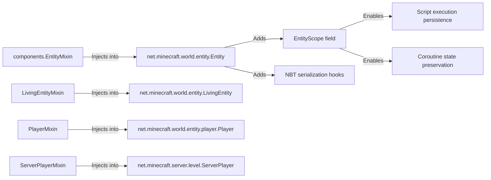
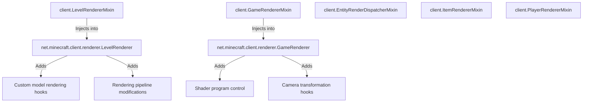
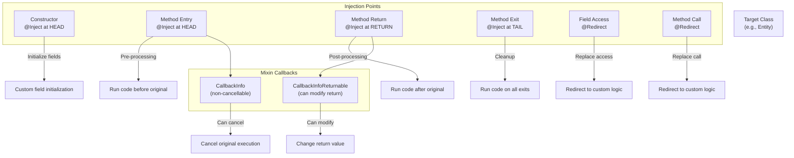
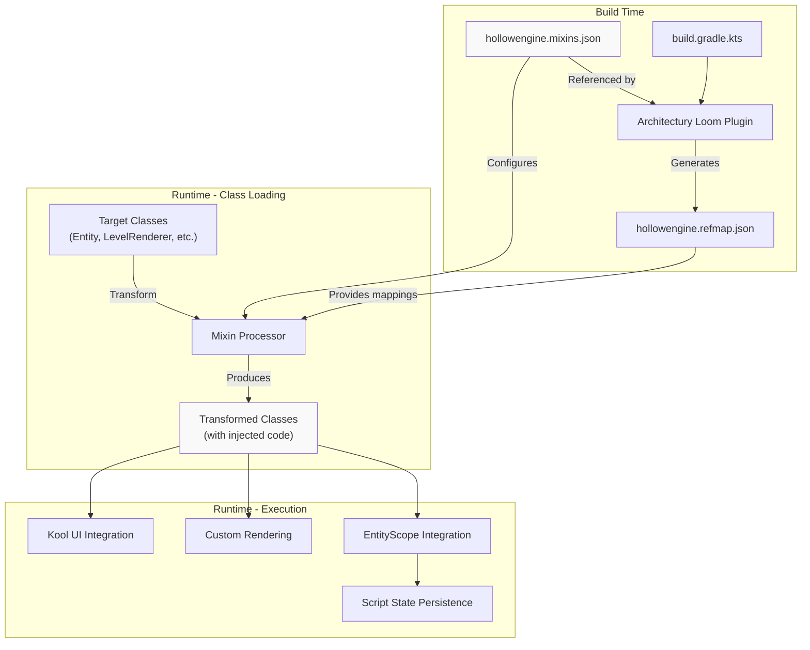

# Mixin System

<details>
<summary>Relevant source files</summary>

The following files were used as context for generating this wiki page:

- [build.gradle.kts](build.gradle.kts)
- [gradle.properties](gradle.properties)
- [src/main/java/ru/hollowhorizon/hollowengine/HollowEngine.kt](src/main/java/ru/hollowhorizon/hollowengine/HollowEngine.kt)
- [src/main/resources/hollowengine.mixins.json](src/main/resources/hollowengine.mixins.json)

</details>


This page documents the Mixin system used in HollowEngine to inject code into Minecraft and third-party library classes at runtime. Mixins enable deep integration with the game engine, entity system, rendering pipeline, and UI framework without requiring modifications to the original class files.

For information about the entity component system that relies on mixins, see [Entity System](#10.4). For details on the build system configuration, see [Build System and Dependencies](#2.2).

---

## Overview and Purpose

HollowEngine uses the [Mixin](https://github.com/SpongePowered/Mixin) library to transform Java bytecode at runtime, allowing the injection of custom code into existing classes. This enables:

- **Entity System Integration**: Injecting `EntityScope` into entities for script execution persistence
- **Rendering Pipeline Modifications**: Adding custom rendering capabilities to `LevelRenderer` and other rendering classes
- **Network Protocol Extensions**: Intercepting packet handling for custom client-server communication
- **UI Framework Integration**: Modifying Kool UI framework classes to work within Minecraft's windowing system
- **Private Field Access**: Creating accessors and invokers for private/protected members

The mixin system operates at the bytecode level, making changes invisible to the original source code while maintaining compatibility with other mods through careful use of injection priorities and cancellable callbacks.

**Sources**: [hollowengine.mixins.json:1-80](), [HollowEngine.kt:1-34]()

---

## Configuration Structure

### Mixin Configuration File

The mixin system is configured via `hollowengine.mixins.json`, which specifies the package structure, compatibility requirements, and list of mixins to apply:

```json
{
  "required": true,
  "minVersion": "0.8",
  "package": "ru.hollowhorizon.hollowengine.mixins",
  "refmap": "${mod_id}.refmap.json",
  "compatibilityLevel": "JAVA_17"
}
```

| Property | Value | Purpose |
|----------|-------|---------|
| `required` | `true` | Mixins must successfully apply or the mod will fail to load |
| `minVersion` | `"0.8"` | Minimum Mixin library version required |
| `package` | `"ru.hollowhorizon.hollowengine.mixins"` | Base package for all mixin classes |
| `refmap` | `"${mod_id}.refmap.json"` | Obfuscation reference map for mapping names |
| `compatibilityLevel` | `"JAVA_17"` | Java bytecode compatibility level |

### Mixin Categories

Mixins are divided into three execution contexts:

- **`mixins`**: Applied on both client and server (common code)
- **`client`**: Applied only on physical client side
- **`server`**: Applied only on dedicated servers (currently empty)

**Sources**: [hollowengine.mixins.json:1-10]()

---

## Mixin Classification

### Diagram: Mixin Organization by Target System

```mermaid
graph TB
    Config["hollowengine.mixins.json"]
    
    subgraph "Common Mixins"
        Entity["Entity Integration"]
        Registry["Registry System"]
        Compact["Compact Features"]
        Components["ECS Components"]
        Fabric["Fabric Platform"]
        Kool["Kool UI Framework"]
        Loot["Loot Tables"]
        Tags["Tag System"]
        Misc["Miscellaneous"]
    end
    
    subgraph "Client-Only Mixins"
        Rendering["Rendering Pipeline"]
        ClientUI["Client UI"]
        ClientKool["Kool Client Handlers"]
        ClientFabric["Fabric Client"]
    end
    
    Config --> Entity
    Config --> Registry
    Config --> Compact
    Config --> Components
    Config --> Fabric
    Config --> Kool
    Config --> Loot
    Config --> Tags
    Config --> Misc
    Config --> Rendering
    Config --> ClientUI
    Config --> ClientKool
    Config --> ClientFabric
    
    Entity --> EntityMixin["components.EntityMixin"]
    Entity --> LivingEntityMixin["LivingEntityMixin"]
    Entity --> PlayerMixin["PlayerMixin"]
    Entity --> ServerPlayerMixin["ServerPlayerMixin"]
    Entity --> AnimalMixin["AnimalMixin"]
    
    Registry --> HolderRef["registry.HolderReferenceAccessor"]
    Registry --> MappedReg["registry.MappedRegistryDynamicMixin"]
    
    Components --> CompEntity["components.EntityMixin"]
    Components --> CompLevel["components.LevelMixin"]
    
    Kool --> KoolClipboard["kool.ClipboardMixin"]
    Kool --> DockNode["kool.DockNodeMixin"]
    Kool --> DragDrop["kool.DragAndDropContextAccessor"]
    
    Rendering --> LevelRenderer["client.LevelRendererMixin"]
    Rendering --> GameRenderer["client.GameRendererMixin"]
    Rendering --> EntityRenderDispatcher["client.EntityRenderDispatcherMixin"]
    
    ClientKool --> Keyboard["kool.KeyboardHandlerMixin"]
    ClientKool --> Mouse["kool.MouseHandlerMixin"]
```



**Sources**: [hollowengine.mixins.json:7-75]()

---

## Core Mixin Types

### Accessor Mixins

Accessor mixins expose private or protected fields and methods from target classes without modifying their behavior. These follow the naming pattern `*Accessor`.

**Examples**:
- `DimensionDataStorageAccessor` - Access dimension storage internals
- `RecipeManagerAccessor` - Access recipe manager private fields
- `ListTagAccessor` - Access NBT list internals
- `HolderReferenceAccessor` - Access registry holder references
- `TagEntryAccessor` - Access tag entry private data
- `ShaderInstanceAccessor` - Access shader program internals

**Pattern**: Accessor mixins typically contain only `@Accessor` and `@Invoker` annotated methods that map to private members of the target class.

**Sources**: [hollowengine.mixins.json:12-14,20,26,42,64]()

---

### Invoker Mixins

Invoker mixins expose private or protected methods from target classes. These follow the naming pattern `*Invoker`.

**Examples**:
- `DockNodeInvoker` - Invoke private Kool UI dock node methods
- `CameraInvoker` - Invoke private camera manipulation methods

**Pattern**: Invoker mixins contain `@Invoker` annotated methods that provide access to private methods with specific signatures.

**Sources**: [hollowengine.mixins.json:34,50]()

---

### Injection Mixins

Injection mixins modify the behavior of existing classes by injecting code at specific points. These represent the majority of mixins and enable core HollowEngine functionality.

#### Entity System Injections

The entity system heavily relies on mixins to inject `EntityScope` functionality:



**Key Capabilities Added**:
- `EntityScope` field storage on all entities
- NBT serialization/deserialization hooks for script state
- Tick event injection for coroutine execution
- Death and removal event hooks for cleanup

**Sources**: [hollowengine.mixins.json:15,19,24,29](), [Diagram 4 from high-level overview]

---

#### Rendering Pipeline Injections

Client-side rendering mixins modify the rendering pipeline to support custom 3D models and visual effects:



**Key Capabilities Added**:
- Custom rendering passes for 3D models
- Shader program injection points
- Camera transformation hooks
- Entity render event callbacks

**Sources**: [hollowengine.mixins.json:48,54,53,56,62]()

---

#### Kool UI Integration Mixins

Mixins in the `kool.*` package integrate the Kool UI framework with Minecraft's windowing and input systems:

| Mixin Class | Target | Purpose |
|-------------|--------|---------|
| `kool.ClipboardMixin` | Kool clipboard handler | Integrate with Minecraft clipboard |
| `kool.DockNodeMixin` | Kool dock node system | Modify docking behavior for IDE |
| `kool.DragAndDropContextAccessor` | Kool drag/drop | Access drag state internals |
| `kool.KeyboardHandlerMixin` | Kool keyboard input | Route keyboard events through Minecraft |
| `kool.MouseHandlerMixin` | Kool mouse input | Route mouse events through Minecraft |
| `kool.PlatformInputMixin` | Kool platform input | Platform-specific input handling |
| `kool.UiDockableAccessor` | Kool dockable UI | Access dockable component state |
| `kool.UiNodeAccessor` | Kool UI node | Access UI node internals |

**Sources**: [hollowengine.mixins.json:33-39,73-74]()

---

## Injection Patterns

### Diagram: Common Mixin Injection Points



**Sources**: Based on standard Mixin patterns used throughout [hollowengine.mixins.json:1-80]()

---

### Head Injection

Injects code at the beginning of a method, before any original code executes. Used for:
- Initializing custom state
- Event firing before operations
- Conditional cancellation of method execution

**Example Pattern**:
```java
@Inject(method = "tick", at = @At("HEAD"))
private void onTick(CallbackInfo ci) {
    // Custom code runs before tick() executes
}
```

---

### Return Injection

Injects code at all return points of a method. Used for:
- Post-processing results
- Cleanup operations
- Event firing after operations

**Example Pattern**:
```java
@Inject(method = "save", at = @At("RETURN"))
private void afterSave(CallbackInfo ci) {
    // Custom code runs after save() completes
}
```

---

### Tail Injection

Injects code at the end of a method (before the final return). Used for:
- Guaranteed cleanup regardless of return path
- Final state modifications
- Resource release

**Example Pattern**:
```java
@Inject(method = "remove", at = @At("TAIL"))
private void onRemove(CallbackInfo ci) {
    // Custom cleanup code
}
```

---

### Redirect Injection

Replaces a method call or field access with custom logic. Used for:
- Replacing private method calls with custom implementations
- Redirecting field access to custom storage
- Conditional behavior modification

**Example Pattern**:
```java
@Redirect(
    method = "render",
    at = @At(
        value = "INVOKE",
        target = "Lnet/minecraft/client/renderer/LevelRenderer;renderChunkLayer(...)V"
    )
)
private void redirectRender(LevelRenderer renderer, ...) {
    // Replace original render call
}
```

---

## Critical Mixins

### EntityMixin (components)

The `components.EntityMixin` is one of the most critical mixins in HollowEngine, injecting `EntityScope` into all entities.

**Responsibilities**:
1. Add `EntityScope` field to `Entity` class
2. Initialize `EntityScope` during entity construction
3. Inject NBT serialization hooks for script state persistence
4. Inject tick hooks for coroutine execution
5. Inject removal hooks for cleanup

**Integration Points**:
- Enables script execution bound to specific entities
- Allows coroutine state to persist across world saves/loads
- Supports serialization of running scripts to NBT

**Sources**: [hollowengine.mixins.json:29]()

---

### LevelRendererMixin (client)

The `client.LevelRendererMixin` modifies the main level rendering pipeline to support custom 3D model rendering.

**Responsibilities**:
1. Inject rendering hooks for custom models
2. Add shader program management
3. Modify rendering order for custom content
4. Support GPU-accelerated model deformation

**Integration Points**:
- Called during main render loop
- Integrates with `GpuDeformer` system
- Enables rendering of GLTF models with skinning and morphing

**Sources**: [hollowengine.mixins.json:48,58]()

---

### MinecraftMixin (client)

The `client.MinecraftMixin` modifies the main Minecraft client class to integrate IDE overlay and input routing.

**Responsibilities**:
1. Initialize IDE overlay system
2. Route input events to Kool UI when IDE is active
3. Manage IDE lifecycle (open/close)
4. Integrate with client tick loop

**Integration Points**:
- Enables F10 keybind to open IDE
- Routes keyboard/mouse events through `ScriptingEnvironmentOverlay`
- Coordinates between Minecraft GUI and Kool UI

**Sources**: [hollowengine.mixins.json:59]()

---

## Platform-Specific Mixins

### Fabric Platform Mixins

Mixins under the `fabric.*` package provide Fabric-specific integration:

| Mixin | Target | Purpose |
|-------|--------|---------|
| `fabric.BlockItemMixin` | BlockItem | Modify block item behavior |
| `fabric.BowItemMixin` | BowItem | Modify bow item behavior |
| `fabric.BossHealthOverlayMixin` | BossHealthOverlay | Custom boss bar rendering |
| `fabric.ChatComponentMixin` | ChatComponent | Chat message interception |
| `fabric.DebugScreenOverlayMixin` | DebugScreenOverlay | Debug screen modifications |
| `fabric.GuiMixin` | Gui | GUI overlay modifications |

These mixins handle platform-specific code paths that differ between Fabric and Forge.

**Sources**: [hollowengine.mixins.json:31-32,69-72]()

---

## Diagram: Mixin System Data Flow



**Sources**: [hollowengine.mixins.json:1-80](), [build.gradle.kts:1-148]()

---

## Mixin Reference Table

### Common (Client + Server) Mixins

| Mixin Class | Target Class | Type | Purpose |
|-------------|-------------|------|---------|
| `AnimalMixin` | `Animal` | Injection | Custom animal behavior |
| `BrewingStandBlockEntityMixin` | `BrewingStandBlockEntity` | Injection | Brewing stand modifications |
| `BrewingStandMenuMixin` | `BrewingStandMenu` | Injection | Brewing menu modifications |
| `ClipboardMixin` | Clipboard | Injection | Clipboard access |
| `DimensionDataStorageAccessor` | `DimensionDataStorage` | Accessor | Access dimension storage |
| `DimensionTypeMixin` | `DimensionType` | Injection | Dimension type modifications |
| `ListTagAccessor` | `ListTag` | Accessor | NBT list access |
| `LivingEntityMixin` | `LivingEntity` | Injection | Living entity hooks |
| `MinecraftServerMixin` | `MinecraftServer` | Injection | Server lifecycle hooks |
| `PackRepositoryMixin` | `PackRepository` | Injection | Resource pack handling |
| `PlayerListMixin` | `PlayerList` | Injection | Player list management |
| `PlayerMixin` | `Player` | Injection | Player entity hooks |
| `RecipeManagerAccessor` | `RecipeManager` | Accessor | Recipe manager access |
| `ServerGamePacketListenerImplMixin` | `ServerGamePacketListenerImpl` | Injection | Packet handling |
| `ServerLevelMixin` | `ServerLevel` | Injection | Server level hooks |
| `ServerPlayerGameModeMixin` | `ServerPlayerGameMode` | Injection | Game mode handling |
| `ServerPlayerMixin` | `ServerPlayer` | Injection | Server player hooks |
| `StructureBlockMixin` | `StructureBlock` | Injection | Structure block modifications |
| `components.EntityMixin` | `Entity` | Injection | **EntityScope injection** |
| `components.LevelMixin` | `Level` | Injection | Level component storage |

**Sources**: [hollowengine.mixins.json:7-43]()

---

### Client-Only Mixins

| Mixin Class | Target Class | Type | Purpose |
|-------------|-------------|------|---------|
| `BiomeMixin` | `Biome` | Injection | Biome rendering modifications |
| `InventoryMixin` | `Inventory` | Injection | Inventory handling |
| `LevelRendererMixin` | `LevelRenderer` | Injection | **Main rendering pipeline** |
| `WorldOpenFlowsMixin` | `WorldOpenFlows` | Injection | World loading screen |
| `client.CameraInvoker` | `Camera` | Invoker | Camera method access |
| `client.ClientLevelMixin` | `ClientLevel` | Injection | Client level hooks |
| `client.DebugMainMixin` | Debug classes | Injection | Debug overlay |
| `client.EntityRenderDispatcherMixin` | `EntityRenderDispatcher` | Injection | Entity rendering |
| `client.GameRendererMixin` | `GameRenderer` | Injection | **Game renderer hooks** |
| `client.GuiMixin` | `Gui` | Injection | GUI overlay |
| `client.ItemRendererMixin` | `ItemRenderer` | Injection | Item rendering |
| `client.LayerDefinitionsMixin` | `LayerDefinitions` | Injection | Model layer definitions |
| `client.MinecraftMixin` | `Minecraft` | Injection | **Main client lifecycle** |
| `client.MultiplayerGameModeMixin` | `MultiplayerGameMode` | Injection | Client-side game mode |
| `client.ParticleEngineMixin` | `ParticleEngine` | Injection | Particle rendering |
| `client.PlayerRendererMixin` | `PlayerRenderer` | Injection | Player model rendering |
| `client.ScreenMixin` | `Screen` | Injection | Screen lifecycle |
| `client.ShaderInstanceAccessor` | `ShaderInstance` | Accessor | Shader access |
| `client.SkullBlockRendererMixin` | `SkullBlockRenderer` | Injection | Skull rendering |
| `client.SoundBufferLibraryMixin` | `SoundBufferLibrary` | Injection | Sound system |
| `client.SoundMixin` | `Sound` | Injection | Sound playback |
| `client.WindowMixin` | `Window` | Injection | Window management |

**Sources**: [hollowengine.mixins.json:45-74]()

---

## Best Practices

### Mixin Naming Conventions

1. **Accessor Mixins**: End with `Accessor` (e.g., `DimensionDataStorageAccessor`)
2. **Invoker Mixins**: End with `Invoker` (e.g., `CameraInvoker`)
3. **Injection Mixins**: Match target class name with `Mixin` suffix (e.g., `EntityMixin`)
4. **Package Organization**: Group by feature or target system (`components.*`, `client.*`, `kool.*`)

### Injection Safety

1. **Use Specific Injection Points**: Prefer `@At("HEAD")` or `@At("RETURN")` over broader matchers
2. **Check Cancellable**: Only cancel when necessary and document side effects
3. **Avoid Multiple Injections**: Minimize number of injection points in single method
4. **Test Compatibility**: Verify mixins work with other mods
5. **Document Side Effects**: Comment any behavior changes that might affect other systems

### Refmap Management

The refmap (`hollowengine.refmap.json`) is generated at build time by Architectury Loom and maps obfuscated names to Mixin targets. This enables mixins to work across different Minecraft versions and mapping sets (Mojang, Yarn, SRG).

**Configuration**: [hollowengine.mixins.json:5]()
**Build Integration**: [build.gradle.kts:11-12]()

---

## Troubleshooting

### Common Mixin Errors

| Error | Cause | Solution |
|-------|-------|----------|
| `Mixin apply failed` | Target class not found | Verify target class exists in current MC version |
| `Critical injection failure` | Method signature mismatch | Check refmap is up to date, verify method exists |
| `Conflicting mixin` | Another mod targets same injection point | Adjust priority or use different injection point |
| `Invalid @At target` | Bytecode instruction not found | Use more specific or broader matcher |
| `Accessor method conflict` | Duplicate accessor name | Rename accessor method to be unique |

### Debug Logging

Enable Mixin debug output by adding JVM arguments:

```
-Dmixin.debug.export=true
-Dmixin.debug.verbose=true
```

This exports transformed class files to `.mixin.out/` for inspection.

---

## Summary

The Mixin system is fundamental to HollowEngine's integration with Minecraft and third-party libraries. Key takeaways:

1. **Configuration**: All mixins are defined in `hollowengine.mixins.json` with common and client-specific lists
2. **Entity Integration**: `components.EntityMixin` injects `EntityScope` for script execution persistence
3. **Rendering**: Multiple client mixins modify the rendering pipeline for custom 3D models
4. **UI Framework**: Kool UI mixins enable IDE integration within Minecraft
5. **Platform Support**: Fabric-specific mixins handle platform differences
6. **Access Patterns**: Accessor and Invoker mixins expose private members without behavior changes

The mixin system enables runtime modification without source code changes, maintaining compatibility while providing deep integration capabilities essential for HollowEngine's scripting and IDE features.

**Sources**: [hollowengine.mixins.json:1-80](), [HollowEngine.kt:1-34](), [build.gradle.kts:1-148]()