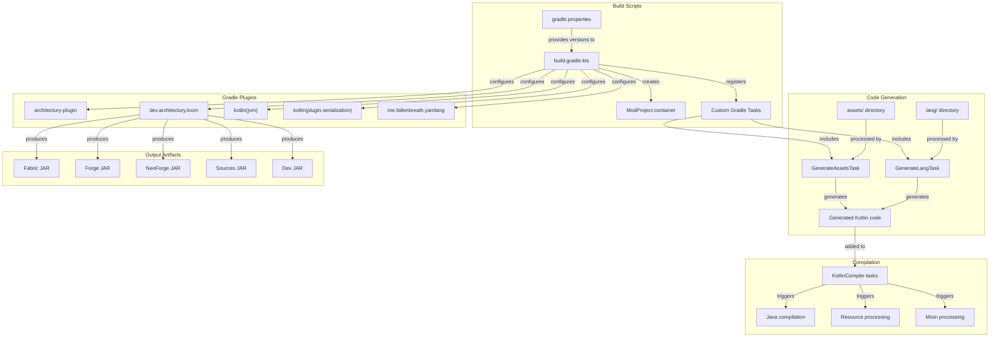
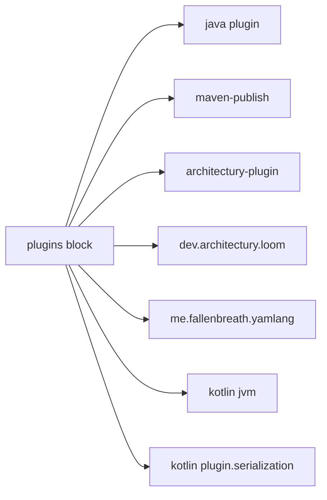
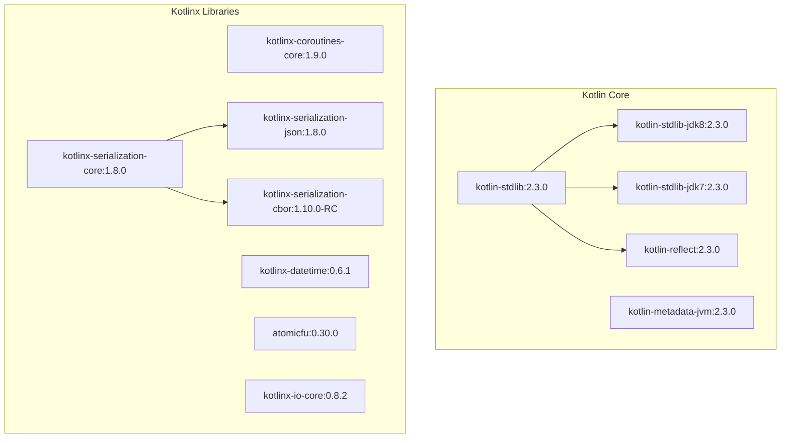
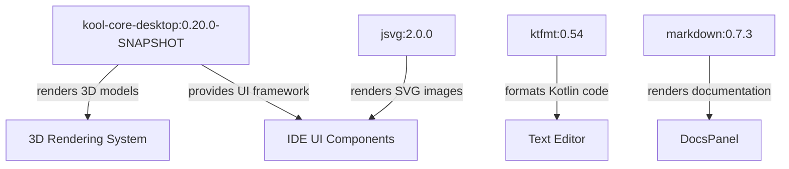
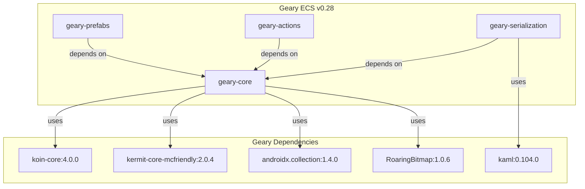
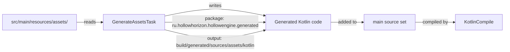
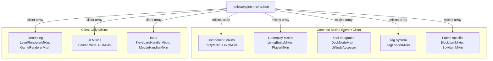
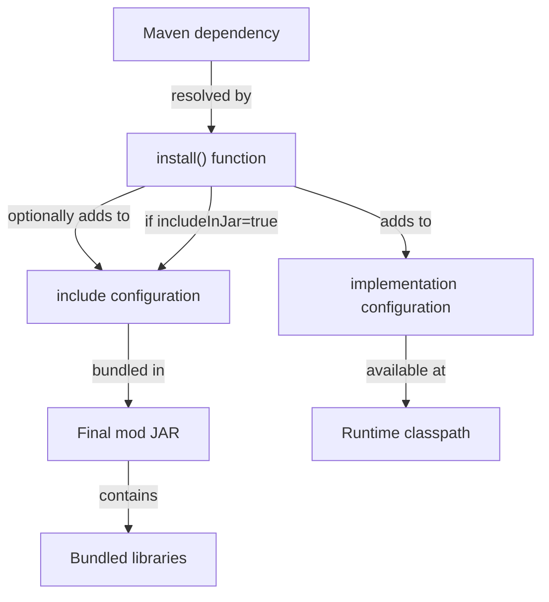
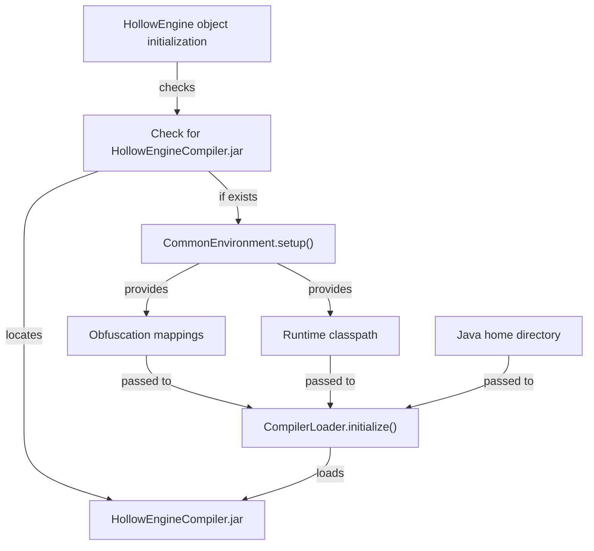

# Build System and Dependencies

<details>
<summary>Relevant source files</summary>

The following files were used as context for generating this wiki page:

- [build.gradle.kts](build.gradle.kts)
- [gradle.properties](gradle.properties)
- [src/main/java/ru/hollowhorizon/hollowengine/HollowEngine.kt](src/main/java/ru/hollowhorizon/hollowengine/HollowEngine.kt)
- [src/main/resources/hollowengine.mixins.json](src/main/resources/hollowengine.mixins.json)

</details>


This page documents HollowEngine's build system configuration, dependency management, and compilation process. It covers the Gradle build scripts, Architectury multi-platform setup, major library dependencies, and code generation tasks that occur during the build lifecycle.

For information about runtime initialization and compiler loading after the build completes, see page 2.4 (Mod Initialization).

---

## Build System Architecture

HollowEngine uses Gradle with Architectury Loom to support multiple mod loaders (Fabric, Forge, and NeoForge) from a single codebase. The build system integrates Kotlin compilation, resource processing, code generation, and mixin configuration into a unified pipeline.

**Build System Components**



**Sources:** [build.gradle.kts:1-146](), [gradle.properties:1-22]()

---

## Gradle Configuration

The primary build configuration is defined in `build.gradle.kts`, which uses Kotlin DSL for type-safe build script authoring.

**Plugin Configuration**



The plugins block at [build.gradle.kts:8-16]() configures:

| Plugin | Purpose |
|--------|---------|
| `java` | Java compilation support |
| `maven-publish` | Publishing to Maven repositories |
| `architectury-plugin` | Multi-platform mod loader support |
| `dev.architectury.loom` | Minecraft mod development tooling, decompilation, remapping |
| `me.fallenbreath.yamlang` | YAML language file processing |
| `kotlin("jvm")` | Kotlin JVM compilation |
| `kotlin("plugin.serialization")` | Kotlinx serialization code generation |

**Build Properties**

Key properties are loaded from `gradle.properties` and exposed to the build script at [build.gradle.kts:18-21]():

```kotlin
val modId: String by properties       // "hollowengine"
val modName: String by properties     // "HollowEngine"
val modVersion: String by properties  // "2.0.0-Beta15.1"
val license: String by properties     // "MIT"
```

**Sources:** [build.gradle.kts:8-21](), [gradle.properties:1-6]()

---

## Architectury Multi-Platform Setup

HollowEngine uses Architectury to compile a single codebase for multiple mod loaders. The `ModProject` container at [build.gradle.kts:23-36]() configures platform-specific entry points:

```kotlin
val container = ModProject(
    modId = modId,
    modName = modName,
    modVersion = modVersion,
    license = license,
    
    entryPoints = mapOf(
        "main" to listOf("ru.hollowhorizon.hollowengine.fabric.HCFabric::onCommonInitialize"),
        "client" to listOf("ru.hollowhorizon.hollowengine.fabric.HCFabric::onClientInitialize")
    ),
    dependencies = mapOf(),
    
    username = "TheHollowHorizon"
)
```

The `setupEnviroment()` function at [build.gradle.kts:42]() configures Architectury Loom with the specified Kotlin version. This enables Loom to:
- Decompile Minecraft sources
- Remap obfuscated names to readable names
- Generate platform-specific JARs (Fabric, Forge, NeoForge)
- Handle cross-platform abstraction layers

**Sources:** [build.gradle.kts:23-42]()

---

## Repository Configuration

Custom Maven repositories are configured at [build.gradle.kts:44-50]() to access dependencies not available in Maven Central:

| Repository | Purpose |
|------------|---------|
| `https://jitpack.io` | GitHub project dependencies |
| `https://maven.blamejared.com/` | JEI (Just Enough Items) API |
| `https://repo.mineinabyss.com/releases` | Geary ECS library |
| `mavenLocal()` | Local development builds |
| `flatDir` from `libs/` | Local JAR files (e.g., BBS deobfuscated) |

**Sources:** [build.gradle.kts:44-50]()

---

## Core Dependencies

Dependencies are declared using a custom `install()` function that handles both implementation and JAR-in-JAR inclusion. The build requires several categories of dependencies.

**Kotlin Standard Library and Runtime**



Kotlin dependencies at [build.gradle.kts:82-96]():

| Dependency | Version | Purpose |
|------------|---------|---------|
| `kotlin-stdlib-jdk8` | 2.3.0 | Kotlin standard library with JDK 8 extensions |
| `kotlin-reflect` | 2.3.0 | Reflection API for runtime introspection |
| `kotlinx-serialization-*` | 1.8.0-1.10.0 | JSON, CBOR, and core serialization support |
| `kotlinx-coroutines-core` | 1.9.0 | Asynchronous programming primitives |
| `kotlinx-datetime` | 0.6.1 | Date and time utilities |
| `atomicfu` | 0.30.0 | Lock-free data structures |
| `kotlinx-io-core` | 0.8.2 | Multiplatform I/O operations |

**Utility Libraries**

| Dependency | Version | Purpose |
|------------|---------|---------|
| `okio` | 3.9.0 | Efficient I/O operations |
| `snakeyaml-engine-kmp` | 4.0.1 | YAML parsing |
| `urlencoder-lib` | 1.6.0 | URL encoding utilities |

**Sources:** [build.gradle.kts:82-96](), [gradle.properties:10]()

---

## Graphics and UI Dependencies

HollowEngine uses the Kool graphics library for 3D rendering and UI composition. Graphics dependencies at [build.gradle.kts:57-62]():

**Kool Graphics Stack**



| Dependency | Version | Purpose |
|------------|---------|---------|
| `kool-core-desktop` | 0.20.0-SNAPSHOT | 3D graphics engine, UI framework, GPU compute |
| `jsvg` | 2.0.0 | SVG image rendering |
| `ktfmt` | 0.54 | Kotlin code formatting |
| `markdown` | 0.7.3 | Markdown rendering for documentation |

The Kool version is defined in [gradle.properties:11]() as `koolVersion=0.20.0-SNAPSHOT`.

**Sources:** [build.gradle.kts:57-62](), [gradle.properties:11]()

---

## ECS and Game Logic Dependencies

The Geary Entity Component System provides the core ECS architecture. Dependencies at [build.gradle.kts:98-110]():

**Geary ECS Modules**



| Dependency | Version | Purpose |
|------------|---------|---------|
| `geary-core` | 0.28 | Core ECS implementation with archetypes |
| `geary-prefabs` | 0.28 | Prefab system for entity templates |
| `geary-actions` | 0.28 | Event-driven action system |
| `geary-serialization` | 0.28 | Component serialization to YAML/NBT |
| `koin-core` | 4.0.0 | Dependency injection for Geary |
| `kermit-core-mcfriendly` | 2.0.4 | Multiplatform logging (Minecraft-compatible) |
| `RoaringBitmap` | 1.0.6 | Efficient bitset implementation for archetypes |
| `kaml` | 0.104.0 | Kotlin YAML serialization |

**Configuration Dependencies**

| Dependency | Version | Purpose |
|------------|---------|---------|
| `tomlkt` | 0.5.0 | TOML configuration parsing |

**Sources:** [build.gradle.kts:55, 98-110]()

---

## Optional Integration Dependencies

HollowEngine integrates with optional mods when available:

**JEI (Just Enough Items) Integration**

At [build.gradle.kts:64-73](), JEI API is conditionally included based on Minecraft version:

| Minecraft Version | JEI Version | Dependency |
|-------------------|-------------|------------|
| 1.20.1 | 15.20.0.105 | `mezz.jei:jei-1.20.1-{platform}-api` |
| 1.21.1 | 19.25.1.332 | `mezz.jei:jei-1.21.1-{platform}-api` |

These are `modCompileOnly` dependencies, meaning they're only required at compile time, not runtime.

**Better Block Sounds (BBS)**

The deobfuscated BBS library is included from the local `libs/` directory at [build.gradle.kts:68, 72]():
```kotlin
compileOnly("lib:bbs:1.2.6-1.20.1-deobf")
```

**Sources:** [build.gradle.kts:64-73]()

---

## Code Generation Tasks

HollowEngine includes custom Gradle tasks that generate type-safe Kotlin code for assets and language files during the build process.

**Asset Generation Pipeline**



**GenerateAssetsTask Configuration**

At [build.gradle.kts:120-124](), the task is configured:

```kotlin
val generateAssets by tasks.registering(GenerateAssetsTask::class) {
    generatedPackage.set("ru.hollowhorizon.hollowengine.generated")
    assetsDirectory.set(rootProject.file("src/main/resources/assets"))
    outputDirectory.set(layout.buildDirectory.dir("generated/sources/assets/kotlin"))
}
```

This task scans the `assets/` directory and generates Kotlin objects with compile-time constants for asset paths, enabling IDE autocomplete and type-safe resource references.

**GenerateLangTask Configuration**

At [build.gradle.kts:126-130](), the language file generator is configured:

```kotlin
val generateLang by tasks.registering(GenerateLangTask::class) {
    generatedPackage.set("ru.hollowhorizon.hollowengine.generated")
    langDirectory.set(rootProject.file("src/main/resources/assets/hollowengine/lang"))
    outputDirectory.set(layout.buildDirectory.dir("generated/sources/hollowengine/lang"))
}
```

This generates Kotlin code for localization keys, providing compile-time validation of translation references.

**Source Set Integration**

Generated code is added to the main source set at [build.gradle.kts:132-137]():

```kotlin
sourceSets {
    main {
        java.srcDir(generateAssets.map { it.outputDirectory })
        java.srcDir(generateLang.map { it.outputDirectory })
    }
}
```

All Kotlin compilation tasks depend on generation tasks at [build.gradle.kts:139-142]():

```kotlin
tasks.withType<KotlinCompile> {
    dependsOn(generateAssets)
    dependsOn(generateLang)
}
```

**Sources:** [build.gradle.kts:120-142]()

---

## Mixin System Configuration

Mixins enable HollowEngine to inject custom logic into Minecraft's codebase at runtime through bytecode modification. The mixin configuration is defined in `hollowengine.mixins.json`.

**Mixin Categories**



**Mixin Configuration Structure**

At [hollowengine.mixins.json:1-7](), the root configuration:

| Property | Value | Purpose |
|----------|-------|---------|
| `required` | `true` | Mixin application is mandatory |
| `minVersion` | `"0.8"` | Minimum Mixin library version |
| `package` | `"ru.hollowhorizon.hollowengine.mixins"` | Base package for mixin classes |
| `refmap` | `"${mod_id}.refmap.json"` | Reference map for obfuscation |
| `compatibilityLevel` | `"JAVA_17"` | Target Java version |

**Common Mixins (Applied on Both Sides)**

The `mixins` array at [hollowengine.mixins.json:7-42]() contains 41 mixins applied on both client and server:

| Category | Mixins | Purpose |
|----------|--------|---------|
| **ECS Integration** | `EntityMixin`, `LevelMixin` | Inject Geary ECS into Minecraft entities and levels |
| **Entity Behavior** | `LivingEntityMixin`, `PlayerMixin`, `AnimalMixin` | Modify entity behavior and properties |
| **Server Logic** | `ServerLevelMixin`, `ServerPlayerMixin`, `MinecraftServerMixin` | Server-side gameplay modifications |
| **Data Storage** | `DimensionDataStorageAccessor`, `RecipeManagerAccessor` | Access private fields for data management |
| **Tag System** | `TagLoaderMixin`, `TagEntryAccessor` | Custom tag loading and processing |
| **Kool Integration** | `DockNodeMixin`, `UiNodeAccessor`, `DragAndDropContextAccessor` | Modify Kool UI library behavior |
| **Fabric Platform** | `BlockItemMixin`, `BowItemMixin` | Fabric-specific compatibility |

**Client-Only Mixins**

The `client` array at [hollowengine.mixins.json:43-74]() contains 31 mixins applied only on the client:

| Category | Mixins | Purpose |
|----------|--------|---------|
| **Rendering** | `LevelRendererMixin`, `GameRendererMixin`, `EntityRenderDispatcherMixin` | Inject custom rendering logic |
| **UI** | `ScreenMixin`, `GuiMixin`, `InventoryMixin` | Modify GUI behavior and rendering |
| **Input** | `KeyboardHandlerMixin`, `MouseHandlerMixin` | Intercept keyboard and mouse input |
| **Camera** | `CameraInvoker` | Expose camera methods for custom views |
| **Models** | `PlayerRendererMixin`, `SkullBlockRendererMixin` | Custom model rendering |
| **Audio** | `SoundBufferLibraryMixin`, `SoundMixin` | Audio system modifications |

**Sources:** [hollowengine.mixins.json:1-79]()

---

## Build Properties and Versioning

Build properties are centralized in `gradle.properties` for easy version management.

**Mod Metadata**

At [gradle.properties:1-6]():

| Property | Value | Purpose |
|----------|-------|---------|
| `modId` | `hollowengine` | Internal mod identifier |
| `modName` | `HollowEngine` | Display name |
| `modVersion` | `2.0.0-snapshot-1` | Semantic version number |
| `modAuthor` | `HollowHorizon` | Creator name |
| `license` | `MIT` | Software license |

**Library Versions**

At [gradle.properties:8-12]():

| Property | Value | Purpose |
|----------|-------|---------|
| `hollowcore` | `2.3.12` | Base library version (if used) |
| `kotlinVersion` | `2.3.0` | Kotlin compiler and stdlib version |
| `koolVersion` | `0.20.0-SNAPSHOT` | Kool graphics library version |
| `compiler_plugin` | `1.5.1` | Compiler plugin version (likely for annotation processing) |

**Publishing Configuration**

At [gradle.properties:14-16]():

| Property | Value | Purpose |
|----------|-------|---------|
| `publish.modrinth` | `XMd2cJSg` | Modrinth project ID |
| `publish.curseforge` | `906892` | CurseForge project ID |

**Gradle JVM Arguments**

At [gradle.properties:18-21]():

```properties
org.gradle.jvmargs=-Xmx6096m -Dfile.encoding=UTF-8
org.gradle.parallel=true
org.gradle.daemon=false
```

- Maximum heap size: 6GB (to handle large Minecraft decompilation)
- UTF-8 encoding enforced
- Parallel task execution enabled
- Gradle daemon disabled (for CI/CD consistency)

**Sources:** [gradle.properties:1-22]()

---

## Dependency Installation and JAR-in-JAR

HollowEngine uses a custom `install()` function for dependency management. This function handles both compile-time dependencies and JAR-in-JAR packaging, which bundles libraries directly into the mod JAR file.

**Dependency Resolution Flow**



The `install()` function appears to be a custom extension (referenced at [build.gradle.kts:55, 58, etc.]()), likely defined in the imported gradle utilities at [build.gradle.kts:4]():

```kotlin
import ru.hollowhorizon.gradle.*
```

This function simplifies dependency declarations by automatically handling both compilation and JAR inclusion based on a boolean parameter, enabling consistent dependency management across the large dependency list.

**Sources:** [build.gradle.kts:4, 52-118]()

---

## Test Dependencies

HollowEngine includes comprehensive testing support at [build.gradle.kts:76-80]():

| Dependency | Version | Purpose |
|------------|---------|---------|
| `kotlin("test")` | (matches Kotlin version) | Kotlin test framework |
| `kotlinx-coroutines-test` | 1.9.0 | Testing utilities for coroutines |
| `junit-jupiter` | 5.10.1 | JUnit 5 testing framework |
| `kotlin("reflect")` | (matches Kotlin version) | Reflection for test utilities |

Tests are configured to use JUnit Platform at [build.gradle.kts:144-146]():

```kotlin
tasks.withType<Test> {
    useJUnitPlatform()
}
```

**Sources:** [build.gradle.kts:76-80, 144-146]()

---

## Runtime Initialization

After the build completes and the mod JAR is loaded, HollowEngine initializes during Minecraft startup. The initialization process at [HollowEngine.kt:16-33]() performs:

1. **Compiler JAR Detection**: Checks if `HollowEngineCompiler.jar` exists in the `hollowengine` directory
2. **Environment Setup**: If the compiler JAR is present, configures classpath and obfuscation mappings via `CommonEnvironment.setup()`
3. **Compiler Loading**: Initializes the `CompilerLoader` with the Java home directory, classpath, and mappings

**Initialization Flow**



The compiler JAR is optional; if absent, the mod functions normally but IDE features (code completion, diagnostics) are disabled. This separation keeps the runtime JAR lightweight while making development features opt-in.

**Sources:** [HollowEngine.kt:16-33]()