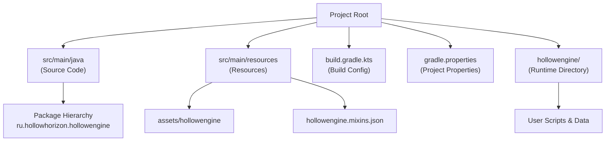
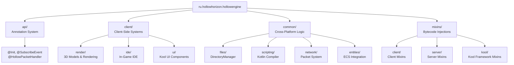
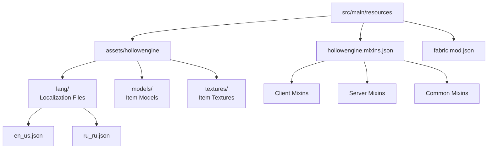
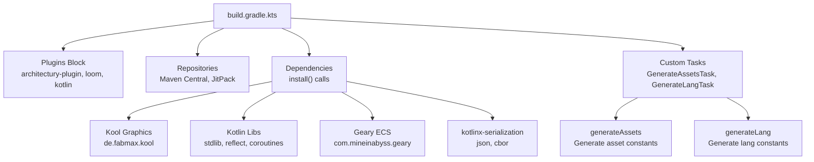
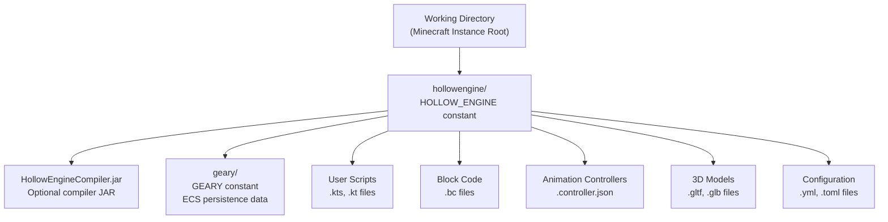
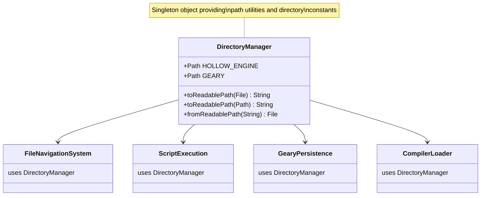
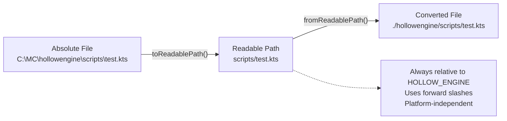
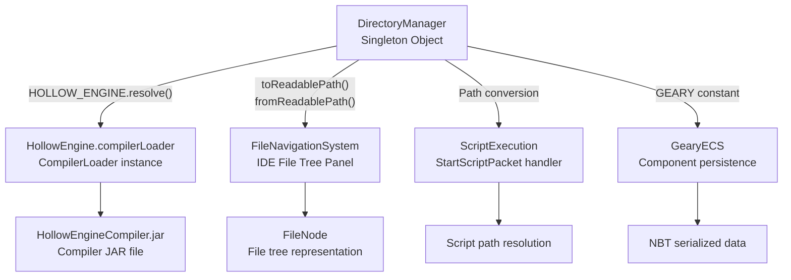

# Project Structure and Directories

<details>
<summary>Relevant source files</summary>

The following files were used as context for generating this wiki page:

- [build.gradle.kts](build.gradle.kts)
- [gradle.properties](gradle.properties)
- [src/main/java/ru/hollowhorizon/hollowengine/HollowEngine.kt](src/main/java/ru/hollowhorizon/hollowengine/HollowEngine.kt)
- [src/main/java/ru/hollowhorizon/hollowengine/common/files/DirectoryManager.kt](src/main/java/ru/hollowhorizon/hollowengine/common/files/DirectoryManager.kt)
- [src/main/resources/hollowengine.mixins.json](src/main/resources/hollowengine.mixins.json)

</details>


This document describes both the development-time project structure (source code organization, resources, and build configuration) and the runtime directory structure used by HollowEngine. It covers the source package hierarchy, resource organization, the `DirectoryManager` utility for runtime path management, and conventions for readable path representation.

## Project Structure Overview

HollowEngine follows a standard Gradle-based Minecraft mod structure with Kotlin as the primary language. The project is organized into distinct areas for source code, resources, build configuration, and runtime data directories.

**High-Level Project Layout**



**Sources:** [gradle.properties:1-22](), [build.gradle.kts:1-146](), [src/main/java/ru/hollowhorizon/hollowengine/HollowEngine.kt:1-34]()

The project structure separates:
- **Source Code**: Kotlin/Java files organized by package in `src/main/java`
- **Resources**: Assets, language files, and mixin configurations in `src/main/resources`
- **Build Configuration**: Gradle build scripts and properties files
- **Runtime Data**: User-created content and mod data in the `hollowengine/` directory created at runtime

## Source Code Structure

The source code is organized under the root package `ru.hollowhorizon.hollowengine` with distinct sub-packages for different subsystems.

**Package Organization**



**Sources:** [src/main/java/ru/hollowhorizon/hollowengine/HollowEngine.kt:1-34](), [src/main/resources/hollowengine.mixins.json:1-80]()

### Key Package Purposes

| Package | Purpose | Key Classes |
|---------|---------|-------------|
| `api` | Annotation-based registration system | `@Init`, `@SubscribeEvent`, `@Registerable`, `@Syncable` |
| `client.render` | 3D model rendering and animation pipeline | `HollowModelManager`, `AnimationSystem` |
| `client.ide` | In-game IDE framework and editors | `IdeContent`, `DockPanel`, `FileNode` |
| `common.files` | File system management and path utilities | `DirectoryManager` |
| `common.scripting` | Kotlin script compilation and execution | `CompilerLoader`, `ScriptingEnvironment` |
| `common.network` | Client-server packet communication | `HollowPacket`, `StartScriptPacket` |
| `common.entities` | Geary ECS integration and components | `ComponentRegistry`, `MinecraftEntityLookup` |
| `mixins` | Mixin injections for Minecraft integration | Various mixin classes |

**Sources:** [src/main/java/ru/hollowhorizon/hollowengine/HollowEngine.kt:1-34](), [src/main/java/ru/hollowhorizon/hollowengine/common/files/DirectoryManager.kt:1-30]()

The package structure separates concerns by functional area and platform (client vs common). The `api` package provides the annotation system that drives automatic registration (see [Annotation System](#13.6)). The `mixins` package contains bytecode injections organized by target (client, server, kool framework).

## Resource Structure

Resources are stored in `src/main/resources` and include assets, language files, and configuration files.

**Resource Organization**



**Sources:** [src/main/resources/assets/hollowengine/lang/en_us.json:1-122](), [src/main/resources/hollowengine.mixins.json:1-80]()

### Mixin Configuration

The `hollowengine.mixins.json` file declares all mixin classes that inject into Minecraft and third-party libraries. Mixins are organized into three categories:

| Section | Target Platform | Example Mixins |
|---------|----------------|----------------|
| `"mixins"` | Common (client + server) | `EntityMixin`, `LevelMixin`, `PlayerMixin` |
| `"client"` | Client-only | `MinecraftMixin`, `GuiMixin`, `LevelRendererMixin` |
| `"server"` | Server-only | Currently empty |

**Sources:** [src/main/resources/hollowengine.mixins.json:1-80]()

The mixin system enables HollowEngine to integrate deeply with Minecraft's rendering pipeline, entity system, and UI framework. Notable mixin categories include:
- **Component Integration**: `EntityMixin`, `LevelMixin` for Geary ECS attachment
- **Kool UI Integration**: `DockNodeMixin`, `PlatformInputMixin`, `KeyboardHandlerMixin`
- **Rendering**: `LevelRendererMixin`, `EntityRenderDispatcherMixin`, `ItemRendererMixin`

### Language Files

Language files are stored in `assets/hollowengine/lang/` and provide translations for UI elements, commands, and messages. Each language has a dedicated JSON file mapping translation keys to localized strings.

**Translation Key Prefixes**

| Prefix | Purpose | Example |
|--------|---------|---------|
| `hollowengine.gui.ide.*` | IDE interface elements | `hollowengine.gui.ide.file` → "Файл" |
| `hollowengine.gui.tool.*` | Tool UI elements | `hollowengine.gui.tool.general` → "Основное" |
| `hollowengine.tags.*` | Tag editor UI | `hollowengine.tags.search_hint` → "Поиск тегов..." |
| `hollowengine.commands.*` | Command feedback messages | `hollowengine.commands.copy` → "Значение скопировано" |
| `hollowengine.key.*` | Keybind descriptions | `hollowengine.key.hollowengine.menu` → "Главное меню" |

**Sources:** [src/main/resources/assets/hollowengine/lang/en_us.json:1-122](), [src/main/resources/assets/hollowengine/lang/ru_ru.json:1-122]()

The localization system supports multiple languages (currently English and Russian) and is used throughout the IDE and in-game interfaces.

## Build Configuration

The build configuration consists of two primary files: `gradle.properties` for project metadata and versioning, and `build.gradle.kts` for dependency management and build tasks.

### gradle.properties

This file defines project metadata, library versions, and Gradle settings.

**Key Configuration Sections**

| Category | Properties | Example Values |
|----------|-----------|----------------|
| Mod Metadata | `modId`, `modName`, `modVersion`, `modAuthor` | `hollowengine`, `HollowEngine`, `2.0.0-Beta15.1` |
| Library Versions | `kotlinVersion`, `koolVersion`, `gearyVersion` | `2.3.0`, `0.20.0-SNAPSHOT` |
| Publishing | `publish.modrinth`, `publish.curseforge` | Project IDs for mod hosting platforms |
| Gradle Settings | `org.gradle.jvmargs`, `org.gradle.parallel` | Memory allocation, parallel builds |

**Sources:** [gradle.properties:1-22]()

The version numbers in this file control which versions of core dependencies are used. The `kotlinVersion` must match the Kotlin compiler version used for script compilation. The `koolVersion` determines the version of the Kool 3D graphics framework.

### build.gradle.kts

This Kotlin DSL build script defines the project's dependencies, repositories, and custom build tasks.

**Build Script Structure**



**Sources:** [build.gradle.kts:1-146]()

The build script uses a custom `install()` function (from `ru.hollowhorizon.gradle`) to manage dependencies. Key dependency categories include:

| Category | Libraries | Purpose |
|----------|-----------|---------|
| Graphics | `kool-core-desktop`, `jsvg` | 3D rendering, SVG support |
| Kotlin | `kotlin-stdlib`, `kotlinx-coroutines`, `kotlinx-serialization` | Language runtime and extensions |
| ECS | `geary-core`, `geary-prefabs`, `geary-actions` | Entity Component System |
| Config | `tomlkt`, `kaml` | TOML and YAML parsing |
| Utilities | `koin-core`, `kermit`, `RoaringBitmap` | Dependency injection, logging, data structures |

**Sources:** [build.gradle.kts:52-118]()

### Custom Build Tasks

The build script defines two custom tasks for code generation:

**generateAssets Task**

Generates Kotlin constants for asset paths from `src/main/resources/assets`. This enables type-safe asset references in code.

**Sources:** [build.gradle.kts:120-124]()

**generateLang Task**

Generates Kotlin constants for language keys from language files in `assets/hollowengine/lang`. This provides compile-time checking for translation keys.

**Sources:** [build.gradle.kts:126-130]()

Both tasks output generated sources to `build/generated/sources/` and are configured to run before Kotlin compilation tasks.

**Sources:** [build.gradle.kts:132-142]()

## Runtime Directory Structure

At runtime, HollowEngine creates and manages a dedicated directory structure separate from the Minecraft installation directory. All HollowEngine-related user files are stored under a root `hollowengine` directory located in the working directory of the Minecraft instance.

**Runtime Directory Structure**



**Sources:** [src/main/java/ru/hollowhorizon/hollowengine/common/files/DirectoryManager.kt:1-30](), [src/main/java/ru/hollowhorizon/hollowengine/HollowEngine.kt:10-28]()

The root `hollowengine` directory is created lazily on first access and serves as the base for all HollowEngine runtime file operations. Key contents include:

| Directory/File | Purpose | Created By |
|---------------|---------|------------|
| `HollowEngineCompiler.jar` | Optional Kotlin compiler JAR for advanced script analysis | Manual installation or automatic download |
| `geary/` | Geary ECS component data persistence | Geary serialization system |
| `*.kts`, `*.kt` | User-created Kotlin scripts | In-game IDE text editor |
| `*.bc` | Block code visual programming files | In-game IDE block editor |
| `*.controller.json` | Animation controller graphs | In-game IDE animation editor |
| `*.gltf`, `*.glb` | 3D model files for entities and items | User-imported or created externally |

The directory structure is accessed by:
- The in-game IDE for storing and loading user-created content (see [File Tree and Navigation](#3.3))
- The Geary ECS system for component data persistence (see [NBT Persistence](#8.6))
- The compiler loader for accessing the optional compiler JAR (see [Compiler Integration](#4.7))
- The script execution system for loading and running scripts (see [Script Execution](#7))

## DirectoryManager Class

The `DirectoryManager` object provides centralized access to key directories and path conversion utilities. It is implemented as a Kotlin object singleton, ensuring consistent path resolution across all systems.

**DirectoryManager Architecture**



**Sources:** [src/main/java/ru/hollowhorizon/hollowengine/common/files/DirectoryManager.kt:6-30]()

### Core Directory Constants

| Constant | Type | Value | Purpose |
|----------|------|-------|---------|
| `HOLLOW_ENGINE` | `Path` | `./hollowengine` | Root directory for all HollowEngine files |
| `GEARY` | `Path` | `./hollowengine/geary` | Storage for Geary ECS component data |

**Sources:** [src/main/java/ru/hollowhorizon/hollowengine/common/files/DirectoryManager.kt:7-13]()

The `HOLLOW_ENGINE` path is initialized lazily using Kotlin's `lazy` delegate. On first access, it creates the directory if it does not exist using `mkdirs()`. This ensures the directory structure is available before any file operations are attempted.

The `GEARY` subdirectory is eagerly initialized as a relative path from `HOLLOW_ENGINE`. This directory is used by the Geary ECS system for persisting component data between game sessions.

## Path Conversion System

HollowEngine uses a "readable path" convention to represent file paths in a platform-independent, relative format. This system enables consistent path representation in network packets, NBT storage, and user-facing displays.

**Path Conversion Flow**



**Sources:** [src/main/java/ru/hollowhorizon/hollowengine/common/files/DirectoryManager.kt:16-28]()

### Path Conversion Methods

The `DirectoryManager` provides three extension methods for path conversion:

#### `File.toReadablePath(): String`

Converts an absolute `File` to a readable path string. This method delegates to the `Path` version after converting the file to a path.

**Sources:** [src/main/java/ru/hollowhorizon/hollowengine/common/files/DirectoryManager.kt:16-18]()

#### `Path.toReadablePath(): String`

Converts an absolute `Path` to a readable path string by:
1. Relativizing the path against `HOLLOW_ENGINE` using `relativize()`
2. Converting the result to a string
3. Replacing all backslashes with forward slashes for cross-platform compatibility

This ensures paths are always represented with forward slashes, regardless of the host operating system.

**Sources:** [src/main/java/ru/hollowhorizon/hollowengine/common/files/DirectoryManager.kt:20-23]()

#### `String.fromReadablePath(): File`

Converts a readable path string back to an absolute `File` by resolving it against `HOLLOW_ENGINE`. This is the inverse operation of `toReadablePath()`.

**Sources:** [src/main/java/ru/hollowhorizon/hollowengine/common/files/DirectoryManager.kt:26-28]()

## Integration with HollowEngine Systems

The `DirectoryManager` is referenced by multiple core systems during initialization and runtime operations, providing a central point of access for all file system paths.

**System Integration Map**



**Sources:** [src/main/java/ru/hollowhorizon/hollowengine/HollowEngine.kt:10-28](), [src/main/java/ru/hollowhorizon/hollowengine/common/files/DirectoryManager.kt:1-30]()

### Compiler Loader Integration

The `HollowEngine` object uses `DirectoryManager.HOLLOW_ENGINE` to locate the compiler JAR file during initialization. The compiler JAR path is constructed by resolving `"HollowEngineCompiler.jar"` against the `HOLLOW_ENGINE` directory.

```kotlin
val compilerLoader = CompilerLoader(
    DirectoryManager.HOLLOW_ENGINE.resolve("HollowEngineCompiler.jar").toFile()
)
```

**Sources:** [src/main/java/ru/hollowhorizon/hollowengine/HollowEngine.kt:20-20]()

This integration ensures the compiler system can locate its required JAR file in a predictable location. For more details on compiler initialization, see [Compiler Integration](#4.7).

### File Navigation Integration

The file tree panel in the in-game IDE uses `DirectoryManager` for all file operations, including creating, renaming, deleting, and navigating files. The `toReadablePath()` methods are used to display file paths to users in a clean, relative format.

For details on how the file tree uses these utilities, see [File Tree and Navigation](#3.3).

### Geary ECS Integration

The Geary ECS system uses the `GEARY` subdirectory for storing persistent component data. This separation ensures ECS data is isolated from other HollowEngine files and can be managed independently.

For details on how Geary uses this directory for NBT persistence, see [NBT Persistence](#8.6).

## Usage Patterns

The following table summarizes common usage patterns for `DirectoryManager` utilities:

| Use Case | Method | Example Input | Example Output |
|----------|--------|---------------|----------------|
| Display file path in UI | `toReadablePath()` | `/path/to/hollowengine/scripts/test.kts` | `scripts/test.kts` |
| Store path in network packet | `toReadablePath()` | `Path.of("hollowengine/models/npc.gltf")` | `models/npc.gltf` |
| Resolve path from packet | `fromReadablePath()` | `"scripts/init.kts"` | `File("hollowengine/scripts/init.kts")` |
| Locate compiler JAR | Direct resolution | `HOLLOW_ENGINE.resolve("HollowEngineCompiler.jar")` | `Path("hollowengine/HollowEngineCompiler.jar")` |
| Locate Geary data | Use constant | `GEARY` | `Path("hollowengine/geary")` |

**Sources:** [src/main/java/ru/hollowhorizon/hollowengine/common/files/DirectoryManager.kt:16-28](), [src/main/java/ru/hollowhorizon/hollowengine/HollowEngine.kt:20-20]()

## Directory Creation Behavior

The `HOLLOW_ENGINE` directory is created automatically on first access using the `apply` block with `mkdirs()`. This ensures the directory structure exists before any file operations are attempted. Subdirectories like `GEARY` are defined as paths but are not automatically created; systems that use them are responsible for creating them as needed.

**Sources:** [src/main/java/ru/hollowhorizon/hollowengine/common/files/DirectoryManager.kt:7-13]()

The lazy initialization pattern ensures that:
- The directory is not created unnecessarily if HollowEngine features are not used
- Directory creation happens exactly once, even in multithreaded contexts
- File operations can safely assume the root directory exists