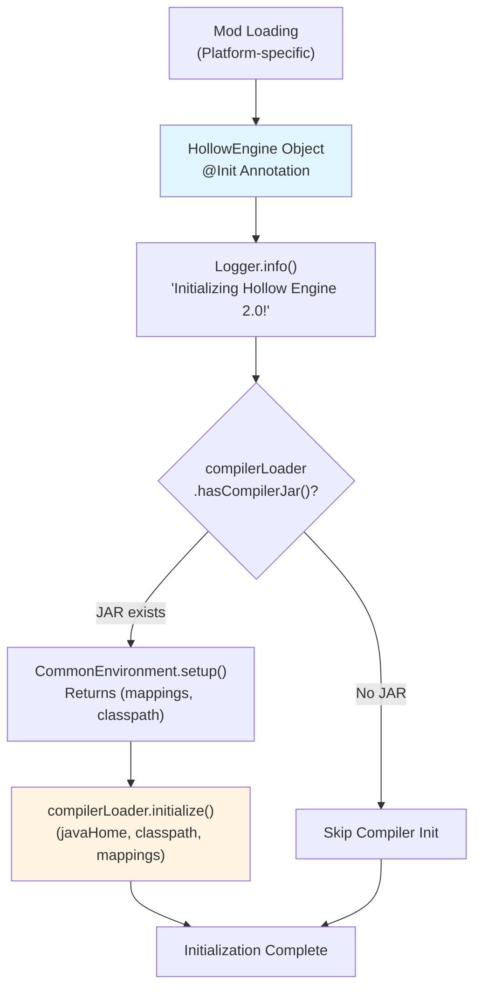
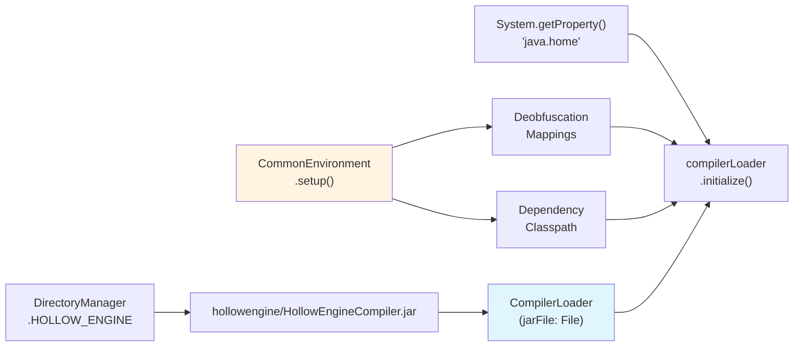
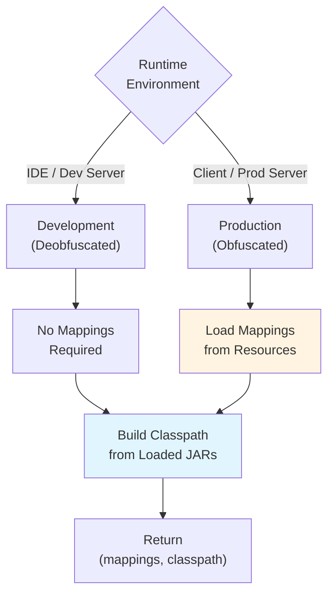
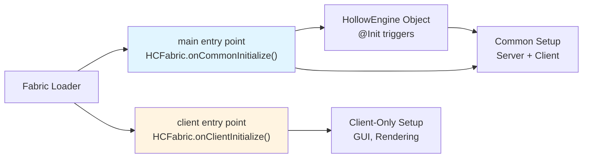
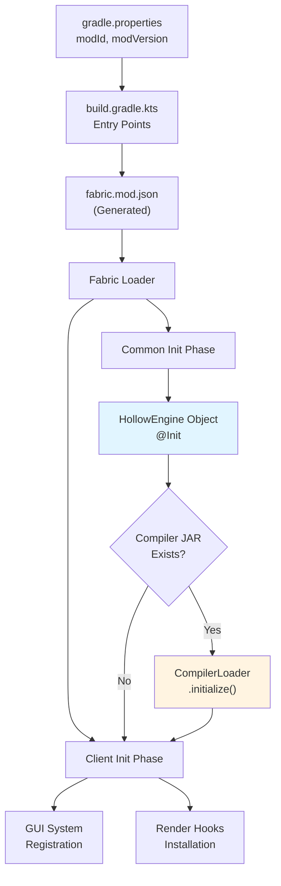

# Mod Initialization

Relevant source files

The following files were used as context for generating this wiki page:

- [build.gradle.kts](build.gradle.kts)
- [gradle.properties](gradle.properties)
- [src/main/java/ru/hollowhorizon/hollowengine/HollowEngine.kt](src/main/java/ru/hollowhorizon/hollowengine/HollowEngine.kt)
- [src/main/resources/hollowengine.mixins.json](src/main/resources/hollowengine.mixins.json)

This page documents the initialization sequence of HollowEngine, including the main entry point, compiler setup, and mixin system configuration. This covers how the mod bootstraps itself when Minecraft loads, preparing the scripting environment and injecting runtime modifications.

For information about the build system and Gradle configuration, see [Build System and Dependencies](#2.2). For the directory structure created during initialization, see [Project Structure and Directories](#2.3). For details on how scripts execute after initialization, see [Script Execution and Runtime](#7).

---

## HollowEngine Object

The [`HollowEngine`](src/main/java/ru/hollowhorizon/hollowengine/HollowEngine.kt:17-33) object serves as the primary initialization point for the mod. It is a Kotlin singleton annotated with `@Init`, ensuring it initializes during mod loading.

### Core Components

| Component | Type | Purpose |
|-----------|------|---------|
| `MODID` | `String` | Mod identifier constant: `"hollowengine"` |
| `LOGGER` | `Logger` | Apache Log4j logger instance for diagnostic output |
| `compilerLoader` | `CompilerLoader` | Manages Kotlin script compilation infrastructure |

The initialization block [HollowEngine.kt:22-33]() performs several critical setup steps:

1. **Logger Announcement**: Outputs initialization message to log
2. **Compiler Detection**: Checks if `HollowEngineCompiler.jar` exists at the expected location
3. **Environment Setup**: Configures deobfuscation mappings and classpath
4. **Compiler Initialization**: Prepares the Kotlin compiler with proper configuration

### Initialization Flow

**Sources**: [src/main/java/ru/hollowhorizon/hollowengine/HollowEngine.kt:17-33]()

---

## CompilerLoader Setup

The [`CompilerLoader`](src/main/java/ru/hollowhorizon/hollowengine/HollowEngine.kt:20) is instantiated with a reference to the compiler JAR file located at `hollowengine/HollowEngineCompiler.jar`. This JAR contains the Kotlin compiler and associated tooling required for runtime script compilation.

### CompilerLoader Configuration

### Initialization Parameters

The `compilerLoader.initialize()` method [HollowEngine.kt:27]() receives three critical parameters:

| Parameter | Source | Purpose |
|-----------|--------|---------|
| `javaHome` | `File(System.getProperty("java.home"))` | Path to Java runtime for compiler execution |
| `classpath` | `CommonEnvironment.setup()` | Full classpath including Minecraft and dependencies |
| `mappings` | `CommonEnvironment.setup()` | Obfuscation mappings for runtime environment |

The classpath includes all necessary dependencies for script compilation:
- Minecraft classes (obfuscated in production, deobfuscated in development)
- Fabric/Forge API classes
- HollowEngine classes and libraries
- Kotlin standard library and reflection

**Sources**: [src/main/java/ru/hollowhorizon/hollowengine/HollowEngine.kt:20-28]()

---

## CommonEnvironment Setup

The `CommonEnvironment.setup()` method [HollowEngine.kt:26]() is responsible for preparing the scripting environment's classpath and deobfuscation mappings. This setup ensures that scripts can reference Minecraft classes correctly regardless of the runtime environment (development vs. production).

### Environment Configuration

The setup process returns a tuple containing:

1. **Mappings**: Deobfuscation data that translates between obfuscated (production) and readable (development) class/method/field names
2. **Classpath**: Complete list of JAR files and directories needed for script compilation

### Deobfuscation Strategy

The classpath includes:
- All loaded mods' JAR files
- Minecraft game classes
- Fabric Loader classes
- Core libraries (Kotlin, kotlinx.coroutines, kotlinx.serialization)
- HollowEngine's own classes

**Sources**: [src/main/java/ru/hollowhorizon/hollowengine/HollowEngine.kt:26]()

---

## Mixin System

The mixin system provides runtime bytecode modifications to Minecraft classes, enabling deep integration without requiring Minecraft source modifications. Configuration is defined in [`hollowengine.mixins.json`](src/main/resources/hollowengine.mixins.json:1-80).

### Mixin Configuration Structure

```mermaid
graph TB
    MixinConfig["hollowengine.mixins.json<br/>Configuration File"]
    
    subgraph "Common Mixins"
        EntityMix["components.EntityMixin<br/>Injects EntityScope"]
        LevelMix["components.LevelMixin<br/>Level tracking"]
        ServerMix["MinecraftServerMixin<br/>Server lifecycle"]
        PlayerMix["PlayerMixin<br/>Player capabilities"]
        PackMix["PackRepositoryMixin<br/>Resource pack loading"]
    end
    
    subgraph "Client-Only Mixins"
        RenderMix["client.LevelRendererMixin<br/>Custom rendering"]
        GuiMix["client.GuiMixin<br/>GUI overlay"]
        CameraMix["client.CameraInvoker<br/>Camera control"]
        MinecraftMix["client.MinecraftMixin<br/>Client lifecycle"]
    end
    
    subgraph "Accessors"
        DimAccess["DimensionDataStorageAccessor<br/>Storage access"]
        RecipeAccess["RecipeManagerAccessor<br/>Recipe data"]
        ListAccess["ListTagAccessor<br/>NBT manipulation"]
    end
    
    MixinConfig --> EntityMix
    MixinConfig --> LevelMix
    MixinConfig --> ServerMix
    MixinConfig --> PlayerMix
    MixinConfig --> PackMix
    MixinConfig --> RenderMix
    MixinConfig --> GuiMix
    MixinConfig --> CameraMix
    MixinConfig --> MinecraftMix
    MixinConfig --> DimAccess
    MixinConfig --> RecipeAccess
    MixinConfig --> ListAccess
    
    style EntityMix fill:#e1f5ff
    style RenderMix fill:#fff4e1
```

### Critical Mixin Injections

| Mixin Class | Target | Purpose |
|-------------|--------|---------|
| `components.EntityMixin` | `Entity` | Injects `EntityScope` for script execution context |
| `components.LevelMixin` | `Level` | Tracks level-specific state and events |
| `client.LevelRendererMixin` | `LevelRenderer` | Enables custom 3D model rendering pipeline |
| `MinecraftServerMixin` | `MinecraftServer` | Hooks server start/stop for resource initialization |
| `PackRepositoryMixin` | `PackRepository` | Intercepts resource pack loading for dynamic content |
| `LivingEntityMixin` | `LivingEntity` | Provides animation controller attachment points |

### Mixin Categories

The configuration [hollowengine.mixins.json:7-44]() defines mixins in three categories:

1. **Common Mixins** (lines 7-44): Applied on both client and server
   - Entity system modifications
   - Server lifecycle hooks
   - Data structure accessors

2. **Client Mixins** (lines 45-75): Applied only on client
   - Rendering pipeline hooks
   - GUI overlay injection
   - Input handling modifications

3. **Accessors/Invokers**: Special mixins that expose private fields/methods
   - Allow access to internal Minecraft state
   - Enable advanced integration without reflection

**Sources**: [src/main/resources/hollowengine.mixins.json:1-80]()

---

## Platform Entry Points

HollowEngine uses platform-specific initialization through the Fabric Loader's entry point system. The entry points are configured in [`build.gradle.kts`](build.gradle.kts:29-32).

### Fabric Platform Initialization

### Entry Point Configuration

The build script defines two entry points [build.gradle.kts:29-32]():

| Entry Point | Method | Purpose |
|-------------|--------|---------|
| `main` | `HCFabric::onCommonInitialize` | Initializes common (server + client) functionality |
| `client` | `HCFabric::onClientInitialize` | Initializes client-only features (GUI, rendering) |

### Initialization Sequence

1. **Fabric Loader Startup**: Fabric Loader reads `fabric.mod.json` and locates entry points
2. **Common Initialization**: `HCFabric.onCommonInitialize()` executes
   - Triggers `@Init` annotation processing
   - `HollowEngine` object initializes
   - CompilerLoader sets up if JAR exists
3. **Client Initialization** (client-side only): `HCFabric.onClientInitialize()` executes
   - Client-only mixins apply
   - Rendering pipeline hooks initialize
   - GUI overlay system prepares

### Initialization Dependencies

**Sources**: [build.gradle.kts:29-32](), [gradle.properties:1-6]()

---

## Configuration Properties

The mod's metadata is defined in [`gradle.properties`](gradle.properties:1-6), which is used during the build process to generate platform-specific mod metadata files.

### Core Properties

| Property | Value | Usage |
|----------|-------|-------|
| `modId` | `hollowengine` | Unique mod identifier, used in `HollowEngine.MODID` |
| `modName` | `HollowEngine` | Human-readable mod name |
| `modVersion` | `2.0.0-snapshot-1` | Current version string |
| `modAuthor` | `HollowHorizon` | Mod author/team name |
| `license` | `MIT` | Software license |

### Library Versions

Key library versions specified [gradle.properties:8-12]():

| Library | Version | Purpose |
|---------|---------|---------|
| `hollowcore` | `2.3.12` | Core HollowHorizon utilities |
| `kotlinVersion` | `2.3.0` | Kotlin language and stdlib |
| `koolVersion` | `0.20.0-SNAPSHOT` | Kool UI framework for IDE |
| `compiler_plugin` | `1.5.1` | Kotlin compiler plugin version |

These properties are consumed by the build system [build.gradle.kts:18-21]() and propagated to generated metadata files.

**Sources**: [gradle.properties:1-12](), [build.gradle.kts:18-21]()